# WebSocket Client Design Process

## Getting Started

### Prerequisites

1. Read these documents in order:
   - `machine.md`: Formal specification of the WebSocket client
   - `guidelines.md`: Design principles and approach
   - This design process document

### Process Overview

1. Follow C4 model levels in order:
   - System Context → Containers → Components → Classes
2. Create each file in specified order within each level
3. Complete validation checklist before moving to next file
4. Get review/approval before moving to next level

## Governance Files

1. `governance.md`: Core stability rules
2. `process.md`: Change management
3. `reviews.md`: Review process
4. `stability.md`: Stability maintenance

## 1. System Context Level

### 1.1 context.system.md

#### Creation Steps

1. Draw System Context Diagram:

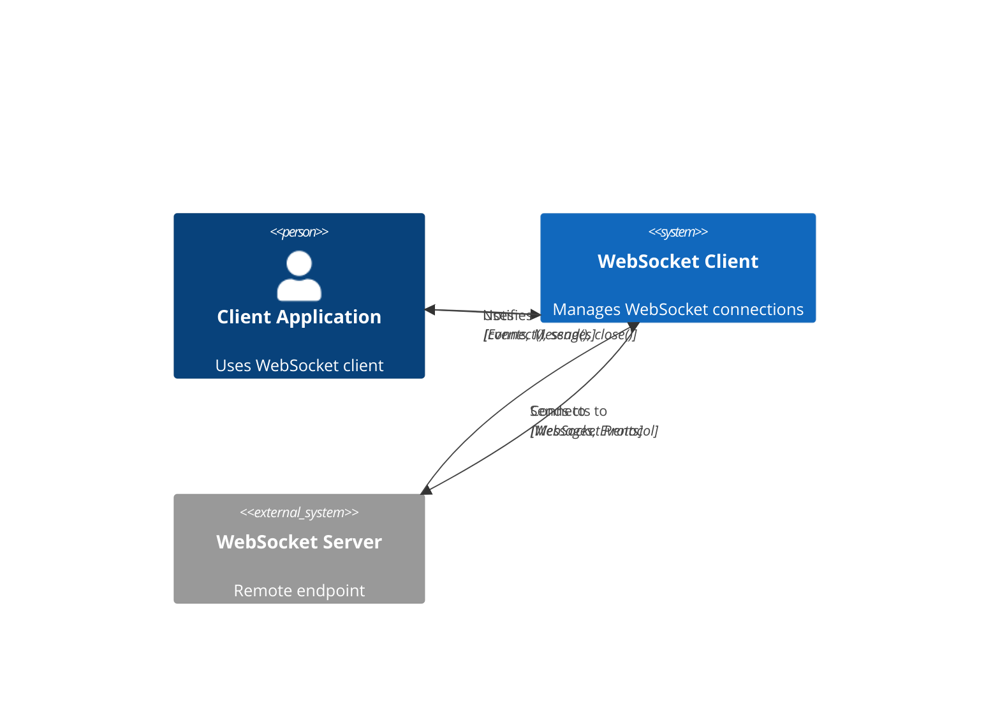
```mermaid
C4Context
    Person(app, "Client Application", "Uses WebSocket client")
    System(client, "WebSocket Client", "Manages WebSocket connections")
    System_Ext(server, "WebSocket Server", "Remote endpoint")

    Rel(app, client, "Uses", "connect(), send(), close()")
    Rel(client, server, "Connects to", "WebSocket Protocol")
    Rel(server, client, "Sends to", "Messages, Events")
    Rel(client, app, "Notifies", "Events, Messages")
```

2. Map Formal Elements
   From `machine.md`:

- States ($S$) → System states visible to users
  ```
  disconnected → Client not connected
  connecting → Connection in progress
  connected → Active connection
  reconnecting → Attempting to reconnect
  ```
- Events ($E$) → External API methods and callbacks
  ```
  CONNECT → connect() method
  DISCONNECT → disconnect() method
  MESSAGE → onMessage callback
  ERROR → onError callback
  ```
- Context ($C$) → System configuration
  ```
  url → Connection URL
  protocols → WebSocket protocols
  retries → Retry configuration
  timeouts → Timeout settings
  ```

3. Document System

- Purpose and scope
- External actors
- Core interfaces
- Key constraints

#### Validation Checklist

- [ ] System boundary clearly defined
- [ ] All external actors identified
- [ ] Core interfaces mapped to formal spec
- [ ] Key constraints documented

### 1.2 context.interfaces.md

#### Creation Steps

1. Define External API

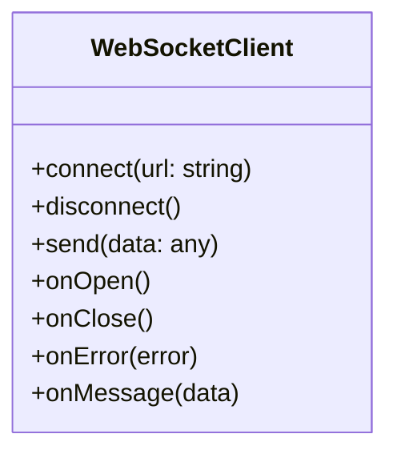
```mermaid
classDiagram
    class WebSocketClient {
        +connect(url: string)
        +disconnect()
        +send(data: any)
        +onOpen()
        +onClose()
        +onError(error)
        +onMessage(data)
    }
```

2. Define Protocol Requirements

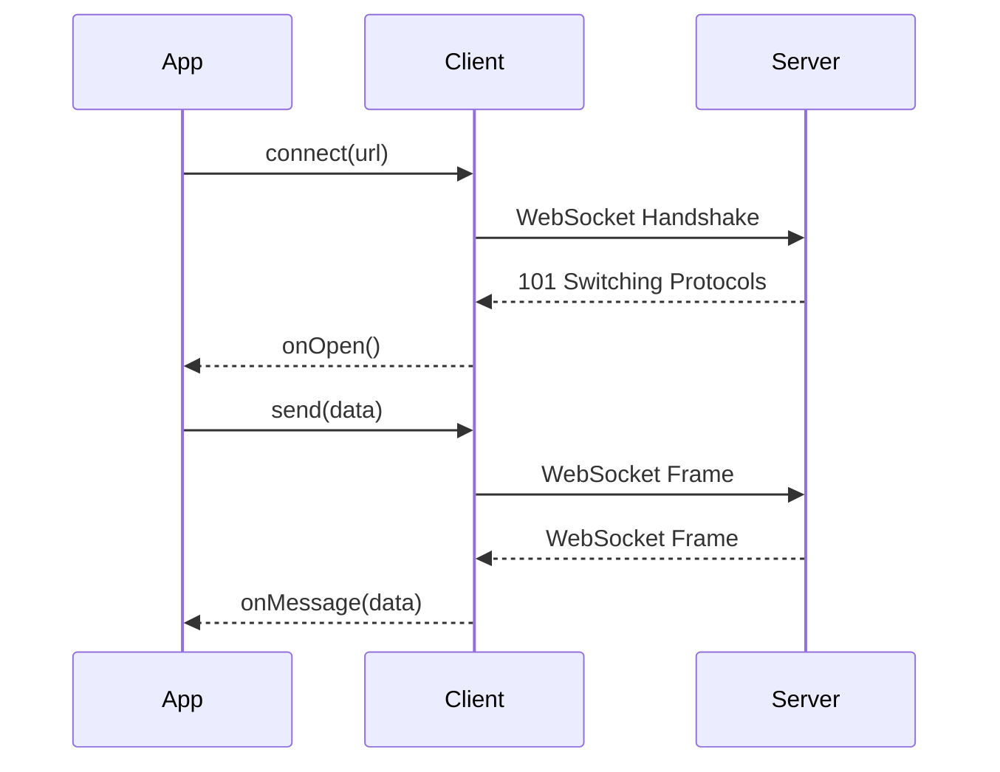
```mermaid
sequenceDiagram
    participant App
    participant Client
    participant Server

    App->>Client: connect(url)
    Client->>Server: WebSocket Handshake
    Server-->>Client: 101 Switching Protocols
    Client-->>App: onOpen()

    App->>Client: send(data)
    Client->>Server: WebSocket Frame
    Server-->>Client: WebSocket Frame
    Client-->>App: onMessage(data)
```

3. Document Error Handling

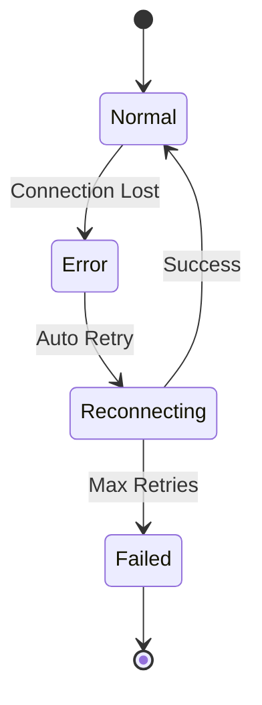
```mermaid
stateDiagram-v2
    [*] --> Normal
    Normal --> Error: Connection Lost
    Error --> Reconnecting: Auto Retry
    Reconnecting --> Normal: Success
    Reconnecting --> Failed: Max Retries
    Failed --> [*]
```

#### Validation Checklist

- [ ] All formal events mapped to API
- [ ] Protocol requirements complete
- [ ] Error cases covered
- [ ] Type definitions clear

### 1.3 context.constraints.md

#### Creation Steps

1. Map Resource Constraints

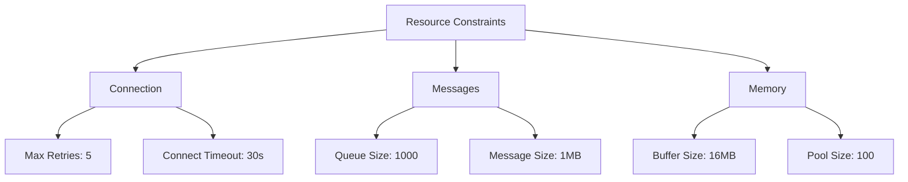
```mermaid
graph TD
    A[Resource Constraints] --> B[Connection]
    A --> C[Messages]
    A --> D[Memory]

    B --> B1[Max Retries: 5]
    B --> B2[Connect Timeout: 30s]

    C --> C1[Queue Size: 1000]
    C --> C2[Message Size: 1MB]

    D --> D1[Buffer Size: 16MB]
    D --> D2[Pool Size: 100]
```

2. Define Performance Requirements

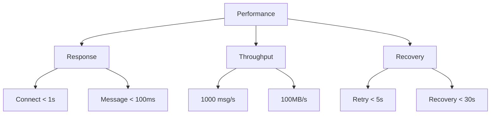
```mermaid
graph TD
    A[Performance] --> B[Response]
    A --> C[Throughput]
    A --> D[Recovery]

    B --> B1[Connect < 1s]
    B --> B2[Message < 100ms]

    C --> C1[1000 msg/s]
    C --> C2[100MB/s]

    D --> D1[Retry < 5s]
    D --> D2[Recovery < 30s]
```

3. Document Quality Requirements

- Reliability metrics
- Performance metrics
- Resource utilization
- Error rate limits

#### Validation Checklist

- [ ] All formal constraints mapped
- [ ] Performance requirements defined
- [ ] Quality metrics specified
- [ ] Resource bounds documented

## 2. Container Level

### 2.1 container.architecture.md

#### Creation Steps

1. Draw Container Diagram:

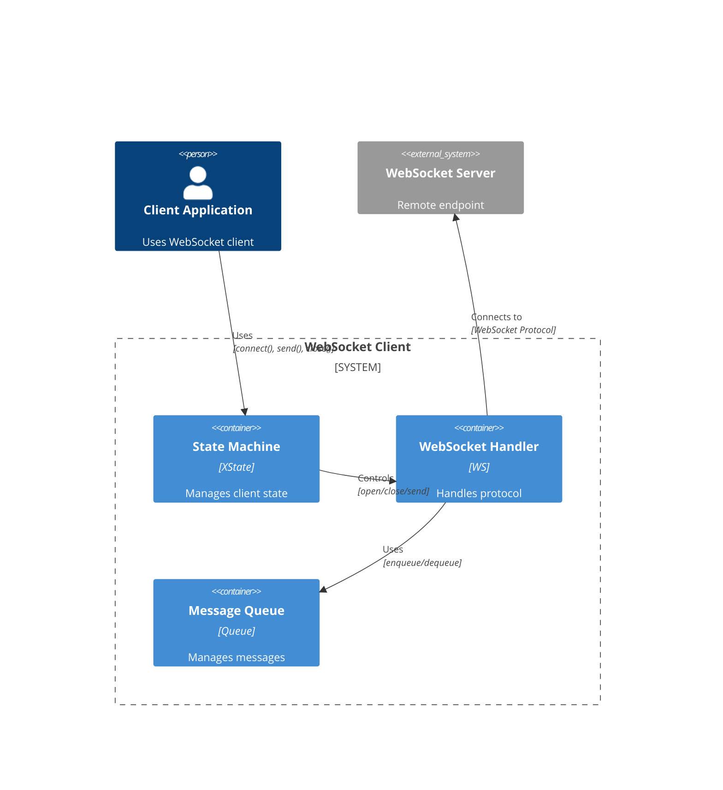
```mermaid
C4Container
    Person(app, "Client Application", "Uses WebSocket client")

    System_Boundary(client, "WebSocket Client") {
        Container(state, "State Machine", "XState", "Manages client state")
        Container(ws, "WebSocket Handler", "WS", "Handles protocol")
        Container(queue, "Message Queue", "Queue", "Manages messages")
    }

    System_Ext(server, "WebSocket Server", "Remote endpoint")

    Rel(app, state, "Uses", "connect(), send(), close()")
    Rel(state, ws, "Controls", "open/close/send")
    Rel(ws, queue, "Uses", "enqueue/dequeue")
    Rel(ws, server, "Connects to", "WebSocket Protocol")
```

2. Map State Machine Container:

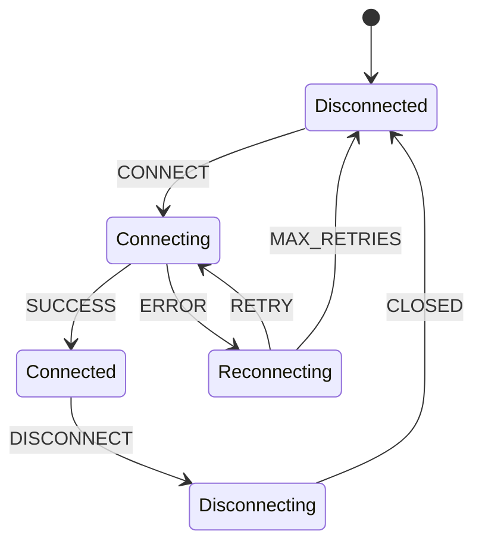
```mermaid
stateDiagram-v2
    [*] --> Disconnected
    Disconnected --> Connecting: CONNECT
    Connecting --> Connected: SUCCESS
    Connecting --> Reconnecting: ERROR
    Connected --> Disconnecting: DISCONNECT
    Disconnecting --> Disconnected: CLOSED
    Reconnecting --> Connecting: RETRY
    Reconnecting --> Disconnected: MAX_RETRIES
```

3. Map WebSocket Container:

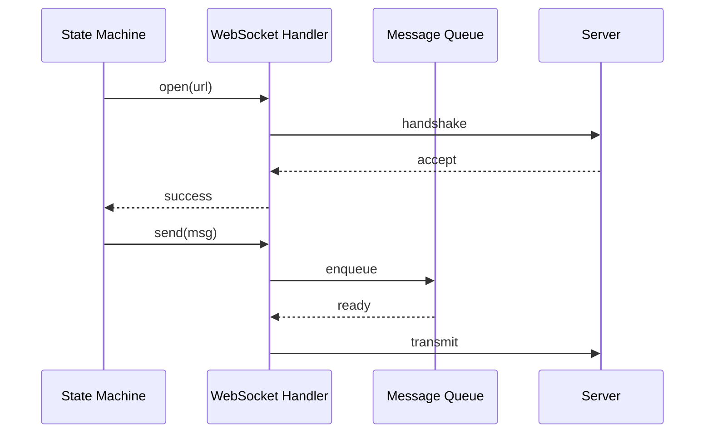
```mermaid
sequenceDiagram
    participant SM as State Machine
    participant WS as WebSocket Handler
    participant Q as Message Queue
    participant S as Server

    SM->>WS: open(url)
    WS->>S: handshake
    S-->>WS: accept
    WS-->>SM: success

    SM->>WS: send(msg)
    WS->>Q: enqueue
    Q-->>WS: ready
    WS->>S: transmit
```

4. Map Message Queue Container:

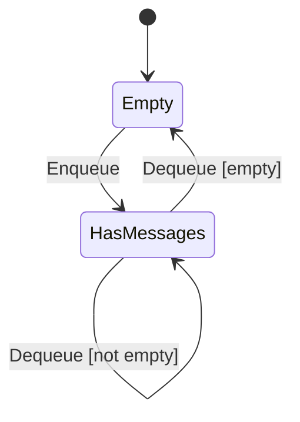
```mermaid
stateDiagram-v2
    [*] --> Empty
    Empty --> HasMessages: Enqueue
    HasMessages --> HasMessages: Enqueue
    HasMessages --> Empty: Dequeue [empty]
    HasMessages --> HasMessages: Dequeue [not empty]
```

#### Validation Checklist

- [ ] All containers identified
- [ ] Responsibilities clear
- [ ] Interfaces defined
- [ ] Resource boundaries set

### 2.2 container.interfaces.md

#### Creation Steps

1. Define Container Interfaces:

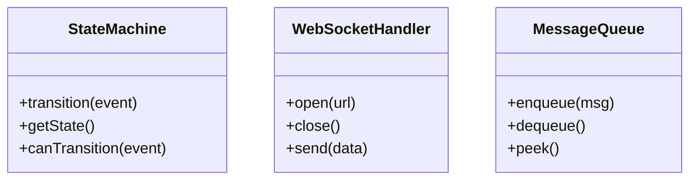
```mermaid
classDiagram
    class StateMachine {
        +transition(event)
        +getState()
        +canTransition(event)
    }
    class WebSocketHandler {
        +open(url)
        +close()
        +send(data)
    }
    class MessageQueue {
        +enqueue(msg)
        +dequeue()
        +peek()
    }
```

2. Map Inter-Container Protocols:

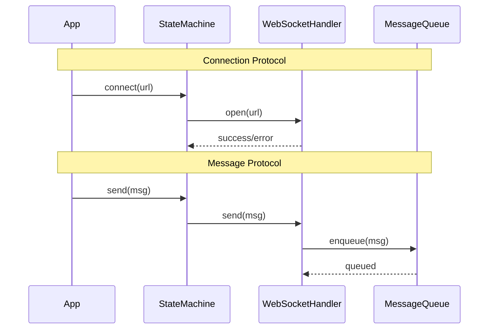
```mermaid
sequenceDiagram
    participant App
    participant SM as StateMachine
    participant WS as WebSocketHandler
    participant Q as MessageQueue

    Note over App,Q: Connection Protocol
    App->>SM: connect(url)
    SM->>WS: open(url)
    WS-->>SM: success/error

    Note over App,Q: Message Protocol
    App->>SM: send(msg)
    SM->>WS: send(msg)
    WS->>Q: enqueue(msg)
    Q-->>WS: queued
```

3. Define Error Handling:

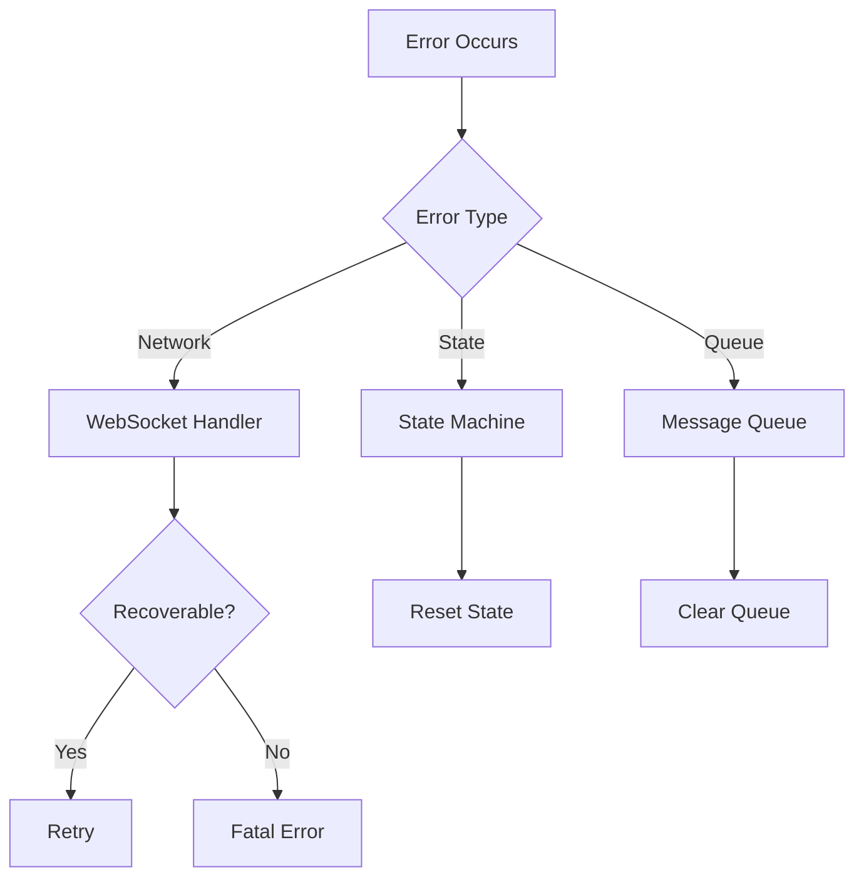
```mermaid
graph TD
    A[Error Occurs] --> B{Error Type}
    B -->|Network| C[WebSocket Handler]
    B -->|State| D[State Machine]
    B -->|Queue| E[Message Queue]

    C --> F{Recoverable?}
    F -->|Yes| G[Retry]
    F -->|No| H[Fatal Error]

    D --> I[Reset State]
    E --> J[Clear Queue]
```

#### Validation Checklist

- [ ] Container interfaces complete
- [ ] Protocols fully specified
- [ ] Error handling defined
- [ ] Resource management clear

### 2.3 container.state.md

#### Creation Steps

1. Map State Distribution:

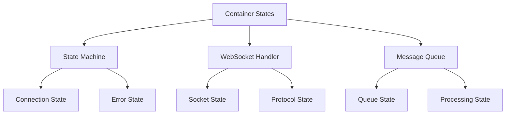
```mermaid
graph TD
    A[Container States] --> B[State Machine]
    A --> C[WebSocket Handler]
    A --> D[Message Queue]

    B --> B1[Connection State]
    B --> B2[Error State]

    C --> C1[Socket State]
    C --> C2[Protocol State]

    D --> D1[Queue State]
    D --> D2[Processing State]
```

2. Define Consistency Rules:

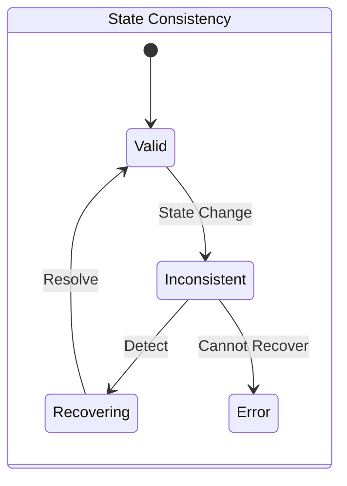
```mermaid
stateDiagram-v2
    state "State Consistency" as SC {
        [*] --> Valid
        Valid --> Inconsistent: State Change
        Inconsistent --> Recovering: Detect
        Recovering --> Valid: Resolve
        Inconsistent --> Error: Cannot Recover
    }
```

3. Document State Flows:

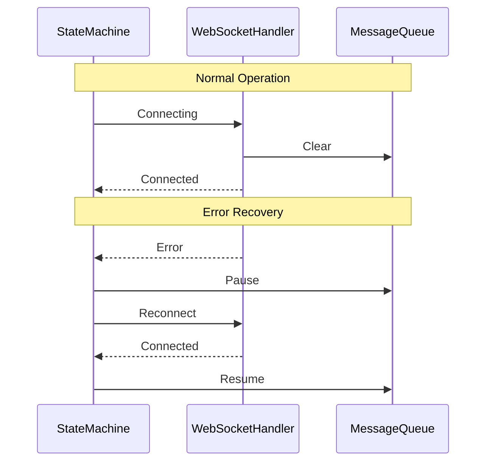
```mermaid
sequenceDiagram
    participant SM as StateMachine
    participant WS as WebSocketHandler
    participant Q as MessageQueue

    Note over SM,Q: Normal Operation
    SM->>WS: Connecting
    WS->>Q: Clear
    WS-->>SM: Connected

    Note over SM,Q: Error Recovery
    WS-->>SM: Error
    SM->>Q: Pause
    SM->>WS: Reconnect
    WS-->>SM: Connected
    SM->>Q: Resume
```

#### Validation Checklist

- [ ] State mapping complete
- [ ] Consistency rules defined
- [ ] Recovery procedures specified
- [ ] Flows documented

## 3. Component Level

### 3.1 component.design.md

#### Creation Steps

1. Create Component Diagrams:

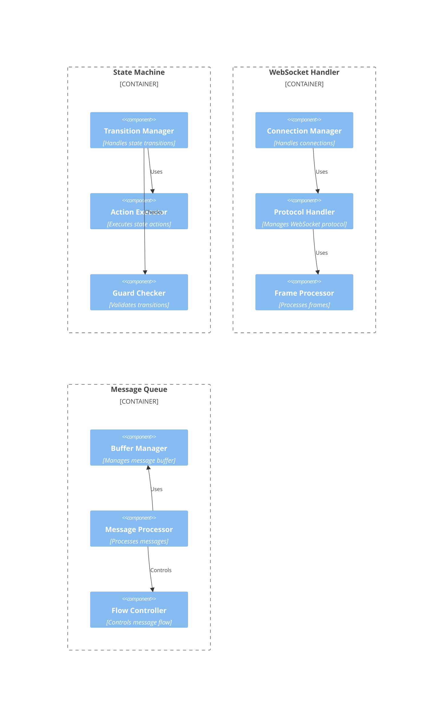
```mermaid
C4Component
    Container_Boundary(sm, "State Machine") {
        Component(transition, "Transition Manager", "Handles state transitions")
        Component(action, "Action Executor", "Executes state actions")
        Component(guard, "Guard Checker", "Validates transitions")
    }

    Container_Boundary(ws, "WebSocket Handler") {
        Component(conn, "Connection Manager", "Handles connections")
        Component(protocol, "Protocol Handler", "Manages WebSocket protocol")
        Component(frame, "Frame Processor", "Processes frames")
    }

    Container_Boundary(queue, "Message Queue") {
        Component(buffer, "Buffer Manager", "Manages message buffer")
        Component(processor, "Message Processor", "Processes messages")
        Component(flow, "Flow Controller", "Controls message flow")
    }

    Rel(transition, action, "Uses")
    Rel(transition, guard, "Checks")
    Rel(conn, protocol, "Uses")
    Rel(protocol, frame, "Uses")
    Rel(processor, buffer, "Uses")
    Rel(processor, flow, "Controls")
```

2. Map State Machine Components:

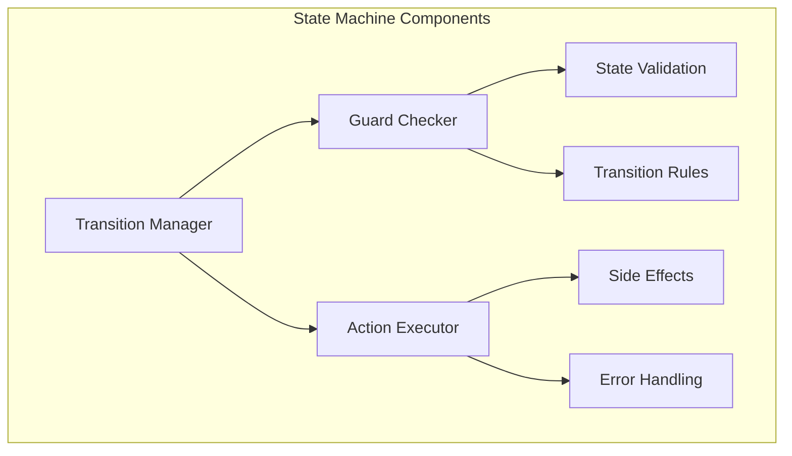
```mermaid
graph TD
    subgraph "State Machine Components"
        A[Transition Manager] --> B[Guard Checker]
        A --> C[Action Executor]

        B --> B1[State Validation]
        B --> B2[Transition Rules]

        C --> C1[Side Effects]
        C --> C2[Error Handling]
    end
```

3. Map Protocol Components:

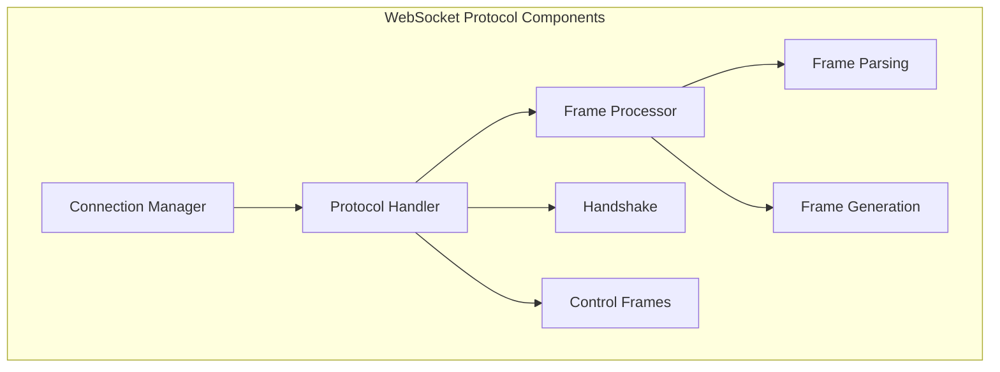
```mermaid
graph TD
    subgraph "WebSocket Protocol Components"
        A[Connection Manager] --> B[Protocol Handler]
        B --> C[Frame Processor]

        B --> B1[Handshake]
        B --> B2[Control Frames]

        C --> C1[Frame Parsing]
        C --> C2[Frame Generation]
    end
```

4. Map Queue Components:

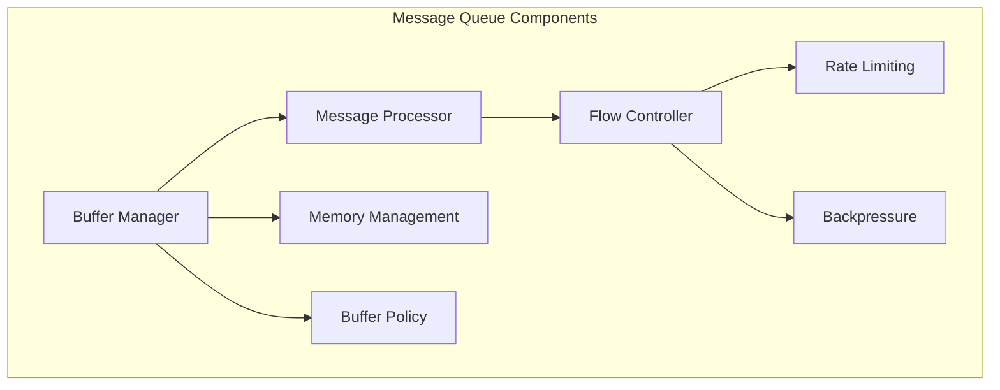
```mermaid
graph TD
    subgraph "Message Queue Components"
        A[Buffer Manager] --> B[Message Processor]
        B --> C[Flow Controller]

        A --> A1[Memory Management]
        A --> A2[Buffer Policy]

        C --> C1[Rate Limiting]
        C --> C2[Backpressure]
    end
```

#### Validation Checklist

- [ ] All components identified
- [ ] Responsibilities assigned
- [ ] Interactions defined
- [ ] Resources allocated

### 3.2 component.interfaces.md

#### Creation Steps

1. Define Component Interfaces:

```mermaid
classDiagram
    class TransitionManager {
        +transition(event)
        +getState()
    }

    class ConnectionManager {
        +connect(url)
        +disconnect()
    }

    class BufferManager {
        +store(message)
        +retrieve()
    }
```

2. Map Component Interactions:

```mermaid
sequenceDiagram
    participant TM as TransitionManager
    participant GC as GuardChecker
    participant AE as ActionExecutor

    TM->>GC: checkTransition(event)
    GC-->>TM: allowed
    TM->>AE: execute(action)
    AE-->>TM: complete
```

3. Define Error Handling:

```mermaid
stateDiagram-v2
    state "Component Error Handling" as CEH {
        [*] --> Normal
        Normal --> ComponentError: Error Occurs
        ComponentError --> Recovering: Handle
        Recovering --> Normal: Resolved
        ComponentError --> Fatal: Cannot Recover
    }
```

#### Validation Checklist

- [ ] Interfaces complete
- [ ] Interactions specified
- [ ] Error handling defined
- [ ] Resources managed

### 3.3 component.interactions.md

#### Creation Steps

1. Document Interaction Patterns:

```mermaid
sequenceDiagram
    participant SM as State Components
    participant WS as WebSocket Components
    participant Q as Queue Components

    SM->>WS: initiate_connection
    WS->>Q: prepare_queue
    WS-->>SM: ready

    SM->>WS: process_message
    WS->>Q: enqueue
    Q-->>WS: processed
    WS-->>SM: complete
```

2. Define Message Flows:

```mermaid
graph LR
    subgraph "Message Flow"
        A[Receive] --> B[Validate]
        B --> C[Process]
        C --> D[Queue]
        D --> E[Send]
    end
```

3. Specify Timing Requirements:

```mermaid
sequenceDiagram
    participant C as Component
    participant P as Processor
    participant Q as Queue

    Note over C,Q: Processing Timeline
    C->>P: submit
    activate P
    P->>Q: process
    activate Q
    Q-->>P: processed
    deactivate Q
    P-->>C: complete
    deactivate P
    Note over C,Q: Max Time: 100ms
```

#### Validation Checklist

- [ ] Patterns documented
- [ ] Flows specified
- [ ] Timing defined
- [ ] Recovery mapped

## 4. Class Level

### 4.1 class.structure.md

#### Creation Steps

1. Create Class Diagrams:

```mermaid
classDiagram
    class StateMachine {
        -currentState: State
        -context: Context
        +transition(event: Event)
        +getState(): State
    }

    class State {
        +type: StateType
        +value: any
        +context: Context
    }

    class Event {
        +type: EventType
        +payload: any
    }

    class Context {
        +url: string
        +retries: number
        +status: Status
    }

    StateMachine --> State
    StateMachine --> Event
    StateMachine --> Context
```

2. Map Formal Elements:

```mermaid
graph TD
    subgraph "Formal to Class Mapping"
        A[States S] --> B[State Types]
        C[Events E] --> D[Event Types]
        E[Context C] --> F[Context Properties]
        G[Actions γ] --> H[Methods]
    end
```

3. Define Type System:

```mermaid
graph TD
    subgraph "Type Hierarchy"
        A[AbstractState] --> B[ConcreteState]
        C[AbstractEvent] --> D[ConcreteEvent]
        E[AbstractContext] --> F[ConcreteContext]

        B --> B1[DisconnectedState]
        B --> B2[ConnectedState]

        D --> D1[ConnectionEvent]
        D --> D2[MessageEvent]
    end
```

#### Validation Checklist

- [ ] Abstractions complete
- [ ] Types defined
- [ ] Relationships specified
- [ ] Constraints documented

### 4.2 class.behavior.md

#### Creation Steps

1. Define Class Behaviors:

```mermaid
stateDiagram-v2
    state StateMachine {
        [*] --> Initializing
        Initializing --> Ready: init()
        Ready --> Processing: handleEvent()
        Processing --> Ready: complete
        Processing --> Error: error
        Error --> Ready: recover
    }
```

2. Map Operations:

```mermaid
sequenceDiagram
    participant SM as StateMachine
    participant S as State
    participant E as Event
    participant C as Context

    SM->>S: validateTransition(event)
    S->>C: updateContext(event)
    C-->>S: updated
    S-->>SM: transitionValid
    SM->>S: performTransition(event)
```

3. Specify Invariants:

```mermaid
graph TD
    subgraph "Class Invariants"
        A[State Invariants] --> A1[Single Active State]
        A --> A2[Valid Transitions]

        B[Context Invariants] --> B1[Required Fields]
        B --> B2[Value Ranges]

        C[Resource Invariants] --> C1[Memory Bounds]
        C --> C2[Queue Limits]
    end
```

#### Validation Checklist

- [ ] Behaviors defined
- [ ] Operations mapped
- [ ] Invariants specified
- [ ] Contracts complete

## Validation Requirements

### For Each File

1. Check Formal Mappings:

```mermaid
graph TD
    A[Formal Spec] --> B{Mapping Check}
    B --> C[Complete]
    B --> D[Consistent]
    B --> E[Traceable]

    C --> C1[All Elements]
    C --> C2[All Properties]

    D --> D1[No Conflicts]
    D --> D2[Preserved Rules]

    E --> E1[Clear Sources]
    E --> E2[Clear Targets]
```

2. Verify Completeness:

```mermaid
graph TD
    A[Design Elements] --> B{Completeness}
    B --> C[Required Elements]
    B --> D[Interfaces]
    B --> E[Behaviors]

    C --> C1[All Present]
    C --> C2[Well Defined]

    D --> D1[All Specified]
    D --> D2[Fully Defined]

    E --> E1[All Covered]
    E --> E2[Well Specified]
```

3. Validate Design:

```mermaid
graph TD
    A[Design Validation] --> B{Design Quality}
    B --> C[Principles]
    B --> D[Simplicity]
    B --> E[Extensions]

    C --> C1[Following Rules]
    C --> C2[Meeting Goals]

    D --> D1[Clean Design]
    D --> D2[Clear Intent]

    E --> E1[Extension Points]
    E --> E2[Flexibility]
```

### Between Levels

1. Check Consistency:

```mermaid
graph TD
    A[Level Consistency] --> B{Checks}
    B --> C[Interfaces]
    B --> D[Properties]
    B --> E[Behavior]

    C --> C1[Align]
    C --> C2[Complete]

    D --> D1[Preserved]
    D --> D2[Enhanced]

    E --> E1[Consistent]
    E --> E2[Complete]
```

2. Verify Completeness:

```mermaid
graph TD
    A[Integration Check] --> B{Verification}
    B --> C[Mappings]
    B --> D[Requirements]
    B --> E[Relationships]

    C --> C1[No Gaps]
    C --> C2[Clear Links]

    D --> D1[All Covered]
    D --> D2[Well Defined]

    E --> E1[All Connected]
    E --> E2[Well Defined]
```

### Final Validation

1. System Complete:

```mermaid
graph TD
    A[System Validation] --> B{Completeness}
    B --> C[Documentation]
    B --> D[Design]
    B --> E[Validation]

    C --> C1[All Files]
    C --> C2[Complete Content]

    D --> D1[All Levels]
    D --> D2[All Elements]

    E --> E1[All Checks]
    E --> E2[All Passed]
```

2. Design Sound:

```mermaid
graph TD
    A[Design Quality] --> B{Quality Gates}
    B --> C[Principles]
    B --> D[Practice]
    B --> E[Implementation]

    C --> C1[Following]
    C --> C2[Sound]

    D --> D1[Workable]
    D --> D2[Clear]

    E --> E1[Ready]
    E --> E2[Complete]
```
