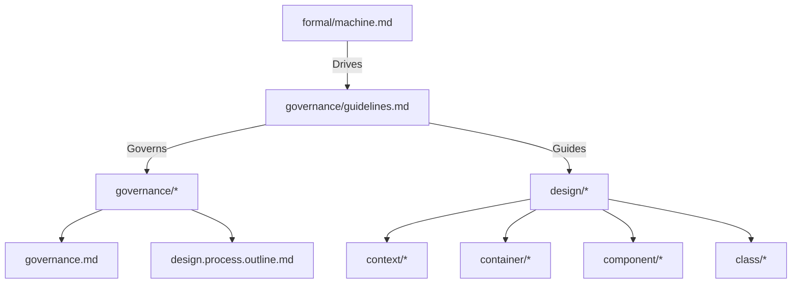
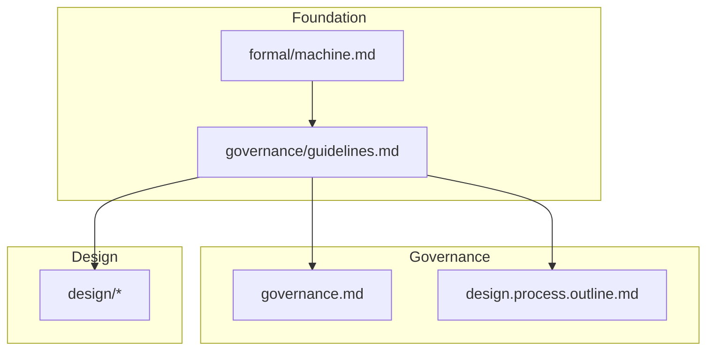

# WebSocket Client Design Guidelines

## File Organization and Structure

### Design File Hierarchy

### File Dependencies

## 1. Core Design Principles

### 1.1 Simplicity

The system design must minimize complexity:

- Choose straightforward solutions over clever optimizations
- Minimize number of components and interactions
- Use standard patterns and approaches
- Avoid premature optimization

### 1.2 Workability

All design decisions must be practical:

- Solutions must be implementable with available technologies
- Consider real-world constraints and limitations
- Use proven approaches where possible
- Enable incremental development and testing

### 1.3 Completeness

The design must fully address requirements:

- Cover all specified states and transitions
- Include error handling and recovery
- Address all documented use cases
- Provide necessary monitoring and management

### 1.4 Stability

Small requirement changes should yield small design changes:

- Avoid designs sensitive to minor requirement changes
- Prefer stable solutions over optimal ones
- Localize impact of changes
- Design for evolution

### Formal Foundation

The formal specification in machine.md provides:

- State machine behavior $(S, E, \delta, s_0, C, \gamma, F)$
- Property definitions $\phi \in \Phi$
- Resource bounds $R = \{r_i\}$
- System invariants $I = \{i_j\}$

### Design Generation Process

1. Formal Mapping

   $$
   \begin{aligned}
   \text{States}: & S \rightarrow \text{SystemStates} \\
   \text{Events}: & E \rightarrow \text{Interfaces} \\
   \text{Actions}: & \gamma \rightarrow \text{Operations} \\
   \text{Context}: & C \rightarrow \text{Configuration}
   \end{aligned}
   $$

2. Property Preservation
   $$
   \begin{aligned}
   \text{Safety}: & \forall s \in S, P_{safety}(s) \\
   \text{Liveness}: & \forall s \in S, \Diamond P_{liveness}(s) \\
   \text{Resources}: & \forall r \in R, r \leq bound(r)
   \end{aligned}
   $$

## 2. Design Generation Framework

### Level Progression

For each design level $L$, completion requires:

$$
complete(L) \iff \begin{cases}
\text{simple}(L): & \text{minimal complexity} \\
\text{workable}(L): & \text{proven feasible} \\
\text{complete}(L): & \text{covers requirements} \\
\text{stable}(L): & \text{resistant to changes}
\end{cases}
$$

### Validation Points

For each validation $V$:

$$
valid(V) \iff \begin{cases}
\text{formal properties:} & \bigwedge_{\phi \in \Phi} check(\phi) \\
\text{resource bounds:} & \bigwedge_{r \in R} verify(r) \\
\text{system invariants:} & \bigwedge_{i \in I} validate(i)
\end{cases}
$$

## 3. Decision Framework

### Technology Selection

For each technology choice $t$:

$$
select(t) \iff \begin{cases}
\text{simplicity}(t) & \text{: minimizes complexity} \\
\text{workability}(t) & \text{: proven viable} \\
\text{completeness}(t) & \text{: meets requirements} \\
\text{stability}(t) & \text{: resistant to change}
\end{cases}
$$

### Trade-off Resolution

When conflicts arise:

$$
priority = \begin{cases}
1 & \text{stability preservation} \\
2 & \text{solution simplicity} \\
3 & \text{implementation workability} \\
4 & \text{requirement completeness} \\
5 & \text{optimization goals}
\end{cases}
$$

## 4. Validation Process

### Property Validation

For each property $\phi$:

$$
validate(\phi) = \begin{cases}
\text{map:} & \phi \rightarrow design \\
\text{verify:} & prove(\phi) \\
\text{document:} & record(\phi) \\
\text{track:} & status(\phi)
\end{cases}
$$

### Resource Validation

For each resource $r$:

$$
verify(r) = \begin{cases}
\text{allocate:} & assign(r) \\
\text{bound:} & check(r \leq limit(r)) \\
\text{monitor:} & track(usage(r)) \\
\text{document:} & record(r)
\end{cases}
$$

## 5. Success Criteria

### Design Completion

A design $D$ is complete when:

$$
complete(D) \iff \begin{cases}
\text{simple:} & \text{minimal complexity achieved} \\
\text{workable:} & \text{implementation validated} \\
\text{complete:} & \text{requirements satisfied} \\
\text{stable:} & \text{change resistant}
\end{cases}
$$

### Quality Requirements

Quality is achieved when:

$$
quality(D) \iff \begin{cases}
\text{formal correctness:} & \bigwedge_{\phi \in \Phi} verify(\phi) \\
\text{resource compliance:} & \bigwedge_{r \in R} bound(r) \\
\text{documentation:} & \bigwedge_{d \in Docs} complete(d)
\end{cases}
$$

## 6. Problem Resolution

### Violation Handling

For any violation $v$:

$$
resolve(v) = \begin{cases}
\text{document:} & record(v) \\
\text{analyze:} & cause(v) \\
\text{fix:} & correct(v) \\
\text{verify:} & check(fix(v))
\end{cases}
$$

### Recovery Process

Recovery must ensure:

$$
recover(D) \implies \begin{cases}
\text{properties restored:} & \forall \phi \in \Phi, verify(\phi) \\
\text{resources compliant:} & \forall r \in R, bound(r) \\
\text{system stable:} & \forall i \in I, check(i)
\end{cases}
$$
