# WebSocket Client Documentation Guide

## Overview

This repository contains the formal specification and implementation guidelines for a robust WebSocket client. The documentation is structured to guide you from theoretical foundations through practical implementation.

## Document Structure

### 1. Formal Specification (`formal/machine.md`)
The core mathematical specification defining:
- State machine model and properties
- Formal proofs of correctness
- System constraints and invariants
- Timing properties
- Safety guarantees

This document serves as the authoritative reference for the WebSocket client's behavior. Any implementation must conform to these specifications.

### 2. Implementation Guidelines (`governance/guidelines.md`)
Design-phase documentation covering:
- Abstraction levels and modeling approaches
- Documentation standards (C4 model, UML, etc.)
- Modeling requirements
- Verification criteria
- Evolution guidelines

Use this document when planning your implementation and establishing development practices.

### 3. Governance Model (`governance/governance.md`)
Rules and processes for maintaining stability:
- Core elements that must not change
- Permitted extension points
- Implementation order requirements
- Change management process
- Review requirements

This document helps prevent implementation drift and maintain long-term stability.

### 4. WebSocket Protocol Mapping (`formal/websocket.md`)
Bridges the formal specification to WebSocket protocols:
- State mapping to WebSocket states
- Protocol-specific constraints
- Message handling properties
- Error classifications
- Resource management

## Documentation Map

### Detailed Relationship Diagram

```mermaid
graph TD
    subgraph Formal_Foundation[Formal Foundation - machine.md]
        M[machine.md]
        subgraph Core_Model[Core Model]
            MS[State Machine Definition]
            MT[Transition Functions]
            MI[Invariants]
            MS --- MT
            MT --- MI
        end
        subgraph Properties[Properties]
            MP1[Safety Properties]
            MP2[Liveness Properties]
            MP3[Timing Properties]
            MP1 --- MP2
            MP2 --- MP3
        end
        subgraph Proofs[Formal Proofs]
            MPR1[State Integrity]
            MPR2[Message Preservation]
            MPR3[Resource Bounds]
            MPR1 --- MPR2
            MPR2 --- MPR3
        end
        M --- Core_Model
        M --- Properties
        M --- Proofs
    end

    subgraph Protocol_Implementation[Protocol Layer - websocket.md]
        W[websocket.md]
        subgraph Protocol[Protocol Handling]
            WP1[State Mapping]
            WP2[Event Processing]
            WP3[Message Queue]
            WP1 --- WP2
            WP2 --- WP3
        end
        subgraph Error[Error Management]
            WE1[Error Classification]
            WE2[Recovery Strategy]
            WE3[Retry Logic]
            WE1 --- WE2
            WE2 --- WE3
        end
        subgraph Resources[Resource Control]
            WR1[Memory Management]
            WR2[Connection Pooling]
            WR3[Rate Limiting]
            WR1 --- WR2
            WR2 --- WR3
        end
        W --- Protocol
        W --- Error
        W --- Resources
    end

    subgraph Governance[Governance - governance.md]
        G[governance.md]
        subgraph Changes[Change Control]
            GC1[Review Process]
            GC2[Version Control]
            GC3[Migration Rules]
            GC1 --- GC2
            GC2 --- GC3
        end
        subgraph Stability[Stability Rules]
            GS1[Core Invariants]
            GS2[Extension Rules]
            GS3[Validation Checks]
            GS1 --- GS2
            GS2 --- GS3
        end
        G --- Changes
        G --- Stability
    end

    subgraph Guidelines[Guidelines - guidelines.md]
        D[guidelines.md]
        subgraph Design[Design Standards]
            DD1[Architecture Patterns]
            DD2[Component Design]
            DD3[Interface Guidelines]
            DD1 --- DD2
            DD2 --- DD3
        end
        subgraph Implementation[Implementation Guide]
            DI1[Best Practices]
            DI2[Code Standards]
            DI3[Testing Rules]
            DI1 --- DI2
            DI2 --- DI3
        end
        D --- Design
        D --- Implementation
    end

    M -->|implements| W
    G -->|governs| W
    G -->|influences| D
    D -->|guides| W

    %% Professional Color Scheme
    classDef core fill:#2c3e50,stroke:#34495e,stroke-width:2px,color:#ecf0f1
    classDef impl fill:#2980b9,stroke:#3498db,stroke-width:2px,color:#ecf0f1
    classDef gov fill:#27ae60,stroke:#2ecc71,stroke-width:2px,color:#ecf0f1
    classDef guide fill:#d35400,stroke:#e67e22,stroke-width:2px,color:#ecf0f1
    
    %% Apply colors to main documents
    class M,Core_Model,Properties,Proofs core
    class W,Protocol,Error,Resources impl
    class G,Changes,Stability gov
    class D,Design,Implementation guide
```


### Quick Reference Map

```
                                  Formal Foundation
┌──────────────────────────────────────────────────────────────────┐
│                          machine.md                              │
│                                                                  │
│  ┌─────────────┐    ┌──────────────┐     ┌──────────────┐      │
│  │ State Model │    │  Constraints  │     │   Proofs     │      │
│  └─────────────┘    └──────────────┘     └──────────────┘      │
└──────────────────────────────────┬───────────────────────────────┘
                                   │
                                   │ implements
                                   ▼
                        Protocol Implementation
┌──────────────────────────────────────────────────────────────────┐
│                         websocket.md                             │
│                                                                  │
│  ┌─────────────┐    ┌──────────────┐     ┌──────────────┐      │
│  │Protocol Map │    │Error Handling│     │Resource Mgmt │      │
│  └─────────────┘    └──────────────┘     └──────────────┘      │
└───────────┬────────────────────────────────────────┬────────────┘
            │                                        │
        governed by                             guided by
            │                                        │
            ▼                                        ▼
┌──────────────────────┐                 ┌──────────────────────┐
│    governance.md     │  influences     │    guidelines.md     │
│                      │◄───────────────►│                      │
│  Change Management   │                 │  Design Standards    │
│  Stability Rules     │                 │  Implementation Guide│
└──────────────────────┘                 └──────────────────────┘
```

## Document Relationships

### Core Dependencies
- machine.md defines fundamental behavior
- websocket.md implements machine.md specifications
- governance.md enforces stability of machine.md
- guidelines.md ensures consistent implementation

### Information Flow
1. machine.md → websocket.md: Implementation requirements
2. governance.md → implementation: Change control
3. guidelines.md → implementation: Design patterns
4. websocket.md → implementation: Protocol details

## How to Use This Documentation

1. **Start with machine.md**
   - Understand the formal model
   - Review state transitions
   - Note invariants and constraints

2. **Review guidelines.md**
   - Understand design principles
   - Note documentation requirements
   - Review modeling standards

3. **Study governance.md**
   - Identify immutable elements
   - Understand extension points
   - Review change processes

4. **Examine websocket.md**
   - See protocol mappings
   - Review implementation details
   - Note resource constraints

## Key Concepts

### State Machine Foundation
The system is built on a formal state machine defined as:
```
𝒲𝒞 = (S, E, δ, s₀, C, γ, F)
```
Where:
- S: Set of states (disconnected, connecting, etc.)
- E: Set of events (connect, disconnect, etc.)
- δ: Transition function
- s₀: Initial state
- C: Context variables
- γ: Actions
- F: Final states

### Stability vs Optimization
The specification emphasizes stability over mathematical optimality:
- Core behaviors remain unchanged
- Extensions follow prescribed patterns
- Changes are additive rather than modificative

### Extension Architecture
The system provides specific extension points:
- Event handlers
- Middleware components
- Configuration options

## Next Steps

1. Read machine.md for formal foundations
2. Review guidelines.md for implementation approach
3. Understand governance.md for stability requirements
4. Study websocket.md for protocol details

## Need Help?

- For formal model questions: reference machine.md
- For design decisions: check guidelines.md
- For process questions: see governance.md
- For protocol details: consult websocket.md