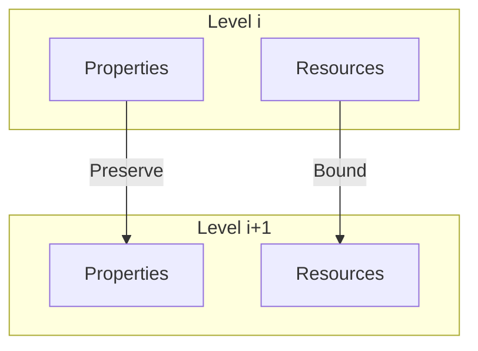
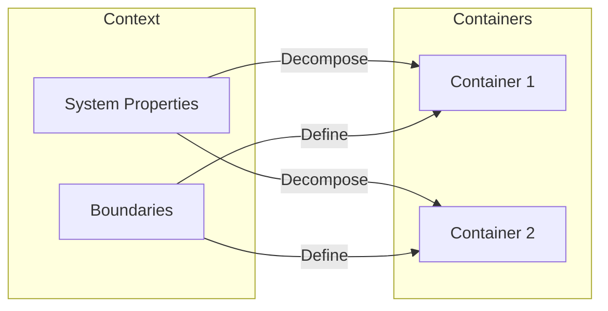
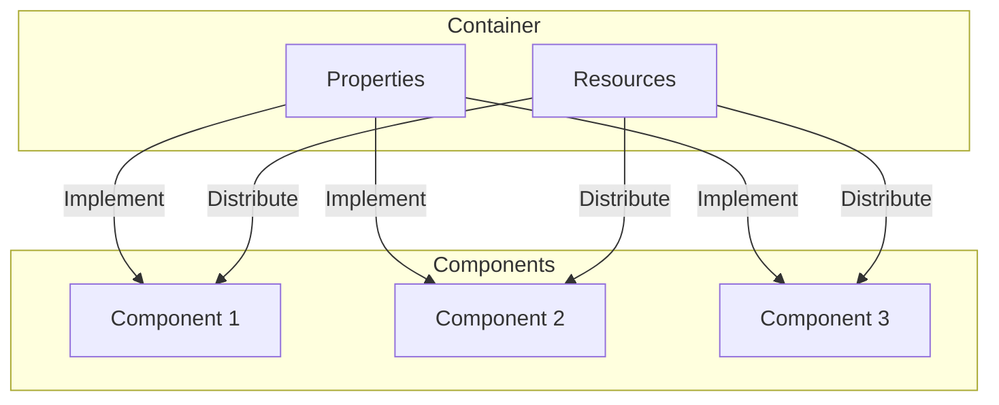

# Level Transition Framework

## 1. Level Definition

Each design level $L_i$ is defined as:

$$
L_i = (B_i, P_i, R_i, I_i)
$$

Where:
- $B_i$: Boundaries at level $i$
- $P_i$: Properties preserved at level $i$
- $R_i$: Resources managed at level $i$
- $I_i$: Interfaces defined at level $i$

## 2. Transition Requirements

### 2.1 Property Preservation
For transition $L_i \rightarrow L_{i+1}$:

### 2.2 Formal Transition Rules

1. Property Preservation:
   $$\forall p \in P_i: \exists p' \in P_{i+1}: preserve(p, p')$$

2. Resource Bounds:
   $$\forall r \in R_i: bound(r, L_{i+1}) \leq bound(r, L_i)$$

3. Interface Completeness:
   $$\forall i \in I_i: complete(i, L_{i+1})$$

## 3. Level-Specific Requirements

### 3.1 Context → Container

$$
\begin{aligned}
&\text{Must satisfy}: \\
&\begin{cases}
\text{Complete coverage}: & \bigcup C_i = S \\
\text{Property preservation}: & \forall p \in P_s: \exists C_i: preserve(p, C_i) \\
\text{Resource allocation}: & \sum bounds(C_i) \leq bounds(S)
\end{cases}
\end{aligned}
$$

### 3.2 Container → Component

$$
\begin{aligned}
&\text{Must satisfy}: \\
&\begin{cases}
\text{Implementation completeness}: & \forall p \in P: implemented(p) \\
\text{Resource distribution}: & \sum resources(C_i) = resources(Container) \\
\text{Interface compliance}: & \forall i \in I: compliant(i)
\end{cases}
\end{aligned}
$$

## 4. Validation Process

### 4.1 Pre-Transition Checks

1. Property Coverage:
   - All properties mapped
   - Resources allocated
   - Interfaces defined

2. Constraint Validation:
   - Resource bounds
   - Interface compliance
   - State consistency

### 4.2 Transition Validation

$$
valid(L_i \rightarrow L_{i+1}) \iff \begin{cases}
\text{Pre-conditions met}: & check(L_i) \\
\text{Transition valid}: & transition(L_i, L_{i+1}) \\
\text{Post-conditions met}: & verify(L_{i+1})
\end{cases}
$$

### 4.3 Post-Transition Verification

1. Property Implementation:
   - Verify pattern application
   - Check constraint preservation
   - Validate state handling

2. Resource Management:
   - Verify allocation
   - Check bounds
   - Validate cleanup

## 5. Design Decisions

### 5.1 Decision Framework
For each design decision $d$:

$$
approve(d) \iff \begin{cases}
\text{Properties preserved}: & \forall p \in P: preserve(p, d) \\
\text{Resources bounded}: & \forall r \in R: bound(r, d) \\
\text{Interfaces complete}: & \forall i \in I: complete(i, d)
\end{cases}
$$

### 5.2 Impact Analysis
For change $\Delta$:

$$
impact(\Delta) = \begin{cases}
\text{Local}: & affects(L_i) \\
\text{Transitional}: & affects(L_i \rightarrow L_{i+1}) \\
\text{Global}: & affects(System)
\end{cases}
$$