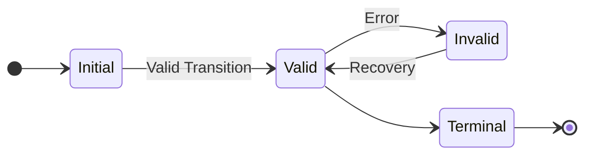
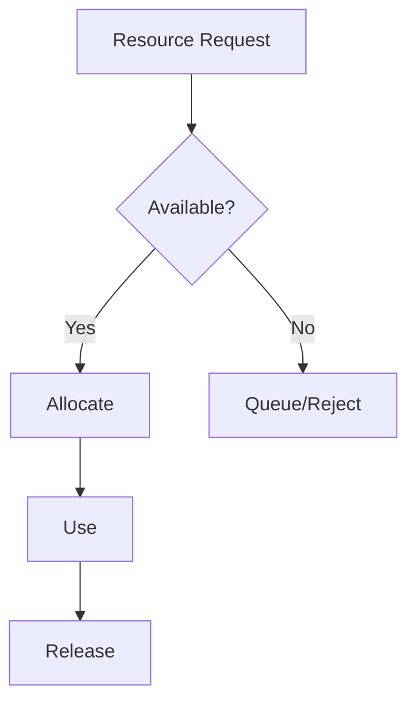

# Enhanced Property Framework

## 1. Property Categories

### 1.1 Core Service Properties
Core properties $\mathcal{P}_{core}$ that must be preserved:

$$
\begin{aligned}
\mathcal{P}_{core} = \{&\\
&\text{state integrity},\\
&\text{resource bounds},\\
&\text{error propagation},\\
&\text{connection lifecycle}\\
\}
\end{aligned}
$$

Each property has associated:
- Design patterns it generates
- Validation criteria
- Resource constraints

### 1.2 Property Mappings
For each property $p \in \mathcal{P}_{core}$:

$$
\phi(p) = (D_p, V_p, R_p)
$$

Where:
- $D_p$: Design patterns property requires
- $V_p$: Validation requirements
- $R_p$: Resource constraints

## 2. Pattern Generation

### 2.1 State Integrity

Generates patterns:
- State tracking mechanism
- Transition validation
- Recovery procedures

### 2.2 Resource Management

Generates patterns:
- Resource pooling
- Lifecycle management
- Cleanup guarantees

## 3. Validation Framework

### 3.1 Property Validation
For each level $L$:

$$
valid(L) \iff \forall p \in \mathcal{P}_{core}: validate(p, L)
$$

Where $validate(p, L)$ verifies:
1. Pattern implementation
2. Resource constraints
3. Error handling

### 3.2 Level Transitions
For transition $L_i \rightarrow L_{i+1}$:

$$
valid(L_i \rightarrow L_{i+1}) \iff \begin{cases}
\text{preserve}(p, L_i, L_{i+1}) & \forall p \in \mathcal{P}_{core} \\
\text{bound}(r, L_{i+1}) \leq \text{bound}(r, L_i) & \forall r \in R \\
\text{complete}(i, L_{i+1}) & \forall i \in I
\end{cases}
$$

## 4. Design Application

### 4.1 Context Level
At context level, properties manifest as:
1. System boundaries
2. External interfaces
3. Global constraints

### 4.2 Container Level
Containers must implement:
1. State management
2. Resource control
3. Error boundaries

### 4.3 Component Level
Components provide:
1. Property implementations
2. Resource management
3. Interface contracts

## 5. Usage Guidelines

### 5.1 Design Process
1. Identify required properties
2. Apply generated patterns
3. Validate implementation
4. Verify constraints

### 5.2 Decision Points
For each design decision:
1. Check property impact
2. Verify pattern compliance
3. Validate resource bounds
4. Ensure recoverability

### 5.3 Validation Steps
1. Check pattern implementation
2. Verify resource constraints
3. Test error handling
4. Validate state transitions