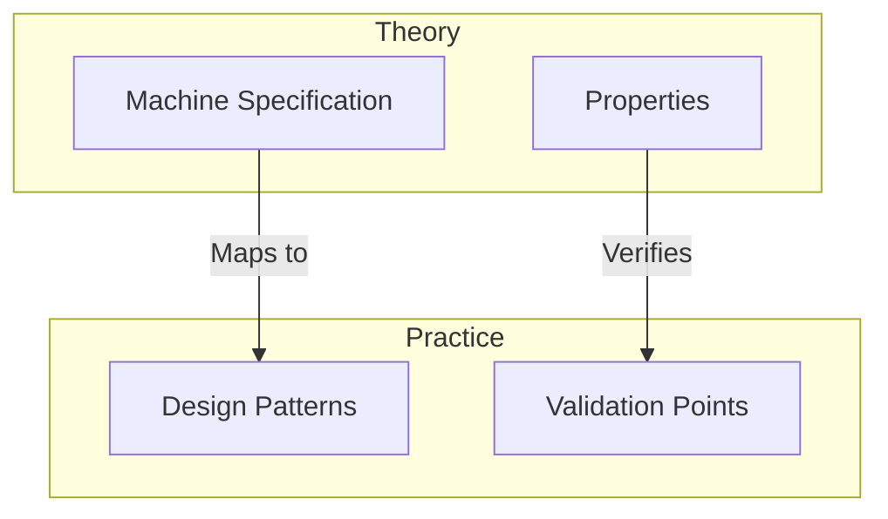

# Governance Framework Gap Analysis and Improvements

## 1. Core Framework Gaps

### 1.1 Theory-Practice Connection
Current framework defines formal machine $M$ and properties $P$, but lacks:
- Connection between formal states $S$ and practical system states
- Mapping between events $E$ and actual system operations
- Translation of formal constraints to system design

Proposed Improvement:

### 1.2 Design Level Transitions
Current framework defines levels but needs:
- Property preservation mechanisms between levels
- Clear validation criteria for transitions
- Resource constraint tracking across levels

$$
\begin{aligned}
&\text{For transition } L_i \rightarrow L_{i+1}: \\
&\begin{cases}
\text{Properties: } & \forall p \in P, preserve(p, L_i, L_{i+1}) \\
\text{Resources: } & \forall r \in R, bound(r, L_i) \geq bound(r, L_{i+1}) \\
\text{Interfaces: } & \forall i \in I, complete(i, L_i) \land compatible(i, L_{i+1})
\end{cases}
\end{aligned}
$$

### 1.3 Property Derivation
Need systematic approach for:
- Deriving concrete properties from formal spec
- Establishing verification methods
- Ensuring property completeness

## 2. Practical Framework Gaps

### 2.1 Pattern Development Process
Need process for:
1. Pattern Identification:
   - From formal properties to patterns
   - Pattern categorization
   - Pattern validation

2. Pattern Application:
   - Context-specific adaptation
   - Composition rules
   - Validation criteria

### 2.2 Design Decision Support
Need framework for:
1. Decision Points:
   - When to apply patterns
   - When to deviate
   - How to validate decisions

2. Trade-off Analysis:
   - Between competing properties
   - Resource allocation
   - Implementation complexity

## 3. Proposed Enhancements

### 3.1 Enhanced Property Framework
Extend $P$ with mapping functions:

$$
\begin{aligned}
\Phi: P &\rightarrow \text{Patterns} \\
\Psi: P &\rightarrow \text{Validation} \\
\Omega: P &\rightarrow \text{Constraints}
\end{aligned}
$$

### 3.2 Level Transition Framework
Strengthen transition validation:

$$
\begin{aligned}
validate(L_i \rightarrow L_{i+1}) \iff \begin{cases}
\text{patterns match: } & \Phi(p) \text{ preserved} \\
\text{validation passes: } & \Psi(p) \text{ satisfied} \\
\text{constraints hold: } & \Omega(p) \text{ maintained}
\end{cases}
\end{aligned}
$$

### 3.3 Design Process Enhancement
Add systematic approach for:
1. Pattern identification from properties
2. Design decision validation
3. Cross-cutting concern integration

## 4. Implementation Guide

### 4.1 Documentation Structure
Organize by:
1. Formal foundations
2. Pattern derivations
3. Design processes
4. Validation frameworks

### 4.2 Usage Guidelines
Include:
1. When to apply which parts
2. How to validate decisions
3. How to maintain traceability

### 4.3 Validation Process
Define clear steps for:
1. Property verification
2. Pattern validation
3. Decision assessment

## 5. Next Steps

### 5.1 Immediate Actions
1. Develop detailed property mapping framework
2. Create pattern identification process
3. Enhance level transition validation

### 5.2 Long-term Improvements
1. Build pattern library
2. Develop decision support tools
3. Create validation automation