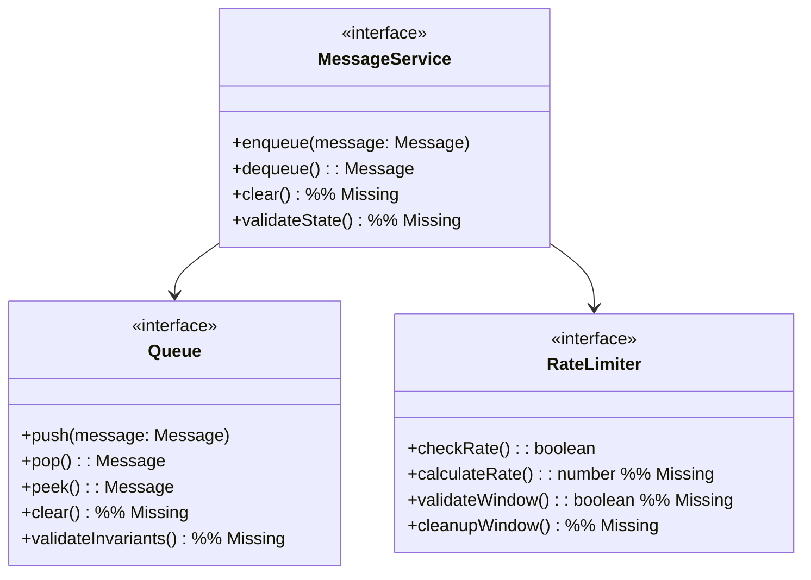

# Message System Completeness Analysis

## 1. Core Concepts Coverage

### 1.1 Message Space $Q$
| Mathematical Concept | Design Component | Status | Notes |
|---------------------|------------------|--------|-------|
| `MessageQueue` | `Queue` interface | ✅ | Direct mapping |
| `MessageContent` | `Message` interface | ✅ | Complete representation |
| `QueueOperation` | Queue operations | ⚠️ | Missing `clear` operation |
| `QueueInvariants` | Queue properties | ❌ | Not explicitly defined |

### 1.2 Rate Limiting Properties
| Mathematical Concept | Design Component | Status | Notes |
|---------------------|------------------|--------|-------|
| `WINDOW_SIZE` | Rate window | ✅ | Mapped in FlowControl |
| `MAX_MESSAGES` | Rate limits | ✅ | Defined in constants |
| `rate(t)` | Rate calculation | ❌ | Missing calculation logic |
| `Window` | Flow window tracking | ⚠️ | Incomplete implementation |

### 1.3 Queue Properties
| Mathematical Concept | Design Component | Status | Notes |
|---------------------|------------------|--------|-------|
| `|Q| ≤ MAX_QUEUE_SIZE` | Size limits | ✅ | Enforced in queue |
| `Order preservation` | FIFO guarantee | ✅ | Queue implementation |
| `Message processing` | Processor | ❌ | Missing complete processing logic |
| `Queue validation` | Validators | ⚠️ | Partial coverage |

## 2. Missing Elements

### 2.1 Queue Operations
Need to add:
1. Queue clear operation
2. Queue validation methods
3. Complete processing pipeline
4. Explicit invariant checks

### 2.2 Rate Limiting
Need to add:
1. Rate calculation formula
2. Complete window tracking
3. Rate limiting validation
4. Window cleanup

### 2.3 Properties
Need to add:
1. Explicit invariant assertions
2. Property validation methods
3. Complete processing guarantees
4. State consistency checks

## 3. Required Updates

### 3.1 Message Service


### 3.2 Property Definitions
```typescript
interface QueueInvariants {
    maxSize: number;
    orderPreservation: boolean;
    processingGuarantees: ProcessingGuarantee[];
    stateValidation: StateValidator;
}

interface RateProperties {
    windowSize: number;
    maxMessages: number;
    calculationMethod: RateCalculation;
    windowValidation: WindowValidator;
}
```

## 4. Recommendation

1. Update `impl/message.md` to include:
   - Complete queue operations
   - Full rate limiting implementation
   - Explicit property definitions
   - Required validators

2. Ensure every mathematical concept has:
   - Direct implementation mapping
   - Property preservation
   - Validation methods
   - State consistency

3. Add missing components while maintaining:
   - Design simplicity
   - Stability requirements
   - Extension points
   - Core patterns