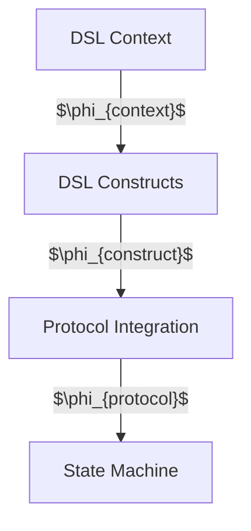

# WebSocket Client DSL Design Process

## 1. Process Foundation

### 1.1 Formal Basis

The design process $\mathcal{P}$ is constructed as:

$$
\mathcal{P} = (M, L, \Delta, V)
$$

where:

- $M$: State machine spec $(S, E, \delta, s_0, C, \gamma, F)$
- $L$: Design levels $\{L_{context}, L_{container}, L_{component}, L_{class}\}$
- $\Delta$: Level transition functions
- $V$: Validation framework

### 1.2 Process Structure

where $\phi_i$ represents the property preservation mapping at each level.

### 1.3 Core Principles

Each level transformation must satisfy:

$$
\begin{aligned}
&\forall \phi_i \in \Phi: \\
&\begin{cases}
\text{simple}(\phi_i) &: \text{minimizes complexity} \\
\text{workable}(\phi_i) &: \text{proven feasible} \\
\text{complete}(\phi_i) &: \text{preserves properties} \\
\text{stable}(\phi_i) &: \text{resistant to changes}
\end{cases}
\end{aligned}
$$

## 2. DSL Context Level

### 2.1 Level Definition

DSL context level $L_{context}$ defined as:

$$
L_{context} = (B, I, \Phi, R)
$$

where:

- $B$: DSL boundaries (minimal)
- $I$: Protocol interfaces (stable)
- $\Phi$: Property mappings (complete)
- $R$: Resource constraints (workable)

### 2.2 Required Deliverables

1. DSL Context Mapping:

   $$
   \begin{aligned}
   \text{Context}: & B \rightarrow \text{DSLBoundaries} \\
   \text{Interfaces}: & I \rightarrow \text{ProtocolAPIs} \\
   \text{Properties}: & \Phi \rightarrow \text{DSLConstraints}
   \end{aligned}
   $$

2. State Machine Mapping:
   $$
   \begin{aligned}
   \text{States}: & S \rightarrow \text{DSLStates} \\
   \text{Events}: & E \rightarrow \text{DSLEvents} \\
   \text{Context}: & C \rightarrow \text{DSLConfig} \\
   \text{Actions}: & \gamma \rightarrow \text{DSLOperations}
   \end{aligned}
   $$

### 2.3 Validation Criteria

For context level completion:

$$
complete(L_{context}) \iff \begin{cases}
\text{states mapped:} & \forall s \in S, mapped(s) \\
\text{events defined:} & \forall e \in E, defined(e) \\
\text{properties preserved:} & \forall p \in \Phi, preserved(p) \\
\text{constraints workable:} & \forall r \in R, feasible(r)
\end{cases}
$$

## 3. DSL Construct Level

### 3.1 Level Definition

Construct level $L_{construct}$ defined as:

$$
L_{construct} = (C, P, M, R)
$$

where:

- $C$: DSL construct set (minimal)
- $P$: Construct patterns (stable)
- $M$: Message flows (complete)
- $R$: Resource allocations (workable)

### 3.2 Required Deliverables

1. DSL Architecture:

   $$
   \begin{aligned}
   \text{StateMachine}: & C_{state} = (S_{dsl}, \delta_{dsl}) \\
   \text{Protocol}: & C_{protocol} = (P_{states}, P_{handlers}) \\
   \text{Queue}: & C_{queue} = (Q_{ops}, Q_{constraints})
   \end{aligned}
   $$

2. State Distribution:
   $$
   distribute: S \rightarrow \bigcup_{c \in C} S_c
   $$

### 3.3 Validation Criteria

For construct level:

$$
valid(L_{construct}) \iff \begin{cases}
\text{states distributed:} & \forall s \in S, \exists c \in C: s \in S_c \\
\text{patterns stable:} & \forall p \in P, stable(p) \\
\text{resources workable:} & \forall r \in R, feasible(r) \\
\text{interfaces complete:} & \forall i \in I, defined(i)
\end{cases}
$$

## 4. Protocol Integration Level

### 4.1 Level Definition

Integration level $L_{protocol}$ defined as:

$$
L_{protocol} = (K, \Pi, \Gamma, \Omega)
$$

where:

- $K$: Protocol set (minimal)
- $\Pi$: Protocol patterns (stable)
- $\Gamma$: Protocol actions (complete)
- $\Omega$: Resource controls (workable)

### 4.2 Required Deliverables

1. Protocol Design:

   $$
   \begin{aligned}
   \text{State}: & K_{state} = \{k \in K | handles(k, S)\} \\
   \text{Protocol}: & K_{protocol} = \{k \in K | handles(k, P)\} \\
   \text{Message}: & K_{message} = \{k \in K | handles(k, M)\}
   \end{aligned}
   $$

2. Protocol Integration:
   $$
   \begin{aligned}
   \text{Sync}: & \Pi_{sync}: K \times K \rightarrow Protocol \\
   \text{Flow}: & \Pi_{flow}: K \times K \rightarrow Messages \\
   \text{Resource}: & \Pi_{res}: K \times R \rightarrow Allocation
   \end{aligned}
   $$

### 4.3 Validation Criteria

For protocol level:

$$
valid(L_{protocol}) \iff \begin{cases}
\text{protocols minimal:} & \forall k \in K, simple(k) \\
\text{patterns stable:} & \forall \pi \in \Pi, stable(\pi) \\
\text{actions complete:} & \forall \gamma \in \Gamma, complete(\gamma) \\
\text{resources workable:} & \forall \omega \in \Omega, feasible(\omega)
\end{cases}
$$

## 5. State Machine Level

### 5.1 Level Definition

State machine level $L_{machine}$ defined as:

$$
L_{machine} = (X, \Sigma, \Psi, \Lambda)
$$

where:

- $X$: State set (minimal)
- $\Sigma$: State structures (stable)
- $\Psi$: State mappings (complete)
- $\Lambda$: Resource implementations (workable)

### 5.2 Design Principles

1. State Machine Structure:

   $$
   \begin{aligned}
   \text{State Rep}: & X_{state}: S \rightarrow States \\
   \text{Event Handle}: & X_{event}: E \rightarrow Handlers \\
   \text{Action Exec}: & X_{action}: \gamma \rightarrow Methods
   \end{aligned}
   $$

2. Protocol Structure:
   $$
   \begin{aligned}
   \text{Frame Process}: & \Sigma_{frame}: F \rightarrow Methods \\
   \text{Error Handle}: & \Sigma_{error}: Err \rightarrow Handlers \\
   \text{Resource Manage}: & \Sigma_{res}: R \rightarrow Controllers
   \end{aligned}
   $$

### 5.3 Validation Requirements

State machine level validation:

$$
valid(L_{machine}) \iff \begin{cases}
\text{states minimal:} & \forall s \in S, simple(s) \\
\text{events stable:} & \forall e \in E, stable(e) \\
\text{actions complete:} & \forall a \in \gamma, complete(a) \\
\text{resources workable:} & \forall r \in R, feasible(r)
\end{cases}
$$

## 6. Level Transitions

### 6.1 Context → Construct

Transition function $\Delta_{1}$:

$$
\Delta_{1}: L_{context} \rightarrow L_{construct}
$$

with mappings:

$$
\begin{aligned}
\text{States}: & S_{context} \rightarrow \bigcup_{c \in C} S_c \\
\text{Events}: & E_{context} \rightarrow \bigcup_{c \in C} E_c \\
\text{Actions}: & \gamma_{context} \rightarrow \bigcup_{c \in C} \gamma_c
\end{aligned}
$$

### 6.2 Construct → Protocol

Transition function $\Delta_{2}$:

$$
\Delta_{2}: L_{construct} \rightarrow L_{protocol}
$$

with mappings:

$$
\begin{aligned}
\text{Constructs}: & C \rightarrow \bigcup_{k \in K} K_c \\
\text{Protocols}: & P \rightarrow \bigcup_{k \in K} \Pi_k \\
\text{Resources}: & R \rightarrow \bigcup_{k \in K} \Omega_k
\end{aligned}
$$

### 6.3 Protocol → Machine

Transition function $\Delta_{3}$:

$$
\Delta_{3}: L_{protocol} \rightarrow L_{machine}
$$

with mappings:

$$
\begin{aligned}
\text{Protocols}: & K \rightarrow \bigcup_{x \in X} X_k \\
\text{Patterns}: & \Pi \rightarrow \bigcup_{x \in X} \Sigma_x \\
\text{Resources}: & \Omega \rightarrow \bigcup_{x \in X} \Lambda_x
\end{aligned}
$$

## 7. Design Validation

### 7.1 Level Validation

For each level $L_i$:

$$
validate(L_i) = \begin{cases}
\text{properties preserved:} & \forall p \in \Phi, preserve(p, L_i) \\
\text{resources bounded:} & \forall r \in R, bound(r, L_i) \\
\text{interfaces complete:} & \forall i \in I, complete(i, L_i)
\end{cases}
$$

### 7.2 Integration Validation

For transitions $\Delta_i$:

$$
valid(\Delta_i) \iff \begin{cases}
\text{property preservation:} & \forall p \in \Phi, preserve(p, \Delta_i) \\
\text{resource maintenance:} & \forall r \in R, maintain(r, \Delta_i) \\
\text{interface stability:} & \forall i \in I, stable(i, \Delta_i)
\end{cases}
$$

## 8. Success Criteria

### 8.1 Design Completion

Design $\mathcal{D}$ is complete when:

$$
complete(\mathcal{D}) \iff \begin{cases}
\text{levels minimal:} & \forall L_i, simple(L_i) \\
\text{properties stable:} & \forall p \in \Phi, stable(p) \\
\text{resources workable:} & \forall r \in R, feasible(r) \\
\text{system complete:} & \forall v \in V, satisfied(v)
\end{cases}
$$

### 8.2 Quality Requirements

Quality requirements $Q$ satisfied when:

$$
quality(\mathcal{D}) \iff \begin{cases}
\text{formal correctness:} & \forall \phi \in \Phi, verify(\phi) \\
\text{resource compliance:} & \forall r \in R, comply(r) \\
\text{stability maintained:} & \forall s \in S, stable(s) \\
\text{workability proven:} & \forall i \in I, feasible(i)
\end{cases}
$$
