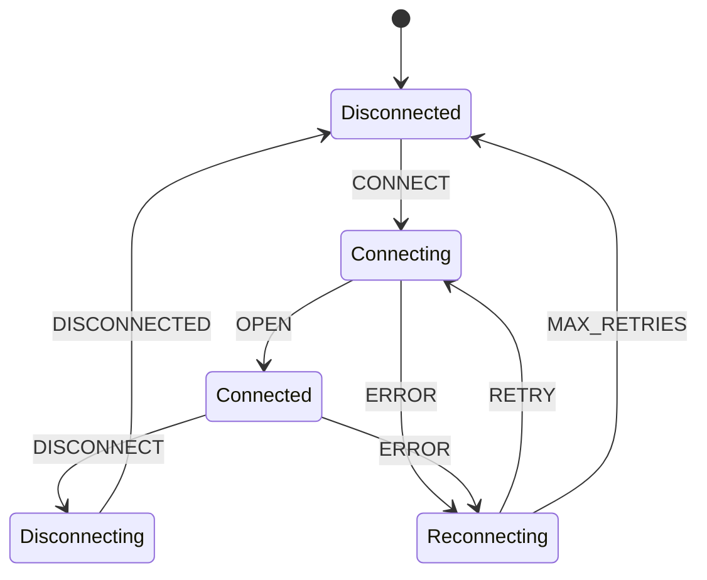

# Enhanced Validation Procedures

## 1. Protocol Compliance Validation

### 1.1 State Machine Conformance



#### Validation Requirements

1. State Coverage

   ```
   For each WebSocket state s:
     Verify DSL provides:
       - State representation
       - Entry conditions
       - Exit conditions
       - Invariant conditions
       - Error handling

     Validate:
       - State transitions
       - Event handling
       - Error recovery
       - Resource management
   ```

2. Event Handling

   ```
   For each WebSocket event e:
     Verify DSL handles:
       - Event recognition
       - State transitions
       - Error conditions
       - Resource implications
       - Protocol constraints

     Validate:
       - Event sequencing
       - Timing constraints
       - Error propagation
       - State consistency
   ```

3. Protocol Properties
   ```
   For each property p:
     Verify preservation of:
       - Connection lifecycle
       - Message ordering
       - Error handling
       - Resource bounds
       - State consistency

     Validate through:
       - Static analysis
       - Runtime checks
       - Formal proofs
       - Test scenarios
   ```

### 1.2 Message Handling Validation

1. Message Types

   ```
   For each message type:
     Verify handling of:
       - Text messages
       - Binary messages
       - Control frames
       - Extension frames

     Validate:
       - Format compliance
       - Content validation
       - Size constraints
       - Timing requirements
   ```

2. Flow Control
   ```
   Verify management of:
     Rate limiting:
       - Message frequency
       - Bandwidth usage
       - Queue depths
       - Backpressure

     Window control:
       - Buffer sizes
       - Flow control
       - Congestion handling
       - Resource allocation
   ```

### 1.3 Connection Management

1. Lifecycle Events

   ```
   Verify handling of:
     Connection events:
       - Connection initiation
       - Handshake completion
       - Keep-alive
       - Disconnection

     Error conditions:
       - Timeout handling
       - Network errors
       - Protocol violations
       - Resource exhaustion
   ```

2. Resource Management
   ```
   Validate control of:
     System resources:
       - Memory usage
       - File descriptors
       - Thread pools
       - Network buffers

     Application resources:
       - Connection pools
       - Message queues
       - State storage
       - Metrics collection
   ```

## 2. State Machine Integration Checks

### 2.1 XState Compatibility

1. Machine Definition

   ```
   Verify machine structure:
     States:
       - Correct definition
       - Proper nesting
       - History states
       - Parallel states

     Transitions:
       - Event handlers
       - Guards
       - Actions
       - Services
   ```

2. Integration Points
   ```
   Validate integration:
     Event mapping:
       - Protocol events
       - Internal events
       - Custom events
       - Error events

     Action binding:
       - Protocol actions
       - Side effects
       - Error handlers
       - Cleanup routines
   ```

### 2.2 State Management

1. State Synchronization

   ```
   Verify synchronization:
     State tracking:
       - Current state
       - History states
       - Parallel states
       - Nested states

     State transitions:
       - Valid paths
       - Guard conditions
       - Entry/exit actions
       - Transition actions
   ```

2. Context Management
   ```
   Validate context handling:
     Context updates:
       - Assignment actions
       - Guard conditions
       - Service data
       - Error states

     Data flow:
       - Input processing
       - Output generation
       - Error propagation
       - State restoration
   ```

### 2.3 Service Integration

1. Service Definition

   ```
   Verify service structure:
     Invocation:
       - Service creation
       - Parameter passing
       - Result handling
       - Error handling

     Lifecycle:
       - Start conditions
       - Stop conditions
       - Cleanup actions
       - Resource management
   ```

2. Event Handling
   ```
   Validate event processing:
     Event flow:
       - Event generation
       - Event queuing
       - Event dispatch
       - Event completion

     Error handling:
       - Error detection
       - Error propagation
       - Recovery actions
       - State restoration
   ```

## 3. DSL Pattern Validation

### 3.1 Pattern Recognition

1. Pattern Identification

   ```
   For each pattern:
     Verify structure:
       - Core elements
       - Relationships
       - Constraints
       - Variations

     Validate usage:
       - Context appropriate
       - Correctly implemented
       - Properly integrated
       - Well documented
   ```

2. Pattern Composition
   ```
   Verify composition:
     Integration:
       - Pattern combining
       - Conflict resolution
       - Interface matching
       - Property preservation

     Validation:
       - Composition rules
       - Constraint satisfaction
       - Property preservation
       - Resource bounds
   ```

### 3.2 Implementation Validation

1. Pattern Implementation

   ```
   Verify implementation:
     Structure:
       - Component layout
       - Interaction paths
       - Resource usage
       - Error handling

     Behavior:
       - State management
       - Event handling
       - Error recovery
       - Resource cleanup
   ```

2. Integration Testing
   ```
   Validate integration:
     System level:
       - Pattern interaction
       - Resource sharing
       - Error propagation
       - State consistency

     Component level:
       - Interface compliance
       - Resource usage
       - Error handling
       - State management
   ```

### 3.3 Property Verification

1. Static Analysis

   ```
   Verify properties:
     Pattern properties:
       - Structural soundness
       - Behavioral correctness
       - Resource bounds
       - Error handling

     System properties:
       - State consistency
       - Message ordering
       - Resource management
       - Error recovery
   ```

2. Runtime Verification
   ```
   Validate behavior:
     Operational:
       - State transitions
       - Event handling
       - Resource usage
       - Error handling

     Performance:
       - Response times
       - Resource efficiency
       - Scalability
       - Reliability
   ```

## 4. Validation Tools

### 4.1 Protocol Validation Tools

```
Tool categories:
  Static analysis:
    - State machine validators
    - Protocol checkers
    - Resource analyzers
    - Property verifiers

  Dynamic analysis:
    - Runtime monitors
    - Load generators
    - Fault injectors
    - Performance profilers
```

### 4.2 State Machine Tools

```
Tool categories:
  Machine validation:
    - XState validators
    - State analyzers
    - Transition checkers
    - Property verifiers

  Integration testing:
    - Machine composers
    - Event simulators
    - Service testers
    - Context validators
```

### 4.3 Pattern Tools

```
Tool categories:
  Pattern analysis:
    - Pattern recognizers
    - Structure validators
    - Composition checkers
    - Property verifiers

  Implementation testing:
    - Component testers
    - Integration validators
    - Resource monitors
    - Performance analyzers
```
