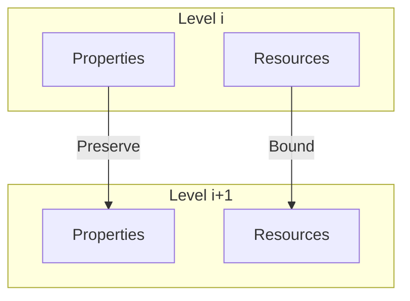
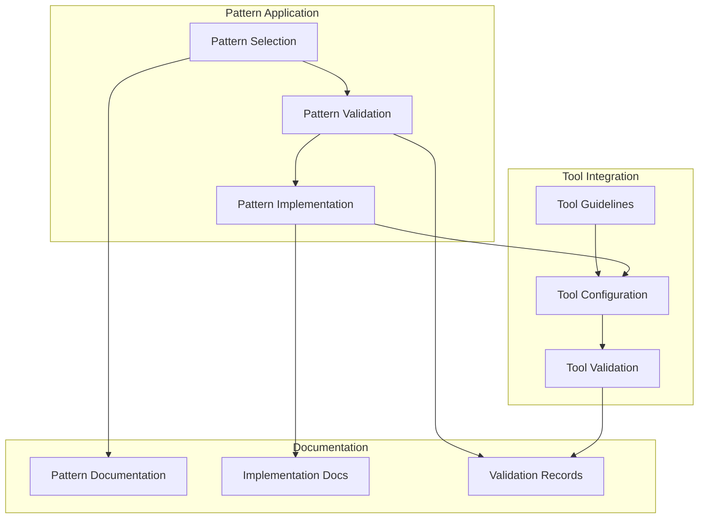
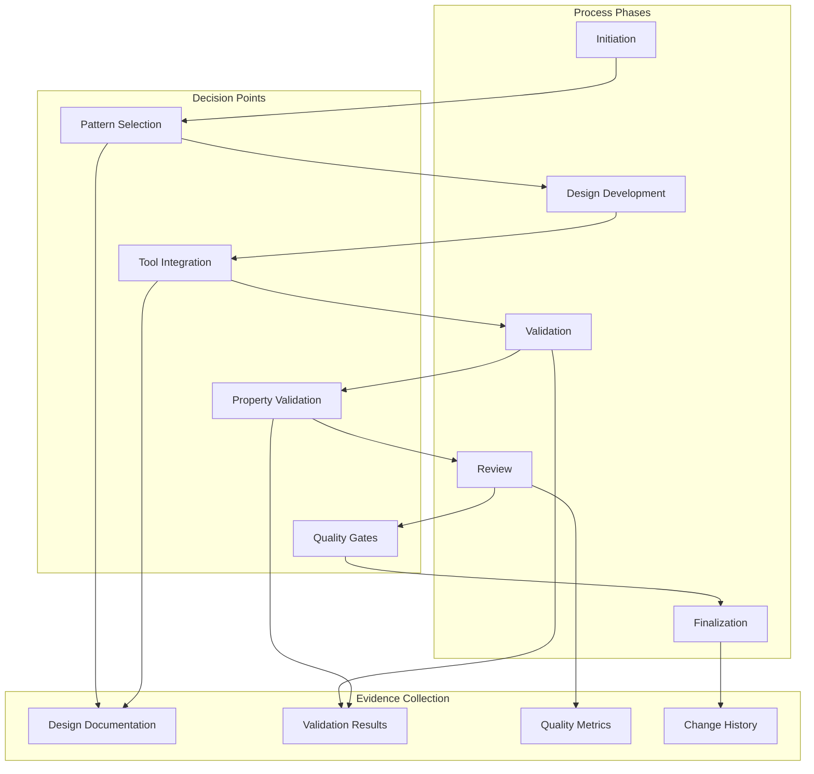

## 1. Core Governance Foundation

### 1.1 Formal Basis

The governance system $\mathfrak{G}$ is defined as:

$$
\mathfrak{G} = (M, P, R, V)
$$

where:

- $M$: The formal machine specification
- $P$: Set of properties to preserve
- $R$: Set of resource constraints
- $V$: Set of validation rules

### 1.2 Level Definition

Each design level $L_i$ must maintain:

$$
L_i = (D_i, P_i, I_i)
$$

Where:

- $D_i$: DSL constructs at level $i$
- $P_i$: Properties preserved at level $i$
- $I_i$: Tool integration points at level $i$

### 1.3 Level Transitions

For transition $L_i \rightarrow L_{i+1}$:

$$
valid(L_i \rightarrow L_{i+1}) \iff \begin{cases}
\text{preserve}(D_i, D_{i+1}): & \text{DSL semantics preserved} \\
\text{maintain}(P_i, P_{i+1}): & \text{properties maintained} \\
\text{integrate}(I_i, I_{i+1}): & \text{tool integration consistent} \\
\text{validate}(L_{i+1}): & \text{level requirements met}
\end{cases}
$$

## 2. Design Generation Governance

### 2.1 Process Requirements

For any design step $d$:

$$
valid(d) \iff \begin{cases}
\text{simple}(d): & \text{minimizes complexity} \\
\text{workable}(d): & \text{provably implementable} \\
\text{complete}(d): & \text{satisfies requirements} \\
\text{stable}(d): & \text{resistant to changes}
\end{cases}
$$

### 2.2 Level Advancement

Level progression $L_i \rightarrow L_{i+1}$ requires:

$$
advance(L_i, L_{i+1}) \iff \begin{cases}
\text{properties preserved:} & \forall p \in P, verify(p, L_i) \\
\text{resources validated:} & \forall r \in R, validate(r, L_i) \\
\text{interfaces complete:} & \forall i \in I, complete(i, L_i) \\
\text{stability maintained:} & \Delta input \implies small(\Delta output)
\end{cases}
$$

### 2.3 Property Governance

Property tracking function $T$ for each property $p$:

$$
T(p) = \begin{pmatrix}
def(p) & \text{formal definition} \\
map(p) & \text{design mapping} \\
val(p) & \text{validation method} \\
stab(p) & \text{stability measure}
\end{pmatrix}
$$

## 3. Change Management

### 3.1 Change Classification

For any change $c$, classification function $\chi$:

$$
\chi(c) = \begin{cases}
C_{prop} & \text{if affects } P \\
C_{res} & \text{if affects } R \\
C_{struct} & \text{if affects structure} \\
C_{tech} & \text{if affects technology} \\
C_{interface} & \text{if affects interfaces}
\end{cases}
$$

### 3.2 Impact Analysis

For change $c$, impact function $I$:

$$
I(c) = \begin{pmatrix}
\Delta P & \text{property changes} \\
\Delta R & \text{resource impacts} \\
\Delta S & \text{structural effects} \\
\delta(c) & \text{stability measure}
\end{pmatrix}
$$

### 3.3 Change Approval

Approval function $A$ for change $c$:

$$
A(c) = \begin{cases}
1 & \text{if } \forall p \in P, preserve(p, c) \\
  & \land \forall r \in R, maintain(r, c) \\
  & \land \delta(c) \leq \epsilon \text{ (stability threshold)} \\
0 & \text{otherwise}
\end{cases}
$$

### 3.4 Change Process

1. Pre-change Assessment:

   $$
   assess(c) = \begin{cases}
   analyze(impact) & \text{: determine scope} \\
   verify(tools) & \text{: check tool compatibility} \\
   validate(properties) & \text{: ensure preservation}
   \end{cases}
   $$

2. Implementation:

   $$
   implement(c) = \begin{cases}
   update(D) & \text{: modify DSL} \\
   adjust(T) & \text{: adapt tool integration} \\
   maintain(P) & \text{: preserve properties}
   \end{cases}
   $$

3. Validation:
   $$
   validate(c) = \begin{cases}
   check(D') & \text{: verify DSL changes} \\
   test(T') & \text{: verify tool integration} \\
   verify(P') & \text{: confirm properties}
   \end{cases}
   $$

## 4. Review Process

### 4.1 Review Types

Review set $\mathfrak{R}$ consists of:

$$
\mathfrak{R} = \{R_{prop}, R_{res}, R_{design}, R_{tech}\}
$$

where each review type is defined:

$$
\begin{aligned}
R_{prop} &= (P, verify_P, doc_P) \\
R_{res} &= (R, verify_R, doc_R) \\
R_{design} &= (D, verify_D, doc_D) \\
R_{tech} &= (T, verify_T, doc_T)
\end{aligned}
$$

### 4.2 Review Requirements

For any review $r \in \mathfrak{R}$:

$$
complete(r) \iff \begin{cases}
\text{properties checked:} & \forall p \in P, verify_P(p) \\
\text{resources verified:} & \forall r \in R, verify_R(r) \\
\text{stability assessed:} & \delta(r) \leq \epsilon \\
\text{documentation complete:} & \forall d \in D, verify_D(d)
\end{cases}
$$

## 5. Documentation Control

### 5.1 Documentation Requirements

Required documentation set $\mathfrak{D}$:

$$
\mathfrak{D} = \begin{pmatrix}
D_{prop} & \text{property docs} \\
D_{res} & \text{resource docs} \\
D_{design} & \text{design docs} \\
D_{tech} & \text{technology docs} \\
D_{change} & \text{change docs}
\end{pmatrix}
$$

### 5.2 Documentation Rules

For each document $d \in \mathfrak{D}$:

$$
valid(d) \iff \begin{cases}
\text{traceable:} & \exists trace(d) \\
\text{complete:} & \forall s \in Sections, filled(s) \\
\text{stable:} & version(d) = latest \\
\text{simple:} & complexity(d) \leq threshold
\end{cases}
$$

## 6. Implementation Guidelines

### 6.1 Pattern Application Framework

Pattern application function $\Phi$ for each pattern $p$:

$$
\Phi(p) = \begin{pmatrix}
select(p) & \text{pattern selection} \\
validate(p) & \text{validation criteria} \\
implement(p) & \text{implementation steps} \\
verify(p) & \text{verification rules}
\end{pmatrix}
$$

### 6.2 Tool Usage Guidelines

Tool usage function $\Gamma$ for tool $t$:

$$
\Gamma(t) = \begin{pmatrix}
config(t) & \text{configuration} \\
integrate(t) & \text{integration} \\
validate(t) & \text{validation} \\
monitor(t) & \text{monitoring}
\end{pmatrix}
$$

### 6.3 Validation Procedures

Validation framework $\Psi$:

$$
\Psi = \begin{pmatrix}
V_{pattern} & \text{pattern validation} \\
V_{tool} & \text{tool validation} \\
V_{integration} & \text{integration validation} \\
V_{system} & \text{system validation}
\end{pmatrix}
$$

## 7. Design Process

### 7.1 Process Phases

Process phase function $\Phi$ defines requirements for each phase:

$$
\Phi(phase) = \begin{pmatrix}
entry(phase) & \text{entry criteria} \\
steps(phase) & \text{required steps} \\
valid(phase) & \text{validation rules} \\
exit(phase) & \text{exit criteria}
\end{pmatrix}
$$

### 7.2 Decision Framework

Decision framework $\Delta$ for each decision point:

$$
\Delta(d) = \begin{pmatrix}
criteria(d) & \text{decision criteria} \\
options(d) & \text{available options} \\
impact(d) & \text{impact analysis} \\
validate(d) & \text{validation rules}
\end{pmatrix}
$$

### 7.3 Evidence Collection

Evidence framework $E$:

$$
E = \begin{pmatrix}
E_{design} & \text{design artifacts} \\
E_{valid} & \text{validation results} \\
E_{metric} & \text{quality metrics} \\
E_{change} & \text{change records}
\end{pmatrix}
$$

## 8. Quality Control

### 8.1 Quality Metrics

Quality metric set $Q$:

$$
Q = \begin{pmatrix}
q_{prop} & \text{property preservation} \\
q_{res} & \text{resource compliance} \\
q_{doc} & \text{documentation quality} \\
q_{stab} & \text{solution stability}
\end{pmatrix}
$$

### 8.2 Quality Rules

Quality function $\mathfrak{Q}$:

$$
\mathfrak{Q}(D) \iff \begin{cases}
\text{properties:} & \forall p \in P, q_{prop}(p) \geq threshold \\
\text{resources:} & \forall r \in R, q_{res}(r) \geq threshold \\
\text{documentation:} & \forall d \in D, q_{doc}(d) \geq threshold \\
\text{stability:} & \forall s \in S, q_{stab}(s) \geq threshold
\end{cases}
$$

### 8.3 Success Criteria

Success function $S$ for process $p$:

$$
S(p) \iff \begin{cases}
\text{design complete:} & \forall d \in D, finished(d) \\
\text{properties preserved:} & \forall p \in P, preserved(p) \\
\text{resources managed:} & \forall r \in R, managed(r) \\
\text{stability maintained:} & \delta(p) \leq \epsilon \\
\text{documentation done:} & \forall d \in \mathfrak{D}, complete(d)
\end{cases}
$$
