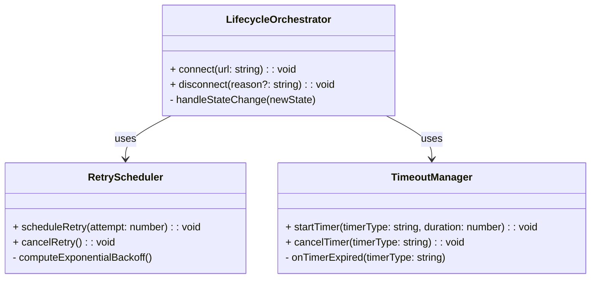
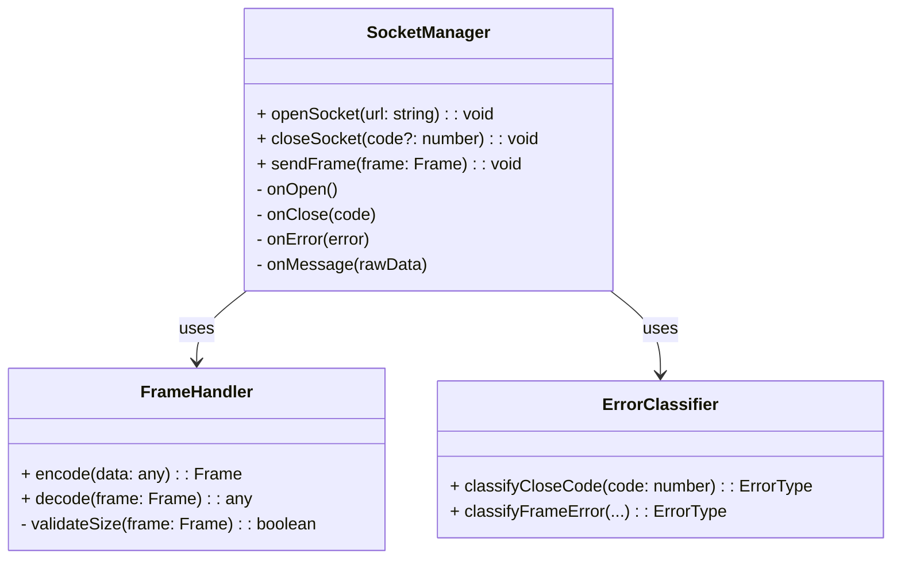
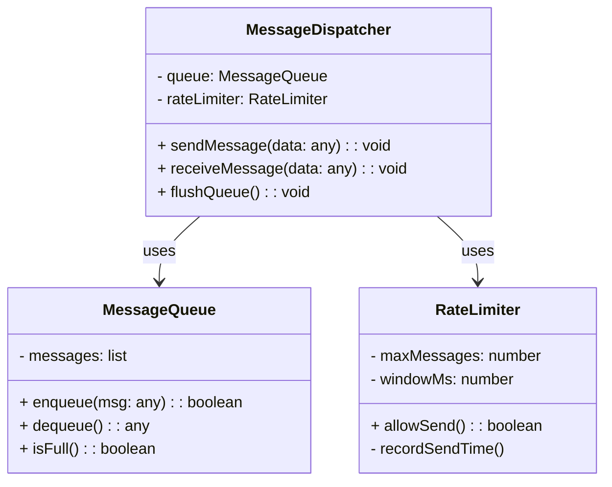
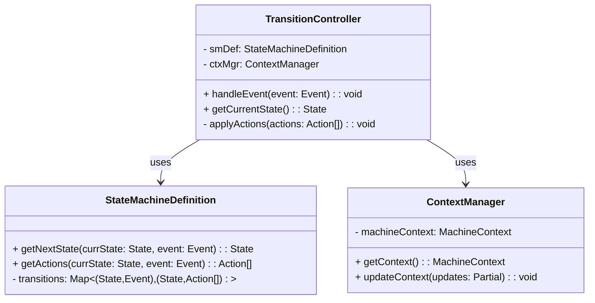
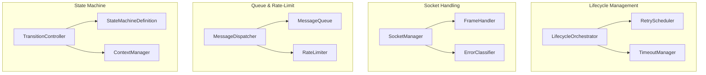

# Component-Centric Class Diagram Approach

In your **Layer 3** (Component Level) design, you described components such as:

1. **LifecycleOrchestrator**, **RetryScheduler**, **TimeoutManager** (in Connection Management)  
2. **SocketManager**, **FrameHandler**, **ErrorClassifier** (in WebSocket Protocol)  
3. **MessageQueue**, **RateLimiter**, **MessageDispatcher** (in Message Processing)  
4. **StateMachineDefinition**, **ContextManager**, **TransitionController** (in State Management)

We can cluster them by **logical “component”** rather than the broader “container” grouping. Note that each component still **lives** in a specific container, but this diagram emphasizes each component’s role and relationships to other components (even those in different containers).

---

## 1. Lifecycle Management Component

**Purpose**: Oversees the connection’s lifecycle—connecting, disconnecting, retrying, applying timeouts.

- **LifecycleOrchestrator** drives connect/disconnect commands, updates status.  
- **RetryScheduler** calculates next retry time for reconnections, notifies orchestrator when to retry.  
- **TimeoutManager** enforces connect/disconnect deadlines, triggers forced transition on timeout.

---

## 2. Socket Handling Component

**Purpose**: Deals with low-level WebSocket operations, frames, and protocol-level errors.

- **SocketManager**: The direct integration with `ws` or Browser WebSocket.  
- **FrameHandler**: Encodes/decodes frames, enforces `MAX_MESSAGE_SIZE`.  
- **ErrorClassifier**: Differentiates fatal vs. recoverable vs. transient issues (e.g., close code `1002`, `1009`, etc.).

---

## 3. Queue & Rate-Limit Component

**Purpose**: Manages message enqueueing, rate limiting, and dispatch logic.

- **MessageQueue**: FIFO storage for outbound messages if socket isn’t ready or to avoid flooding.  
- **RateLimiter**: Allows only a certain number of messages per time window (e.g., 100 msgs/sec).  
- **MessageDispatcher**: Coordinates queue + rate-limiter + actual sending/receiving to/from the WebSocket.

---

## 4. State Machine Component

**Purpose**: Implements the formal finite-state machine from `machine.md`, tracking context and transitions.

- **StateMachineDefinition**: A structure (or config) that enumerates permissible `(state, event) → (nextState, actions)`.  
- **ContextManager**: Tracks variables from `machine.md` context (like `reconnectCount`, `socket`, etc.).  
- **TransitionController**: The runtime “engine”—when an event arrives, it finds the next state, updates context, and triggers side effects.

---

## 5. High-Level Component Integration

You can visualize **all components** on one diagram, each **grouped** into a “box” (component boundary) with classes inside. Here’s an example **Mermaid** snippet that lumps classes by component:

- Each **subgraph** is a **component** from your Layer 3 design.  
- The lines represent key “uses” or “aggregation” relationships within each component.

---

## 6. Cross-Component Relationships

Each **component** can also call into other components. Examples:

1. **LifecycleOrchestrator** (Lifecycle Mgmt) might call **TransitionController** (State Machine) to fire an event like `ERROR` or `CONNECT`.  
2. **MessageDispatcher** (Queue & Rate-Limit) might call **SocketManager** (Socket Handling) to actually `sendFrame()`.  
3. **SocketManager** triggers an event to **TransitionController** when `onClose` or `onError` occurs.

In your **final** diagrams, you might also show these cross-component arrows—especially in a “system-level” class diagram that merges them. Or keep it simpler by focusing on within-component details.

---

## 7. Key Benefits of Component-Centric Grouping

1. **Direct Correspondence** to the **Layer 3** design: Each “component” is exactly what you described at the component level (e.g., “Lifecycle Management” is one group).  
2. **Focus on Cohesion**: Classes are physically close to those they collaborate with the most, making the design easier to read.  
3. **Less Overlap** with “Container” Boundaries**: If you have fewer or different containers, you can still preserve the “component” concept.  
4. **Tracing to Formal Specs**: For instance, “State Machine” references `machine.md` and “Socket Handling” references `websocket.md` close codes.

---

## 8. Next Steps

- **Detail** the relationships: For each class, specify which methods trigger transitions or events in other components.  
- **Refine** method signatures: If you have code stubs or typed signatures, you can place them in each class box.  
- **Confirm** invariants: e.g., “MessageQueue does not exceed `MAX_QUEUE_SIZE`,” “FrameHandler enforces `MAX_MESSAGE_SIZE`,” etc.  
- **Use** these diagrams in code generation or for developer documentation, so everyone sees how classes are grouped by **component**.

---

### Conclusion

By **grouping classes into components** (rather than containers), you get a **component-centric** view that aligns perfectly with your **Layer 3** design:

1. **Lifecycle Management**  
2. **Socket Handling**  
3. **Queue & Rate-Limit**  
4. **State Machine**

Each group shows the internal classes (like `LifecycleOrchestrator`, `SocketManager`, `MessageQueue`, `TransitionController`), highlighting their roles and relationships. This method ensures that **each component** from your design phase remains clearly delineated, while still making it easy to see how the overall system fits together.