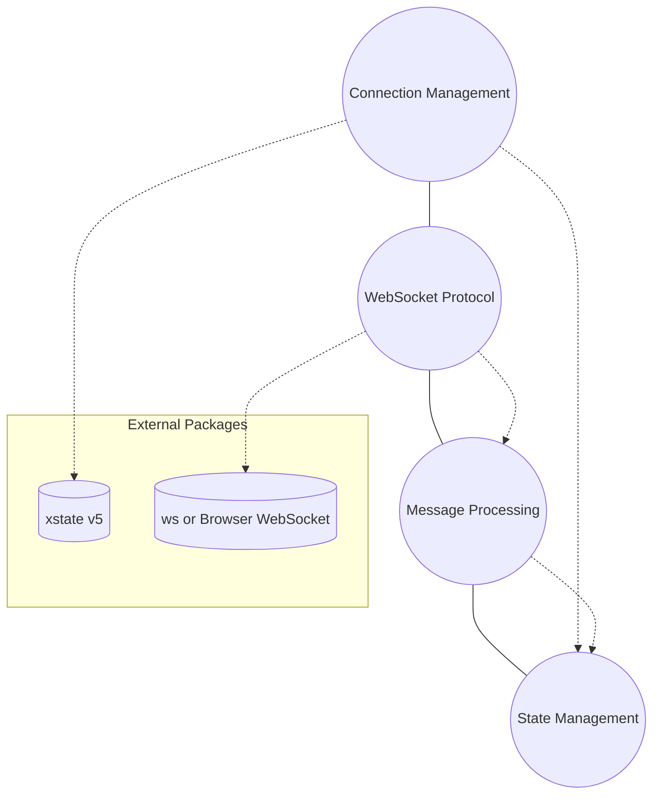
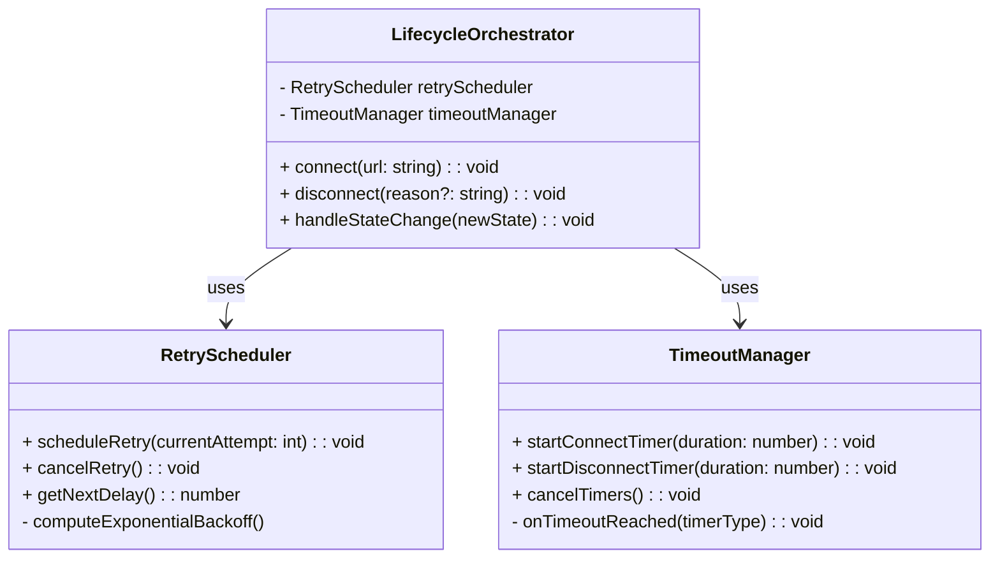
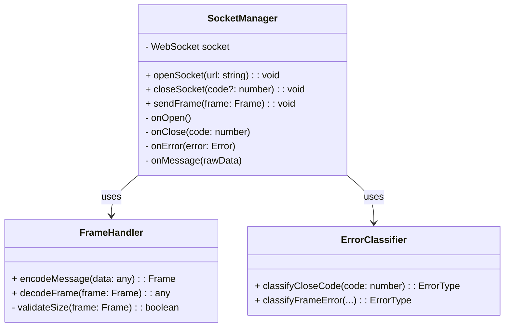
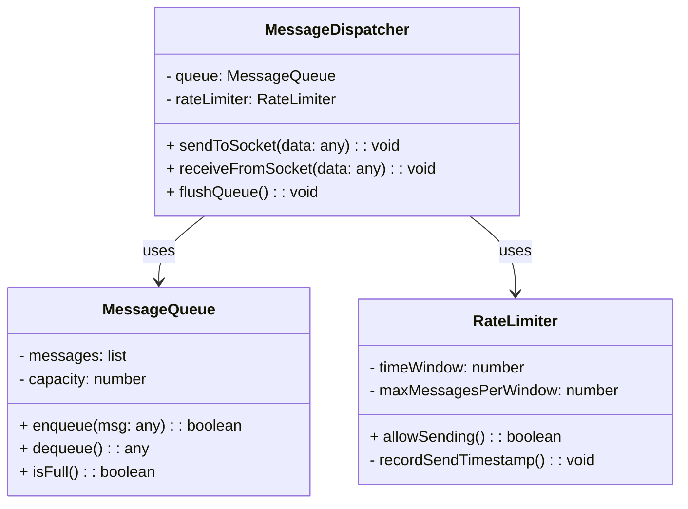
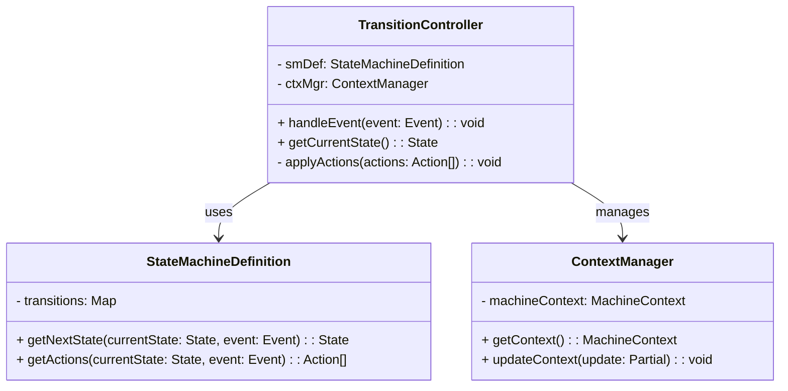

# Container-Centric Class Diagram Approach

Below is a **high-level class diagram plan** that reflects the **overall structure** of the WebSocket Client at the **Class-Level**—grouped by **container** (Connection Management, WebSocket Protocol, Message Processing, State Management). Each diagram shows **key classes** (from your component-level design) and the **relationships** among them. The focus here is on the **architecture** rather than every method signature or field. You can refine each diagram further once you settle on exact class members.

---

## 1. Overall Package (Container) Diagram

Below is a **high-level “package” diagram** showing the **four containers** as top-level groupings (packages). This helps illustrate how they fit together.

- **Connection Management** (CMC) 
- **WebSocket Protocol** (WPC)  
- **Message Processing** (MPC)  
- **State Management** (SMC)

Each “package” will have its own classes, shown in the **per-container class diagrams** below.

---

## 2. Connection Management Container (CMC)

**Responsibilities**: Lifecycle orchestration, retry scheduling, timeouts, single active connection rule.

1. **LifecycleOrchestrator**  
   - Central entry point for connection commands (`connect`, `disconnect`).  
   - Coordinates with `RetryScheduler` for exponential backoff.  
   - Calls `TimeoutManager` to enforce `CONNECT_TIMEOUT` or `DISCONNECT_TIMEOUT`.  

2. **RetryScheduler**  
   - Calculates next retry delay based on `MAX_RETRY_DELAY`, `RETRY_MULTIPLIER`, etc.  
   - Signals `LifecycleOrchestrator` when it’s time to attempt another connect.

3. **TimeoutManager**  
   - Tracks time-limited operations (connect, disconnect).  
   - Notifies `LifecycleOrchestrator` if a timeout occurs, triggering an error or forced transition.

---

## 3. WebSocket Protocol Container (WPC)

**Responsibilities**: Managing the raw WebSocket (`ws` or browser API), encoding/decoding frames, classifying errors, handling close codes.

1. **SocketManager**  
   - Wraps the actual `WebSocket` instance.  
   - Exposes methods to open/close a connection and send frames.  
   - Receives low-level events (onOpen, onClose, etc.) and notifies other containers or triggers state events.

2. **FrameHandler**  
   - Encodes application messages into frames for sending.  
   - Decodes incoming frames into usable data.  
   - Enforces `MAX_MESSAGE_SIZE`.

3. **ErrorClassifier**  
   - Distinguishes `Fatal`, `Recoverable`, or `Transient` errors based on `websocket.md` definitions (e.g., close codes 1002, 1003, etc.).  
   - Possibly merges with `errors.class.md` from **Layer 1** if minimal enough.

---

## 4. Message Processing Container (MPC)

**Responsibilities**: Queuing outbound messages, enforcing rate limits, dispatching inbound/outbound messages to the application or WebSocket Protocol.

1. **MessageQueue**  
   - FIFO storage for outgoing messages if the socket isn’t ready or if rate-limiting is active.  
   - Observes `MAX_QUEUE_SIZE`.  

2. **RateLimiter**  
   - Enforces sending a limited number of messages per time window (e.g., 100 msgs/sec).  
   - Blocks or schedules messages when the limit is reached.

3. **MessageDispatcher**  
   - The main interface for sending messages to the WebSocket (through `SocketManager`) and receiving them for the application.  
   - Pulls from `MessageQueue` + checks `RateLimiter` before sending.  
   - Delivers inbound messages to the app or triggers relevant events.

---

## 5. State Management Container (SMC)

**Responsibilities**: Implements the formal state machine from `machine.md`, manages context variables, validates transitions, notifies other containers of required actions.

1. **StateMachineDefinition**  
   - A static or data-driven map of `(state, event) -> nextState + actions`.  
   - Possibly integrated with **xstate v5** logic internally or used to build an XState machine.

2. **ContextManager**  
   - Stores runtime variables: `reconnectCount`, `lastError`, etc.  
   - Ensures invariants like `socket==null` in `disconnected`.

3. **TransitionController**  
   - The “runtime engine”: when an event occurs, looks up the next state from `StateMachineDefinition`, updates `ContextManager`, and triggers side effects (e.g., “call `LifecycleOrchestrator` to open socket”).  
   - Orchestrates the call flow among containers.

---

## 6. Interaction Across Containers

In practice, classes from **different** containers will collaborate. For example:

- **TransitionController** (SMC) might call **LifecycleOrchestrator** (CMC) with an action “INIT_RECONNECT.”  
- **MessageDispatcher** (MPC) might call `SocketManager.sendFrame()` (WPC) to physically send data.  
- **SocketManager** (WPC) might notify **TransitionController** (SMC) when `onClose(code)` occurs → leads to a `DISCONNECTED` event.

Such cross-container calls typically pass through **public interfaces** or **orchestration** classes (like `transition.class.md`, `lifecycle.class.md`, `dispatch.class.md` in your Layer 3).

---

## 7. Potential Groupings & Refinements

1. **Merging Tiny Classes**  
   - If some classes are small, you can merge them. For example, `ErrorClassifier` might reside in the same file as `FrameHandler` if error logic is minimal.  
2. **Consolidating RateLimiter**  
   - Some designs unify `RateLimiter` with `MessageQueue` if the logic is straightforward.  
3. **Integrating with xstate v5**  
   - The `StateMachineDefinition` or `TransitionController` might be replaced or heavily informed by an actual XState `MachineConfig`.  

---

## 8. Putting It All Together

- **Four Container Diagrams**: Provide a clear visual reference for how classes within each container relate to each other.  
- **Cross-Container Interactions**: Handled by the orchestrators (e.g., “TransitionController notifies LifecycleOrchestrator,” “MessageDispatcher calls SocketManager”).  
- **Alignment with Formal Specs**: Each class references data or constraints from `machine.md` / `websocket.md`, ensuring you meet the **safety**, **liveness**, and **resource** constraints spelled out in those documents.

---

## Conclusion

These **class diagrams** (grouped by container) complete the **class-level** design perspective. They show:

1. **Which classes** implement the responsibilities from the component-level design.  
2. **How classes** within each container associate with, or depend on, each other.  
3. **Where** the key transitions and data flows occur (e.g., from `MessageQueue` to `RateLimiter` to `SocketManager`).  

You can further **refine** each diagram by:

- Listing specific methods, parameters, and return types.  
- Adding notes for invariants or constraints (e.g., “size(msg) ≤ MAX_MESSAGE_SIZE”).  
- Indicating how each class or method references the formal specs.  

With these diagrams in place, your code generation or hand-written implementation can follow a **well-defined blueprint**, ensuring **consistency** and **traceability** back to the original design requirements.