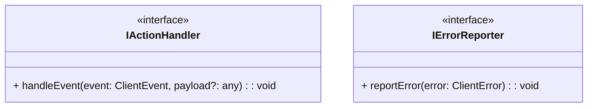

# internal.interface.md

## Overview

Defines minimal internal interfaces used across different components (e.g., event handlers, error reporting).  
References:

- `events.types.md` for `ClientEvent`
- `errors.types.md` for `ClientError` (if used here)

---

## 1. Mermaid Class Diagram



**Explanation**

1. **`IActionHandler`**: An interface describing a method to handle a generic `ClientEvent`.
2. **`IErrorReporter`**: An interface describing a method to report or log errors.

---

## 2. `IActionHandler`

```pseudo
interface IActionHandler {
  handleEvent(event: ClientEvent, payload?: any): void
}
```

- **Method**: `handleEvent(event, payload)`
  - `event`: a `ClientEvent` from `events.types.md`.
  - `payload` (optional): any additional info.
- **Usage**: Classes that respond to state machine or user events implement this to process them.

---

## 3. `IErrorReporter`

```pseudo
interface IErrorReporter {
  reportError(error: ClientError): void
}
```

- **Method**: `reportError(error)`
  - `error`: A `ClientError` from `errors.types.md`.
- **Usage**: Allows consistent error handling across modules.

---

## 4. Notes

- If we prefer single-responsibility, we can define more interfaces, or combine them if we want a single “handler” interface.
- In higher layers, classes like `TransitionController` or `LifecycleOrchestrator` might implement `IActionHandler`.
- `IErrorReporter` might be implemented by a logger or orchestration class.
