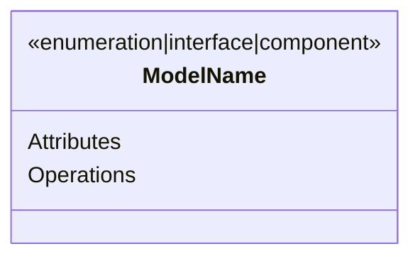

# Layer 0: Core Architecture Documentation

## Purpose

This document establishes the foundational architectural framework for the WebSocket client system. It defines the documentation structure, modeling conventions, and implementation guidance that govern the entire system architecture while maintaining implementation independence.

## Documentation Hierarchy

The Layer 0 documentation suite comprises these core documents:

1. layer.0.architecture.md (this document)

   - Establishes documentation standards
   - Defines modeling conventions
   - Sets implementation guidance
   - Maintains version control standards

2. layer.0.overview.md

   - Describes system context
   - Defines architectural principles
   - Establishes quality attributes
   - Outlines component relationships

3. layer.0.errors.md

   - Defines error classification framework
   - Establishes recovery patterns
   - Sets monitoring requirements
   - Guides error handling implementation

4. layer.0.events.md

   - Establishes event taxonomy
   - Defines processing requirements
   - Sets audit standards
   - Guides event handling implementation

5. layer.0.states.md
   - Defines state management framework
   - Establishes transition rules
   - Sets validation requirements
   - Guides state handling implementation

## Modeling Conventions

### Domain Model Representation

The architecture employs formal modeling conventions to support automated code generation while maintaining implementation independence. All models must include:

1. Conceptual Definition

   - Business purpose
   - Functional requirements
   - Quality attributes
   - Operational constraints

2. Structural Representation

   - Component relationships
   - Interface definitions
   - Dependency flows
   - Resource requirements

3. Behavioral Specification
   - State transitions
   - Event flows
   - Error conditions
   - Recovery patterns

### Implementation Guidance

Models include explicit implementation requirements through these elements:

1. Type Specifications

2. Constraint Definitions

   - Validation rules
   - Performance requirements
   - Resource limitations
   - Error handling protocols

3. Quality Requirements
   - Reliability targets
   - Performance metrics
   - Security controls
   - Maintainability standards

## Documentation Standards

### Document Structure

Each architectural document follows this structure:

1. Purpose Statement

   - Document role
   - Target audience
   - Business context
   - Related documents

2. Conceptual Framework

   - Core concepts
   - Design principles
   - Architectural decisions
   - Quality attributes

3. Implementation Requirements

   - Technical constraints
   - Performance requirements
   - Resource considerations
   - Integration points

4. Operational Guidance
   - Monitoring requirements
   - Management procedures
   - Troubleshooting guides
   - Performance optimization

### Version Control

Version management follows these principles:

1. Semantic Versioning

   - Major: Architecture changes
   - Minor: Feature additions
   - Patch: Clarifications

2. Change Documentation
   - Version history
   - Change rationale
   - Impact assessment
   - Migration guidance

## Quality Assurance

### Documentation Quality

All architectural documents must:

1. Maintain Implementation Independence

   - Technology-neutral language
   - Platform-agnostic designs
   - Framework-independent patterns
   - Protocol-version independence

2. Support Code Generation

   - Clear type specifications
   - Explicit constraints
   - Formal modeling
   - Implementation guidance

3. Enable Verification
   - Testable requirements
   - Measurable attributes
   - Clear success criteria
   - Validation procedures

### Review Requirements

Documentation undergoes these reviews:

1. Technical Review

   - Architectural consistency
   - Implementation feasibility
   - Performance impact
   - Resource requirements

2. Business Review
   - Requirement alignment
   - Cost implications
   - Operational impact
   - Risk assessment

## Version History

| Version | Date       | Changes                       | Author |
| ------- | ---------- | ----------------------------- | ------ |
| 1.0     | 2024-01-26 | Initial version               | Team   |
| 1.1     | 2024-01-26 | Added implementation guidance | Team   |
