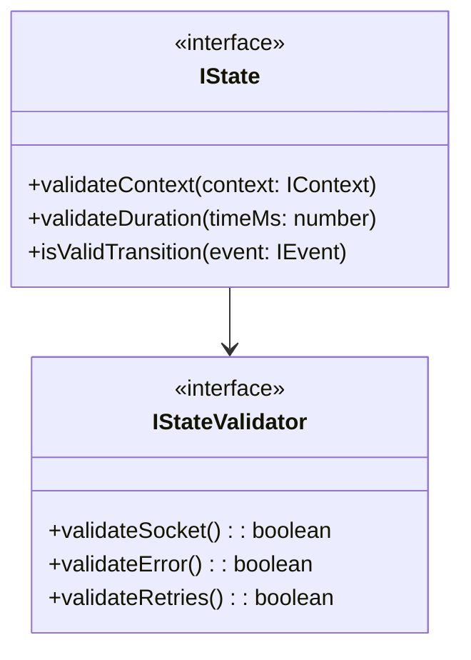
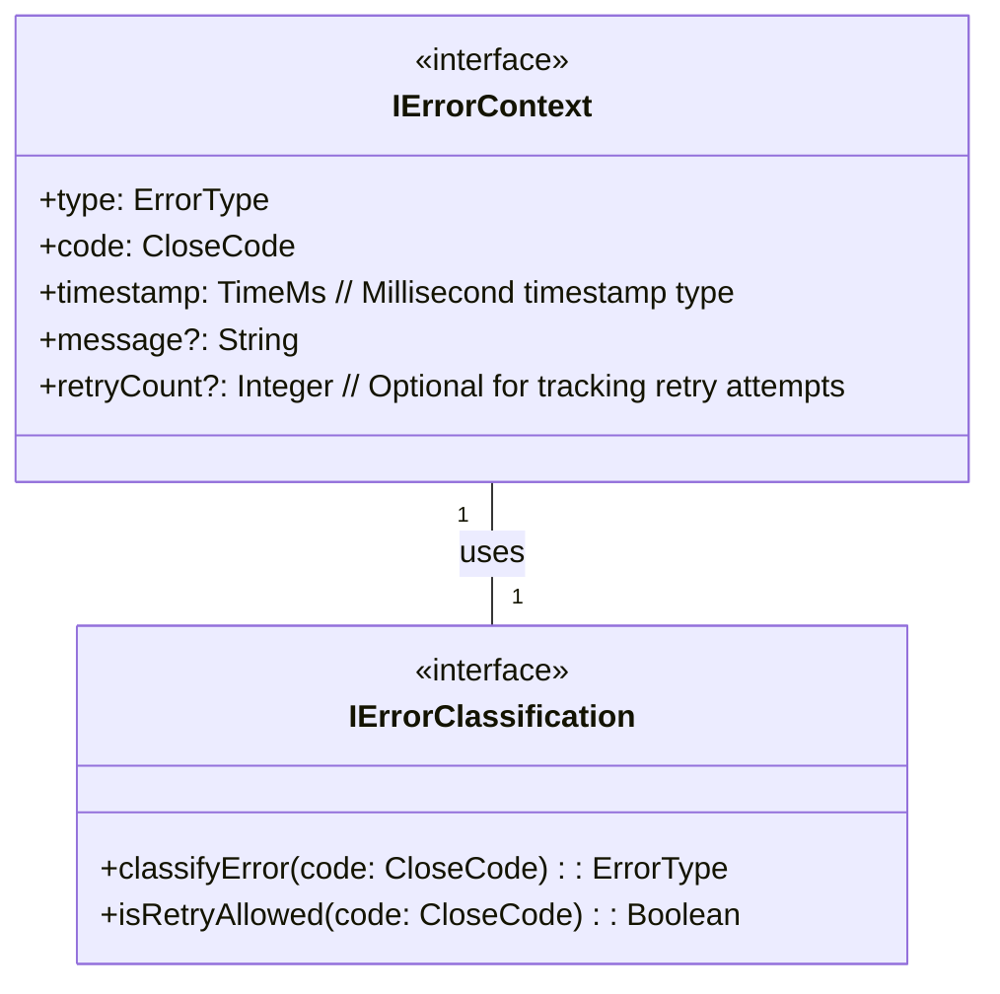

Below is a **Layer 0** example set of four `.md` files—**`common.types.md`**, **`events.types.md`**, **`states.types.md`**, and **`errors.types.md`**—that define the **core types** we’ll use throughout the rest of the WebSocket Client design. Each file references the **formal specs** (`machine.md`, `websocket.md`) in relevant sections. These files are **not** final code; they’re design documents that specify types, constants, and enumerations in a way that can be turned into actual code (TypeScript, Java, etc.) later on.

---

# File 1: `common.types.md`

```md
# common.types.md

## Overview

This file defines **common constants, enumerations, and utility types** used throughout the WebSocket Client.  
References:

- `machine.md` for timing and retry constraints
- `websocket.md` for protocol constants and close codes

---

## 1. Constants

### Connection & Retry

- **MAX_RETRIES**: `5`  
  From `machine.md` section 1.1 and 4.1 (retry limit).
- **INITIAL_RETRY_DELAY**: `1000` (ms)  
  From `machine.md` timing definition (1.1).
- **MAX_RETRY_DELAY**: `60000` (ms)  
  From `machine.md` timing definition.
- **RETRY_MULTIPLIER**: `1.5`  
  Exponential backoff multiplier.

### Timeouts

- **CONNECT_TIMEOUT**: `30000` (ms)
- **DISCONNECT_TIMEOUT**: `3000` (ms)
- **STABILITY_TIMEOUT**: `5000` (ms)

### Message Constraints

- **MAX_QUEUE_SIZE**: `1000`  
  Max number of buffered messages.
- **MAX_MESSAGE_SIZE**: `1 MB` (or `1048576` bytes)  
  May be enforced at the protocol framing level.
- **RATE_LIMIT**: `100` (msgs/sec)  
  From `machine.md` or `websocket.md` rate-limiting if applicable.

### Rate Limiting Constraints

- **WINDOW_SIZE**: `1000` (ms)
  From `machine.md` section 1.1, for rate limiting periods.
- **MAX_WINDOW_LIFETIME**: `60000` (ms)  
  From `machine.md` section 1.1, maximum duration for a rate limiting window.

---

## 2. Common Enums

### ConnectionStatus

Represents a _high-level_ status used by external interfaces (optional mapping to internal states).

```pseudo
enum ConnectionStatus {
  CLOSED,
  CONNECTING,
  OPEN,
  CLOSING,
  RECONNECTING,
  STABILIZING
}
```

Referenced in `machine.md` (states: disconnected → CLOSED, connecting → CONNECTING, etc.).

### CloseCode (Optional)

While exact codes often come from the WebSocket standard, we may define known constants here:

```pseudo
enum CloseCode {
  NORMAL_CLOSURE = 1000,
  GOING_AWAY = 1001,
  PROTOCOL_ERROR = 1002,
  UNSUPPORTED_DATA = 1003,
  POLICY_VIOLATION = 1008,
  MESSAGE_TOO_BIG = 1009,
  INTERNAL_ERROR = 1011
}
```

(From `websocket.md` section 1.2.)

---

## 3. Utility Types

### TimeMs

An alias for “number” indicating milliseconds.

```pseudo
type TimeMs = number
```

### Bytes

An alias for “number” indicating bytes size (useful for message size checks).

```pseudo
type Bytes = number
```

---

## 4. Notes & References

- **machine.md**: Sections 1.1 (System Constants), 4.1 (Connection Timing), 2.5 (Transition constraints for timeouts).
- **websocket.md**: Additional close code definitions in section 1.2, protocol constraints for message size in section 1.10.

## 5. Context Implementation Guide

References `machine.md` section 2.3 Context $(P, V, T)$.

### 5.1 Required Context Properties

1. Primary ($P$)
   - url: Connection URL
   - socket: WebSocket reference
   - status: Current state
   - readyState: Protocol state
   - reconnectCount: Retry tracking

2. Metrics ($V$)
   - messagesSent/Received
   - bytesSent/Received  
   - reconnectAttempts

3. Timing ($T$)
   - connectTime
   - disconnectTime
   - windowStart (rate limiting)
   - lastStableConnection

### 5.2 Context Constraints

1. State-Dependent Rules
   - Socket nullability per state
   - Valid readyState values
   - Timeout enforcement

2. Updates
   - Atomic property changes
   - Emit on significant changes
   - Validate after updates

```

---

# File 2: `events.types.md`

```md
# events.types.md

## Overview
Defines **all events** the WebSocket Client may handle or dispatch, referencing `machine.md` (section 2.2) and `websocket.md` (section 1.3).

---

## 1. Core Event Enum

From `machine.md` section 2.2, we have:

- `CONNECT`
- `DISCONNECT`
- `OPEN`
- `CLOSE`
- `ERROR`
- `RETRY`
- `MAX_RETRIES` (reached)
- `TERMINATE`
- `MESSAGE`
- `SEND`
- `PING`
- `PONG`
- `DISCONNECTED`
- `RECONNECTED`
- `STABILIZED`

We can represent them as an enumeration:

```pseudo
enum ClientEvent {
  CONNECT,
  DISCONNECT,
  OPEN,
  CLOSE,
  ERROR,
  RETRY,
  MAX_RETRIES_REACHED,
  TERMINATE,
  MESSAGE,
  SEND,
  PING,
  PONG,
  DISCONNECTED,
  RECONNECTED,
  STABILIZED
}
````

---

## 2. Event Payloads

Some events may carry data:

1. **ERROR**
   - Could have `errorCode`, or a reference to the `CloseCode`.
2. **MESSAGE**
   - Might include the actual message payload from server or client.
3. **SEND**
   - Outbound message content to be queued or sent.

A possible approach is to define typed structures, e.g.:

```pseudo
type ErrorEventPayload = {
  code: number
  message?: string
}

type MessageEventPayload = {
  data: any
  timestamp: TimeMs
}
```

---

## 3. WebSocket-Specific Events (Optional Sub-Enum)

From `websocket.md` section 1.3:

```pseudo
enum WebSocketEvent {
  open,
  close,
  error,
  message,
  disconnected,
  reconnected,
  stabilized
}
```

(If we prefer merging them into `ClientEvent`, that’s fine too—just keep it consistent.)

---

## 4. References

- `machine.md` section 2.2 for the full list of named events.
- `websocket.md` section 1.3 for protocol event types.
- Each event is associated with transitions in the state machine definitions (see `states.types.md` and `machine.class.md`).

````

---

# File 3: `states.types.md`

```md
# states.types.md

## Overview

Lists **all states** from the formal specs, referencing `machine.md` (sections 2.1, 2.5) and `websocket.md` (section 1.1 for state mapping).

---

## 1. Core States

```pseudo
// From machine.md §2.1
enum State {
  s1: disconnected  
  s2: disconnecting
  s3: connecting
  s4: connected 
  s5: reconnecting
  s6: reconnected
}
```

---

## 2. State Interface Structure



## 3. State Invariants (From $\S$2.6.1)

From `machine.md` section 2.6.1:

### Disconnected ($s_1$)

```pseudo
when Disconnected:
  socket = null
  error = null
  reconnectAttempts = 0
```

### Disconnecting ($s_2$)

```pseudo
when Disconnecting:
  socket != null
  disconnectReason != null
  duration <= DISCONNECT_TIMEOUT
```

### Connecting ($s_3$)

```pseudo
when Connecting:
  socket != null
  url != null
  duration <= CONNECT_TIMEOUT
```

### Connected ($s_4$)

```pseudo
when CONNECTED:
  socket != null
  error = null
  readyState = 1
```

### Reconnecting ($s_5$)

```pseudo
when RECONNECTING:
  socket = null
  retries <= MAX_RETRIES
  error != null
```

### Reconnected ($s_6$)

```pseudo
when RECONNECTED:
  socket != null
  reconnectCount > 0
  lastStableConnection != null
  duration <= STABILITY_TIMEOUT
```

---

## 4. References

- `machine.md` sections 2.1 and 2.5 (transitions).
- `websocket.md` sections 1.1, 1.3 (protocol states).
- Class-level logic that uses these states will appear in `machine.class.md` and `transition.class.md`.


````

---

# File 4: `errors.types.md`

```md
# errors.types.md

## Overview
Defines core type structures for error classification in the WebSocket Client, referencing `machine.md` and `websocket.md`.

---

## 1. Error Type Enumeration

```
Enum ErrorType {
    RECOVERABLE
    FATAL
    TRANSIENT
}
```
*Reference: `websocket.md` section 1.11 - Error Handling Properties*

## 2. Close Code Mapping

```
Enum CloseCode {
    NORMAL_CLOSURE       = 1000  // Standard, clean connection close
    GOING_AWAY           = 1001
    PROTOCOL_ERROR       = 1002
    UNSUPPORTED_DATA     = 1003
    ABNORMAL_CLOSURE     = 1006
    POLICY_VIOLATION     = 1008
    MESSAGE_TOO_BIG      = 1009
    INTERNAL_ERROR       = 1011
}
```
*Reference: WebSocket protocol standard close codes, validated in `websocket.md` section 1.2*

## 3. Error Classification Diagram


*References:* 
- *Error context structure from `machine.md` section 2.3 (Context Properties)*
- *`TimeMs` type defined in `common.types.md` as a timestamp representation in milliseconds*

## 4. Error Classification Mapping

| Close Code | Error Type    | Retry Allowed | Notes |
|-----------|---------------|---------------|-------|
| 1000      | NONE          | No            | Normal connection closure (not an error) |
| 1001      | RECOVERABLE   | Yes           | Server intentionally closing connection |
| 1002      | FATAL         | No            | Protocol error |
| 1003      | FATAL         | No            | Unsupported data type |
| 1006      | RECOVERABLE   | Yes           | Abnormal connection closure |
| 1008      | FATAL         | No            | Policy violation |
| 1009      | FATAL         | No            | Message too large |
| 1011      | FATAL         | No            | Internal server error |

*Reference: Classification logic from `websocket.md` section 1.11.1 (Error Classification Rules)*

```

---

## Summary

We now have **Layer 0** with four `.md` files that define all our **core types**, enumerations, and constants:

1. **`common.types.md`**
2. **`events.types.md`**
3. **`states.types.md`**
4. **`errors.types.md`**

**Next Step**: Move on to **Layer 1** (Base Interfaces & Classes) where we create files like `interfaces/internal.interface.md`, `state/context.class.md`, `protocol/errors.class.md`, `message/queue.class.md`, etc.

Together, these Layer 0 definitions will power everything that follows—**every class** in subsequent layers will import from these `.md` specs to stay consistent with the formal specs (`machine.md` and `websocket.md`).
```
