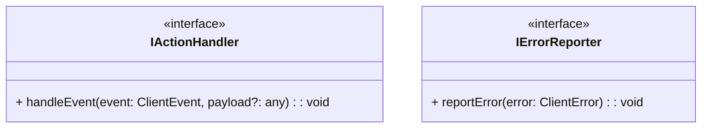
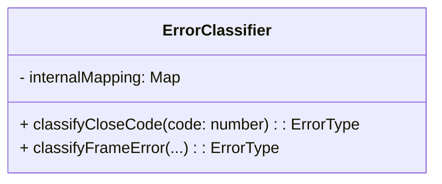
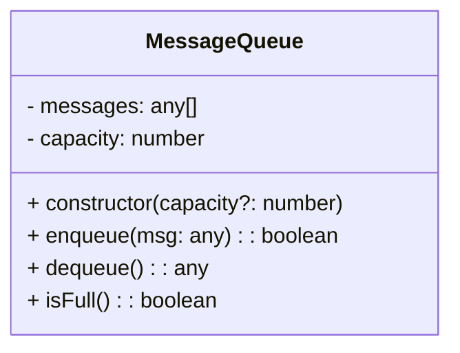

Below are **three** more files for **Layer 1** (Base Interfaces & Classes), each presented with **Mermaid diagrams** and **textual descriptions**, just like we did for `context.class.md`. This completes the typical Layer 1 set:  

1. **`interfaces/internal.interface.md`**  
2. **`protocol/errors.class.md`**  
3. **`message/queue.class.md`**

Feel free to rename or refine fields and methods to match our exact specs.

---

# 1. `interfaces/internal.interface.md`

This file is defined in layer 1.

```md
# internal.interface.md

## Overview
Defines minimal internal interfaces used across different components (e.g., event handlers, error reporting).  
References:
- `events.types.md` for `ClientEvent`
- `errors.types.md` for `ClientError` (if used here)

---

## 1. Mermaid Class Diagram



**Explanation**  
1. **`IActionHandler`**: An interface describing a method to handle a generic `ClientEvent`.  
2. **`IErrorReporter`**: An interface describing a method to report or log errors.

---

## 2. `IActionHandler`

```pseudo
interface IActionHandler {
  handleEvent(event: ClientEvent, payload?: any): void
}
```
- **Method**: `handleEvent(event, payload)`  
  - `event`: a `ClientEvent` from `events.types.md`.  
  - `payload` (optional): any additional info.  
- **Usage**: Classes that respond to state machine or user events implement this to process them.

---

## 3. `IErrorReporter`

```pseudo
interface IErrorReporter {
  reportError(error: ClientError): void
}
```
- **Method**: `reportError(error)`  
  - `error`: A `ClientError` from `errors.types.md`.  
- **Usage**: Allows consistent error handling across modules.

---

## 4. Notes

- If we prefer single-responsibility, we can define more interfaces, or combine them if we want a single “handler” interface.  
- In higher layers, classes like `TransitionController` or `LifecycleOrchestrator` might implement `IActionHandler`.  
- `IErrorReporter` might be implemented by a logger or orchestration class.

```

---

# 2. `protocol/errors.class.md`

```md
# errors.class.md

## Overview
Implements an **ErrorClassifier** class to map close codes or frame issues to `ErrorType` (recoverable, fatal, etc.), per `websocket.md` references.  
Relies on:
- `errors.types.md` for `ErrorType`, `CloseCode`
- Possibly `common.types.md` if referencing constants.

---

## 1. Mermaid Class Diagram



1. **`classifyCloseCode(code: number): ErrorType`**  
   - Returns `FATAL` if code is 1002 (`PROTOCOL_ERROR`), `RECOVERABLE` if code is 1001, etc.  
2. **`classifyFrameError(...)`** (optional)  
   - Distinguish if a big message is `FATAL` or `TRANSIENT`.

---

## 2. Class Definition: `ErrorClassifier`

### 2.1 Fields (Optional)

- **internalMapping**: A map/dictionary from numeric codes to `ErrorType`.  
  For example, `1002 -> FATAL, 1003 -> FATAL, 1001 -> RECOVERABLE`.

### 2.2 Methods

#### classifyCloseCode(code: number): ErrorType
```pseudo
classifyCloseCode(code: number): ErrorType {
  // Example logic:
  // if code == 1002 or 1003 or 1008 or 1009 => FATAL
  // if code == 1001 => RECOVERABLE
  // else => TRANSIENT
}
```
- Aligns with `websocket.md` close codes.

#### classifyFrameError(...)
We can define how we detect an invalid frame (like oversize messages) and map it to `FATAL` or `TRANSIENT`.

---

## 3. Constraints & Usage

- **Constraints**:  
  - Must handle all known close codes from `CloseCode` in `common.types.md` or `errors.types.md`.  
- **Usage**:  
  - Typically called from `socket.class.md` or `frame.class.md` (Layer 2) to decide how to interpret an error event.

---

## 4. References

- **websocket.md**: sections 1.2 (WebSocketConstants), 1.11 (Error classification).
- **errors.types.md**: defines `ErrorType`.
- **machine.md**: If we also treat `ERROR` events differently (fatal vs recoverable transitions).

```

---

# 3. `message/queue.class.md`

```md
# queue.class.md

## Overview
Implements a **basic FIFO queue** for messages, referencing constraints from `machine.md` (section 2.7) and `websocket.md` if relevant.  
Relies on `common.types.md` for `MAX_QUEUE_SIZE`.  

---

## 1. Mermaid Class Diagram



- **`- messages: any[]`**: internal array for storing queued messages (FIFO).  
- **`- capacity: number`**: maximum number of messages allowed.  
- **`+ constructor(capacity?: number)`**: initializes queue, sets `capacity = MAX_QUEUE_SIZE` if none provided.  
- **`+ enqueue(msg): boolean`**: returns `false` if full, else stores the message.  
- **`+ dequeue(): any`**: returns the oldest message or `null` if empty.  
- **`+ isFull(): boolean`**: `true` if `messages.length >= capacity`.

---

## 2. Class Definition: `MessageQueue`

### 2.1 Fields

- **messages**: an internal array with FIFO ordering.  
- **capacity**: typically `MAX_QUEUE_SIZE` from `common.types.md`.

### 2.2 Constructor

```pseudo
constructor(capacity?: number) {
  this.capacity = capacity ?? MAX_QUEUE_SIZE
  this.messages = []
}
```
- Defaults to the global `MAX_QUEUE_SIZE` if none is provided.

### 2.3 Methods

#### enqueue(msg: any): boolean
- If `isFull() == true`, return `false`.
- Else, push `msg` into `messages` and return `true`.

#### dequeue(): any
- If `messages` is empty, return `null` (or `undefined`).
- Otherwise, remove the first element (FIFO) and return it.

#### isFull(): boolean
```pseudo
return this.messages.length >= this.capacity
```

---

## 3. Constraints

1. `|Q| <= capacity` at all times.  
2. FIFO ordering must be preserved (push at the end, pop from the front).

---

## 4. References

- **machine.md** section 2.7: “Queue Properties” (size constraint, ordering).  
- **common.types.md**: For `MAX_QUEUE_SIZE`.  
- **websocket.md**: Possibly references message queue usage in section 1.10 (Message Handling).

```

---

# Summary

With these three new files:

1. **`interfaces/internal.interface.md`**  
   - Basic internal interfaces (`IActionHandler`, `IErrorReporter`).  
2. **`protocol/errors.class.md`**  
   - `ErrorClassifier` logic to map close codes / frame errors → `ErrorType`.  
3. **`message/queue.class.md`**  
   - A minimal FIFO queue with capacity constraints.

…we now have **all** the typical Layer 1 classes/interfaces complete (along with `context.class.md` from before). The next layer (**Layer 2**) will build upon these definitions to integrate actual `xstate v5`, the real `WebSocket` library, and more advanced logic (rate limiting, retry, timeouts, etc.).

Feel free to adjust naming, add or remove methods, or refine the diagrams to match our exact specs. Once satisfied, we can **move on** to create **Layer 2** files (`machine.class.md`, `socket.class.md`, `frame.class.md`, `rate.class.md`, `retry.class.md`, `timeout.class.md`), continuing the same approach of **Mermaid diagrams + textual descriptions**.