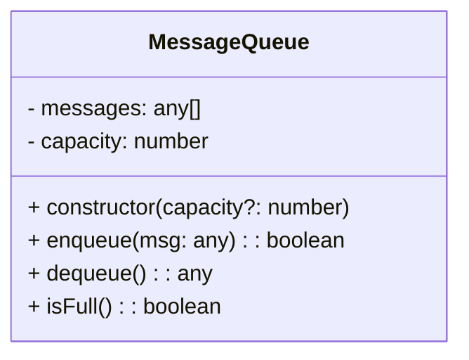

# queue.class.md

## Overview

Implements a **basic FIFO queue** for messages, referencing constraints from `machine.md` (section 2.7) and `websocket.md` if relevant.  
Relies on `common.types.md` for `MAX_QUEUE_SIZE`.

---

## 1. Mermaid Class Diagram



- **`- messages: any[]`**: internal array for storing queued messages (FIFO).
- **`- capacity: number`**: maximum number of messages allowed.
- **`+ constructor(capacity?: number)`**: initializes queue, sets `capacity = MAX_QUEUE_SIZE` if none provided.
- **`+ enqueue(msg): boolean`**: returns `false` if full, else stores the message.
- **`+ dequeue(): any`**: returns the oldest message or `null` if empty.
- **`+ isFull(): boolean`**: `true` if `messages.length >= capacity`.

---

## 2. Class Definition: `MessageQueue`

### 2.1 Fields

- **messages**: an internal array with FIFO ordering.
- **capacity**: typically `MAX_QUEUE_SIZE` from `common.types.md`.

### 2.2 Constructor

```pseudo
constructor(capacity?: number) {
  this.capacity = capacity ?? MAX_QUEUE_SIZE
  this.messages = []
}
```

- Defaults to the global `MAX_QUEUE_SIZE` if none is provided.

### 2.3 Methods

#### enqueue(msg: any): boolean

- If `isFull() == true`, return `false`.
- Else, push `msg` into `messages` and return `true`.

#### dequeue(): any

- If `messages` is empty, return `null` (or `undefined`).
- Otherwise, remove the first element (FIFO) and return it.

#### isFull(): boolean

```pseudo
return this.messages.length >= this.capacity
```

---

## 3. Constraints

1. `|Q| <= capacity` at all times.
2. FIFO ordering must be preserved (push at the end, pop from the front).

---

## 4. References

- **machine.md** section 2.7: “Queue Properties” (size constraint, ordering).
- **common.types.md**: For `MAX_QUEUE_SIZE`.
- **websocket.md**: Possibly references message queue usage in section 1.10 (Message Handling).
