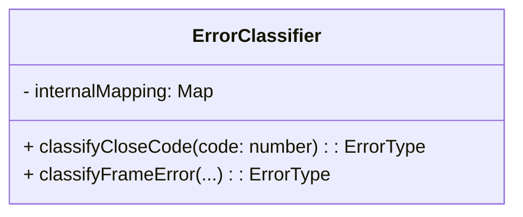

# errors.class.md

## Overview

Implements an **ErrorClassifier** class to map close codes or frame issues to `ErrorType` (recoverable, fatal, etc.), per `websocket.md` references.  
Relies on:

- `errors.types.md` for `ErrorType`, `CloseCode`
- Possibly `common.types.md` if referencing constants.

---

## 1. Mermaid Class Diagram



1. **`classifyCloseCode(code: number): ErrorType`**
   - Returns `FATAL` if code is 1002 (`PROTOCOL_ERROR`), `RECOVERABLE` if code is 1001, etc.
2. **`classifyFrameError(...)`** (optional)
   - Distinguish if a big message is `FATAL` or `TRANSIENT`.

---

## 2. Class Definition: `ErrorClassifier`

### 2.1 Fields (Optional)

- **internalMapping**: A map/dictionary from numeric codes to `ErrorType`.  
  For example, `1002 -> FATAL, 1003 -> FATAL, 1001 -> RECOVERABLE`.

### 2.2 Methods

#### classifyCloseCode(code: number): ErrorType

```pseudo
classifyCloseCode(code: number): ErrorType {
  // Example logic:
  // if code == 1002 or 1003 or 1008 or 1009 => FATAL
  // if code == 1001 => RECOVERABLE
  // else => TRANSIENT
}
```

- Aligns with `websocket.md` close codes.

#### classifyFrameError(...)

We can define how we detect an invalid frame (like oversize messages) and map it to `FATAL` or `TRANSIENT`.

---

## 3. Constraints & Usage

- **Constraints**:
  - Must handle all known close codes from `CloseCode` in `common.types.md` or `errors.types.md`.
- **Usage**:
  - Typically called from `socket.class.md` or `frame.class.md` (Layer 2) to decide how to interpret an error event.

---

## 4. References

- **websocket.md**: sections 1.2 (WebSocketConstants), 1.11 (Error classification).
- **errors.types.md**: defines `ErrorType`.
- **machine.md**: If we also treat `ERROR` events differently (fatal vs recoverable transitions).
