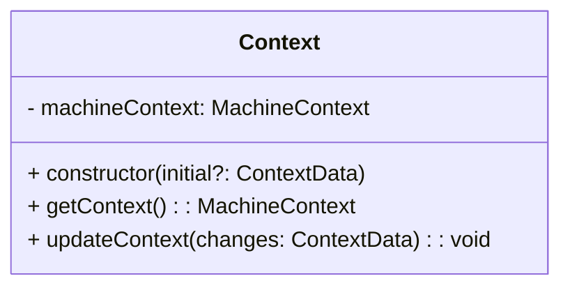

# context.class.md

## Overview
Defines the **MachineContext** interface (a data structure capturing key context variables from `machine.md`) and the **Context** class that stores and updates these variables. This design follows **Option 1**, placing everything about the context in a single `.md` file for clarity.

### References
- **`machine.md`**: Sections 2.3 (Context \(`C`\)) and 4.1 (Connection Timing)  
- **`websocket.md`**: Additional context for `closeCode`, error details, etc.
- **`errors.types.md`**: For `ClientError` definition
- **`common.types.md`**: For constants like `MAX_RETRIES`, `CONNECT_TIMEOUT`, etc.

---

## 1. Types & Interfaces

### 1.1 `MachineContext`

```pseudo
interface MachineContext {
  socket: WebSocket | null
  reconnectCount: number
  disconnectReason?: string
  lastError?: ClientError
  readyState?: number
  // Add any other fields from machine.md (C = (P, V, T)), e.g.:
  // messagesSent?: number
  // messagesReceived?: number
  // lastPingTime?: TimeMs
  // ...
}
```

**Notes**:
- `socket` can be `null` if we’re disconnected or in certain states (like reconnecting).  
- `lastError` references a type from `errors.types.md` (e.g., `ClientError`).

### 1.2 `ContextData`
```pseudo
type ContextData = Partial<MachineContext>
```
- This allows partial updates (e.g. `updateContext({ disconnectReason: "User Request" })`).

*(If you don’t need partial updates, you could skip `ContextData` and directly use `MachineContext`.)*

---

## 2. Class Diagram

Below is a **Mermaid** class diagram showing how the `Context` class works internally.



1. **`- machineContext: MachineContext`**  
   Private field holding all context variables.  
2. **`+ constructor(initial?: ContextData)`**  
   Takes optional initial values to override defaults.  
3. **`+ getContext(): MachineContext`**  
   Returns the current context data (read-only or a shallow copy).  
4. **`+ updateContext(changes: ContextData): void`**  
   Merges partial updates into the existing `machineContext`, applying invariants.

---

## 3. Class Definition: `Context`

### 3.1 Fields

- **machineContext**:  
  - Type: `MachineContext`  
  - Initialized in the constructor.  
  - Internal representation of the current state machine context (socket, reconnectCount, errors, etc.).

### 3.2 Constructor

```pseudo
constructor(initial?: ContextData) {
  // Provide default values for essential fields
  this.machineContext = {
    socket: null,
    reconnectCount: 0,
    readyState: 0, // e.g., if 0 means 'CLOSED'
    // any other defaults
    ...initial
  }
}
```

**Explanation**:
- Merges user-provided `initial` data with the default values.  
- If `initial` is not provided, it defaults everything to the “safe” defaults (e.g., `socket = null`).

### 3.3 getContext(): MachineContext

```pseudo
getContext(): MachineContext {
  // Option A: return directly if read-only
  return this.machineContext

  // Option B: return a shallow copy
  // return { ...this.machineContext }
}
```

- Returns current snapshot of the machine context.  
- Decide if you want to return a **direct reference** or a **copy** to prevent external mutations.

### 3.4 updateContext(changes: ContextData): void

```pseudo
updateContext(changes: ContextData): void {
  // Potentially enforce invariants
  if (changes.reconnectCount && changes.reconnectCount > MAX_RETRIES) {
    // Might forcibly set state to disconnected, etc.
  }

  // Example: If new state is disconnected, ensure socket is null
  // if (changes.state === ClientState.DISCONNECTED) {
  //   changes.socket = null
  // }

  // Merge in the changes
  this.machineContext = {
    ...this.machineContext,
    ...changes
  }
}
```

- **Partial updates**: any subset of fields in `MachineContext` can be updated.  
- **Invariants**: This is an optional place to enforce rules (or you might do that in the transition logic). Examples:
  - If we exceed `MAX_RETRIES`, forcibly set `reconnectCount` to `MAX_RETRIES`.
  - If `readyState == 0` (CLOSED), then ensure `socket == null`.

---

## 4. Constraints & Invariants

1. **Single Active Socket**  
   - If `machineContext.readyState` indicates `DISCONNECTED`, then `machineContext.socket` must be `null`.
2. **Retry Limit**  
   - `machineContext.reconnectCount <= MAX_RETRIES`.
3. **Context Integrity**  
   - If any event tries to set `reconnectCount < 0`, ignore or clamp to 0.
4. **Error Clearing**  
   - You might decide that upon successful connection, `lastError` is reset to `undefined`.

*(Enforce some or all of these in `updateContext()` or in a higher-level transition logic, depending on your design.)*

---

## 5. References

- **machine.md**:  
  - Section 2.3: Defines the context fields `(P, V, T)`.  
  - Might also reference transitions that rely on `reconnectCount` or `lastError`.

- **websocket.md**:  
  - If you store `closeCode` or protocol info in `machineContext`, you can note that here.

- **common.types.md**:  
  - If you use constants like `MAX_RETRIES`, `CONNECT_TIMEOUT`, etc.

- **errors.types.md**:  
  - For the `ClientError` type used in `lastError`.

---

## Final Notes

- This `Context` class does not directly handle **events** or **transitions**—that belongs in **Layer 2 or 3** (the state machine logic and orchestration).  
- If you want to **rename** fields to match your specs (e.g., `status` instead of `readyState`), feel free.  
- If you need more fields from `machine.md` (like `messagesSent`, `lastPingTime`, `windowStart` for rate limiting, etc.), you can add them under `MachineContext`.

