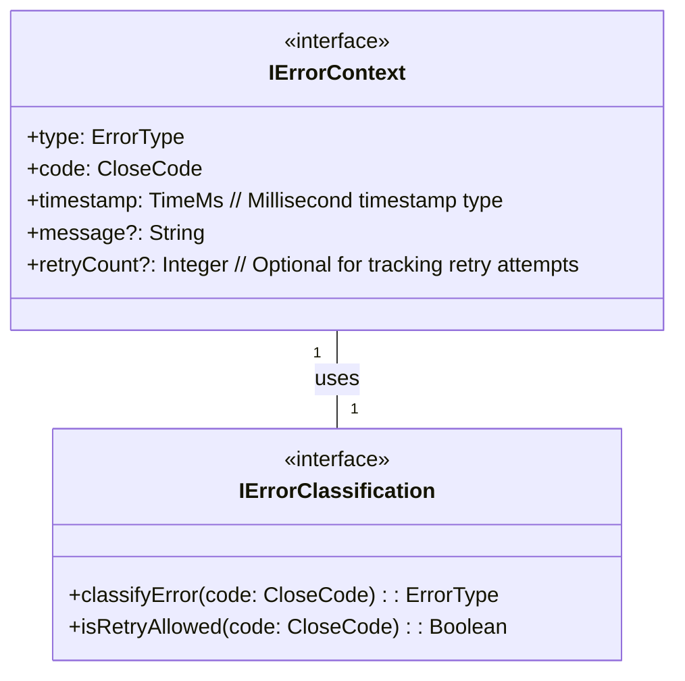

# errors.types.md

## Overview
Defines core type structures for error classification in the WebSocket Client, referencing `machine.md` and `websocket.md`.

---

## 1. Error Type Enumeration

```
Enum ErrorType {
    RECOVERABLE
    FATAL
    TRANSIENT
}
```
*Reference: `websocket.md` section 1.11 - Error Handling Properties*

## 2. Close Code Mapping

```
Enum CloseCode {
    NORMAL_CLOSURE       = 1000  // Standard, clean connection close
    GOING_AWAY           = 1001
    PROTOCOL_ERROR       = 1002
    UNSUPPORTED_DATA     = 1003
    ABNORMAL_CLOSURE     = 1006
    POLICY_VIOLATION     = 1008
    MESSAGE_TOO_BIG      = 1009
    INTERNAL_ERROR       = 1011
}
```
*Reference: WebSocket protocol standard close codes, validated in `websocket.md` section 1.2*

## 3. Error Classification Diagram


*References:* 
- *Error context structure from `machine.md` section 2.3 (Context Properties)*
- *`TimeMs` type defined in `common.types.md` as a timestamp representation in milliseconds*

## 4. Error Classification Mapping

| Close Code | Error Type    | Retry Allowed | Notes |
|-----------|---------------|---------------|-------|
| 1000      | NONE          | No            | Normal connection closure (not an error) |
| 1001      | RECOVERABLE   | Yes           | Server intentionally closing connection |
| 1002      | FATAL         | No            | Protocol error |
| 1003      | FATAL         | No            | Unsupported data type |
| 1006      | RECOVERABLE   | Yes           | Abnormal connection closure |
| 1008      | FATAL         | No            | Policy violation |
| 1009      | FATAL         | No            | Message too large |
| 1011      | FATAL         | No            | Internal server error |

*Reference: Classification logic from `websocket.md` section 1.11.1 (Error Classification Rules)*