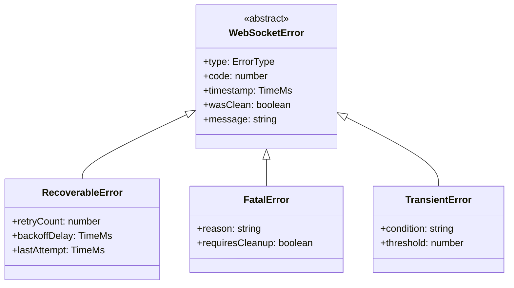
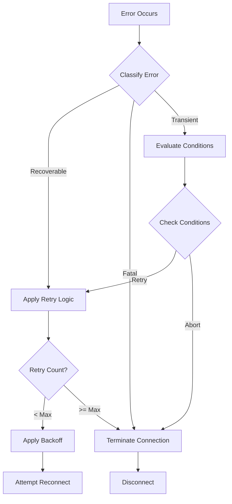

# WebSocket Client Error Types and Classification

## Overview

The error handling system is a critical component that ensures reliable operation of the WebSocket client by managing connection failures, protocol violations, and system errors. This system supports key business requirements:

- Automated recovery from temporary network disruptions
- Graceful degradation during planned maintenance
- Protection against resource exhaustion
- Clear error reporting for monitoring and diagnostics

## 1. Business Impact

### 1.1 Reliability Objectives

The error classification system directly supports these reliability targets:

- 99.9% successful automatic recovery from transient failures
- Zero data loss during reconnection scenarios
- Maximum 5-second detection and response time for fatal errors
- Clear audit trail of all error conditions and recovery attempts

### 1.2 Operational Requirements

Error handling must support these operational needs:

- Real-time monitoring of connection health
- Automated escalation of critical failures
- Detailed error context for troubleshooting
- Configurable retry policies for different deployment environments

## 2. Error Classification

### 2.1 Error Categories

The system classifies all errors into three categories based on their operational impact:

```typescript
enum ErrorType {
  RECOVERABLE, // Temporary failures that can be automatically resolved
  FATAL, // Severe errors requiring manual intervention
  TRANSIENT, // Momentary disruptions that self-resolve
}
```

### 2.2 Protocol Close Codes

WebSocket protocol close codes map to our error categories:

```typescript
enum CloseCode {
  NORMAL_CLOSURE = 1000, // Clean shutdown - not an error
  GOING_AWAY = 1001, // Graceful disconnect (maintenance)
  PROTOCOL_ERROR = 1002, // Protocol violation
  UNSUPPORTED_DATA = 1003, // Invalid message format
  ABNORMAL_CLOSURE = 1006, // Connection lost
  POLICY_VIOLATION = 1008, // Security policy breach
  MESSAGE_TOO_BIG = 1009, // Message size limit exceeded
  INTERNAL_ERROR = 1011, // Unexpected server error
}
```

## 3. Error Handling Architecture

### 3.1 Component Model



### 3.2 Error Processing Flow



## 4. Operational Considerations

### 4.1 Monitoring Integration

The error handling system exposes these metrics:

- Error rates by category
- Recovery success rates
- Average recovery time
- Current retry counts
- Error distribution patterns

### 4.2 Configuration Parameters

Key configuration options:

- Maximum retry attempts
- Retry backoff parameters
- Error classification thresholds
- Monitoring integration settings
- Logging detail levels

### 4.3 Troubleshooting Guide

Common error scenarios and resolution steps:

| Error Type         | Common Causes                       | Resolution Steps                           | Business Impact                |
| ------------------ | ----------------------------------- | ------------------------------------------ | ------------------------------ |
| Network Timeout    | Network congestion, DNS issues      | Check network connectivity, DNS resolution | Temporary service interruption |
| Protocol Error     | Client/server version mismatch      | Verify protocol compatibility              | Service degradation            |
| Security Violation | Invalid credentials, expired tokens | Update authentication credentials          | Service outage                 |

## 5. Implementation Guidelines

### 5.1 Error Context Requirements

All errors must capture:

- Timestamp in milliseconds
- Related protocol close code
- Clean closure status
- Retry attempt count (if applicable)
- Last successful operation timestamp
- Network condition indicators

### 5.2 Recovery Process Standards

Recovery procedures must:

- Implement exponential backoff
- Respect rate limits
- Maintain operation ordering
- Preserve session state where possible
- Log all recovery attempts

## 6. References

This implementation is governed by:

- RFC 6455 (WebSocket Protocol) Section 7.4 - Error Codes
- System Reliability Requirements (SRE-101)
- Operational Monitoring Standards (OPS-203)
- Error Handling Best Practices (SEC-157)

## 7. Change Management

| Version | Date       | Changes                  | Author |
| ------- | ---------- | ------------------------ | ------ |
| 1.0     | 2024-01-26 | Initial version          | Team   |
| 1.1     | 2024-01-26 | Added monitoring section | Team   |
