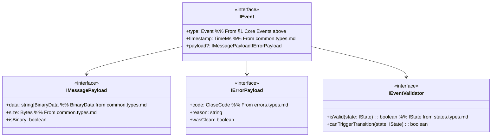

# events.types.md

## Overview
Defines **all events** the WebSocket Client may handle or dispatch, referencing `machine.md` (section 2.2) and `websocket.md` (section 1.3).

---

## 1. Core Events

```pseudo
// From machine.md §2.2 Events (E)
enum Event {
  e₁: CONNECT
  e₂: DISCONNECT  
  e₃: OPEN
  e₄: CLOSE
  e₅: ERROR
  e₆: RETRY
  e₇: MAX_RETRIES
  e₈: TERMINATE
  e₉: MESSAGE
  e₁₀: SEND
  e₁₁: PING
  e₁₂: PONG
  e₁₃: DISCONNECTED
  e₁₄: RECONNECTED
  e₁₅: STABILIZED
}
```

---

## 2. Event Interface Structure 



This interface definition depends on:

- `TimeMs`, `Bytes`, `BinaryData` from `common.types.md`
- `CloseCode` from `errors.types.md`
- `IState` from `states.types.md`
- `Event` enum from $\S 1$ above

---

## 3. WebSocket-Specific Events (Optional Sub-Enum)

From `websocket.md` section 1.3:

```pseudo
enum WebSocketEvent {
  open,
  close,
  error,
  message,
  disconnected,
  reconnected,
  stabilized
}
```
(If we prefer merging them into `ClientEvent`, that’s fine too—just keep it consistent.)

---

## 4. References

- `machine.md` section 2.2 for the full list of named events.
- `websocket.md` section 1.3 for protocol event types.
- Each event is associated with transitions in the state machine definitions (see `states.types.md` and `machine.class.md`).
