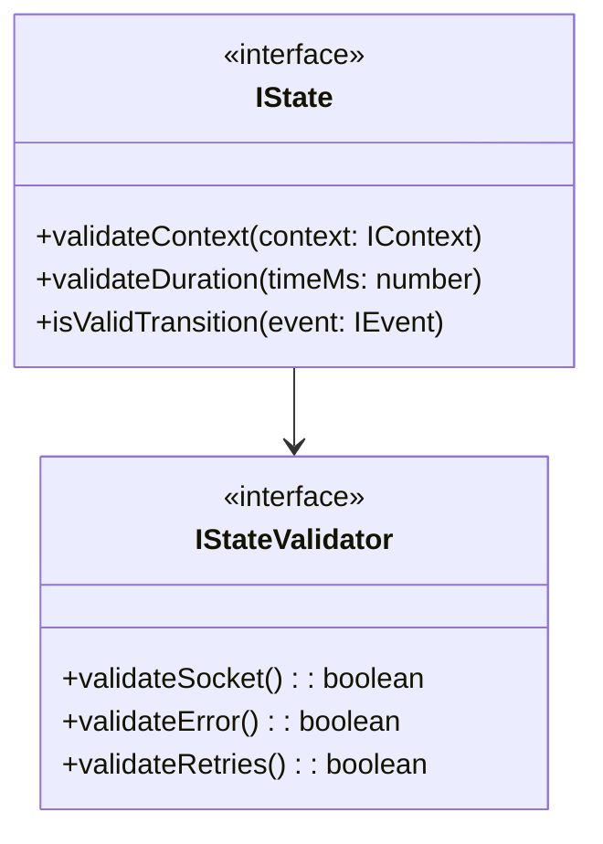

# states.types.md

## Overview

Lists **all states** from the formal specs, referencing `machine.md` (sections 2.1, 2.5) and `websocket.md` (section 1.1 for state mapping).

---

## 1. Core States

```pseudo
// From machine.md §2.1
enum State {
  s1: disconnected  
  s2: disconnecting
  s3: connecting
  s4: connected 
  s5: reconnecting
  s6: reconnected
}
```

---

## 2. State Interface Structure



## 3. State Invariants (From $\S$2.6.1)

From `machine.md` section 2.6.1:

### Disconnected ($s_1$)

```pseudo
when Disconnected:
  socket = null
  error = null
  reconnectAttempts = 0
```

### Disconnecting ($s_2$)

```pseudo
when Disconnecting:
  socket != null
  disconnectReason != null
  duration <= DISCONNECT_TIMEOUT
```

### Connecting ($s_3$)

```pseudo
when Connecting:
  socket != null
  url != null
  duration <= CONNECT_TIMEOUT
```

### Connected ($s_4$)

```pseudo
when CONNECTED:
  socket != null
  error = null
  readyState = 1
```

### Reconnecting ($s_5$)

```pseudo
when RECONNECTING:
  socket = null
  retries <= MAX_RETRIES
  error != null
```

### Reconnected ($s_6$)

```pseudo
when RECONNECTED:
  socket != null
  reconnectCount > 0
  lastStableConnection != null
  duration <= STABILITY_TIMEOUT
```

---

## 4. References

- `machine.md` sections 2.1 and 2.5 (transitions).
- `websocket.md` sections 1.1, 1.3 (protocol states).
- Class-level logic that uses these states will appear in `machine.class.md` and `transition.class.md`.

