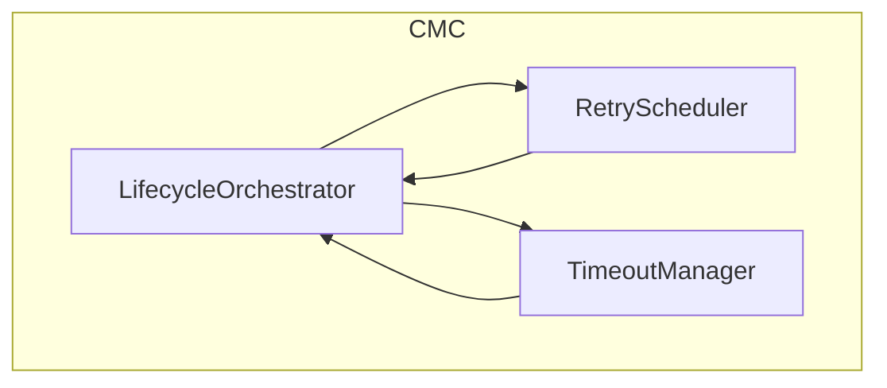
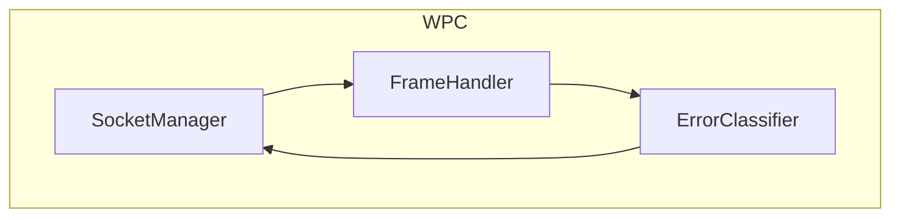
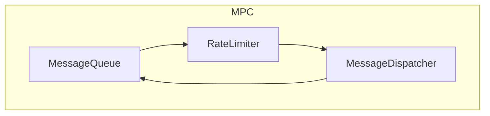
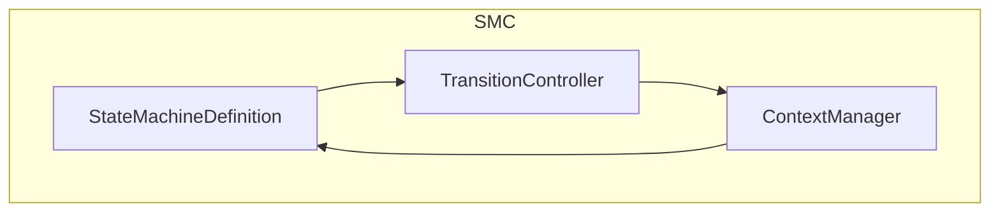

# Layer 3: Component-Level Design (Container by Container)

## 1. Connection Management Container (CMC)

The **Connection Management Container** orchestrates connection lifecycles, handles (re)connecting logic, and enforces timeouts and retry policies.

### 1.1 Components Overview

1. **LifecycleOrchestrator**  
2. **RetryScheduler**  
3. **TimeoutManager**

- **LifecycleOrchestrator (LO)**  
  - **Role**: Central coordinator for connect/disconnect processes. Receives commands from the application, updates status, and instructs the WPC (WebSocket Protocol Container) to open or close sockets.  
  - **Input**:
    - External commands: `connect(url)`, `disconnect()`.
    - State signals from SMC: e.g., “enter reconnecting state,” “disconnected state.”  
  - **Output**:
    - Invokes WPC methods: `openSocket(url)`, `closeSocket(code?)`.
    - Notifies RetryScheduler to set up or cancel backoff.
    - Notifies TimeoutManager to track `CONNECT_TIMEOUT` or `DISCONNECT_TIMEOUT`.

- **RetryScheduler (RS)**  
  - **Role**: Applies exponential backoff policies when the client transitions to a reconnecting state.  
  - **Input**:
    - Triggers from LifecycleOrchestrator (e.g., “start retry #n”).  
    - `MAX_RETRIES`, `INITIAL_RETRY_DELAY`, `MAX_RETRY_DELAY` from config.  
  - **Output**:
    - Dispatches “RetryEvent” (or a similar signal) back to LifecycleOrchestrator after the scheduled delay.
    - Cancels scheduled retry upon success or user-driven disconnect.

- **TimeoutManager (TM)**  
  - **Role**: Monitors connect/disconnect operations. If they exceed the configured timeouts, it sends a forced transition (e.g., “connect timeout → error state”).  
  - **Input**:
    - Start or cancel requests from LifecycleOrchestrator (`startConnectTimer`, `cancelDisconnectTimer`, etc.).
    - `CONNECT_TIMEOUT`, `DISCONNECT_TIMEOUT` from config.  
  - **Output**:
    - Timeout events to LifecycleOrchestrator, e.g. `onConnectTimeout()`, leading to an error or forced close.

### 1.2 Internal Interactions

- **On `connect(url)`**:  
  1. LifecycleOrchestrator instructs TimeoutManager to start a `CONNECT_TIMEOUT` timer.  
  2. If success (`open` event from WPC arrives in time), LifecycleOrchestrator cancels the timer.  
  3. If timeout, TimeoutManager notifies LifecycleOrchestrator → triggers an error or reconnect transition.

- **On `reconnecting` state**:  
  1. LifecycleOrchestrator tells RetryScheduler: “Schedule next attempt #n.”  
  2. RetryScheduler calculates `delay_n`, sets a timer. When time elapses, it signals LifecycleOrchestrator → attempt to reconnect again or transition to `disconnected` if `MAX_RETRIES` exceeded.

### 1.3 Constraints & References

- **Constraints**:  
  - Must not exceed `MAX_RETRIES = 5`.  
  - Must handle `CONNECT_TIMEOUT`, `DISCONNECT_TIMEOUT` properly.  
- **References**:  
  - Aligned with `machine.md` transitions: `connecting → connected`, `connecting → reconnecting`, etc.  
  - Aligned with `websocket.md` for error classification (recoverable vs fatal).

---

## 2. WebSocket Protocol Container (WPC)

The **WebSocket Protocol Container** manages low-level socket operations and frames, bridging the actual WebSocket server and the client’s higher-level logic.

### 2.1 Components Overview

1. **SocketManager**  
2. **FrameHandler**  
3. **ErrorClassifier**

- **SocketManager (SMgr)**  
  - **Role**: Creates/destroys a `WebSocket` instance (via `ws` library or browser API), listens to low-level events (`onOpen`, `onClose`, `onError`, `onMessage`) and notifies the rest of the system.  
  - **Input**:
    - Connection Management requests: `openSocket(url)`, `closeSocket(code?)`.  
    - Actual WebSocket server frames/events.  
  - **Output**:
    - Emitted signals: “socketOpened”, “socketClosed(code)”, “socketError(error)”, or “incomingFrame(frame)”.  
  - **Constraints**:
    - Single active socket.  
    - Must close prior socket if asked to open a new one.

- **FrameHandler (FH)**  
  - **Role**: Encodes/decodes WebSocket frames, ensuring messages respect `MAX_MESSAGE_SIZE`.  
  - **Input**:
    - Raw frames from SocketManager (`onMessage`).  
    - High-level messages from Message Processing Container (to be sent out as frames).  
  - **Output**:
    - Outbound frames to `SocketManager.send(frame)`.  
    - Decoded content to MPC or error signals to ErrorClassifier if frames are malformed.  
  - **Constraints**:
    - Enforces or checks `message.size <= MAX_MESSAGE_SIZE`.  
    - Possibly splits or discards oversize frames.

- **ErrorClassifier (EC)**  
  - **Role**: Distinguishes fatal vs. recoverable vs. transient protocol errors based on `websocket.md` close codes (`1002`, `1003`, etc.).  
  - **Input**:
    - FrameHandler flags or `SocketManager` close events with a code.  
  - **Output**:
    - Classification result: e.g., `RecoverableErrorEvent`, `FatalErrorEvent`.  
    - Informs SMC to transition to `reconnecting` or `disconnected` accordingly.

### 2.2 Internal Interactions

- **Sending a Message**:  
  1. MPC calls `FrameHandler.encode(message)`.  
  2. FrameHandler returns a frame, passes it to `SocketManager.send(frame)`.  
  3. SocketManager physically sends data on the WebSocket.  

- **Receiving a Message**:  
  1. SocketManager receives a raw frame from the server (`onMessage`).  
  2. Passes the frame to `FrameHandler.decode(frame)`.  
  3. If valid, FrameHandler returns a decoded message to MPC. If invalid, FrameHandler calls ErrorClassifier → SMC.

### 2.3 Constraints & References

- **Constraints**:  
  - Must respect WebSocket close codes from `websocket.md`: `NORMAL_CLOSURE`, `PROTOCOL_ERROR`, etc.  
  - Must handle partial frames or errors gracefully.  
- **References**:  
  - Ties to the `Error Recovery Rules` in `websocket.md` (recoverable vs. fatal errors).  
  - Ties to `machine.md` for transitions triggered by `ERROR` or `CLOSE`.

---

## 3. Message Processing Container (MPC)

The **Message Processing Container** ensures messages flow seamlessly, adhering to queue, rate-limiting, and ordering rules.

### 3.1 Components Overview

1. **MessageQueue**  
2. **RateLimiter**  
3. **MessageDispatcher**

- **MessageQueue (MQ)**  
  - **Role**: Stores outbound messages when the socket is not yet ready, or when rate limiting is triggered.  
  - **Input**:
    - Outbound messages from the Application (or from SMC actions like `SEND`).  
  - **Output**:
    - Provides next message to RateLimiter when the system is `connected` or `reconnected`.  
  - **Constraints**:
    - `MAX_QUEUE_SIZE = 1000`. If full, must reject or discard new messages.  
    - Preserves FIFO ordering.

- **RateLimiter (RL)**  
  - **Role**: Enforces `RATE_LIMIT = 100 msgs/sec`.  
  - **Input**:
    - Next message from MessageQueue.  
    - Timestamps of recent sends.  
  - **Output**:
    - If under limit, sends message to `MessageDispatcher`.  
    - If limit reached, signals back to SMC or temporarily blocks the queue.  
  - **Constraints**:
    - Must handle a sliding window or token-bucket mechanism to maintain the rate limit from `machine.md`.

- **MessageDispatcher (MD)**  
  - **Role**: The final step in sending messages out (via WPC). Also receives inbound messages from WPC to pass to the Application.  
  - **Input**:
    - Outbound messages from RateLimiter.  
    - Inbound messages from WPC (decoded frames).  
  - **Output**:
    - Calls WPC to `sendFrame(data)` for outbound.  
    - Notifies Application Logic of inbound messages.  
    - Possibly triggers events to SMC if a message error occurs (e.g., “MESSAGE too big?”).

### 3.2 Internal Interactions

- **Outbound Flow**:
  1. **MQ** receives a new message from the app.  
  2. **MQ** checks capacity; if not full, it queues it.  
  3. When SMC signals “connected,” **MQ** releases messages to **RL**.  
  4. **RL** checks rate window; if under limit, it passes the message to **MD** → **MD** calls WPC.  
  5. If limit is exceeded, RL either delays or signals the queue to pause.

- **Inbound Flow**:
  1. WPC passes a decoded message to **MD**.  
  2. **MD** notifies the app (`onMessage`) or SMC if a special event triggers transitions.

### 3.3 Constraints & References

- **Constraints**:  
  - `MAX_QUEUE_SIZE`, `RATE_LIMIT`, `MAX_MESSAGE_SIZE`.  
  - Must not lose messages unless explicitly forced (e.g., queue overflow).  
- **References**:  
  - Rate-limit and queue size constraints from `machine.md`.  
  - Actions like `processMessage` (`\gamma_4` in `machine.md`) or `sendMessage` (`\gamma_5`).

---

## 4. State Management Container (SMC)

The **State Management Container** is the **central brain** that enforces the formal state machine from `machine.md` and `websocket.md`.

### 4.1 Components Overview

1. **StateMachineDefinition**  
2. **ContextManager**  
3. **TransitionController**

- **StateMachineDefinition (SMD)**  
  - **Role**: Encodes all states (disconnected, connecting, etc.) and events (CONNECT, OPEN, ERROR, RETRY, etc.), plus the valid transitions.  
  - **Input**:
    - Triggering events from other containers (WPC, MPC, CMC).  
    - Internal events like “time-based transitions” if integrated (via CMC or timers).  
  - **Output**:
    - A next state or action set, e.g., “move to `reconnecting`,” “increment retries,” “dispatch SEND action.”

- **ContextManager (CMgr)**  
  - **Role**: Stores and updates the machine context (e.g., `reconnectCount`, `lastError`, `closeCode`, `socket`).  
  - **Input**:
    - Update actions from TransitionController or SMD.  
  - **Output**:
    - Provides updated context to SMD to evaluate guards (like “retries < MAX_RETRIES?”).  
  - **Constraints**:
    - Must keep `socket=null` if `disconnected`.  
    - Must not exceed `MAX_RETRIES`, etc.

- **TransitionController (TC)**  
  - **Role**: The “runtime” engine that, upon receiving `(state, event)`, looks up the corresponding transition in **SMD**, updates **CMgr**, and emits resulting actions/commands.  
  - **Input**:
    - `(currentState, event)` pairs from external triggers or internal signals.  
  - **Output**:
    - A new `currentState`, or an instruction to call `CMC`, `WPC`, or `MPC`.  
  - **Constraints**:
    - Exactly one next state for each `(state, event)` (deterministic).  
    - If a transition is invalid, it logs or raises an error.

### 4.2 Internal Interactions

1. **Event Dispatch**:
   - Another container triggers an event, e.g. `ERROR`.  
   - **TransitionController** consults **StateMachineDefinition** → “From `connected` + `ERROR` = `reconnecting`.”  
   - Updates **ContextManager** accordingly (`lastError = ...`, `retries++`).  
   - If a side effect is indicated (like “initiate reconnect”), sends that request to **CMC**.

2. **Guard Evaluation**:
   - Some transitions require checking context, e.g. if `(retries < MAX_RETRIES)`.  
   - **TransitionController** calls `ContextManager.get('retries')` → decides next state.  
   - If guard fails, transitions to `disconnected` or a different path.

### 4.3 Constraints & References

- **Constraints**:
  - Must align with `machine.md` transitions, ensuring determinism and coverage for all `(state, event)` pairs.  
  - Must preserve invariants from `websocket.md` (e.g., “reconnecting → reconnected”).
- **References**:
  - Uses **xstate v5** or an equivalent pattern to implement the state logic.  
  - Ties to `websocket.md` error classification for transitions like `ERROR → reconnecting` or `ERROR → disconnected`.

---

## 5. Summary and Next Steps

At **Layer 3 (Component)**, we have split each container into **logical submodules** with distinct responsibilities:

- **CMC**:  
  - **LifecycleOrchestrator**, **RetryScheduler**, **TimeoutManager**  
- **WPC**:  
  - **SocketManager**, **FrameHandler**, **ErrorClassifier**  
- **MPC**:  
  - **MessageQueue**, **RateLimiter**, **MessageDispatcher**  
- **SMC**:  
  - **StateMachineDefinition**, **ContextManager**, **TransitionController**

Each component references the **formal specs** (`machine.md`, `websocket.md`) for transitions, error handling, queue constraints, rate limits, etc. This ensures **completeness** and **workability**, while preserving the **simplicity** of well-defined internal boundaries.

In **Layer 4 (Class-Level)**, we will **further refine** these components into **classes, interfaces, and methods**, making explicit how each function (e.g., `retryScheduler.schedule()`, `socketManager.send()`, `transitionController.fireEvent()`) is coded. That final layer will tie directly into real code—**xstate v5** usage, actual `ws` library calls, and the overall design DSL.