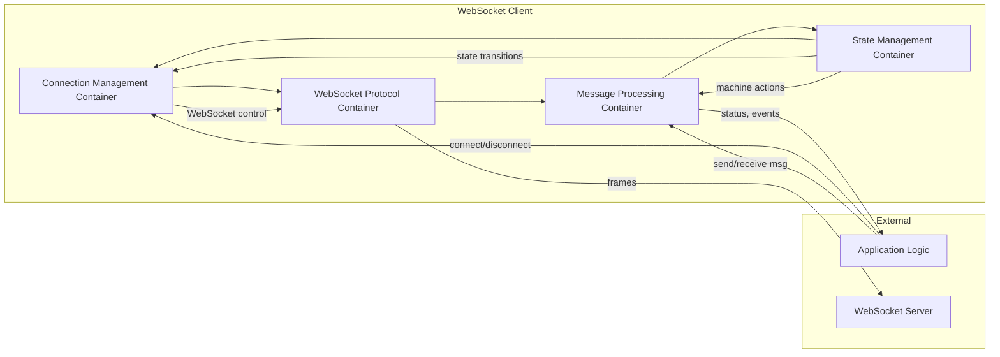

# WebSocket Client: Container Level Design

> **Scope:**  
> The **Container** level identifies **major subsystems** (or “containers”) within the WebSocket Client. Each container groups related functionality and defines stable interfaces for collaborating with other containers. This ensures a clean separation of concerns and better alignment with the formal specs (`machine.md`, `websocket.md`).

---

## 1. Container Overview

Below are the **four main containers** within the WebSocket Client, consistent with the higher-level modules introduced at the **System Context** level:

1. **Connection Management Container (CMC)**  
2. **WebSocket Protocol Container (WPC)**  
3. **Message Processing Container (MPC)**  
4. **State Management Container (SMC)**  

Each container is responsible for a subset of tasks—whether it’s negotiating connections, handling protocol frames, queuing messages, or enforcing state machine transitions.

---

## 2. Container Diagram

**Reading the Diagram**  
- **Connection Management Container (CMC)**: Receives connect/disconnect requests from the application, orchestrates lifecycle.  
- **WebSocket Protocol Container (WPC)**: Translates high-level connection actions into actual WebSocket frames and vice versa.  
- **Message Processing Container (MPC)**: Handles messages enqueued or received, also interacting with application for data I/O.  
- **State Management Container (SMC)**: Maintains the formal state machine, ensuring valid transitions, error handling, and reconnection logic.

---

## 3. Container Responsibilities

### 3.1 Connection Management Container (CMC)

**Responsibilities**  
- **Lifecycle Orchestration**: Initiates connects, disconnects, retries based on triggers (user commands or error events).  
- **Timeouts**: Applies `CONNECT_TIMEOUT`, `DISCONNECT_TIMEOUT`, scheduling fallback or cleanup if time is exceeded.  
- **Resource Tracking**: Updates counters (`reconnectCount`, `retries`) and triggers reconnection or “give up” after `MAX_RETRIES`.

**Interfaces**  
- **Input**:  
  - From **Application Logic**: `connect(url)`, `disconnect()`, config changes.  
  - From **State Management**: notifications like “RETRY needed” or “DISCONNECTED event.”  
- **Output**:  
  - To **WebSocket Protocol**: actual “open” or “close” calls.  
  - To **Message Processing**: signals to pause/resume message flow as needed.  
  - To **Application Logic**: current status (`connecting`, `disconnected`, etc.).

**Constraints**  
- Must adhere to `MAX_RETRIES` and exponential backoff logic.  
- Must preserve a **single active connection** rule (never create multiple sockets at once).

---

### 3.2 WebSocket Protocol Container (WPC)

**Responsibilities**  
- **Low-Level WebSocket Handling**: Creates/destroys the actual `WebSocket` instance (via `ws` library or browser API).  
- **Frame Parsing**: Decodes/encodes frames, handles close codes (`NORMAL_CLOSURE`, `PROTOCOL_ERROR`, etc.).  
- **Error Classification**: Distinguishes **Recoverable** vs. **Fatal** protocol errors (per `websocket.md`).

**Interfaces**  
- **Input**:  
  - From **Connection Management**: instructions to open or close the connection.  
  - From **WebSocket Server**: incoming frames, close events, error events.  
- **Output**:  
  - To **Message Processing**: raw messages converted into a standard format.  
  - To **Connection Management**: status changes (open, error, close codes).  
  - To **State Management**: error classification triggers (“ERROR event” with a specific code).

**Constraints**  
- Must enforce `MAX_MESSAGE_SIZE` on incoming/outgoing frames.  
- Must handle close codes properly, respecting the formal states (`disconnected`, `reconnecting`, etc.).

---

### 3.3 Message Processing Container (MPC)

**Responsibilities**  
- **Queue Management**: Maintains an internal queue for outbound messages if the socket is not in a state to send immediately (e.g., `disconnected` or `connecting`).  
- **Rate Limiting**: Enforces `RATE_LIMIT` constraints (e.g., at most 100 msgs/sec).  
- **Message Lifecycle**: Receives messages from the server, processes or transforms them, and notifies the application.

**Interfaces**  
- **Input**:  
  - From **Application Logic**: requests to `send(data)`.  
  - From **WebSocket Protocol**: newly received frames that are valid messages.  
  - From **State Management**: actions such as `processMessage(context, event)`.  
- **Output**:  
  - To **State Management**: signals if queue is full or if a rate limit was reached.  
  - To **Application Logic**: processed messages, errors (if a message is invalid).  
  - To **WebSocket Protocol**: actual data frames to transmit, once allowed by rate limits and queue status.

**Constraints**  
- **MAX_QUEUE_SIZE**: must reject or discard messages if queue is full.  
- **Message Ordering**: preserve FIFO for enqueued messages.  
- **Rate Limit**: ensure no more than 100 messages/second are sent.

---

### 3.4 State Management Container (SMC)

**Responsibilities**  
- **Formal State Machine**: Implements states (`disconnected`, `connecting`, `connected`, etc.), events (`CONNECT`, `ERROR`, `RETRY`, etc.), and transitions.  
- **Context Updates**: Adjusts context variables (`reconnectCount`, `lastError`, `closeCode`) per actions specified in `machine.md` and `websocket.md`.  
- **Error & Liveness Enforcement**: Decides if an `ERROR` leads to `reconnecting` or `disconnected` (based on `MAX_RETRIES`, error classification).

**Interfaces**  
- **Input**:  
  - From **Connection Management**: triggers like “User requested connect/disconnect.”  
  - From **WebSocket Protocol**: events such as `open`, `close(code)`, `error`, etc.  
  - From **Message Processing**: signals like “message queue full,” or “rate limit hit.”  
- **Output**:  
  - State transitions and actions, e.g. “go to `reconnecting`, increment retries,” “send message,” “disconnect now,” etc.  
  - Notifies **Connection Management** or **Message Processing** to perform side effects.  
  - Delivers final states or error conditions to the **Application**.

**Constraints**  
- Must **strictly** follow transitions from the formal specs.  
- No contradictory or undefined transitions: for any `(state, event)` pair, exactly one next state.  
- Must keep context consistent: e.g. if state is `connecting`, `socket != null`.

---

## 4. Container Interactions

### 4.1 Collaboration Patterns

1. **Connection Flow**  
   - **APP** calls `connect(url)` → **CMC** instructs **WPC** to open a socket → **WPC** notifies **SMC** of `open` or `error`.  
   - **SMC** transitions to `connected` or `reconnecting`, signals **MPC** to resume or queue messages.

2. **Messaging Flow**  
   - **APP** calls `send(data)` → **MPC** queues or sends immediately if `connected` → **WPC** encodes frames → **WS** receives.  
   - **WS** sends frames → **WPC** decodes them → passes message to **MPC** → **APP** is notified.

3. **Reconnection**  
   - If an `ERROR` event arises (or close code signals a recoverable failure), **SMC** transitions to `reconnecting`.  
   - **CMC** applies a backoff policy; once time has elapsed, it tries opening the connection again via **WPC**.  
   - On success, **SMC** transitions to `reconnected` → eventually `connected`.  
   - On max retry exhaustion, **SMC** transitions to `disconnected`.

### 4.2 Container Data Flows

**CMC ↔ WPC**  
- `CMC` → `WPC`: `openSocket(url)`, `closeSocket(code)`  
- `WPC` → `CMC`: `onSocketOpen()`, `onSocketClose(code)`, `onSocketError(err)`

**WPC ↔ MPC**  
- `WPC` → `MPC`: `onMessage(frame)`, possibly multiple per second  
- `MPC` → `WPC`: `sendFrame(data)`

**MPC ↔ SMC**  
- `MPC` → `SMC`: “Queue full,” “message error,” or “rate limit event.”  
- `SMC` → `MPC`: “queueMessage(action)`, `processMessage(action)`, etc.

**SMC ↔ CMC**  
- `SMC` → `CMC`: “initiateReconnect()”, “disconnectNow()”  
- `CMC` → `SMC`: “connectionTimeout()” event, or “disconnected()” event

---

## 5. Container Resource Allocations \((R)\)

Each container consumes or manages certain resources defined at the **System Context** level:

1. **CMC**  
   - Tracks **retry counts** (`MAX_RETRIES` = 5).  
   - Schedules timers for connect/disconnect timeouts.  

2. **WPC**  
   - Maintains **WebSocket** objects within `MAX_BUFFER_SIZE` = 16 MB total.  
   - Handles frames up to `MAX_MESSAGE_SIZE` = 1 MB.

3. **MPC**  
   - Manages the **message queue** with `MAX_QUEUE_SIZE` = 1000.  
   - Enforces `RATE_LIMIT` = 100 msgs/sec.

4. **SMC**  
   - No large data structures typically, but must respect timing constraints like `STABILITY_TIMEOUT`, `CONNECT_TIMEOUT`.

---

## 6. Validation Criteria

### 6.1 State Distribution

- **All states** from `machine.md`/`websocket.md` have a **home** in SMC or are recognized by the relevant container.  
- **No container** introduces new states that conflict with the formal specs.

### 6.2 Protocol Stability

- **WPC** must handle official WebSocket close codes, error classifications, and partial frames if needed.  
- **CMC** never attempts multiple concurrent connections, preserving the “single active connection” rule.

### 6.3 Resource Workability

- Each container respects the resource constraints from Level 1.  
- **MPC** does not exceed queue capacity or rate limits.  
- **WPC** ensures frame sizes remain under `MAX_MESSAGE_SIZE`.

### 6.4 Interfaces Completeness

- Each container interface lines up with the **System Context** interfaces (connection, message, control).  
- No container is missing a critical operation that might prevent fulfilling a formal property (e.g., liveness via reconnection).

---

## 7. Conclusion and Next Steps

At the **Container Level**, we’ve allocated all major tasks—connection orchestration, WebSocket protocol, message handling, and state management—into four distinct containers:

1. **Connection Management Container (CMC)**  
2. **WebSocket Protocol Container (WPC)**  
3. **Message Processing Container (MPC)**  
4. **State Management Container (SMC)**  

Each container includes:

- **Responsibilities** and **Interfaces**  
- **Constraints** mapped to the formal specs  
- **Interaction patterns** showing how containers collaborate

In **Level 3 (Component)** design, we will further **break down** each container into internal components (e.g., “QueueManager” inside MPC, “RetryScheduler” inside CMC). We’ll detail how these components fulfill the container’s responsibilities while preserving the constraints and properties from `machine.md` and `websocket.md`.

This container-level design thus **bridges** the abstract System Context (Level 1) and the more **fine-grained** component-level (Level 3), preserving **simplicity**, **completeness**, and **workability** at every step.