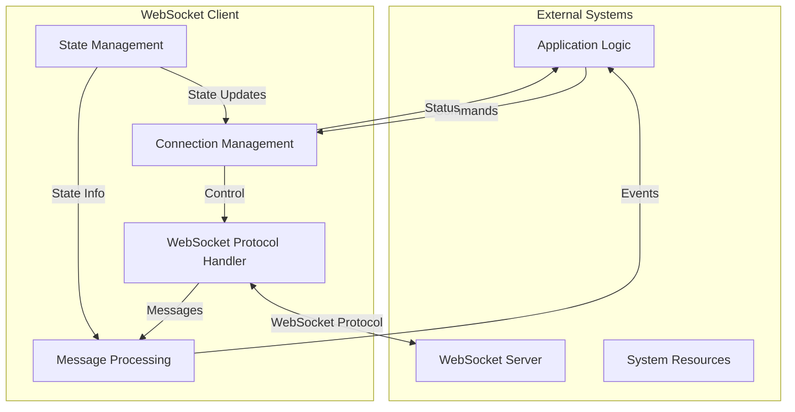
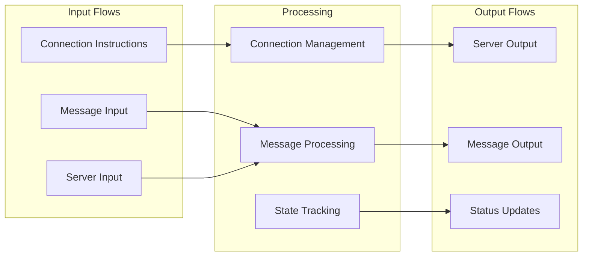
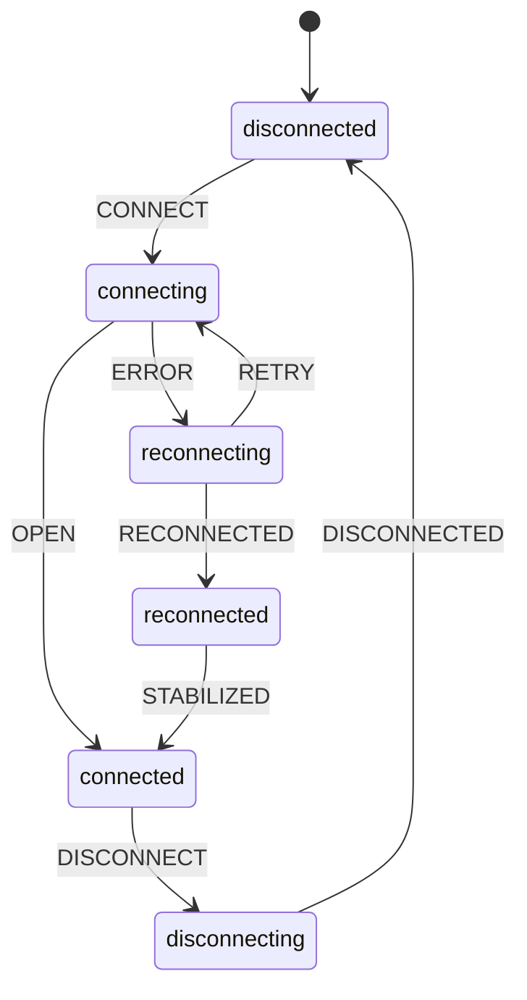

# WebSocket Client: System Context Level Design

> **Scope:**  
> At the **System Context** level, we focus on the **highest-level boundaries** of the WebSocket Client system. This document clarifies how external actors (servers, applications, resources) interact with the client, and how the client’s core sub-modules and interfaces are arranged. Fine-grained implementation details (classes, methods, etc.) will be defined in subsequent design phases.

---

## 1. System Context Diagrams

### 1.1 System Context Overview

**Key Points**  
- **Application Logic (APP)** issues user-level commands (connect, disconnect) and receives status updates or incoming messages.  
- **WebSocket Protocol Handler (WPH)** handles low-level protocol details and frames to/from the **WebSocket Server (WS)**.  
- **State Management (SM)** tracks and enforces formal state machine transitions.  
- **Connection Management (CM)** orchestrates connecting/disconnecting logic, possibly scheduling retries.  
- **Message Processing (MP)** processes and routes messages, linking them back to the application.

### 1.2 Information Flow

**Key Points**  
- **Input Flows**: Connection instructions (CI) and messages (MI) typically come from the Application Logic; server inputs (SI) come from the WebSocket Server.  
- **Processing**: CM handles connections, MP handles messages, SM handles overall state transitions.  
- **Output Flows**: Outgoing messages to the server (SO), processed messages to the app (MO), and status updates (ST) all represent the system’s outputs.

### 1.3 State Management View

**Key Points**  
- Reflects a **typical** WebSocket Client life cycle.  
- Corresponds to the formal definitions in `machine.md`/`websocket.md`.  
- Certain events (CONNECT, OPEN, ERROR, DISCONNECT) cause transitions that align with the **Core State Machine** logic.

---

## 2. System Boundaries \((B)\)

### 2.1 Core System

\[
\begin{aligned}
B_{\text{core}} = \{\, &\text{WebSocket Protocol Handler},\\
                   &\text{State Management},\\
                   &\text{Connection Management},\\
                   &\text{Message Processing}\,\}
\end{aligned}
\]

These are **internal** modules that collectively implement the WebSocket Client’s functionality. They directly use or reference the **formal specs** from `machine.md` and `websocket.md`.

### 2.2 External Dependencies

\[
\begin{aligned}
B_{\text{ext}} = \{\, &\text{WebSocket Server},\\
                   &\text{Application Logic},\\
                   &\text{System Resources}\,\}
\end{aligned}
\]

- **WebSocket Server**: Provides the endpoint to which we connect.  
- **Application Logic**: Issues commands and consumes messages or status updates.  
- **System Resources**: Might include OS timers, environment variables, or external libraries like `ws` and `xstate v5`.

---

## 3. External Interfaces \((I)\)

### 3.1 Connection Interface

\[
I_{\text{conn}} = 
\begin{cases}
\text{connect}(url: \text{URL}) \rightarrow \text{Promise<void>} \\
\text{disconnect}() \rightarrow \text{Promise<void>} \\
\text{getStatus}() \rightarrow \text{ConnectionStatus}
\end{cases}
\]

- **connect(url)**: Enters `connecting` state if not already connected.  
- **disconnect()**: Transitions to `disconnecting` state if in a connected state.  
- **getStatus()**: Returns a simple enumeration or object representing the **formal** state (`disconnected`, `connected`, etc.).

### 3.2 Message Interface

\[
I_{\text{msg}} = 
\begin{cases}
\text{send}(data: \text{MessageData}) \rightarrow \text{Promise<void>} \\
\text{onMessage}(\text{handler: Handler}) \rightarrow \text{void} \\
\text{onError}(\text{handler: Handler}) \rightarrow \text{void}
\end{cases}
\]

- **send(data)**: Enqueues or directly transmits a message, depending on the current state.  
- **onMessage(handler)**: Registers a callback invoked upon receiving **valid** messages from the server.  
- **onError(handler)**: Registers a callback for asynchronous errors (connection issues, protocol violations, etc.).

### 3.3 Control Interface

\[
I_{\text{ctrl}} = 
\begin{cases}
\text{configure}(\text{options: Config}) \rightarrow \text{void} \\
\text{health}() \rightarrow \text{HealthStatus} \\
\text{reset}() \rightarrow \text{Promise<void>}
\end{cases}
\]

- **configure(options)**: Adjusts parameters like `MAX_RETRIES`, timeouts, or queue size at runtime.  
- **health()**: Provides a quick snapshot of the client’s health (could measure internal stats or check state machine integrity).  
- **reset()**: Resets internal counters, caches, or queues, possibly returning to a “clean” state.

---

## 4. Property Mappings \((\Phi)\)

### 4.1 State Property Mapping

\[
\Phi_{\text{state}}: S \rightarrow \text{ConnectionStatus} =
\begin{cases}
\text{disconnected} \mapsto \text{CLOSED} \\
\text{connecting} \mapsto \text{CONNECTING} \\
\text{connected} \mapsto \text{OPEN} \\
\text{disconnecting} \mapsto \text{CLOSING} \\
\text{reconnecting} \mapsto \text{RECONNECTING} \\
\text{reconnected} \mapsto \text{STABILIZING}
\end{cases}
\]

This **explicit** mapping ensures that any user-facing status or enumerations reflect the formal states from `machine.md`/`websocket.md`.

### 4.2 Safety Properties

\[
\Phi_{\text{safety}} = \{
\,\text{single active connection},
\,\text{valid state transitions},
\,\text{message ordering},
\,\text{resource cleanup}\,\}
\]

Examples include:

- **Single active connection**: The client must never hold two open sockets at once.  
- **Valid transitions**: The system does not jump from `disconnected` to `connected` without passing through `connecting`.  
- **Message ordering**: Messages in the queue must preserve FIFO order.  
- **Resource cleanup**: Ensure timers and memory buffers are released on disconnect.

### 4.3 Liveness Properties

\[
\Phi_{\text{liveness}} = \{
\,\text{connection progress},
\,\text{message delivery},
\,\text{reconnection attempts},
\,\text{error recovery}\,\}
\]

Examples include:

- **Connection progress**: `connecting` eventually reaches `connected` or fails.  
- **Message delivery**: Queued messages get delivered once reconnected or else are discarded in a known final state.  
- **Reconnection**: On certain errors, client transitions to `reconnecting` up to `MAX_RETRIES`.  
- **Error recovery**: After ephemeral errors, normal operation can resume or gracefully fail.

---

## 5. Resource Constraints \((R)\)

### 5.1 Connection Resources

\[
R_{\text{conn}} =
\begin{cases}
\text{MAX\_RETRIES} &= 5 \\
\text{CONNECT\_TIMEOUT} &= 30000\,\text{ms} \\
\text{DISCONNECT\_TIMEOUT} &= 3000\,\text{ms} \\
\text{STABILITY\_TIMEOUT} &= 5000\,\text{ms}
\end{cases}
\]

- A maximum of **5** reconnection attempts.  
- **Connect** must succeed (or fail) within **30 seconds**.  
- **Disconnect** must complete within **3 seconds**.  
- “Stabilizing” reconnection must not exceed **5 seconds**.

### 5.2 Message Resources

\[
R_{\text{msg}} =
\begin{cases}
\text{MAX\_MESSAGE\_SIZE} &= 1\,\text{MB} \\
\text{MAX\_QUEUE\_SIZE} &= 1000 \\
\text{RATE\_LIMIT} &= 100\,/\,\text{sec}
\end{cases}
\]

- **Messages** exceeding 1 MB are rejected or split.  
- Message **queue** cannot hold more than 1000 entries.  
- A **rate limit** of 100 messages/second ensures no spam or flood occurs.

### 5.3 Memory Resources

\[
R_{\text{mem}} =
\begin{cases}
\text{MAX\_BUFFER\_SIZE} &= 16\,\text{MB} \\
\text{MAX\_LISTENERS} &= 10
\end{cases}
\]

- Internal buffers must not exceed **16 MB** in total usage.  
- **Up to 10** event listeners (e.g., `onMessage`, `onError`, etc.) can be attached to the client without performance degradation.

---

## 6. Validation Criteria

### 6.1 Property Validation

For each property \(p \in \Phi\):

\[
valid(p) \iff
\begin{cases}
mapped(p) &:\text{ a formal mapping from specs to design} \\
verified(p) &:\text{ the property can be proven or tested} \\
stable(p) &:\text{ minimal impact of changes on }p
\end{cases}
\]

- **mapped(p)** ensures every property from the formal specs (safety, liveness) corresponds to a real mechanism in the design.  
- **verified(p)** might involve tests or code instrumentation.  
- **stable(p)** checks whether a small modification in the design threatens the property.

### 6.2 Resource Validation

For each resource \(r \in R\):

\[
valid(r) \iff
\begin{cases}
bounded(r) &:\text{ }r\leq \text{limit}(r) \\
measurable(r) &:\text{ can be monitored or tracked} \\
adjustable(r) &:\text{ can be reconfigured if needed}
\end{cases}
\]

- **bounded(r)**: The system enforces `MAX_RETRIES`, `MAX_QUEUE_SIZE`, etc.  
- **measurable(r)**: We can gather metrics or logs to confirm usage.  
- **adjustable(r)**: Some resource limits can be set at runtime via `configure(options)`.

### 6.3 Interface Validation

For each interface \(i \in I\):

\[
valid(i) \iff
\begin{cases}
complete(i) &:\text{ covers all standard use cases} \\
minimal(i) &:\text{ no excess or redundant methods} \\
stable(i) &:\text{ minor changes don't break compatibility}
\end{cases}
\]

- **complete(i)**: For example, `I_{conn}` covers every step needed to manage connections.  
- **minimal(i)**: We do not add extraneous methods.  
- **stable(i)**: If we rename an internal method, external consumers should not be broken.

---

## 7. Change Impact Analysis

### 7.1 Change Sensitivity

For boundary changes \(c\) to \(B\):

\[
\Delta(c) \leq \epsilon,\text{ where }\epsilon\text{ is the stability threshold}
\]

In other words, adjusting what belongs inside/outside the core system should have minimal ripple effects if we maintain **clear** interface boundaries.

### 7.2 Interface Stability

For an interface change \(i\):

\[
impact(i) \subseteq \text{local scope}
\]

When an interface evolves, only local code depending on that interface should be affected, not the entire system.

### 7.3 Property Preservation

For any modification \(m\):

\[
\forall p \in \Phi:\ preserve(p)\text{ after }m
\]

All safety and liveness properties from the formal specs must remain intact after changes—meaning the client still respects **single active connection**, **message ordering**, etc.

---

## Conclusion

This **System Context Level** design outlines:

1. **Boundaries** \((B)\): The internal modules (Protocol Handler, State Management, etc.) versus external actors (WebSocket Server, Application Logic, System Resources).  
2. **Interfaces** \((I)\): How connections, messages, and control are requested and handled, matching the formal specs.  
3. **Property Mappings** \((\Phi)\): Safety and liveness constraints from the state machine are anchored in real interfaces and statuses.  
4. **Resource Constraints** \((R)\): Hard limits (e.g., timeouts, queue sizes) ensuring feasibility and preventing overload.  
5. **Validation & Change Impact**: A framework for confirming correctness and stability under future modifications.

This provides a **high-level** yet **comprehensive** view of how the WebSocket Client system fits into its environment and upholds its formal requirements. Subsequent design levels (Container, Component, Class) will refine **how** each sub-module implements these details, culminating in a minimal, workable design aligned with `machine.md` and `websocket.md`.