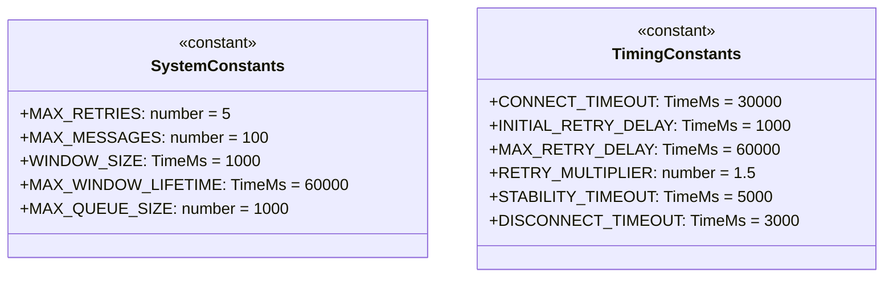
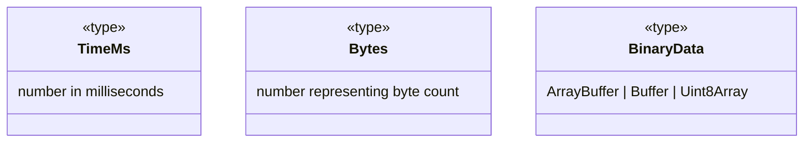
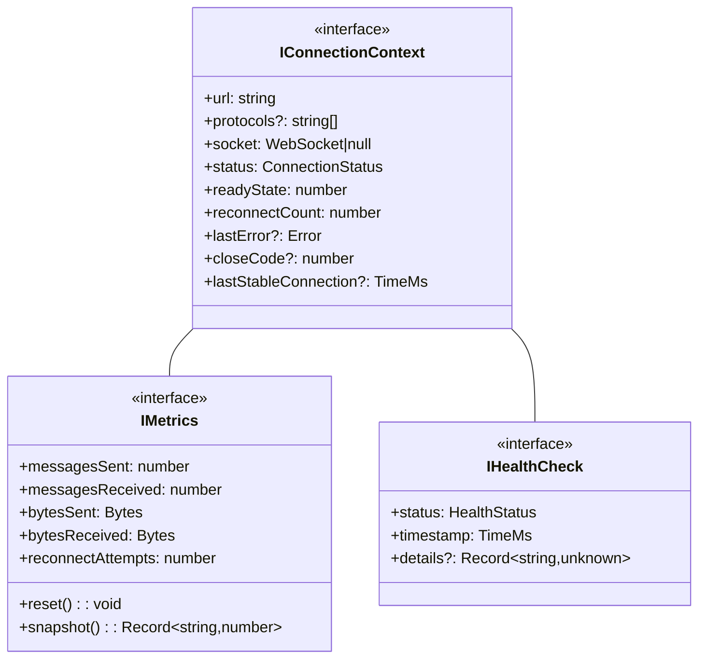

# common.types.md

## Overview

Core type definitions for WebSocket Client system, defining fundamental types referenced across all components.

## 1. System Constants

_Reference: `machine.md` §1.1 System Constants_

## 2. Basic Types

## 3. Core Interfaces

_Reference: Context structure from `machine.md` §2.3_

## 4. Dependencies

- Does not depend on other type definitions
- Used by:
  - `events.types.md` for event payloads
  - `states.types.md` for state context
  - `errors.types.md` for error context

## 5. Type Requirements

1. All time values must use `TimeMs` type
2. All size values must use `Bytes` type
3. Binary data must use `BinaryData` type
4. Constants must be immutable (`readonly`)
