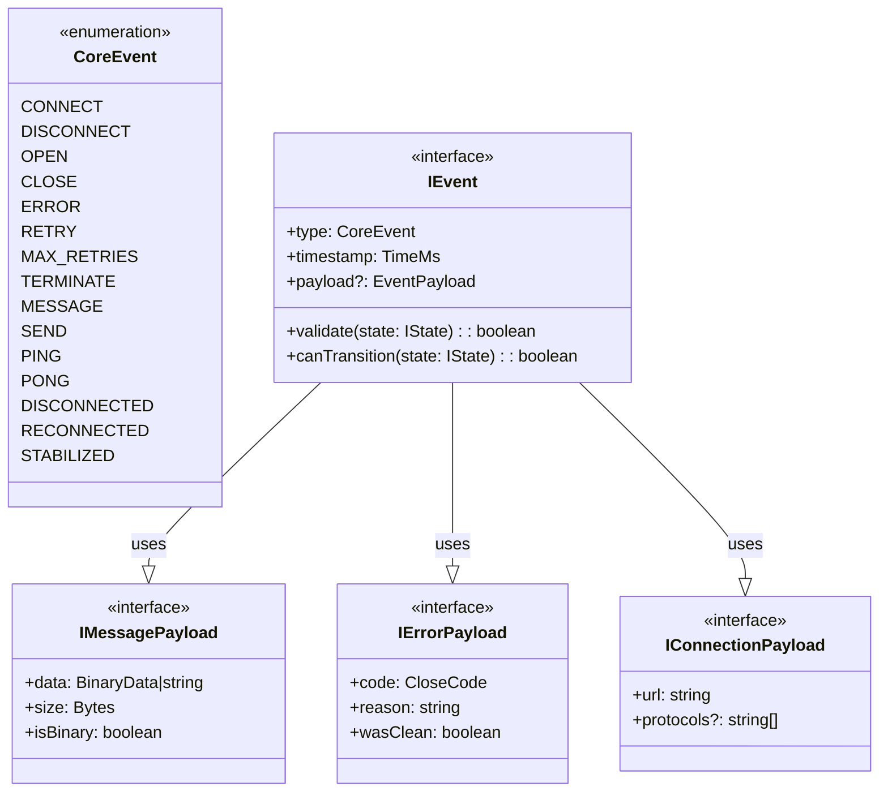
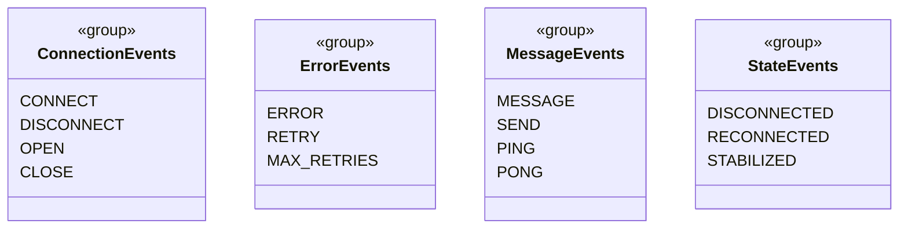

# events.types.md

## Overview

Event type system for WebSocket Client, implementing core events from `machine.md` §2.2 and WebSocket-specific events from `websocket.md` §1.3.

## 1. Event Type Hierarchy

_Reference: Event definitions from `machine.md` §2.2_

## 2. Event Groups

_Reference: Event categorization aligned with `websocket.md` §1.3_

## 3. Dependencies

- Types (`TimeMs`, `Bytes`, `BinaryData`) from `common.types.md`
- `CloseCode` from `errors.types.md`
- `IState` from `states.types.md`

## 4. Validation Rules

1. Events must be valid for current state (state machine rules)
2. Payloads must match event types
3. Binary messages must include size
4. Error events must include valid close codes
5. Connection events require valid URLs

_Reference: State transition rules from `machine.md` §2.5_
