# WebSocket Client DSL Architecture Summary

This document provides a comprehensive overview of the Domain-Specific Language (DSL) hierarchy implemented across the WebSocket client's architectural levels, from context through components. Each level's DSL defines specific protocols and patterns for communication, resource management, and state handling.

## 1. DSL Hierarchy Overview

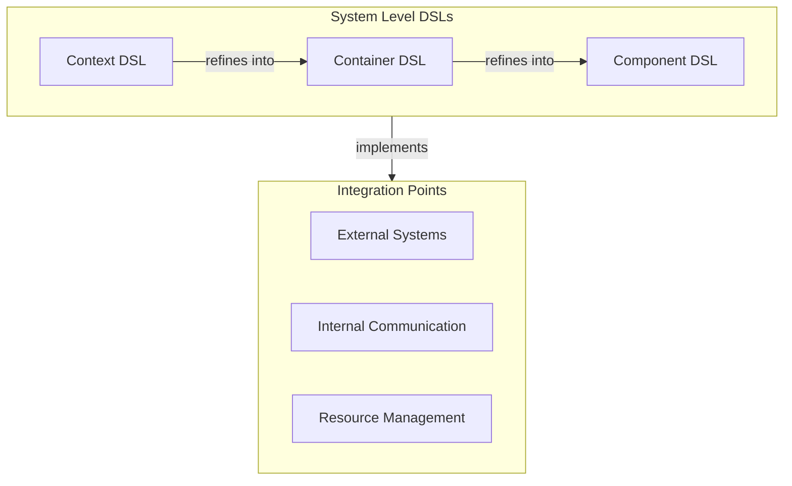

## 2. Context Level DSL

The Context Level DSL defines system boundaries and external communication protocols.

### 2.1 External Communication Patterns

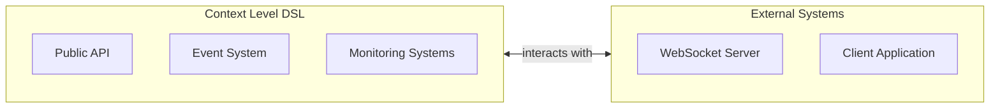

### 2.2 Resource Management

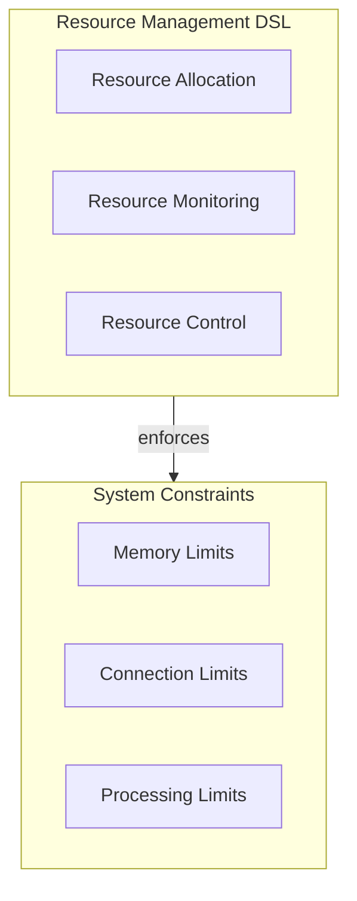

## 3. Container Level DSL

The Container Level DSL manages communication between major system components.

### 3.1 Container Communication

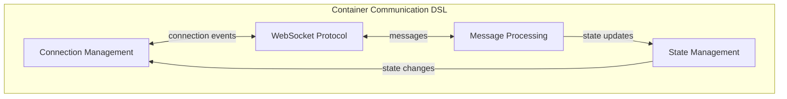

### 3.2 State Management

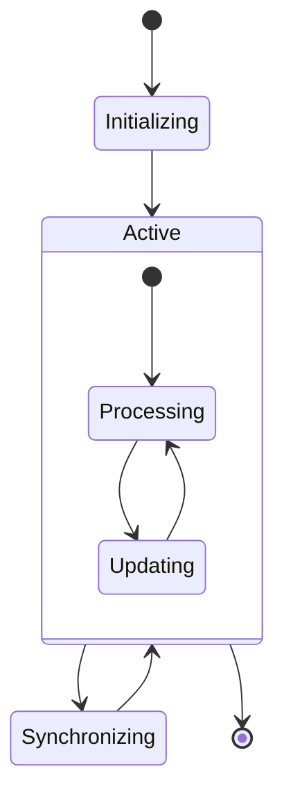

## 4. Component Level DSL

The Component Level DSL defines interaction patterns between components within containers.

### 4.1 Component Interaction

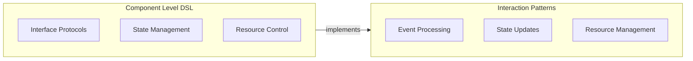

### 4.2 Resource Flow

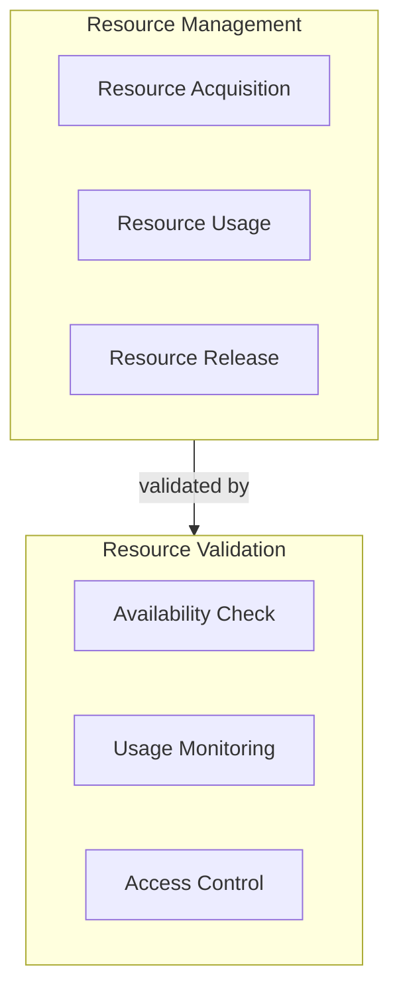

## 5. Integration Patterns

### 5.1 Vertical Integration

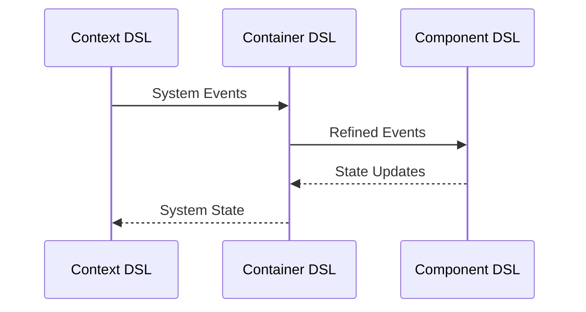

### 5.2 Horizontal Integration

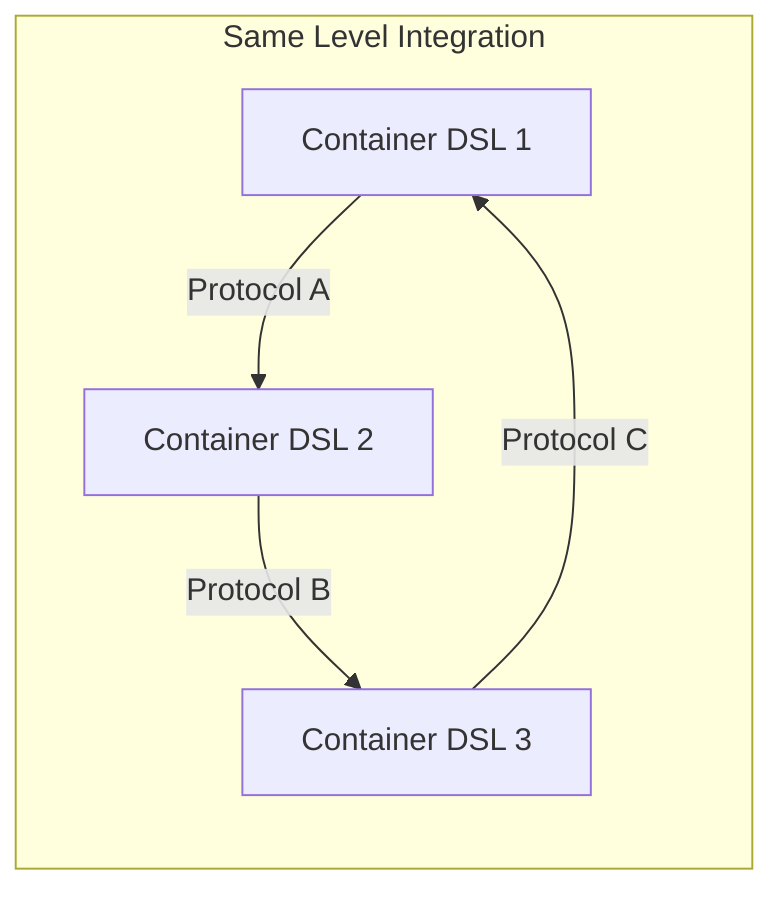

## 6. Implementation Guidelines

The DSL hierarchy implementation should follow these key principles:

### 6.1 State Management

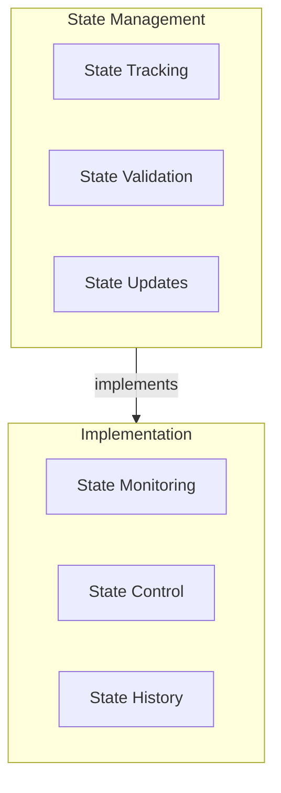

### 6.2 Resource Control

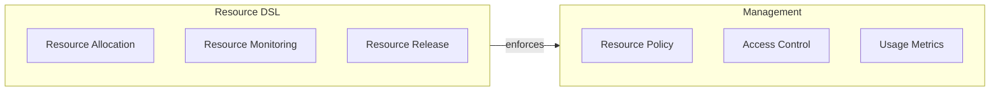

## 7. Quality Assurance

Each DSL level must maintain specific quality attributes:

### 7.1 Performance Monitoring

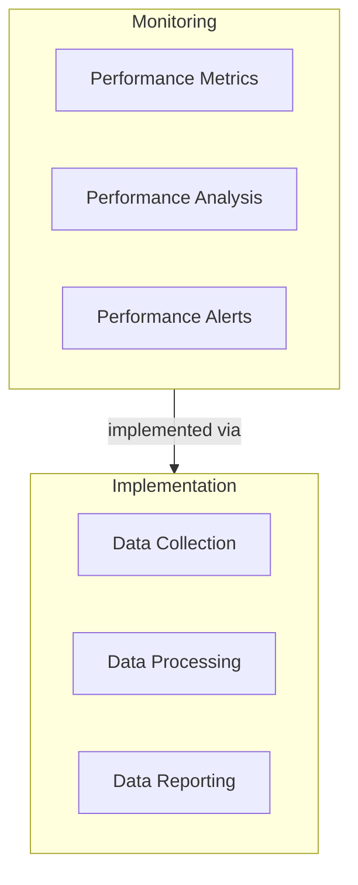

### 7.2 Reliability Assurance

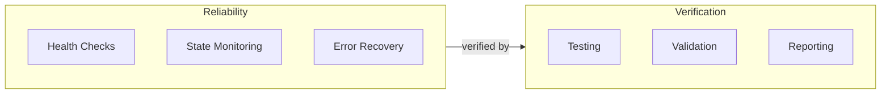

## 8. Evolution Strategy

The DSL architecture supports system evolution through:

### 8.1 Version Management

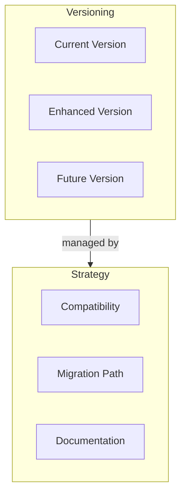

### 8.2 Change Management

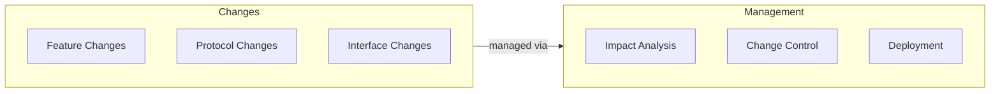

## 9. Summary

This DSL architecture provides:

1. Clear separation of concerns across architectural levels
2. Well-defined communication patterns within and between levels
3. Comprehensive resource management strategies
4. Strong support for system evolution
5. Built-in quality assurance mechanisms

Each level's DSL builds upon and refines the concepts established at higher levels, ensuring consistent and maintainable system behavior while supporting robust implementation practices.
