# WebSocket Client Component Interfaces and Testing Specification

## 1. Component Interface Design

This specification defines the interfaces and testing strategies for the WebSocket Client components, ensuring alignment with the formal specifications and architectural requirements.

### 1.1 Interface Design Principles

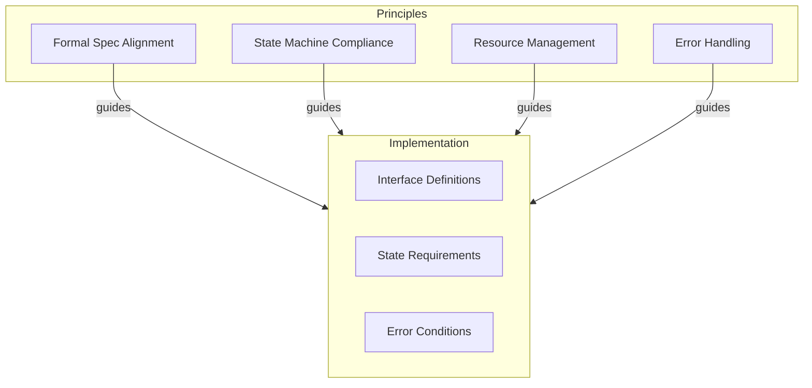

Each component interface must align with these principles to maintain system integrity:

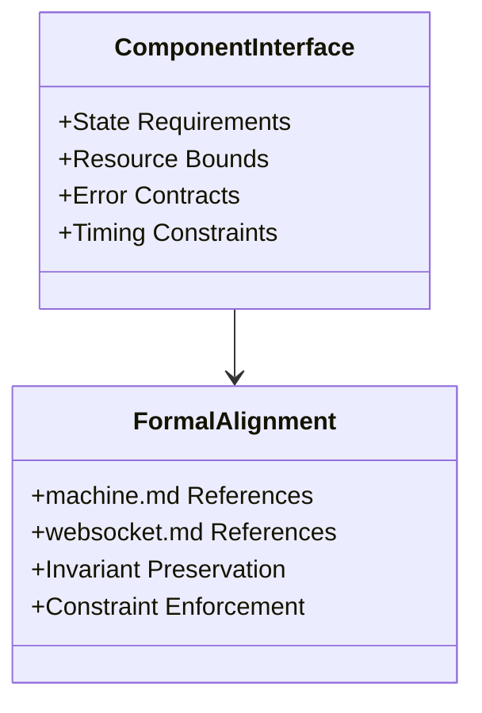

### 1.2 Component Dependencies

The dependency graph shows initialization and cleanup order:

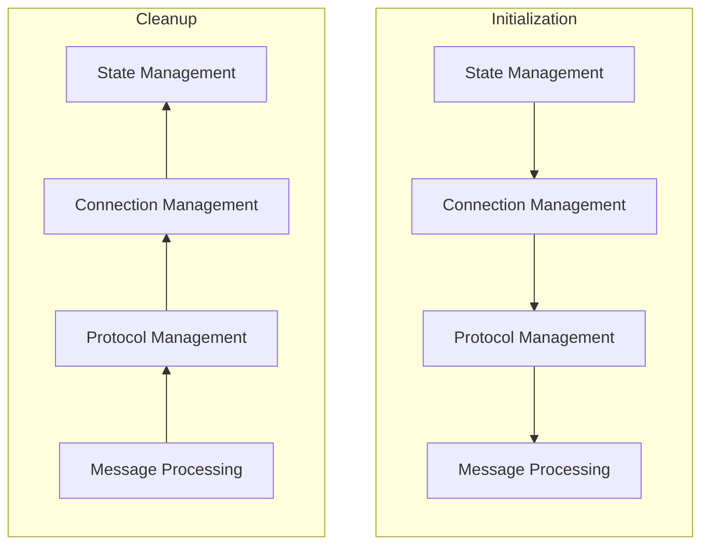

## 2. Testing Strategy

### 2.1 Unit Testing Framework

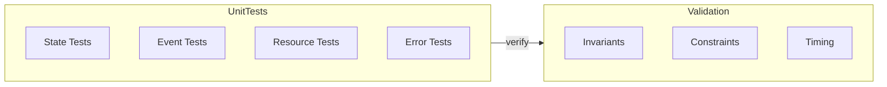

The unit testing framework validates component behavior against formal specifications:

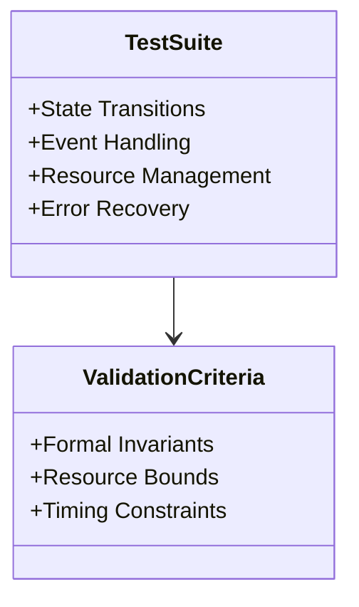

### 2.2 Integration Testing Approach

Integration tests verify component interactions:

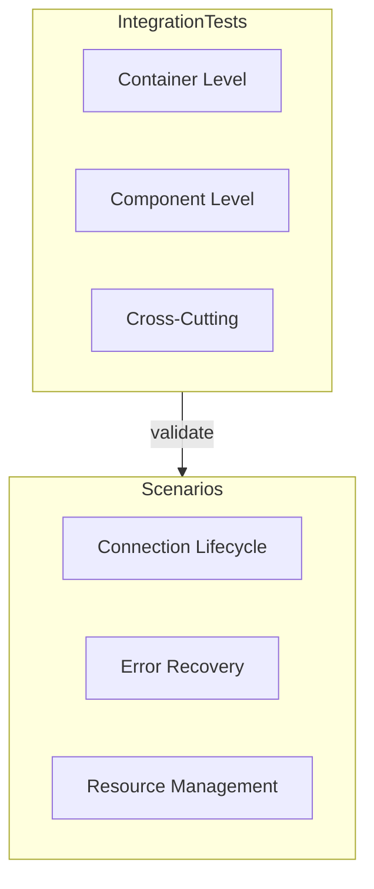

### 2.3 Performance Testing

Performance tests ensure system meets timing constraints:

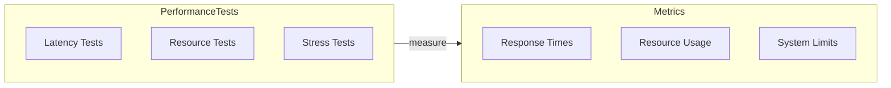

## 3. Interface Specifications

### 3.1 Connection Management Interfaces

The Connection Management Container exposes these interfaces:

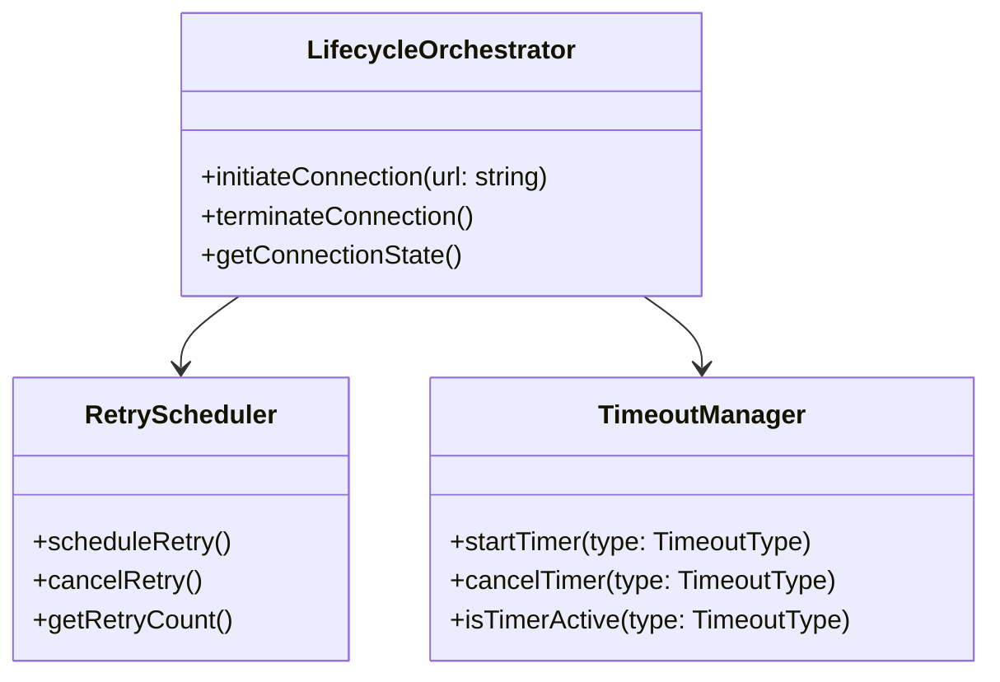

### 3.2 Protocol Management Interfaces

The WebSocket Protocol Container defines these interfaces:

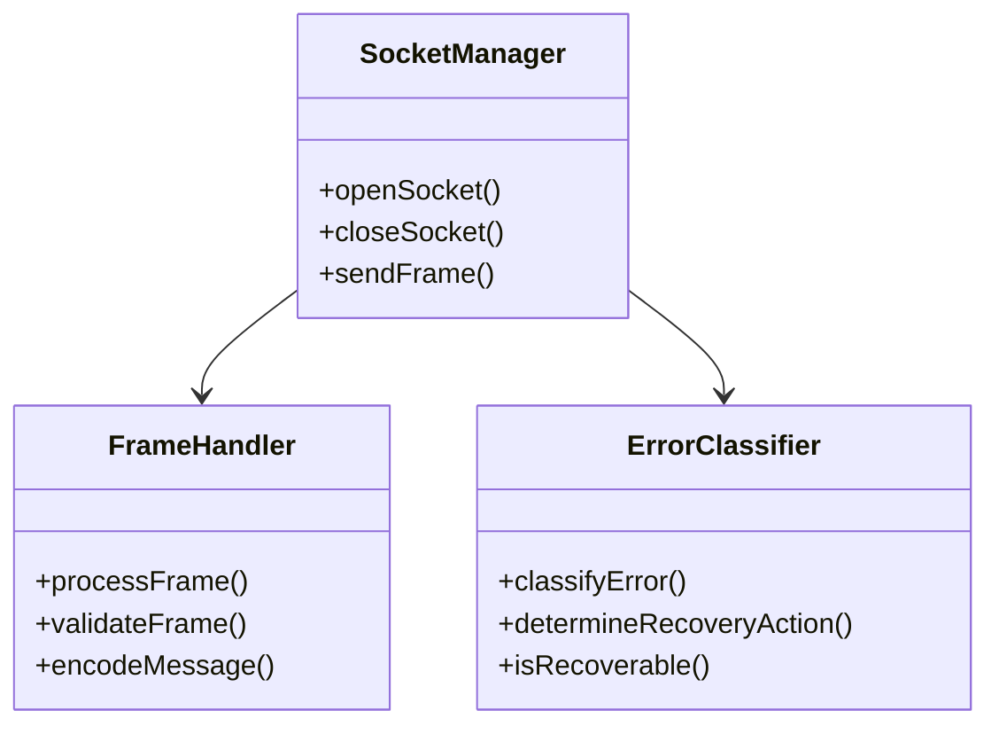

### 3.3 Message Processing Interfaces

The Message Processing Container exposes these interfaces:

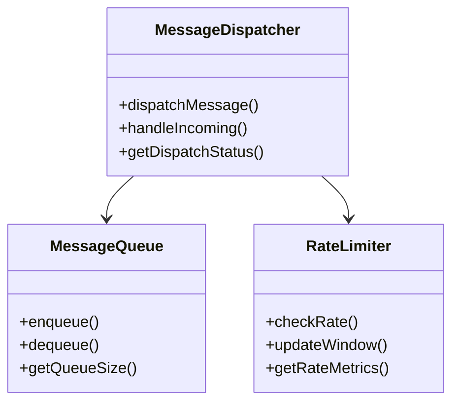

## 4. Component State Requirements

### 4.1 State Validation

Each component must validate its state against formal requirements:

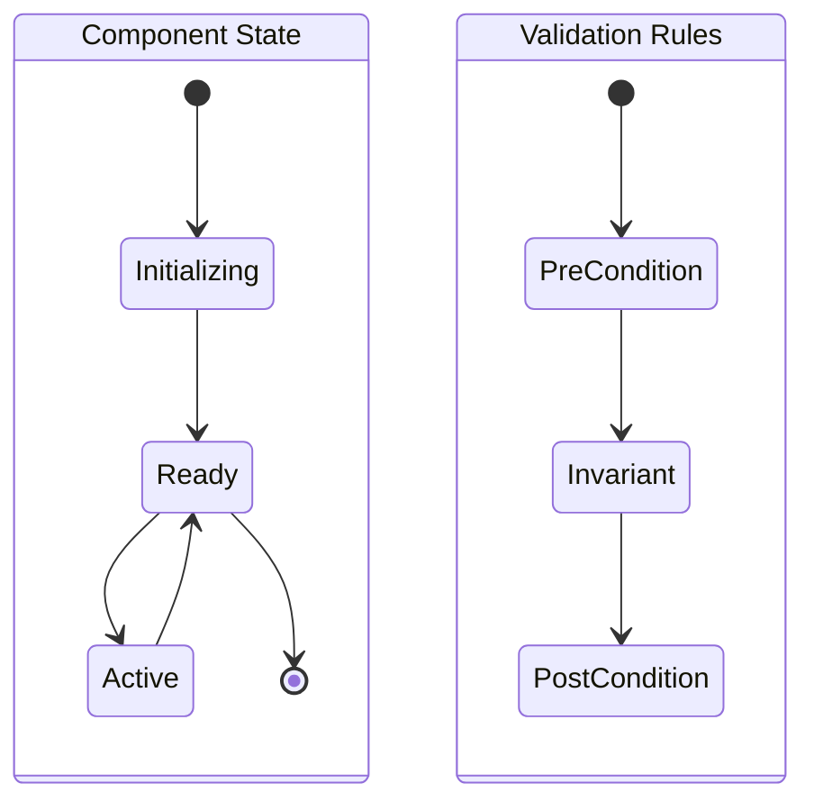

### 4.2 Resource Management

Components must manage resources within defined bounds:

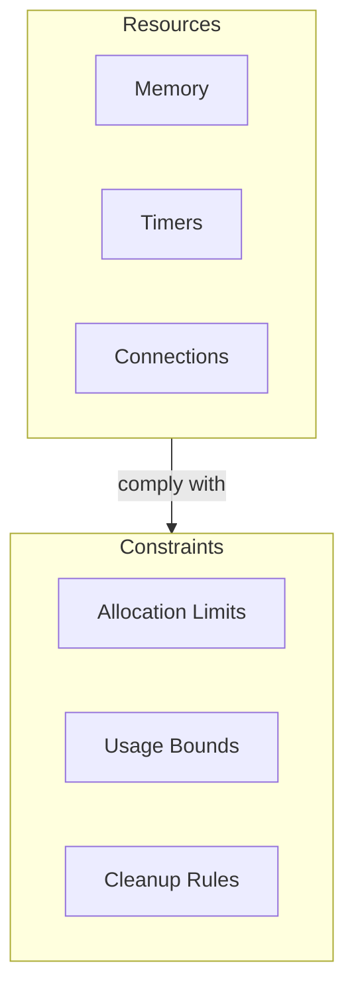

## 5. Implementation Checklist

### 5.1 Component Implementation

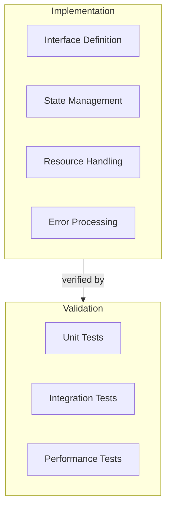

### 5.2 Quality Gates

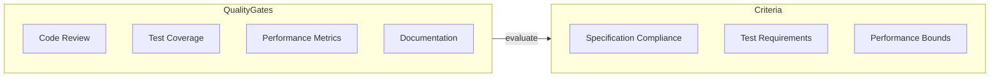

## 6. Next Steps

The implementation should proceed in this order:

1. Interface Implementation

   - Define concrete interfaces
   - Implement state management
   - Add resource handling

2. Testing Infrastructure

   - Create test framework
   - Implement test suites
   - Set up CI/CD pipeline

3. Integration Points

   - Implement component communication
   - Add monitoring hooks
   - Enable tracing

4. Documentation
   - API documentation
   - Integration guides
   - Deployment procedures
