# WebSocket Client Component Design Specification

## Component Architecture Overview

This specification details the internal component architecture for the WebSocket client system, expanding upon the container-level design. Each component's design directly implements requirements from the formal specifications while maintaining clear boundaries and responsibilities.

## 1. Connection Management Components

### 1.1 Lifecycle Orchestrator

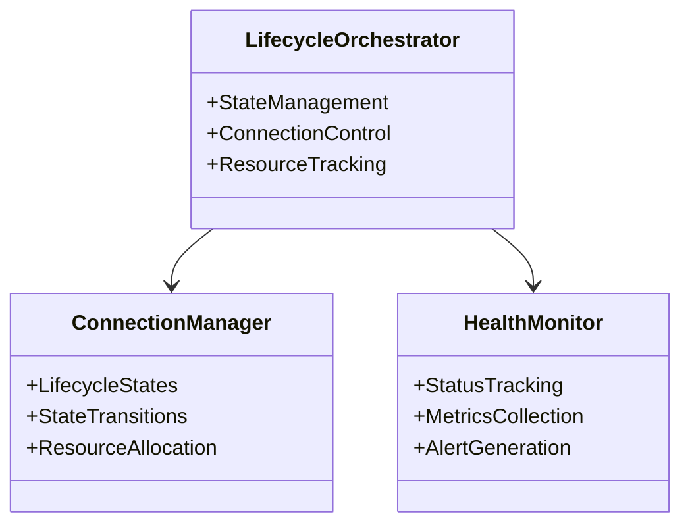

The Lifecycle Orchestrator implements connection state management as defined in `machine.md` §2.1. Its subcomponents handle distinct aspects of connection lifecycle:

**Connection Manager** enforces state transition rules specified in `machine.md` §2.5, ensuring:
- Valid state sequencing
- Resource allocation timing
- Transition safety properties

**Health Monitor** implements the health check infrastructure defined in `websocket.md` §1.6, providing:
- Connection stability tracking
- Performance metrics collection
- Health status reporting

### 1.2 Retry Scheduler

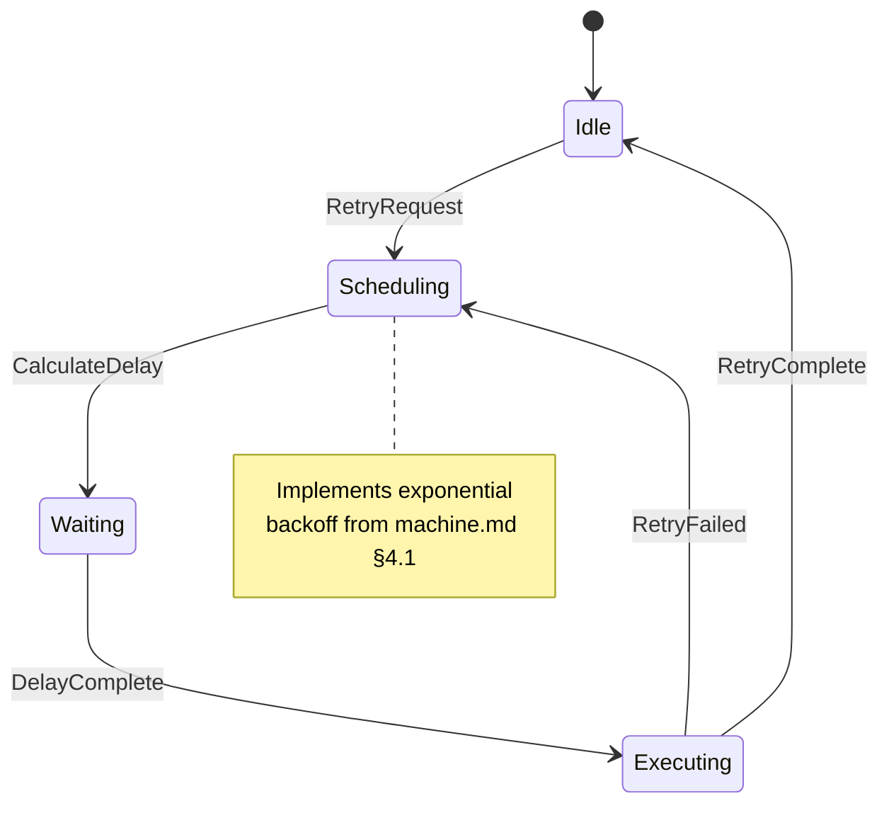

The Retry Scheduler implements the retry logic specified in `machine.md` §4.1 and `websocket.md` §1.3, managing:
- Retry attempt tracking
- Backoff delay calculation
- Retry limit enforcement

### 1.3 Timeout Manager

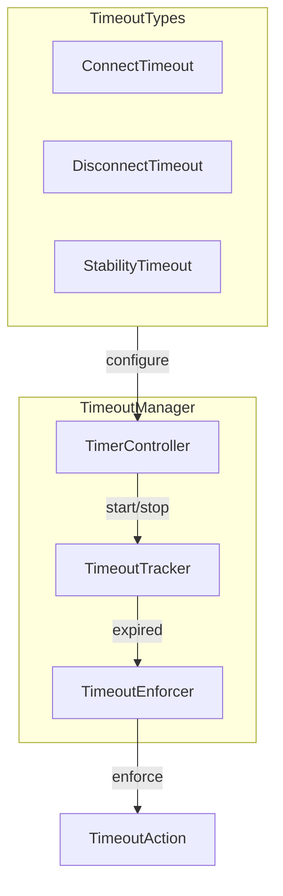

The Timeout Manager enforces timing constraints from `machine.md` §4.1, providing:
- Coordinated timeout tracking
- Multiple timeout type support
- Timeout action enforcement

## 2. WebSocket Protocol Components

### 2.1 Socket Manager

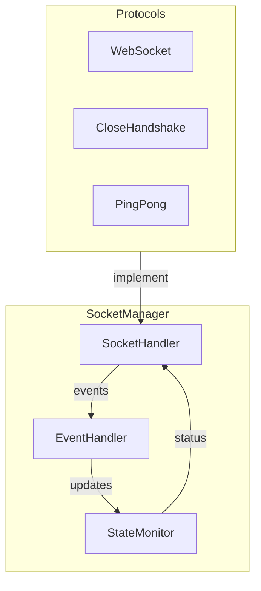

The Socket Manager implements the WebSocket protocol handling specified in `websocket.md` §1.2, managing:
- Protocol state transitions
- Event propagation
- Connection monitoring

### 2.2 Frame Handler

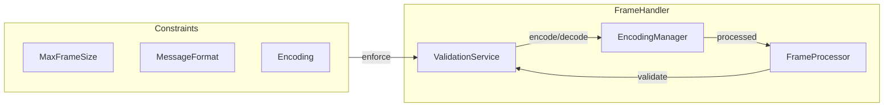

The Frame Handler implements frame processing requirements from `websocket.md` §1.7, ensuring:
- Frame size validation
- Message format compliance
- Encoding consistency

### 2.3 Error Classifier

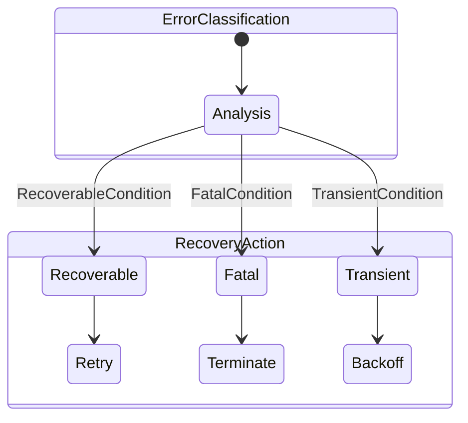

The Error Classifier implements error handling specified in `websocket.md` §1.11, providing:
- Error categorization
- Recovery strategy selection
- Error state management

## 3. Message Processing Components

### 3.1 Message Queue

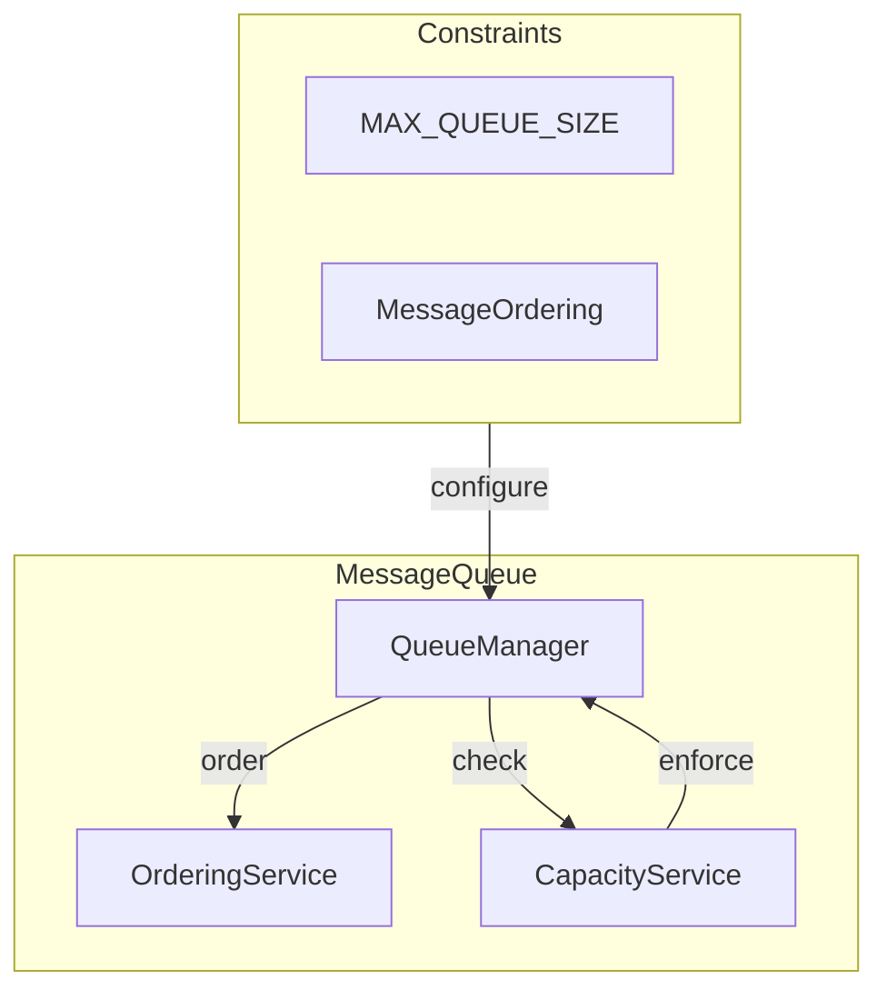

The Message Queue implements queue properties from `machine.md` §2.7, ensuring:
- FIFO message ordering
- Capacity management
- Message persistence

### 3.2 Rate Limiter

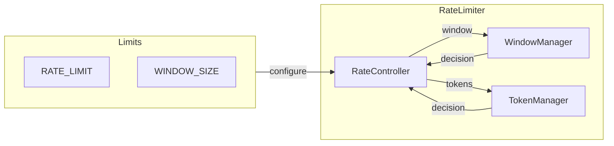

The Rate Limiter implements rate limiting properties from `machine.md` §2.8, managing:
- Message rate tracking
- Window management
- Rate limit enforcement

### 3.3 Message Dispatcher

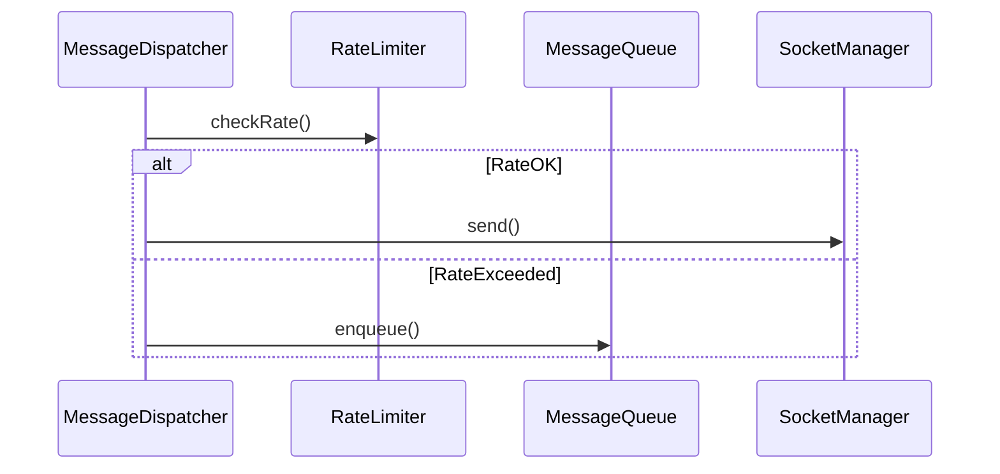

The Message Dispatcher coordinates message handling according to `machine.md` §2.7, providing:
- Message routing
- Rate limit coordination
- Queue management

## 4. State Management Components

### 4.1 State Machine Definition

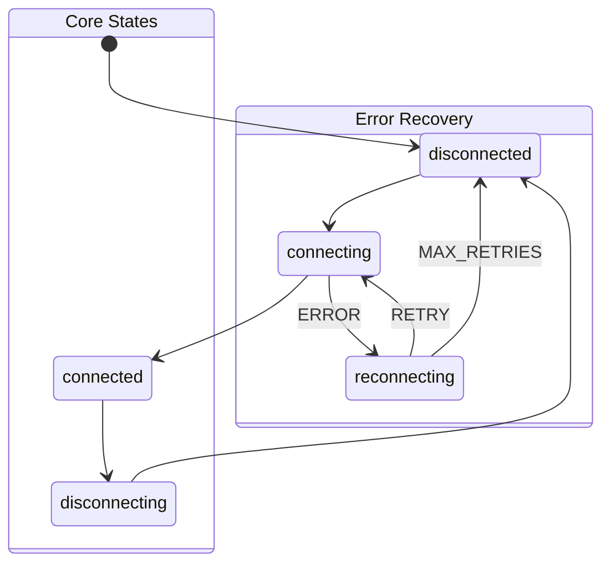

The State Machine Definition implements the formal state machine from `machine.md` §2, defining:
- State transitions
- Event handling
- Guard conditions

### 4.2 Context Manager

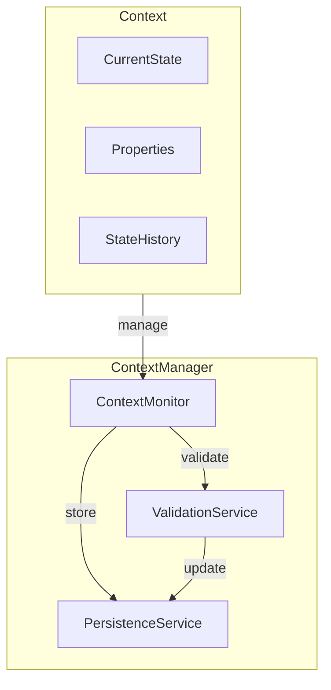

The Context Manager implements context requirements from `machine.md` §2.3, providing:
- Context state tracking
- Property validation
- State history management

### 4.3 Transition Controller

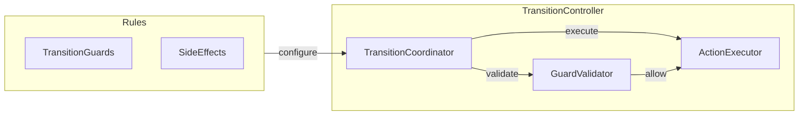

The Transition Controller implements transition logic from `machine.md` §2.5, managing:
- Transition validation
- Guard evaluation
- Action execution

## 5. Cross-Component Integration

### 5.1 Event Flow

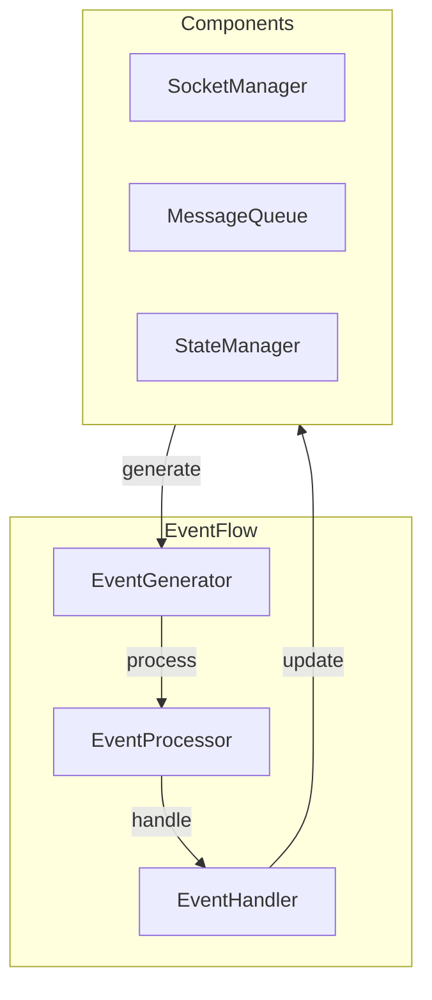

The event flow system coordinates component interactions according to `machine.md` §2.2, ensuring:
- Event ordering
- Component synchronization
- State consistency

### 5.2 Resource Management

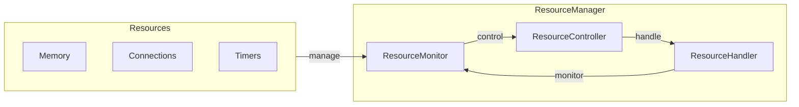

The resource management system implements constraints from both specifications, providing:
- Resource allocation
- Usage monitoring
- Cleanup coordination

## 6. Implementation Guidelines

The component design enforces these key principles:

1. State Integrity
- Each component maintains its internal state
- State changes follow formal transition rules
- Component state aligns with system state

2. Resource Management
- Components respect resource limits
- Resource allocation is coordinated
- Cleanup is guaranteed

3. Error Handling
- Components implement error recovery
- Error propagation follows specification
- Recovery actions are coordinated

4. Performance Considerations
- Components implement efficient operations
- Resource usage is optimized
- System overhead is minimized

## 7. Next Steps

Implementation should proceed with:

1. Component Interface Definition
- Define precise method signatures
- Document state requirements
- Specify error conditions

2. Component Testing Strategy
- Unit test requirements
- Integration test approach
- Performance test criteria

3. Component Dependencies
- Document clear dependencies
- Specify initialization order
- Define cleanup sequence