# WebSocket Client Container Interfaces

## 1. Container Interface Overview

This specification defines the interfaces between containers in the WebSocket Client system, ensuring proper encapsulation and communication while maintaining compliance with formal specifications.

### 1.1 Container Boundaries

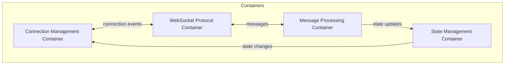

### 1.2 Container Responsibilities

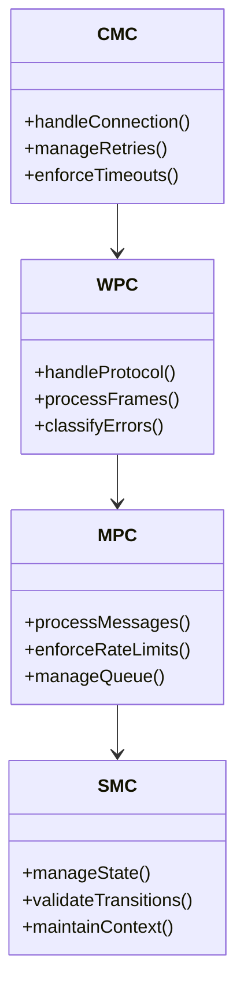

## 2. Inter-Container Communication

### 2.1 Event Flow

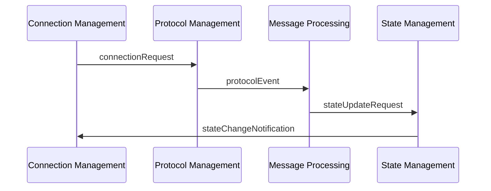

### 2.2 Resource Sharing

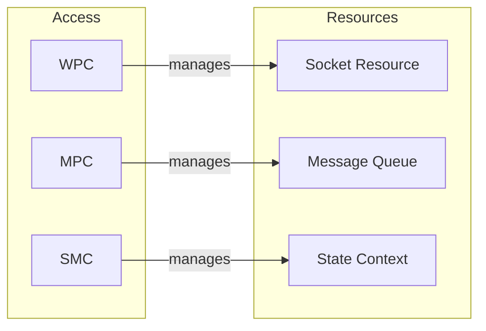

## 3. Container Interface Specifications

### 3.1 Connection Management Interface

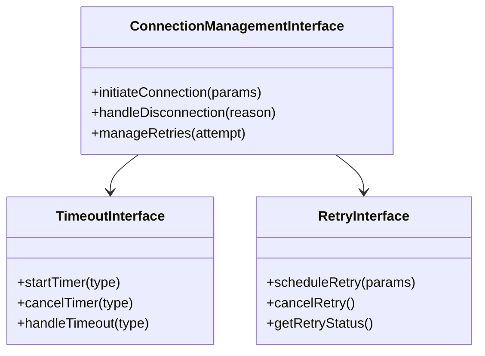

### 3.2 Protocol Management Interface

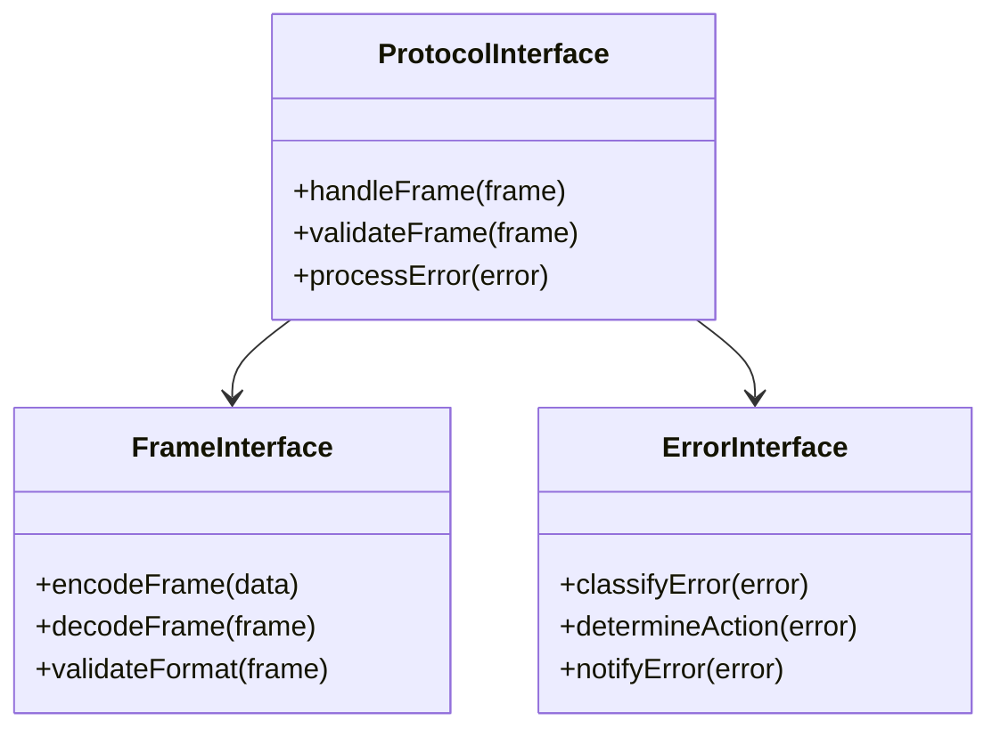

## 4. Container State Management

### 4.1 State Synchronization

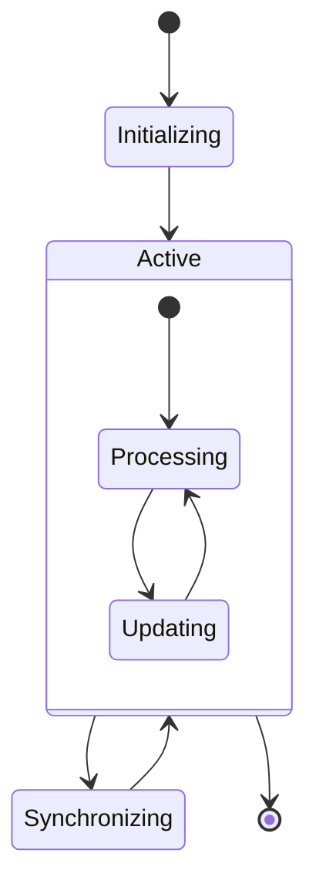

### 4.2 State Validation

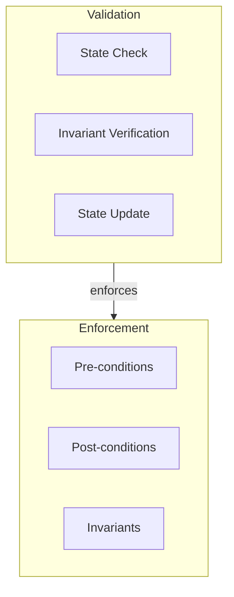

## 5. Resource Management

### 5.1 Resource Allocation

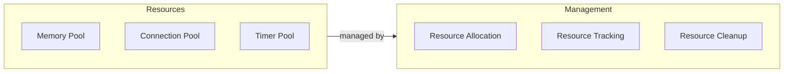

### 5.2 Resource Constraints

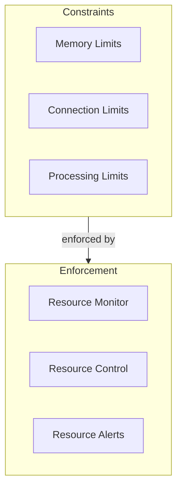

## 6. Error Handling

### 6.1 Error Propagation

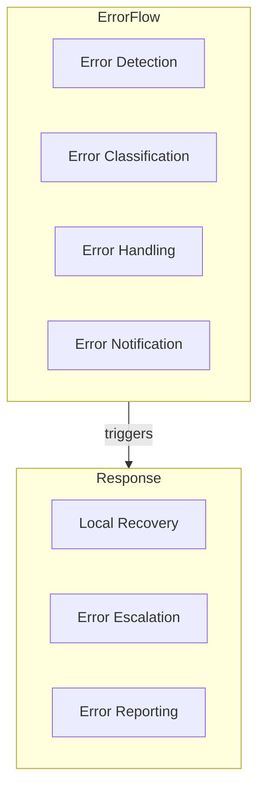

### 6.2 Recovery Strategies

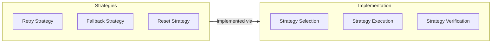

## 7. Container Lifecycle Management

### 7.1 Initialization Sequence

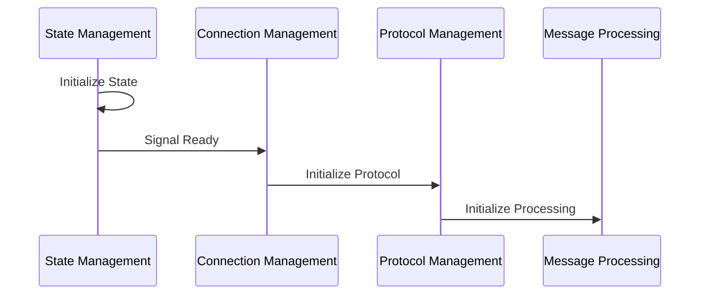

### 7.2 Shutdown Sequence

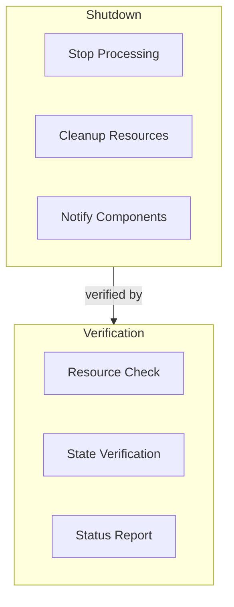

## 8. Monitoring and Metrics

### 8.1 Container Health Monitoring

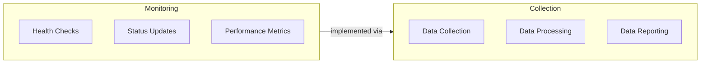

### 8.2 Performance Tracking

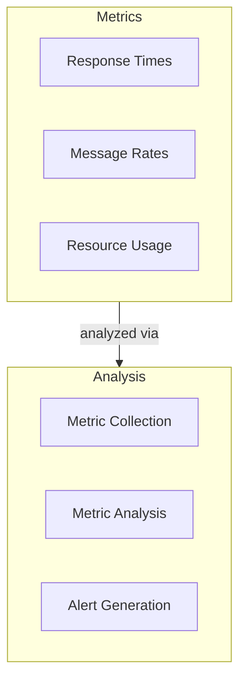

## 9. Implementation Guidelines

### 9.1 Interface Implementation

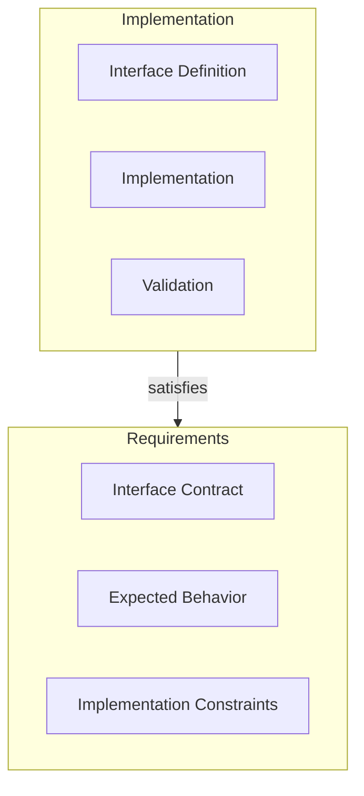

### 9.2 Testing Strategy

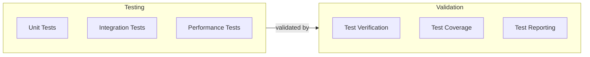
