# WebSocket Client Design Documentation

This document provides comprehensive design specifications for the WebSocket Client system using diagrams, formal spec references, and clear component relationships. It follows a container-first approach, breaking down each major subsystem into its constituent components.

## Table of Contents
1. [Connection Management Container (CMC)](#1-connection-management-container-cmc)
2. [WebSocket Protocol Container (WPC)](#2-websocket-protocol-container-wpc)
3. [Message Processing Container (MPC)](#3-message-processing-container-mpc)
4. [State Management Container (SMC)](#4-state-management-container-smc)
5. [Cross-Container Interactions](#5-cross-container-interactions)

## 1. Connection Management Container (CMC)

### 1.1 Container Structure

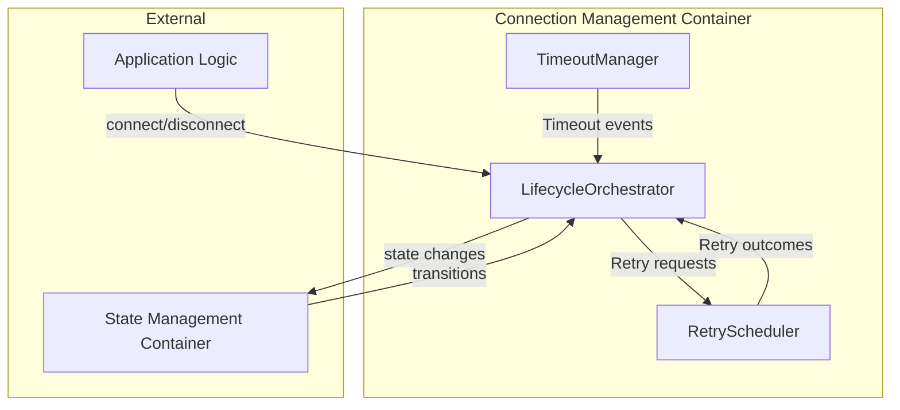

The Connection Management Container orchestrates connection lifecycles according to `machine.md` §2.1. Its structure directly implements the timing constraints specified in `machine.md` §4.1.

### 1.2 Component Relationships

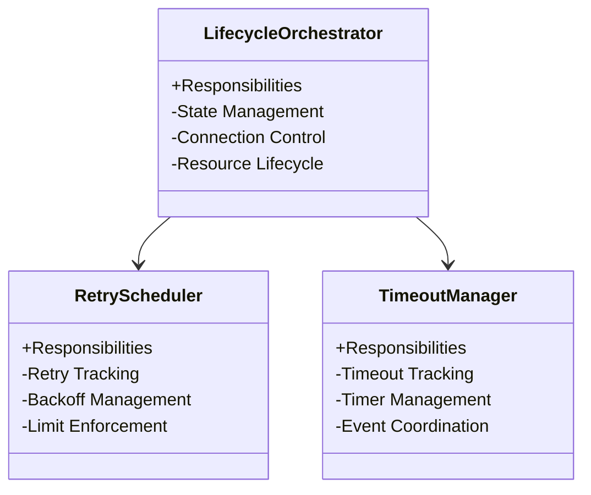

### 1.3 State Flow

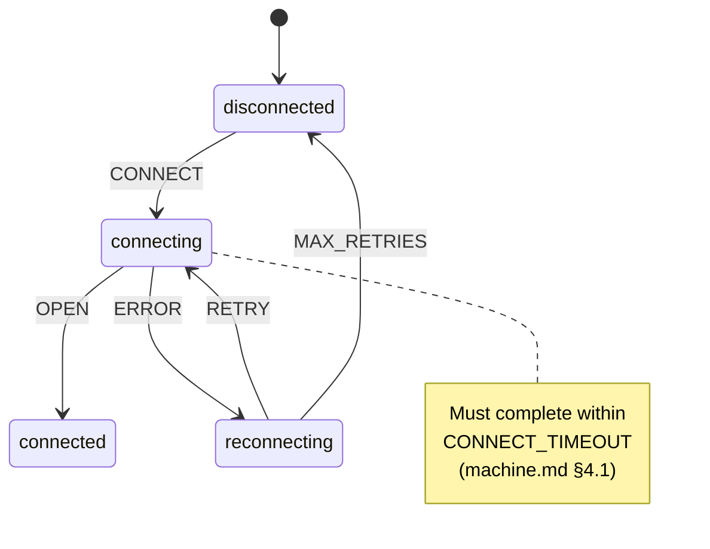

## 2. WebSocket Protocol Container (WPC)

### 2.1 Container Structure

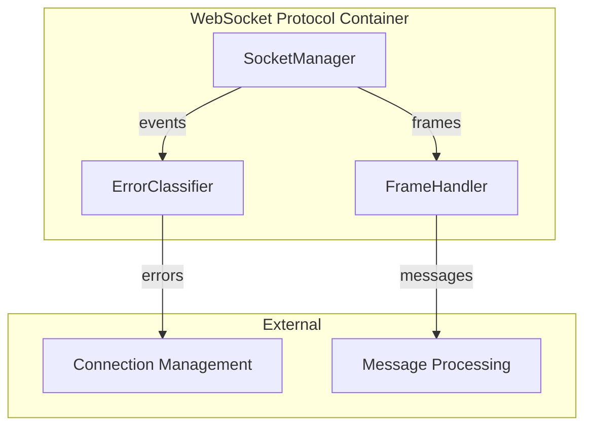

The WebSocket Protocol Container implements the protocol-level specifications from `websocket.md` §1.2 and error classification from `websocket.md` §1.11.

### 2.2 Protocol Flow

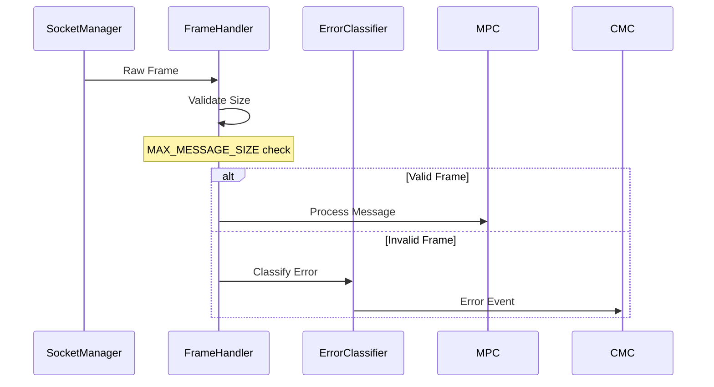

### 2.3 Error Classification

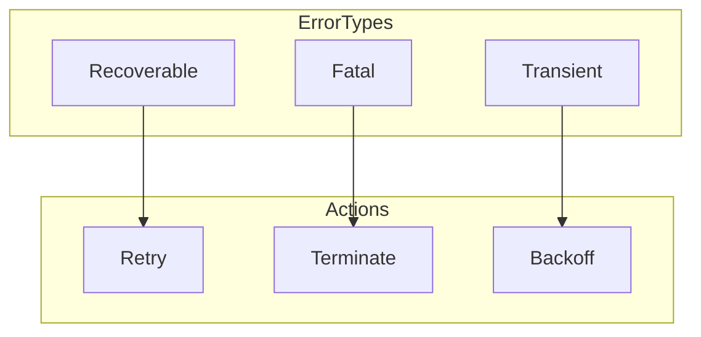

## 3. Message Processing Container (MPC)

### 3.1 Container Structure

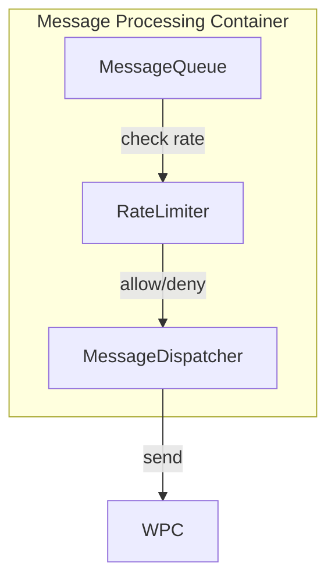

The Message Processing Container implements the queue properties from `machine.md` §2.7 and rate limiting from `machine.md` §2.8.

### 3.2 Message Flow

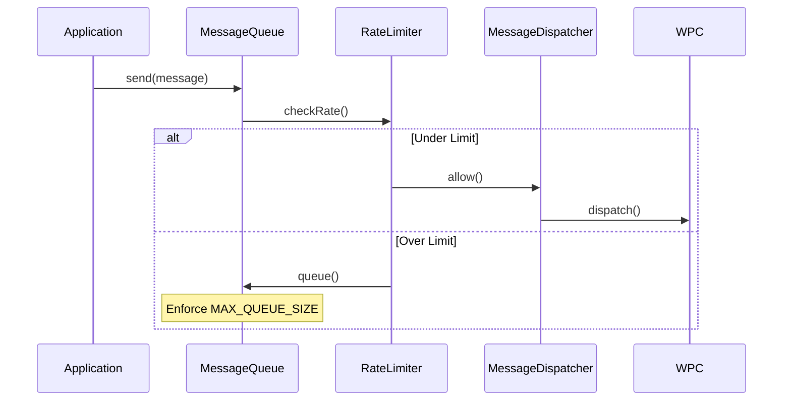

## 4. State Management Container (SMC)

### 4.1 Container Structure

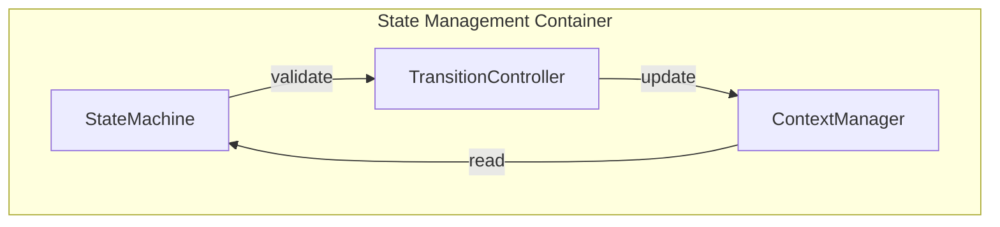

The State Management Container implements the formal state machine defined in `machine.md` §2 and maintains the context structure from `machine.md` §2.3.

### 4.2 State Transitions

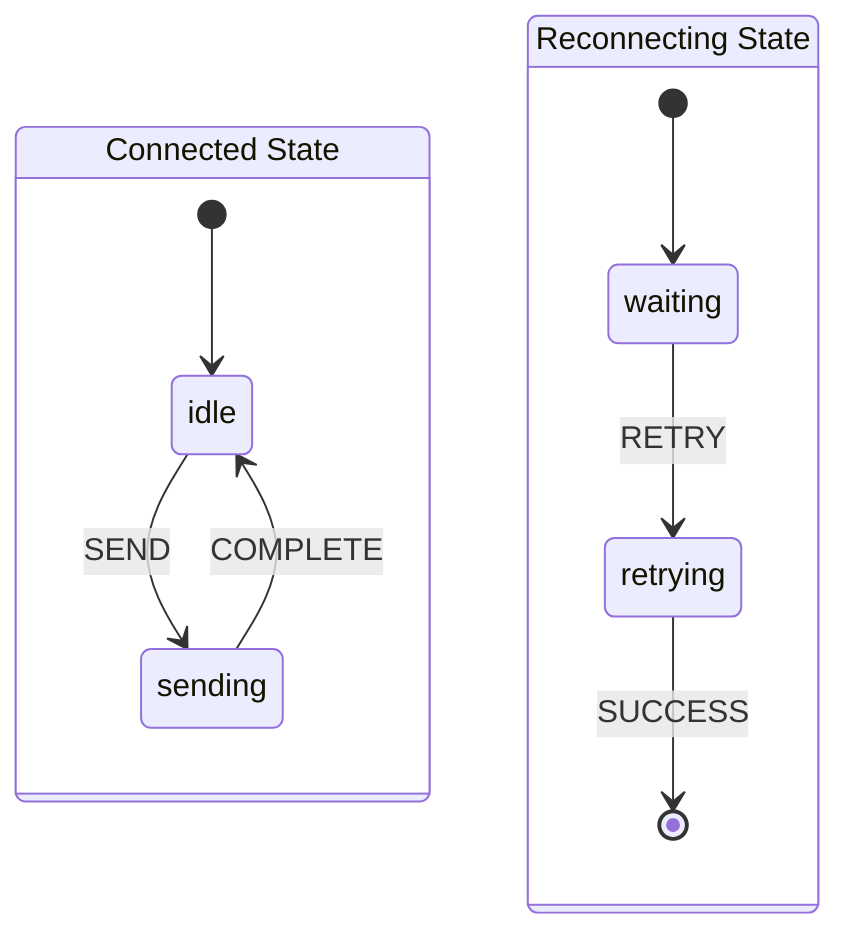

## 5. Cross-Container Interactions

### 5.1 Message Handling Flow

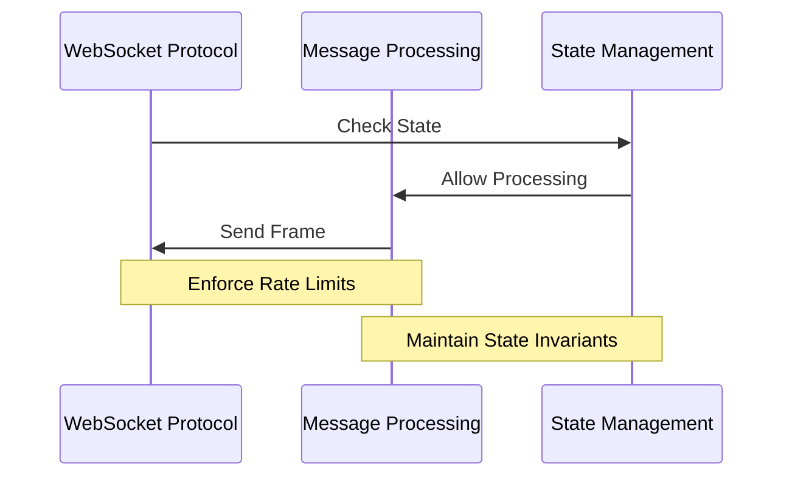

### 5.2 Error Handling Flow

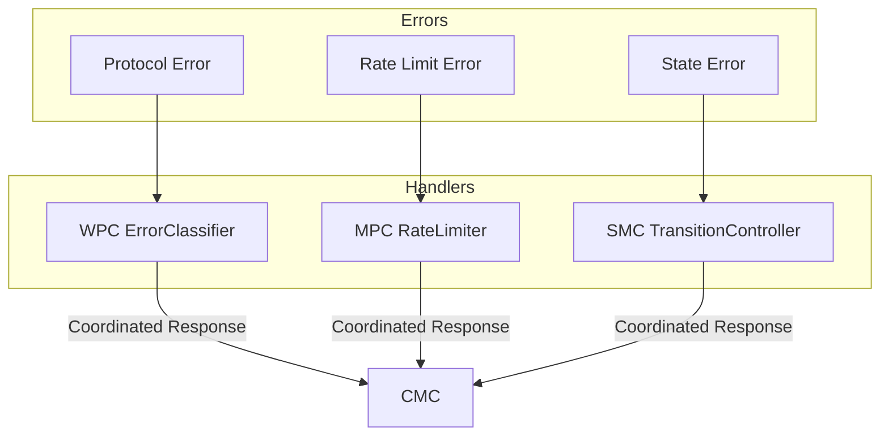

## 6. Validation Properties

Each container maintains specific invariants defined in the formal specifications:

### 6.1 CMC Invariants
- Single active connection (`machine.md` §5.3)
- Retry limits (`machine.md` §1.1)
- Timeout enforcement (`machine.md` §4.1)

### 6.2 WPC Invariants
- Frame size limits (`websocket.md` §1.7)
- Protocol consistency (`websocket.md` §1.6)
- Error classification (`websocket.md` §1.11)

### 6.3 MPC Invariants
- Queue size limits (`machine.md` §2.7)
- Message ordering (`machine.md` §2.7)
- Rate limiting (`machine.md` §2.8)

### 6.4 SMC Invariants
- State consistency (`machine.md` §2.6)
- Context validity (`machine.md` §2.3)
- Transition safety (`machine.md` §2.5)

## 7. Resource Management

Each container manages specific resources within defined bounds:

### 7.1 Memory Bounds
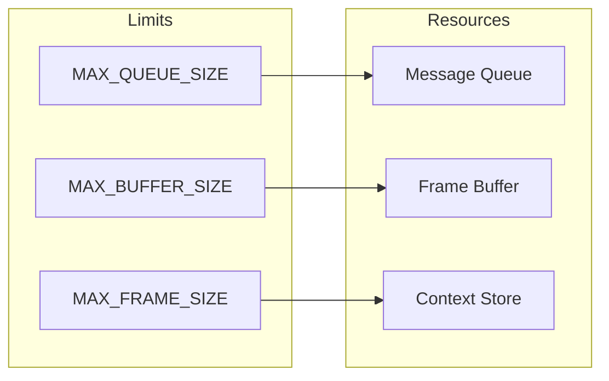

### 7.2 Timer Resources
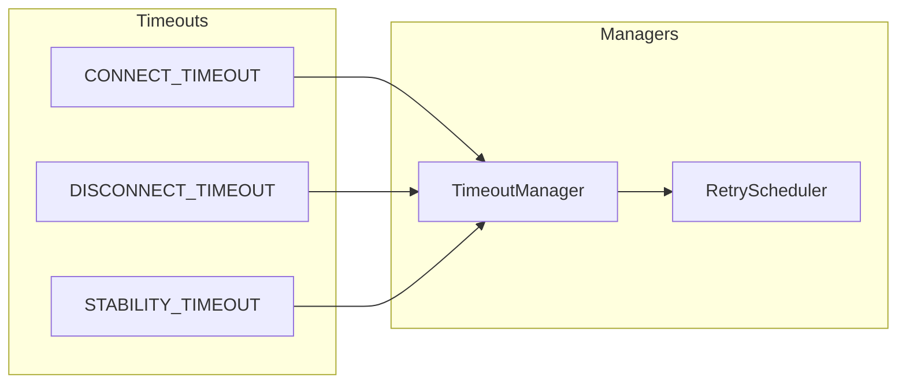

## 8. Implementation Guidance

This design serves as a governance framework for implementation, ensuring:

1. **Consistency**: All components align with formal specifications
2. **Safety**: Invariants are maintained across state transitions
3. **Reliability**: Error handling and recovery follows defined patterns
4. **Performance**: Resource usage stays within specified bounds

Implementation should proceed container-by-container, with careful attention to formal specification references and invariant maintenance.