# WebSocket Client System Context Interfaces

## 1. System Interface Overview

The WebSocket Client exposes well-defined interfaces to external systems while maintaining clear boundaries and protocols for interaction. These interfaces implement the formal specifications from `machine.md` and `websocket.md`.

### 1.1 Primary System Interfaces

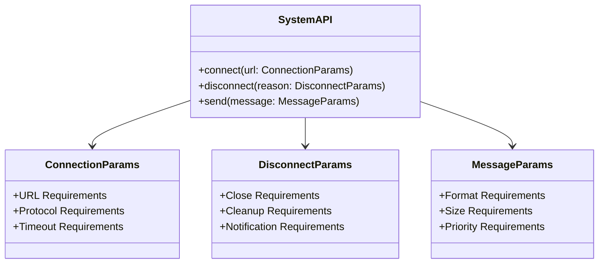

### 1.2 External System Integration

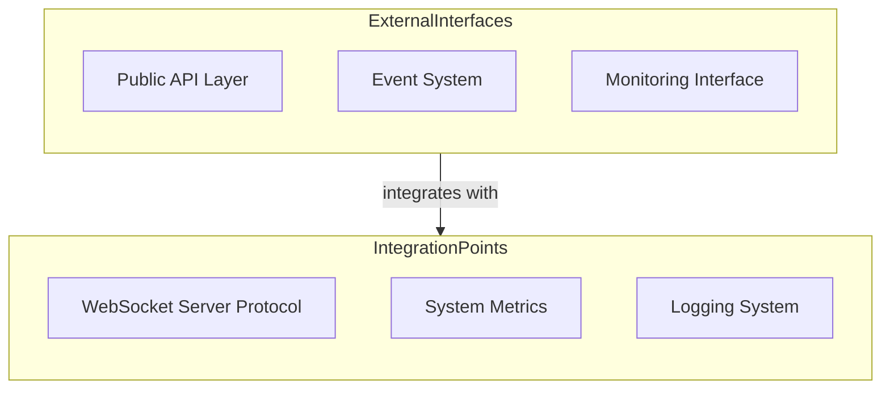

## 2. Interface Specifications

### 2.1 Connection Interface

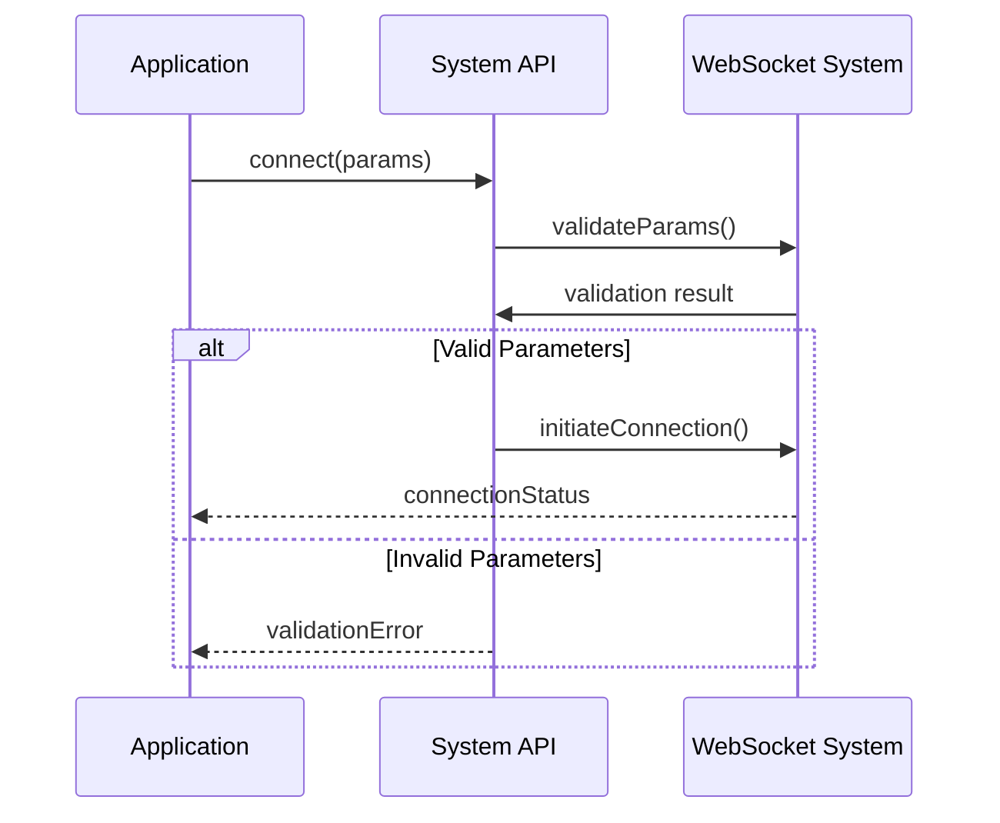

### 2.2 Monitoring Interface

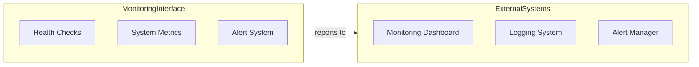

## 3. Interface Constraints

### 3.1 Resource Constraints

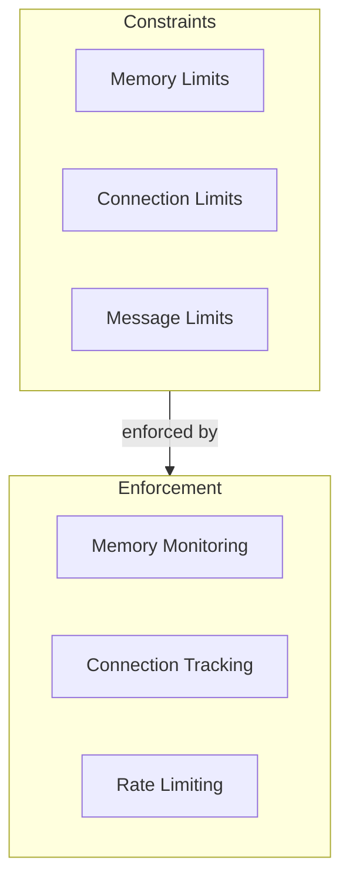

### 3.2 Protocol Constraints

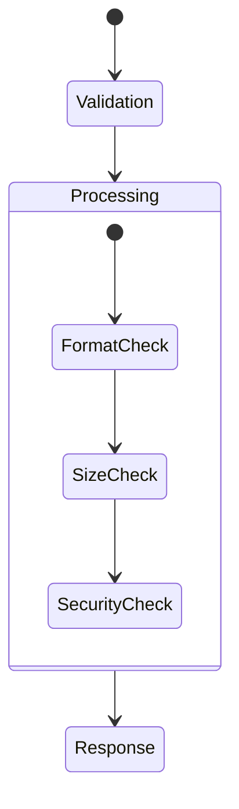

## 4. Error Handling

### 4.1 Error Categories

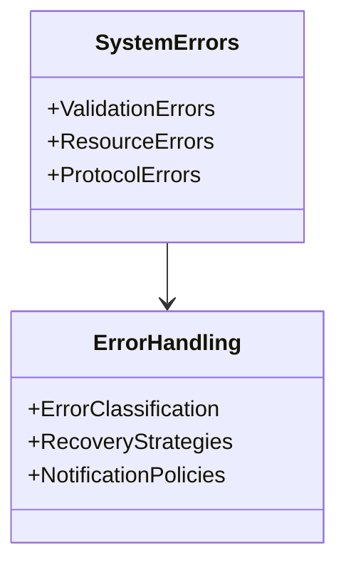

### 4.2 Error Propagation

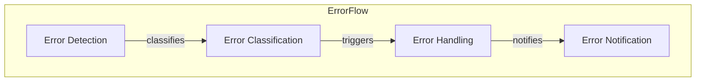

## 5. Quality Requirements

### 5.1 Performance Requirements

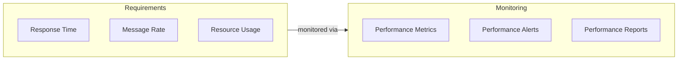

### 5.2 Reliability Requirements

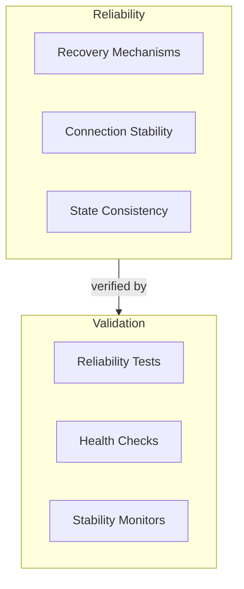

## 6. Documentation Requirements

### 6.1 Interface Documentation

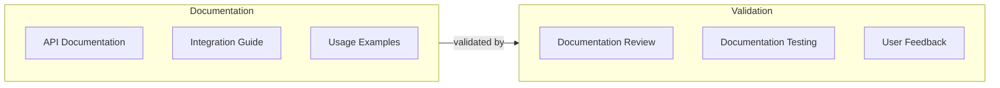

### 6.2 Monitoring Documentation

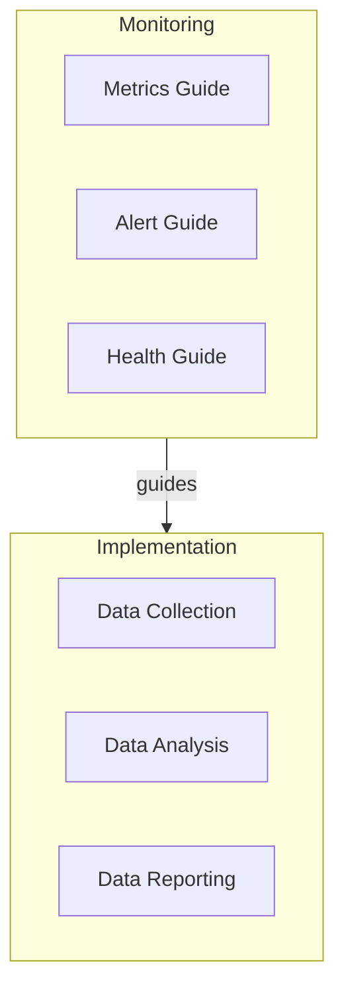

## 7. Evolution Strategy

### 7.1 Interface Evolution

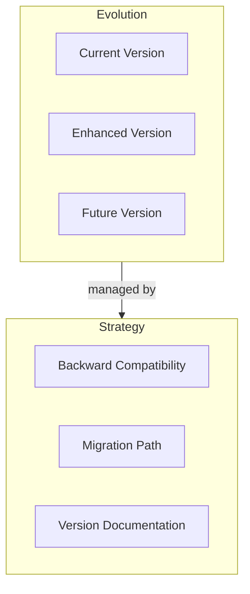

### 7.2 Integration Evolution

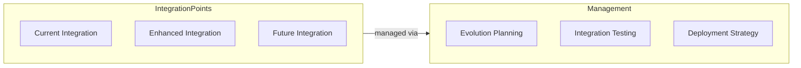
