# WebSocket Client System Context

## 1. System Overview

The WebSocket Client system operates within a broader network context, interacting with various external systems and actors while maintaining strict compliance with formal specifications defined in `machine.md` and `websocket.md`.

### 1.1 System Boundaries

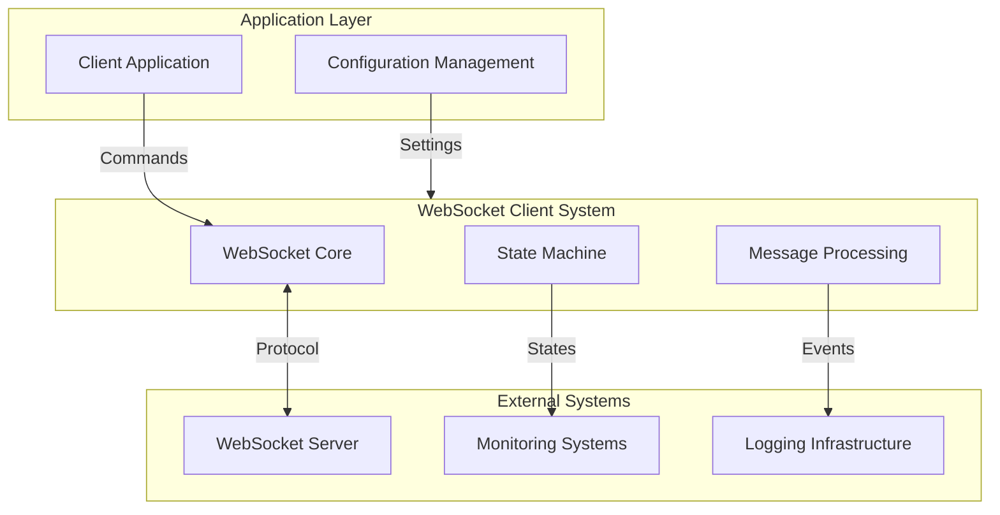

### 1.2 Primary Actors

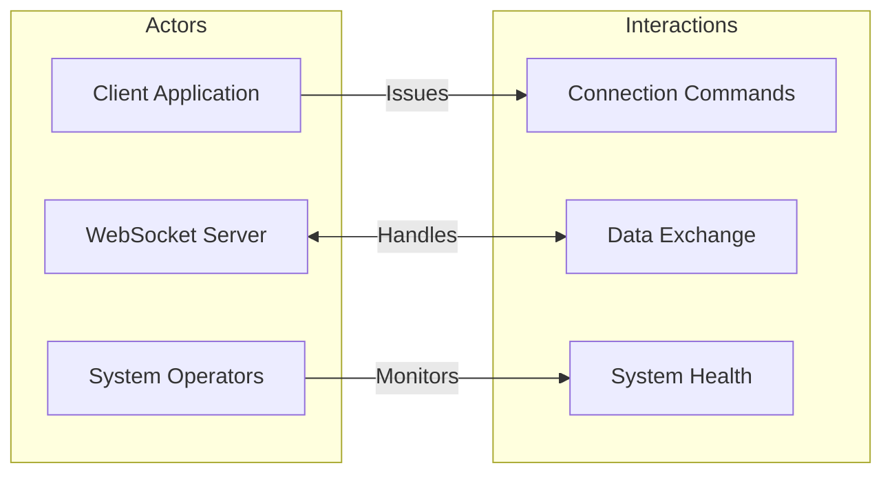

## 2. System Responsibilities

### 2.1 Core Functions

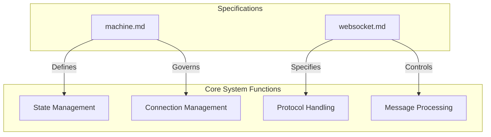

### 2.2 System Properties

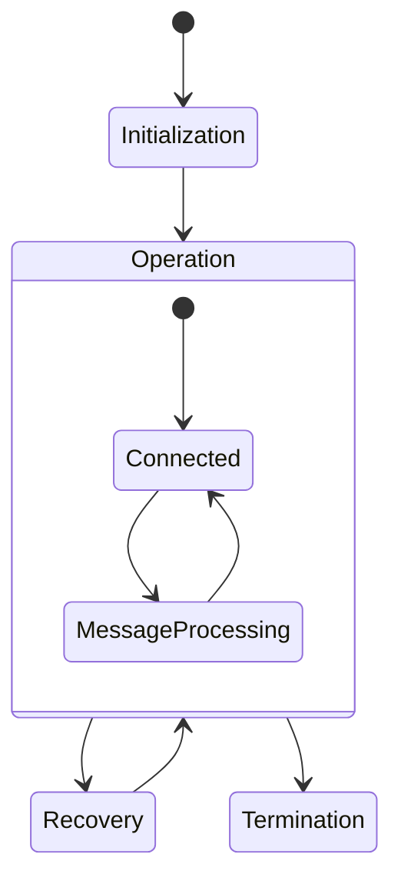

## 3. External Dependencies

### 3.1 Required Infrastructure

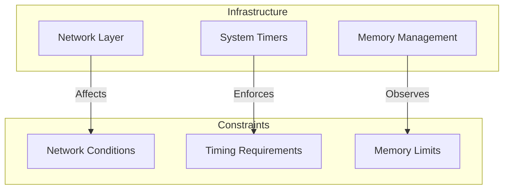

### 3.2 Integration Points

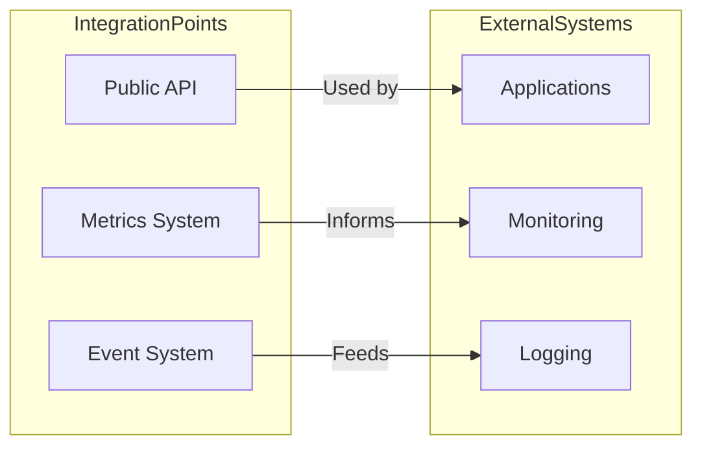

## 4. Quality Attributes

### 4.1 Performance Requirements

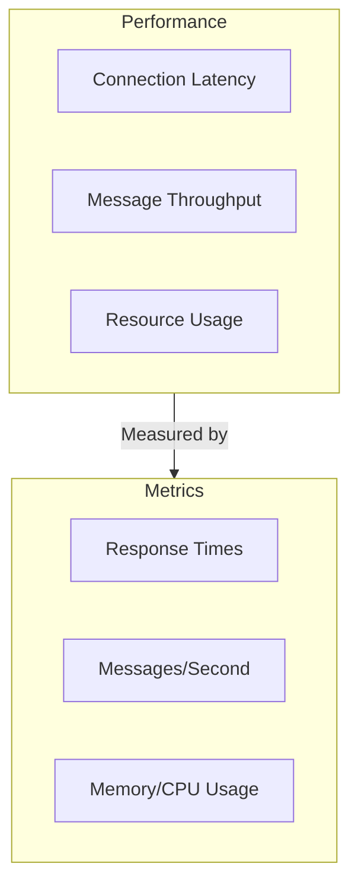

### 4.2 Reliability Requirements

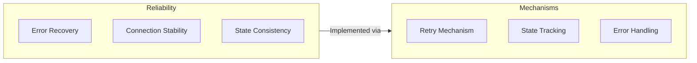

## 5. Design Constraints

### 5.1 Technical Constraints

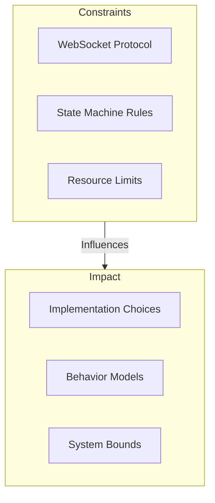

### 5.2 Operational Constraints

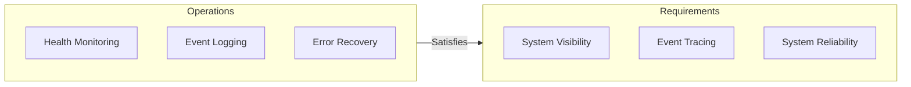

## 6. Risk Analysis

### 6.1 System Risks

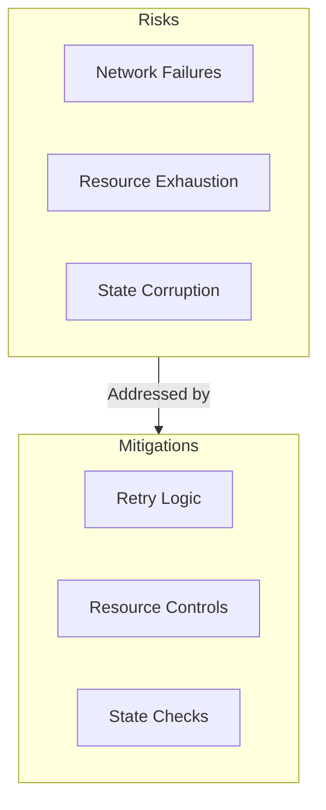

### 6.2 Operational Risks

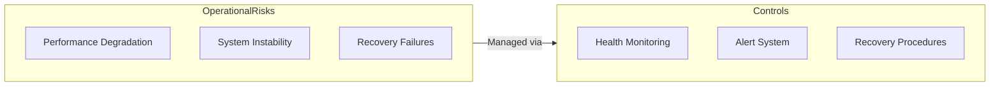

## 7. Evolution Strategy

### 7.1 System Evolution

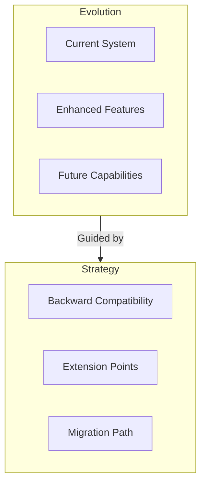

### 7.2 Integration Evolution

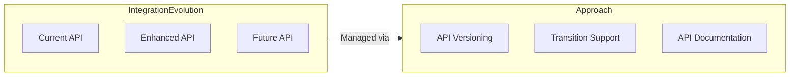

## 8. Implementation Guidance

The system context established here guides implementation by:

1. Defining clear system boundaries and interfaces
2. Establishing integration points with external systems
3. Specifying operational requirements and constraints
4. Providing evolution and risk management strategies

All implementation decisions must align with this context while maintaining compliance with formal specifications in `machine.md` and `websocket.md`.
