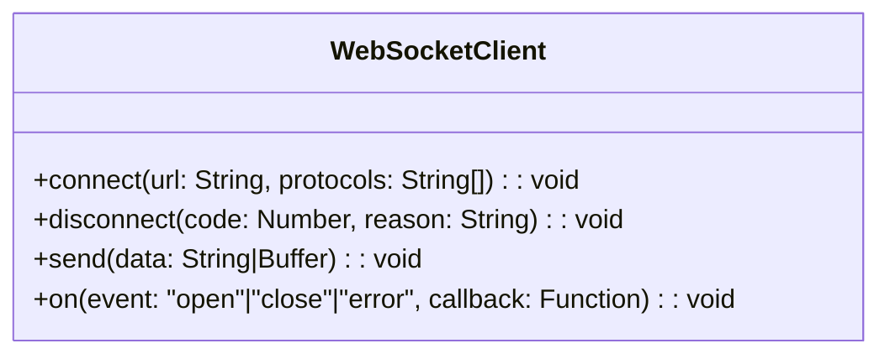
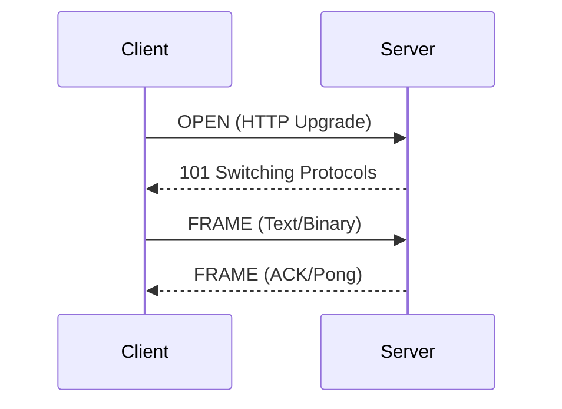
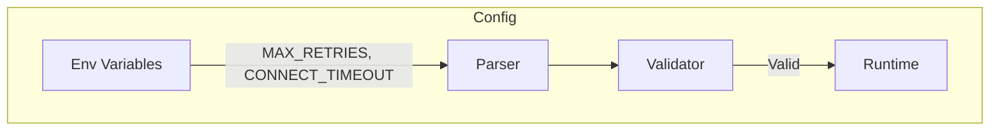
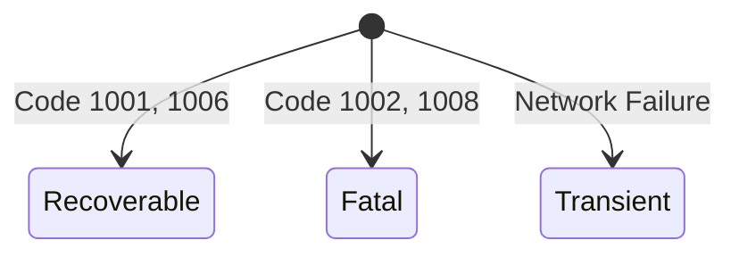
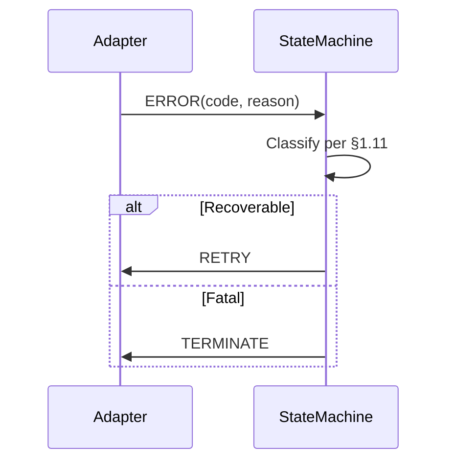

# WebSocket Client Context Interfaces

## 1. System Boundary Interfaces
### 1.1 Application Interface

### 1.2 Protocol Interface

## 2. Cross-Cutting Interfaces
### 2.1 Monitoring Interface
| Metric | Source | Formal Spec Reference |
|--------|--------|-----------------------|
| `websocket_connections_active` | State Machine | `machine.md` §3.1 |
| `message_queue_size` | Queue Manager | `machine.md` §2.7 |
| `reconnect_attempts_total` | Retry Scheduler | `machine.md` §5.4 |

### 2.2 Configuration Interface

## 3. Error Boundary
### 3.1 Error Taxonomy

### 3.2 Error Handling Flow

---

### **3. Next Steps**
1. **Review the Enhanced Files**:  
   - Ensure they align with `machine.md`, `websocket.md`, and `guidelines.md`.  

2. **Proceed to Containers**:  
   - Build on the refined context layer to design the container layer.  

