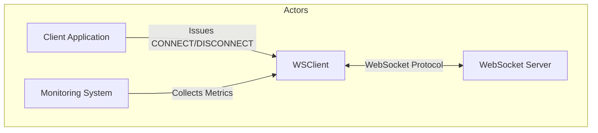
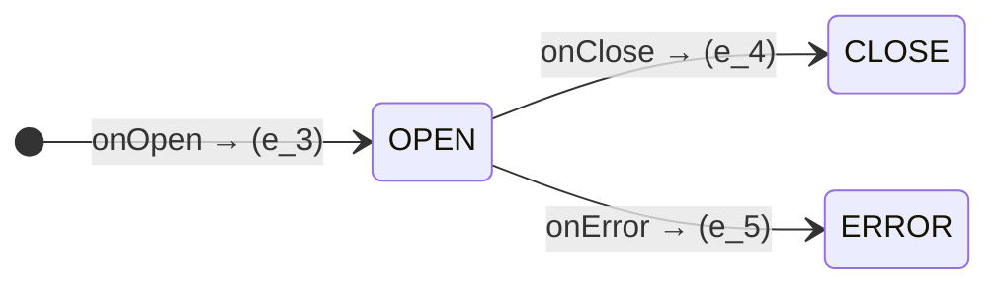
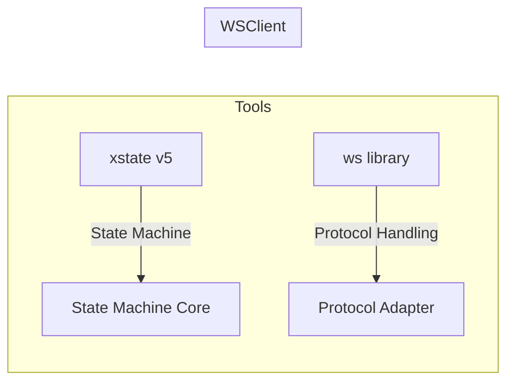

# WebSocket Client System Context

## 1. System Purpose
Implements a stateful WebSocket Client adhering to:
- **Formal State Machine**: 7-tuple \((S, E, \delta, s_0, C, \gamma, F)\) from `machine.md`.
- **Protocol Extensions**: WebSocket protocol rules, close codes, and error recovery from `websocket.md`.

## 2. System Scope
### 2.1 Key Responsibilities
| Responsibility | Formal Spec Reference |
|----------------|-----------------------|
| State Transitions | `machine.md` §2.5 |
| Protocol Compliance | `websocket.md` §1.6 |
| Queue Management | `machine.md` §2.7 |
| Error Recovery | `websocket.md` §1.11 |

### 2.2 Out of Scope
- Transport-layer security (TLS/SSL).
- Application-layer message semantics.

## 3. External Actors

## 4. Key Interfaces
### 4.1 Public API
| Method | Event Mapped | Formal Spec Reference |
|--------|--------------|-----------------------|
| `connect(url)` | \(e_1\) (CONNECT) | `machine.md` §2.2 |
| `disconnect(code)` | \(e_2\) (DISCONNECT) | `websocket.md` §1.4 |
| `send(data)` | \(e_{10}\) (SEND) | `machine.md` §2.4 |

### 4.2 Protocol Events

## 5. Constraints
### 5.1 Technical Constraints
| Constraint | Source | Enforcement Mechanism |
|------------|--------|-----------------------|
| \(MAX\_RETRIES = 5\) | `machine.md` §1.1 | Retry Scheduler |
| \(closeCode \in WebSocketConstants\) | `websocket.md` §1.2 | Error Classifier |
| \(|Q| \leq 1000\) | `machine.md` §2.7 | Queue Manager |

### 5.2 Operational Constraints
| Requirement | Implementation |
|-------------|----------------|
| Latency ≤ 500ms for `CONNECT` | Timeout Manager (§4.1) |
| 99.9% message delivery in `connected` state | Rate Limiter + Queue |

## 6. Tool Integration

---

