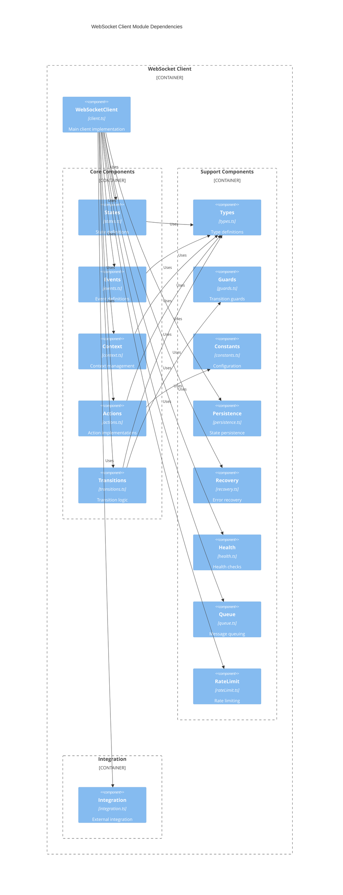

# WebSocket Client Architecture

## 1. Module Organization

Based on the formal definition M = (S, E, δ, s0, C, γ, F), we can organize the modules as follows:

### 1.1 Core Modules (Based on Formal Components)

1. **States (S)** - `states.ts`
   - Contains state definitions and state-specific logic
   - Maps to mathematical set S = {s₁, s₂, ..., sₙ}

2. **Events (E)** - `events.ts`
   - Contains event type definitions
   - Maps to mathematical set E = {e₁, e₂, ..., eₘ}

3. **Context (C)** - `context.ts`
   - Contains context type definitions and context management
   - Maps to mathematical definition C = (P, V, T)

4. **Actions (γ)** - `actions.ts`
   - Contains action implementations
   - Maps to mathematical set Γ = {γ₁, γ₂, ..., γₚ}

5. **Transitions (δ)** - `transitions.ts`
   - Contains transition logic
   - Maps to mathematical function δ: S × E → S × Γ

### 1.2 Supporting Modules

6. **Types** - `types.ts`
   - Shared type definitions
   - Common interfaces and types

7. **Guards** - `guards.ts`
   - Transition guards and predicates
   - Pure functions for state checking

8. **Constants** - `constants.ts`
   - Configuration constants
   - Default values
   - Error codes

9. **Persistence** - `persistence.ts`
   - State persistence logic
   - Storage adapters

10. **Recovery** - `recovery.ts`
    - Error recovery strategies
    - Retry logic

11. **Health** - `health.ts`
    - Health check implementation
    - Connection monitoring

12. **Queue** - `queue.ts`
    - Message queue implementation
    - Queue management

13. **RateLimit** - `rateLimit.ts`
    - Rate limiting implementation
    - Traffic control

### 1.3 Integration Modules

14. **Integration** - `integration.ts`
    - External system integration
    - Event processing pipeline

15. **WebSocketClient** - `client.ts`
    - Main client implementation
    - Public API

## 2. Module Relationships and Dependencies



## 3. Module Details

### 3.1 Core Modules

#### states.ts
```typescript
// Constants
export const STATES = {
  DISCONNECTED: 'disconnected',
  CONNECTING: 'connecting',
  CONNECTED: 'connected',
  RECONNECTING: 'reconnecting',
  DISCONNECTING: 'disconnecting',
  TERMINATED: 'terminated'
} as const;

// Types
export type State = typeof STATES[keyof typeof STATES];

// Interfaces
export interface StateDefinition {
  name: State;
  allowed: State[];
  onEnter?: () => void;
  onExit?: () => void;
}

// Implementations
export const stateDefinitions: Record<State, StateDefinition> = {
  [STATES.DISCONNECTED]: {
    name: STATES.DISCONNECTED,
    allowed: [STATES.CONNECTING, STATES.TERMINATED]
  },
  // ... other state definitions
};
```

#### events.ts
```typescript
// Constants
export const EVENTS = {
  CONNECT: 'CONNECT',
  DISCONNECT: 'DISCONNECT',
  OPEN: 'OPEN',
  // ... other events
} as const;

// Types
export type EventType = typeof EVENTS[keyof typeof EVENTS];

// Interfaces
export interface Event {
  type: EventType;
  payload?: unknown;
  timestamp: number;
}

// Implementation
export const createEvent = (type: EventType, payload?: unknown): Event => ({
  type,
  payload,
  timestamp: Date.now()
});
```

[Continue with other module details...]

## 4. File Organization

```
src/
├── core/
│   ├── states.ts
│   ├── events.ts
│   ├── context.ts
│   ├── actions.ts
│   └── transitions.ts
├── support/
│   ├── types.ts
│   ├── guards.ts
│   ├── constants.ts
│   ├── persistence.ts
│   ├── recovery.ts
│   ├── health.ts
│   ├── queue.ts
│   └── rateLimit.ts
├── integration/
│   └── integration.ts
└── client.ts
```

## 5. Module Relationships

### 5.1 Dependency Flow

1. **Core Dependencies**
   - All core modules depend on `types.ts`
   - `transitions.ts` depends on `states.ts`, `events.ts`, and `actions.ts`
   - `actions.ts` depends on `context.ts`
   - `context.ts` is independent of other core modules

2. **Support Dependencies**
   - `guards.ts` depends on `context.ts` and `states.ts`
   - `persistence.ts` depends on `context.ts`
   - `recovery.ts` depends on `actions.ts` and `events.ts`
   - `health.ts` depends on `events.ts` and `context.ts`
   - `queue.ts` depends on `context.ts`
   - `rateLimit.ts` depends on `context.ts`

3. **Integration Dependencies**
   - `integration.ts` depends on `events.ts` and `context.ts`

4. **Client Dependencies**
   - `client.ts` depends on all core modules
   - `client.ts` selectively uses support modules as needed

### 5.2 Data Flow

1. **Event Flow**
   ```
   External Event → client.ts → events.ts → transitions.ts → actions.ts → context.ts
   ```

2. **State Changes**
   ```
   transitions.ts → states.ts → client.ts → persistence.ts
   ```

3. **Message Flow**
   ```
   client.ts → queue.ts → rateLimit.ts → WebSocket API
   ```

4. **Health Check Flow**
   ```
   health.ts → events.ts → client.ts → WebSocket API
   ```

## 6. Implementation Guidelines

1. **Immutability**
   - All state changes must go through transitions
   - Context updates must be immutable
   - Events should be frozen after creation

2. **Error Handling**
   - All async operations must have error boundaries
   - Recovery strategies must be defined for each action
   - Errors must be propagated to the client

3. **Testing**
   - Each module should have isolated unit tests
   - Integration tests should cover state transitions
   - E2E tests should verify complete flows

4. **Performance**
   - Minimize object allocation in hot paths
   - Use efficient data structures for queues
   - Implement proper cleanup in all modules