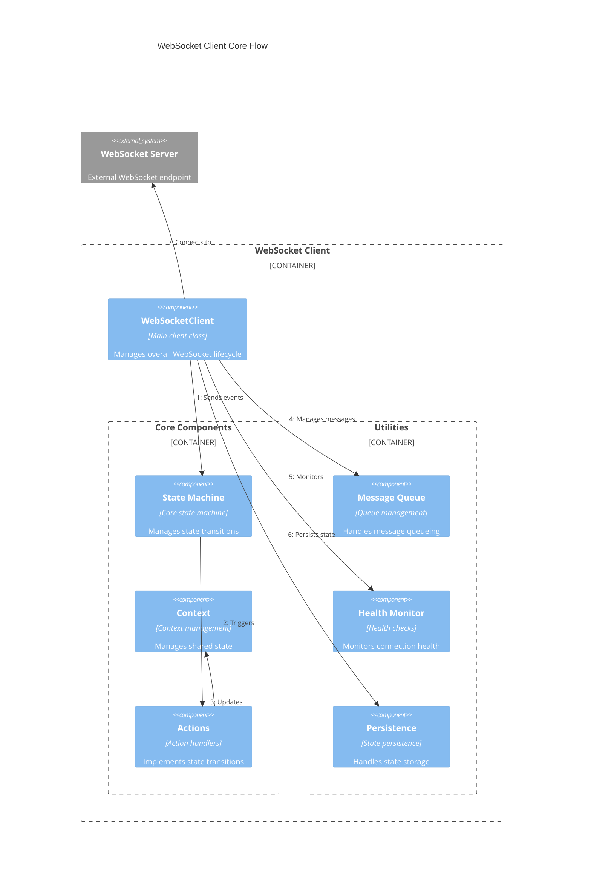

```mermaid
C4Dynamic

title WebSocket Client Core Flow

Container_Boundary(ws, "WebSocket Client") {
    Component(client, "WebSocketClient", "Main client class", "Manages overall WebSocket lifecycle")
    
    Container_Boundary(core, "Core Components") {
        Component(sm, "State Machine", "Core state machine", "Manages state transitions")
        Component(ctx, "Context", "Context management", "Manages shared state")
        Component(act, "Actions", "Action handlers", "Implements state transitions")
    }
    
    Container_Boundary(util, "Utilities") {
        Component(queue, "Message Queue", "Queue management", "Handles message queueing")
        Component(health, "Health Monitor", "Health checks", "Monitors connection health")
        Component(persist, "Persistence", "State persistence", "Handles state storage")
    }
}

System_Ext(ws_server, "WebSocket Server", "External WebSocket endpoint")

Rel(client, sm, "Sends events")
Rel(sm, act, "Triggers")
Rel(act, ctx, "Updates")
Rel(client, queue, "Manages messages")
Rel(client, health, "Monitors")
Rel(client, persist, "Persists state")
Rel(client, ws_server, "Connects to")

UpdateRelStyle(client, sm, $offsetY="-40")
UpdateRelStyle(sm, act, $offsetX="40")
UpdateRelStyle(act, ctx, $offsetY="40")
```