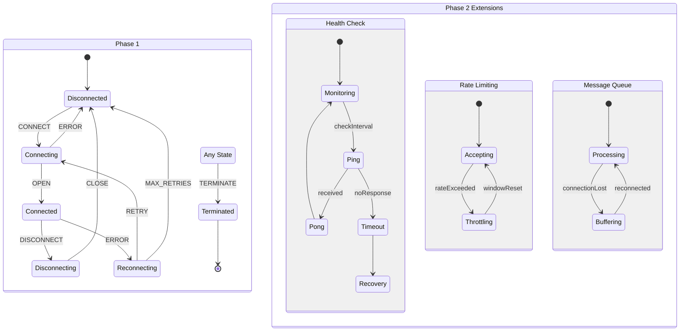

```mermaid
stateDiagram-v2
    %% Phase 1: Core State Machine
    state "Phase 1" as P1 {
        [*] --> Disconnected
        Disconnected --> Connecting : CONNECT
        Connecting --> Connected : OPEN
        Connecting --> Disconnected : ERROR
        Connected --> Disconnecting : DISCONNECT
        Disconnecting --> Disconnected : CLOSE
        Connected --> Reconnecting : ERROR
        Reconnecting --> Connecting : RETRY
        Reconnecting --> Disconnected : MAX_RETRIES
        state "Any State" as Any
        Any --> Terminated : TERMINATE
        Terminated --> [*]
    }

    %% Phase 2: Extended Features
    state "Phase 2 Extensions" as P2 {
        state "Health Check" as HC {
            [*] --> Monitoring
            Monitoring --> Ping : checkInterval
            Ping --> Pong : received
            Ping --> Timeout : noResponse
            Pong --> Monitoring
            Timeout --> Recovery
        }

        state "Rate Limiting" as RL {
            [*] --> Accepting
            Accepting --> Throttling : rateExceeded
            Throttling --> Accepting : windowReset
        }

        state "Message Queue" as MQ {
            [*] --> Processing
            Processing --> Buffering : connectionLost
            Buffering --> Processing : reconnected
        }
    }
```