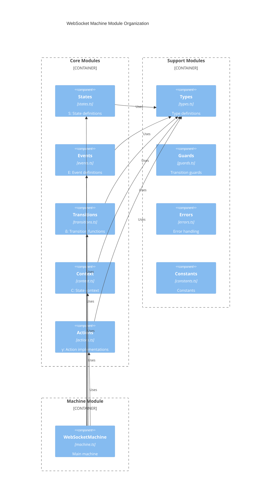

# WebSocket Machine Architecture & Implementation Guide

## 1. Overview & Design Goals

### 1.1 Phased Implementation Strategy
The implementation is divided into two phases:

Phase 1: Core State Machine
- Focus on implementing the formal mathematical definition M = (S, E, δ, s0, C, γ, F)
- Establish foundational reliability and correctness
- Core WebSocket functionality

Phase 2: Advanced Features
- Build on core functionality
- Add performance features
- Enhance monitoring capabilities

### 1.2 Module Organization



## 2. Core Module Implementation

### 2.1 States Module (S)
```typescript
// src/core/states.ts
/**
 * WebSocket States following mathematical model:
 * S = {sᵢ | i=1,2,...,n; n=6} where each sᵢ represents a specific state
 * s₀ ∈ S is the initial state (Disconnected)
 * F ⊆ S is the set of final states F = {s_Terminated}
 */

/**
 * S₆: Complete state set of the WebSocket machine
 */
export const STATES = {
  DISCONNECTED: 'disconnected',   // s₁: Initial state s₀
  CONNECTING: 'connecting',       // s₂
  CONNECTED: 'connected',         // s₃
  RECONNECTING: 'reconnecting',   // s₄
  DISCONNECTING: 'disconnecting', // s₅
  TERMINATED: 'terminated'        // s₆: Final state ∈ F
} as const;

export type State = keyof typeof STATES;

/**
 * State Schema defining entry/exit actions and allowed transitions
 * For each s ∈ S, defines:
 * - Entry actions: γ executed upon entering state
 * - Exit actions: γ executed upon leaving state
 * - Allowed transitions: {e ∈ E | ∃s' ∈ S: δ(s,e) = (s',γ)}
 */
export interface StateDefinition {
  entry?: string[];  // Entry actions γentry ⊆ γ
  exit?: string[];   // Exit actions γexit ⊆ γ
  on: {             // Allowed transitions
    [K in WebSocketEvent['type']]?: TransitionDefinition;
  };
}

/**
 * Complete state machine schema
 * Defines behavior for all s ∈ S
 */
export const stateSchema: Record<State, StateDefinition> = {
  // s₁: Disconnected (Initial state s₀)
  [STATES.DISCONNECTED]: {
    entry: ['resetConnection'],
    on: {
      CONNECT: { target: STATES.CONNECTING }
    }
  },

  // s₂: Connecting
  [STATES.CONNECTING]: {
    entry: ['createSocket'],
    on: {
      OPEN: { target: STATES.CONNECTED },
      ERROR: { target: STATES.RECONNECTING },
      CLOSE: { target: STATES.DISCONNECTED }
    }
  },

  // s₃: Connected
  [STATES.CONNECTED]: {
    entry: ['logConnection'],
    exit: ['cleanupSocket'],
    on: {
      DISCONNECT: { target: STATES.DISCONNECTING },
      ERROR: { target: STATES.RECONNECTING },
      MESSAGE: { target: STATES.CONNECTED },
      SEND: { target: STATES.CONNECTED },
      PING: { target: STATES.CONNECTED },
      PONG: { target: STATES.CONNECTED }
    }
  },

  // s₄: Reconnecting
  [STATES.RECONNECTING]: {
    entry: ['prepareReconnect'],
    on: {
      RETRY: { target: STATES.CONNECTING },
      MAX_RETRIES: { target: STATES.DISCONNECTED }
    }
  },

  // s₅: Disconnecting
  [STATES.DISCONNECTING]: {
    entry: ['initiateDisconnect'],
    on: {
      CLOSE: { target: STATES.DISCONNECTED }
    }
  },

  // s₆: Terminated (Final state ∈ F)
  [STATES.TERMINATED]: {
    entry: ['forceTerminate'],
    // No transitions out of terminated state
    on: {}
  }
};

/**
 * Initial state s₀ ∈ S
 */
export const INITIAL_STATE: State = STATES.DISCONNECTED;

/**
 * Final states F ⊆ S
 */
export const FINAL_STATES: Set<State> = new Set([STATES.TERMINATED]);

/**
 * Validates if a state exists in S
 */
export const isValidState = (state: unknown): state is State => {
  return typeof state === 'string' && state in STATES;
};

/**
 * Gets all valid transitions from a state
 * Returns {e ∈ E | ∃s' ∈ S: δ(s,e) = (s',γ)}
 */
export const getValidTransitions = (state: State): State[] => {
  return Object.keys(stateSchema[state].on) as State[];
};

/**
 * Checks if state is final
 * Returns true if s ∈ F
 */
export const isFinalState = (state: State): boolean => {
  return FINAL_STATES.has(state);
};

/**
 * Gets entry actions for a state
 * Returns γentry ⊆ γ
 */
export const getEntryActions = (state: State): string[] => {
  return stateSchema[state].entry || [];
};

/**
 * Gets exit actions for a state
 * Returns γexit ⊆ γ
 */
export const getExitActions = (state: State): string[] => {
  return stateSchema[state].exit || [];
};

/**
 * Validates the entire state schema
 * Ensures all states are properly defined with valid transitions
 */
export const validateStateSchema = (): boolean => {
  return Object.values(STATES).every(state => {
    const definition = stateSchema[state];
    if (!definition) return false;

    // Validate entry/exit actions exist
    const validEntry = !definition.entry || definition.entry.every(isValidAction);
    const validExit = !definition.exit || definition.exit.every(isValidAction);

    // Validate transitions refer to valid states
    const validTransitions = Object.values(definition.on).every(
      transition => isValidState(transition.target)
    );

    return validEntry && validExit && validTransitions;
  });
};

// Helper to validate action name
const isValidAction = (action: string): boolean => {
  // Implementation would check against actual action names
  return true; // Simplified for example
};
```

### 2.2 Events Module (E)
```typescript
// src/core/events.ts
/**
 * WebSocket Events following mathematical model:
 * E = {eᵢ | i=1,2,...,m; m=12} where each eᵢ represents a specific event type
 * Each event carries specific payload data relevant to its type
 */

/**
 * E₁₂: Complete event set with all possible WebSocket events
 */
export const EVENTS = {
  // Connection Events (e₁ - e₄)
  CONNECT: 'CONNECT',     // e₁
  DISCONNECT: 'DISCONNECT', // e₂
  OPEN: 'OPEN',          // e₃
  CLOSE: 'CLOSE',        // e₄

  // Error Events (e₅ - e₈)
  ERROR: 'ERROR',        // e₅
  RETRY: 'RETRY',        // e₆
  MAX_RETRIES: 'MAX_RETRIES', // e₇
  TERMINATE: 'TERMINATE',  // e₈

  // Data Events (e₉ - e₁₂)
  MESSAGE: 'MESSAGE',    // e₉
  SEND: 'SEND',         // e₁₀
  PING: 'PING',         // e₁₁
  PONG: 'PONG'          // e₁₂
} as const;

export type EventType = keyof typeof EVENTS;

/**
 * Event Definitions following E = {e₁, e₂, ..., e₁₂}
 */
export type WebSocketEvent =
  // e₁: CONNECT - Initiates connection to WebSocket server
  | {
      type: 'CONNECT';
      url: string;
      protocols?: string[];
      options?: ConnectionOptions;
    }
  // e₂: DISCONNECT - Initiates graceful disconnection
  | {
      type: 'DISCONNECT';
      code?: number;
      reason?: string;
    }
  // e₃: OPEN - Connection successfully established
  | {
      type: 'OPEN';
      event: Event;
      timestamp: number;
    }
  // e₄: CLOSE - Connection closed
  | {
      type: 'CLOSE';
      code: number;
      reason: string;
      wasClean: boolean;
    }
  // e₅: ERROR - Error occurred during operation
  | {
      type: 'ERROR';
      error: Error;
      timestamp: number;
      attempt?: number;
    }
  // e₆: RETRY - Attempt to reconnect
  | {
      type: 'RETRY';
      attempt: number;
      delay: number;
    }
  // e₇: MAX_RETRIES - Maximum retry attempts reached
  | {
      type: 'MAX_RETRIES';
      attempts: number;
      lastError?: Error;
    }
  // e₈: TERMINATE - Force immediate termination
  | {
      type: 'TERMINATE';
      code?: number;
      reason?: string;
      immediate?: boolean;
    }
  // e₉: MESSAGE - Received message from server
  | {
      type: 'MESSAGE';
      data: any;
      timestamp: number;
      id?: string;
    }
  // e₁₀: SEND - Send message to server
  | {
      type: 'SEND';
      data: any;
      id?: string;
      options?: SendOptions;
    }
  // e₁₁: PING - Health check ping
  | {
      type: 'PING';
      timestamp: number;
    }
  // e₁₂: PONG - Health check response
  | {
      type: 'PONG';
      latency: number;
      timestamp: number;
    };

/**
 * Event Configuration Interfaces
 */
interface ConnectionOptions {
  reconnect: boolean;
  maxReconnectAttempts: number;
  reconnectInterval: number;
  reconnectBackoffRate: number;
  pingInterval: number;
  pongTimeout: number;
  messageQueueSize: number;
  messageTimeout: number;
  rateLimit: RateLimit;
}

interface SendOptions {
  retry: boolean;
  timeout: number;
  priority: 'high' | 'normal';
  queueIfOffline: boolean;
}

interface RateLimit {
  messages: number;
  window: number;
}

/**
 * Event Creators
 * Functions to create properly typed events with required payload data
 */
export const createEvent = {
  // e₁: Create CONNECT event
  connect: (url: string, protocols?: string[], options?: ConnectionOptions): WebSocketEvent => ({
    type: EVENTS.CONNECT,
    url,
    protocols,
    options
  }),

  // e₂: Create DISCONNECT event
  disconnect: (code?: number, reason?: string): WebSocketEvent => ({
    type: EVENTS.DISCONNECT,
    code,
    reason
  }),

  // e₃: Create OPEN event
  open: (originalEvent: Event): WebSocketEvent => ({
    type: EVENTS.OPEN,
    event: originalEvent,
    timestamp: Date.now()
  }),

  // Continue for all other events...
} as const;

/**
 * Event Validation
 */
export const validateEvent = (event: unknown): event is WebSocketEvent => {
  if (!event || typeof event !== 'object' || !('type' in event)) {
    return false;
  }

  const { type } = event as { type: string };
  
  // Verify event type exists in E
  if (!(type in EVENTS)) {
    return false;
  }

  // Validate required payload data based on event type
  return validateEventPayload(event as WebSocketEvent);
};

/**
 * Helper function to validate event payload data
 */
const validateEventPayload = (event: WebSocketEvent): boolean => {
  switch (event.type) {
    case EVENTS.CONNECT:
      return typeof event.url === 'string';
    
    case EVENTS.OPEN:
      return event.event instanceof Event && 
             typeof event.timestamp === 'number';
    
    case EVENTS.CLOSE:
      return typeof event.code === 'number' &&
             typeof event.reason === 'string' &&
             typeof event.wasClean === 'boolean';
    
    // Continue validation for other event types...
    
    default:
      return true;
  }
};

/**
 * Event Type Guards
 */
export const isConnectEvent = (event: WebSocketEvent): event is Extract<WebSocketEvent, { type: 'CONNECT' }> =>
  event.type === EVENTS.CONNECT;

export const isMessageEvent = (event: WebSocketEvent): event is Extract<WebSocketEvent, { type: 'MESSAGE' }> =>
  event.type === EVENTS.MESSAGE;

export const isValidEvent = (event: unknown): event is WebSocketEvent => {
  if (!event || typeof event !== 'object' || !('type' in event)) {
    return false;
  }
  return (event as { type: string }).type in EVENTS;
};
```

### 2.3 Context Module (C)
```typescript
// src/core/context.ts

/**
 * WebSocket Context following mathematical model:
 * C = (P, V, T) where:
 * P = Primary Connection Properties (strings, socket, connection state)
 * V = Metric Values (natural numbers ℕ: messagesSent, messagesReceived, etc.)
 * T = Timing Properties (positive real numbers ℝ⁺ or null: connectTime, etc.)
 */

// P: Primary Connection Properties
interface PrimaryConnectionProperties {
  url: string | null;
  protocols: string[];
  socket: WebSocket | null;
  status: ConnectionStatus;
  readyState: number;
}

// V: Metric Values (ℕ - natural numbers including zero)
interface MetricValues {
  messagesSent: number;    // ℕ
  messagesReceived: number; // ℕ
  reconnectAttempts: number; // ℕ
  bytesSent: number;      // ℕ
  bytesReceived: number;   // ℕ
}

// T: Timing Properties (ℝ⁺ - positive real numbers or null)
interface TimingProperties {
  connectTime: number | null;    // ℝ⁺ ∪ {null}
  disconnectTime: number | null; // ℝ⁺ ∪ {null}
  lastPingTime: number | null;   // ℝ⁺ ∪ {null}
  lastPongTime: number | null;   // ℝ⁺ ∪ {null}
  windowStart: number | null;    // ℝ⁺ ∪ {null}
}

// C = (P, V, T): Complete Context
export interface WebSocketContext {
  connection: PrimaryConnectionProperties;  // P
  metrics: MetricValues;                    // V
  timing: TimingProperties;                 // T
}

export const createInitialContext = (config: WebSocketConfig): WebSocketContext => ({
  connection: {
    url: null,
    protocols: [],
    socket: null,
    status: 'disconnected',
    readyState: WebSocket.CLOSED
  },
  metrics: {
    messagesSent: 0,
    messagesReceived: 0,
    reconnectAttempts: 0,
    bytesSent: 0,
    bytesReceived: 0
  },
  timing: {
    connectTime: null,
    disconnectTime: null,
    lastPingTime: null,
    lastPongTime: null,
    windowStart: null
  }
});

export const validateContext = (context: unknown): context is WebSocketContext => {
  if (!context || typeof context !== 'object') return false;
  const c = context as Partial<WebSocketContext>;

  // Validate P (Primary Connection Properties)
  if (!validatePrimaryProps(c.connection)) return false;

  // Validate V (Metric Values)
  if (!validateMetricValues(c.metrics)) return false;

  // Validate T (Timing Properties)
  if (!validateTimingProps(c.timing)) return false;

  return true;
};

// Helper validators
const validatePrimaryProps = (p: unknown): p is PrimaryConnectionProperties => {
  if (!p || typeof p !== 'object') return false;
  const props = p as Partial<PrimaryConnectionProperties>;

  return (
    (typeof props.url === 'string' || props.url === null) &&
    Array.isArray(props.protocols) &&
    (props.socket instanceof WebSocket || props.socket === null) &&
    typeof props.status === 'string' &&
    typeof props.readyState === 'number'
  );
};

const validateMetricValues = (v: unknown): v is MetricValues => {
  if (!v || typeof v !== 'object') return false;
  const metrics = v as Partial<MetricValues>;

  return (
    typeof metrics.messagesSent === 'number' && metrics.messagesSent >= 0 &&
    typeof metrics.messagesReceived === 'number' && metrics.messagesReceived >= 0 &&
    typeof metrics.reconnectAttempts === 'number' && metrics.reconnectAttempts >= 0 &&
    typeof metrics.bytesSent === 'number' && metrics.bytesSent >= 0 &&
    typeof metrics.bytesReceived === 'number' && metrics.bytesReceived >= 0
  );
};

const validateTimingProps = (t: unknown): t is TimingProperties => {
  if (!t || typeof t !== 'object') return false;
  const timing = t as Partial<TimingProperties>;

  const isPositiveRealOrNull = (n: unknown): boolean =>
    n === null || (typeof n === 'number' && n > 0);

  return (
    isPositiveRealOrNull(timing.connectTime) &&
    isPositiveRealOrNull(timing.disconnectTime) &&
    isPositiveRealOrNull(timing.lastPingTime) &&
    isPositiveRealOrNull(timing.lastPongTime) &&
    isPositiveRealOrNull(timing.windowStart)
  );
};
```

### 2.4 Actions Module (γ)
```typescript
// src/core/actions.ts
/**
 * WebSocket Actions following mathematical model:
 * γ: C × E → C where:
 * - C is the Context triple (P, V, T)
 * - E is the Event set
 * - Each action γᵢ: C × E → C is a pure function that transforms the context
 */

import { WebSocketContext } from './context';
import { WebSocketEvent } from './events';

type ActionArgs = {
  context: WebSocketContext;
  event: WebSocketEvent;
};

/**
 * γ₁: Store URL
 * γ₁(c, e_CONNECT) = c' where c'.connection.url = e_CONNECT.url
 */
const storeUrl = ({ context, event }: ActionArgs): Partial<WebSocketContext> => {
  if (event.type !== 'CONNECT') return context;
  return {
    connection: {
      ...context.connection,
      url: event.url,
      protocols: event.protocols || []
    }
  };
};

/**
 * γ₂: Reset Retries
 * γ₂(c) = c' where c'.metrics.reconnectAttempts = 0
 */
const resetRetries = ({ context }: ActionArgs): Partial<WebSocketContext> => ({
  metrics: {
    ...context.metrics,
    reconnectAttempts: 0
  }
});

/**
 * γ₃: Handle Error
 * γ₃(c, e_ERROR) = c' where:
 * - c'.connection.status = error
 * - c'.timing.disconnectTime = now()
 */
const handleError = ({ context, event }: ActionArgs): Partial<WebSocketContext> => {
  if (event.type !== 'ERROR') return context;
  return {
    connection: {
      ...context.connection,
      status: 'error',
      socket: null
    },
    timing: {
      ...context.timing,
      disconnectTime: Date.now()
    }
  };
};

/**
 * γ₄: Process Message
 * γ₄(c, e_MESSAGE) = c' where:
 * - c'.metrics.messagesReceived = c.metrics.messagesReceived + 1
 * - c'.metrics.bytesReceived = c.metrics.bytesReceived + size(e_MESSAGE.data)
 */
const processMessage = ({ context, event }: ActionArgs): Partial<WebSocketContext> => {
  if (event.type !== 'MESSAGE') return context;
  const messageSize = new Blob([event.data]).size;
  return {
    metrics: {
      ...context.metrics,
      messagesReceived: context.metrics.messagesReceived + 1,
      bytesReceived: context.metrics.bytesReceived + messageSize
    }
  };
};

/**
 * γ₅: Send Message
 * γ₅(c, e_SEND) = c' where:
 * - c'.metrics.messagesSent = c.metrics.messagesSent + 1
 * - c'.metrics.bytesSent = c.metrics.bytesSent + size(e_SEND.data)
 */
const sendMessage = ({ context, event }: ActionArgs): Partial<WebSocketContext> => {
  if (event.type !== 'SEND') return context;
  const messageSize = new Blob([event.data]).size;
  return {
    metrics: {
      ...context.metrics,
      messagesSent: context.metrics.messagesSent + 1,
      bytesSent: context.metrics.bytesSent + messageSize
    }
  };
};

/**
 * γ₆: Handle Ping
 * γ₆(c, e_PING) = c' where c'.timing.lastPingTime = e_PING.timestamp
 */
const handlePing = ({ context, event }: ActionArgs): Partial<WebSocketContext> => {
  if (event.type !== 'PING') return context;
  return {
    timing: {
      ...context.timing,
      lastPingTime: event.timestamp
    }
  };
};

/**
 * γ₇: Handle Pong
 * γ₇(c, e_PONG) = c' where:
 * - c'.timing.lastPongTime = e_PONG.timestamp
 */
const handlePong = ({ context, event }: ActionArgs): Partial<WebSocketContext> => {
  if (event.type !== 'PONG') return context;
  return {
    timing: {
      ...context.timing,
      lastPongTime: event.timestamp
    }
  };
};

/**
 * γ₈: Enforce Rate Limit
 * γ₈(c) = c' where:
 * - c'.timing.windowStart = now() if windowExpired(c)
 */
const enforceRateLimit = ({ context }: ActionArgs): Partial<WebSocketContext> => {
  const now = Date.now();
  const windowExpired = context.timing.windowStart === null ||
    now - context.timing.windowStart >= RATE_LIMIT_WINDOW;
  
  return {
    timing: {
      ...context.timing,
      windowStart: windowExpired ? now : context.timing.windowStart
    }
  };
};

/**
 * γ₉: Increment Retries
 * γ₉(c) = c' where c'.metrics.reconnectAttempts = c.metrics.reconnectAttempts + 1
 */
const incrementRetries = ({ context }: ActionArgs): Partial<WebSocketContext> => ({
  metrics: {
    ...context.metrics,
    reconnectAttempts: context.metrics.reconnectAttempts + 1
  }
});

/**
 * γ₁₀: Log Connection
 * γ₁₀(c) = c' where c'.timing.connectTime = now()
 */
const logConnection = ({ context }: ActionArgs): Partial<WebSocketContext> => ({
  timing: {
    ...context.timing,
    connectTime: Date.now()
  }
});

/**
 * γ₁₁: Force Terminate
 * γ₁₁(c) = c' where:
 * - c'.connection.socket = null
 * - c'.connection.status = terminated
 * - c'.timing.disconnectTime = now()
 */
const forceTerminate = ({ context }: ActionArgs): Partial<WebSocketContext> => ({
  connection: {
    ...context.connection,
    socket: null,
    status: 'terminated'
  },
  timing: {
    ...context.timing,
    disconnectTime: Date.now()
  }
});

// Export action map γ = {γ₁, γ₂, ..., γ₁₁}
export const actions = {
  storeUrl,
  resetRetries,
  handleError,
  processMessage,
  sendMessage,
  handlePing,
  handlePong,
  enforceRateLimit,
  incrementRetries,
  logConnection,
  forceTerminate
} as const;

// Type for any action in γ
export type Action = typeof actions[keyof typeof actions];

// Validate that an action properly transforms context
export const validateAction = (
  action: Action,
  args: ActionArgs
): boolean => {
  try {
    const result = action(args);
    if (!result || typeof result !== 'object') return false;
    // Ensure action only updates valid parts of context
    const keys = Object.keys(result);
    return keys.every(k => k in args.context);
  } catch {
    return false;
  }
};
```

### 2.5 Transitions Module (δ)
```typescript
// src/core/transitions.ts
/**
 * WebSocket Transitions following mathematical model:
 * δ: S × E → S × Γ where:
 * - S is the state set
 * - E is the event set
 * - Γ is the set of actions
 * 
 * Key transitions include:
 * δ(s_Disconnected, e_CONNECT) = (s_Connecting, {γ₁, γ₁₀})
 * δ(s_Connecting, e_OPEN) = (s_Connected, {γ₂})
 * etc.
 */

import { State, STATES } from './states';
import { WebSocketEvent, EventType } from './events';
import { Action } from './actions';

/**
 * TransitionDefinition represents a single transition:
 * δ(s, e) = (s', Γ') where Γ' ⊆ Γ
 */
export interface TransitionDefinition {
  target: State;           // s' - target state
  guards?: string[];       // Predicates that must be true for transition
  actions?: string[];      // Γ' - subset of actions to execute
}

/**
 * Complete transition map δ: S × E → S × Γ
 */
export const transitions: Record<State, Partial<Record<EventType, TransitionDefinition>>> = {
  // From Disconnected State
  [STATES.DISCONNECTED]: {
    CONNECT: {
      target: STATES.CONNECTING,
      guards: ['canConnect'],
      actions: ['storeUrl', 'logConnection']
    }
  },

  // From Connecting State
  [STATES.CONNECTING]: {
    OPEN: {
      target: STATES.CONNECTED,
      actions: ['resetRetries']
    },
    ERROR: {
      target: STATES.RECONNECTING,
      guards: ['canRetry'],
      actions: ['handleError', 'incrementRetries']
    },
    CLOSE: {
      target: STATES.DISCONNECTED,
      actions: ['handleError']
    }
  },

  // From Connected State
  [STATES.CONNECTED]: {
    DISCONNECT: {
      target: STATES.DISCONNECTING,
      actions: ['logDisconnection']
    },
    ERROR: {
      target: STATES.RECONNECTING,
      guards: ['canRetry'],
      actions: ['handleError', 'incrementRetries']
    },
    MESSAGE: {
      target: STATES.CONNECTED,
      actions: ['processMessage', 'enforceRateLimit']
    },
    SEND: {
      target: STATES.CONNECTED,
      actions: ['sendMessage', 'enforceRateLimit']
    },
    PING: {
      target: STATES.CONNECTED,
      actions: ['handlePing']
    },
    PONG: {
      target: STATES.CONNECTED,
      actions: ['handlePong']
    }
  },

  // From Reconnecting State
  [STATES.RECONNECTING]: {
    RETRY: {
      target: STATES.CONNECTING,
      guards: ['canRetry'],
      actions: ['incrementRetries']
    },
    MAX_RETRIES: {
      target: STATES.DISCONNECTED,
      actions: ['handleError']
    }
  },

  // From Disconnecting State
  [STATES.DISCONNECTING]: {
    CLOSE: {
      target: STATES.DISCONNECTED,
      actions: ['logDisconnection']
    }
  },

  // From any state
  [STATES.TERMINATED]: {} // No transitions out of terminated state
};

/**
 * Validates if a transition exists in δ
 * Returns true if δ(from, event) is defined
 */
export const isValidTransition = (
  from: State,
  event: EventType,
  to: State
): boolean => {
  const transition = transitions[from]?.[event];
  return transition?.target === to;
};

/**
 * Gets all possible transitions from a state
 * Returns {e ∈ E | ∃s' ∈ S: δ(s, e) = (s', Γ')}
 */
export const getPossibleTransitions = (state: State): EventType[] => {
  return Object.keys(transitions[state] || {}) as EventType[];
};

/**
 * Gets the target state for a transition
 * Returns s' where δ(s, e) = (s', Γ')
 */
export const getTargetState = (
  currentState: State,
  event: EventType
): State | undefined => {
  return transitions[currentState]?.[event]?.target;
};

/**
 * Gets actions for a transition
 * Returns Γ' where δ(s, e) = (s', Γ')
 */
export const getTransitionActions = (
  currentState: State,
  event: EventType
): string[] => {
  return transitions[currentState]?.[event]?.actions || [];
};

/**
 * Gets guards for a transition
 * Returns set of predicates that must be true for δ(s, e)
 */
export const getTransitionGuards = (
  currentState: State,
  event: EventType
): string[] => {
  return transitions[currentState]?.[event]?.guards || [];
};

/**
 * Validates the entire transition map
 * Ensures all states and events are handled properly
 */
export const validateTransitionMap = (): boolean => {
  // Check all states have transition definitions
  const allStatesHaveTransitions = Object.values(STATES).every(
    state => state in transitions
  );

  // Check all transitions reference valid states and actions
  const allTransitionsValid = Object.entries(transitions).every(
    ([fromState, eventMap]) =>
      Object.entries(eventMap).every(([eventType, def]) => {
        const validTarget = def.target in STATES;
        const validActions = def.actions?.every(action => isValidAction(action)) ?? true;
        return validTarget && validActions;
      })
  );

  return allStatesHaveTransitions && allTransitionsValid;
};

// Helper to validate action name
const isValidAction = (action: string): boolean => {
  // Implementation would check against actual action names
  return true; // Simplified for example
};
```

### 2.6 Guards

```typescript
// src/core/guards.ts
/**
 * WebSocket Guards following mathematical model:
 * Each guard g: C × E → {true, false} is a pure predicate function
 * that determines if a transition δ(s,e) is allowed based on current context
 */

import { WebSocketContext } from './context';
import { WebSocketEvent } from './events';

type GuardArgs = {
  context: WebSocketContext;
  event: WebSocketEvent;
};

/**
 * Guard type definition
 * g: C × E → {true, false}
 */
export type Guard = (args: GuardArgs) => boolean;

/**
 * g₁: Can Connect
 * Predicate: url exists ∧ socket is null ∧ (no error ∨ error is recoverable)
 */
const canConnect: Guard = ({ context }) => {
  const { connection, metrics } = context;
  return (
    typeof connection.url === 'string' &&
    connection.socket === null &&
    metrics.reconnectAttempts === 0
  );
};

/**
 * g₂: Can Retry
 * Predicate: reconnectAttempts < maxRetries ∧ error is recoverable
 */
const canRetry: Guard = ({ context }) => {
  const { metrics } = context;
  const maxRetries = 3; // Should come from config
  return metrics.reconnectAttempts < maxRetries;
};

/**
 * g₃: Is Connected
 * Predicate: socket exists ∧ socket.readyState === OPEN
 */
const isConnected: Guard = ({ context }) => {
  const { connection } = context;
  return (
    connection.socket !== null &&
    connection.socket.readyState === WebSocket.OPEN
  );
};

/**
 * g₄: Has Error
 * Predicate: error exists in context
 */
const hasError: Guard = ({ context }) => {
  const { connection } = context;
  return connection.status === 'error';
};

/**
 * g₅: Can Send
 * Predicate: isConnected ∧ not rate limited
 */
const canSend: Guard = ({ context }) => {
  const { timing } = context;
  const isRateLimited = timing.windowStart !== null &&
    Date.now() - timing.windowStart < 1000; // Rate limit window
  return isConnected({ context } as GuardArgs) && !isRateLimited;
};

/**
 * g₆: Should Reconnect
 * Predicate: canRetry ∧ (connection lost ∨ error occurred)
 */
const shouldReconnect: Guard = ({ context, event }) => {
  if (event.type !== 'CLOSE' && event.type !== 'ERROR') return false;
  return canRetry({ context, event });
};

/**
 * g₇: Is Clean Disconnect
 * Predicate: normal closure code ∧ was clean disconnect
 */
const isCleanDisconnect: Guard = ({ event }) => {
  if (event.type !== 'CLOSE') return false;
  return event.code === 1000 && event.wasClean;
};

/**
 * g₈: Can Terminate
 * Predicate: true (termination always allowed)
 */
const canTerminate: Guard = () => true;

/**
 * Complete guard map G = {g₁, g₂, ..., g₈}
 */
export const guards: Record<string, Guard> = {
  canConnect,
  canRetry,
  isConnected,
  hasError,
  canSend,
  shouldReconnect,
  isCleanDisconnect,
  canTerminate
};

/**
 * Validates a guard execution
 * Ensures g(c,e) returns boolean and doesn't throw
 */
export const validateGuard = (
  guard: Guard,
  args: GuardArgs
): boolean => {
  try {
    const result = guard(args);
    return typeof result === 'boolean';
  } catch {
    return false;
  }
};

/**
 * Validates guard composition
 * For guards g₁, g₂, ensures (g₁ ∧ g₂)(c,e) is valid
 */
export const composeGuards = (
  guards: Guard[]
): Guard => {
  return (args: GuardArgs) => {
    return guards.every(guard => guard(args));
  };
};

/**
 * Type guard to check if a function is a valid guard
 */
export const isGuard = (fn: unknown): fn is Guard => {
  if (typeof fn !== 'function') return false;
  try {
    const result = fn({ 
      context: {} as WebSocketContext,
      event: { type: 'CONNECT', url: '' }
    });
    return typeof result === 'boolean';
  } catch {
    return false;
  }
};
```

### Machine

```typescript
// src/machine.ts
/**
 * WebSocket Machine Integration
 * Implements the complete mathematical model:
 * M = (S, E, δ, s₀, C, γ, F) where:
 * - S: State set (states.ts)
 * - E: Event set (events.ts)
 * - δ: Transition function (transitions.ts)
 * - s₀: Initial state (DISCONNECTED)
 * - C: Context (context.ts)
 * - γ: Actions (actions.ts)
 * - F: Final states (TERMINATED)
 */

import { setup } from 'xstate';
import { 
  STATES,
  INITIAL_STATE,
  FINAL_STATES,
  stateSchema,
  type State 
} from './core/states';
import { type WebSocketEvent } from './core/events';
import { createInitialContext, type WebSocketContext } from './core/context';
import { actions } from './core/actions';
import { transitions } from './core/transitions';
import { guards } from './core/guards';

/**
 * Configuration for the WebSocket machine
 */
export interface WebSocketConfig {
  url?: string;
  protocols?: string[];
  maxRetries?: number;
  retryInterval?: number;
  pingInterval?: number;
  pongTimeout?: number;
  messageQueueSize?: number;
}

/**
 * Creates a new WebSocket machine instance
 * Returns M = (S, E, δ, s₀, C, γ, F)
 */
export const createWebSocketMachine = (config: WebSocketConfig) => {
  /**
   * Machine Definition
   * Combines all mathematical components into a working implementation
   */
  return setup({
    types: {} as {
      context: WebSocketContext;  // C: Context
      events: WebSocketEvent;     // E: Events
      actions: typeof actions;    // γ: Actions
      guards: typeof guards;      // Guard predicates
    },
    guards,
    actions
  }).createMachine({
    id: 'webSocket',
    initial: INITIAL_STATE,           // s₀: Initial state
    context: createInitialContext(config), // Initial context
    states: stateSchema,              // S: States
    on: {
      // Global transitions (apply to all states)
      TERMINATE: {
        target: STATES.TERMINATED,    // F: Final state
        actions: ['forceTerminate']
      }
    }
  });
};

/**
 * Types for the WebSocket machine
 */
export type WebSocketMachine = ReturnType<typeof createWebSocketMachine>;
export type WebSocketActor = ReturnType<WebSocketMachine['createActor']>;

/**
 * Runtime validation of machine integrity
 * Verifies all mathematical properties are maintained
 */
export const validateMachine = (machine: WebSocketMachine): boolean => {
  // Verify states S
  const hasAllStates = Object.values(STATES).every(
    state => state in machine.config.states
  );

  // Verify initial state s₀
  const hasInitialState = machine.config.initial === INITIAL_STATE;

  // Verify final states F
  const hasFinalStates = Array.from(FINAL_STATES).every(
    state => state in machine.config.states
  );

  // Verify transitions δ
  const hasValidTransitions = Object.entries(machine.config.states).every(
    ([state, def]: [string, any]) =>
      Object.entries(def.on || {}).every(([event, transition]) => {
        const target = transition.target;
        return target in machine.config.states;
      })
  );

  return (
    hasAllStates &&
    hasInitialState &&
    hasFinalStates &&
    hasValidTransitions
  );
};

/**
 * Helper to create a WebSocket actor with monitoring
 */
export const createWebSocketActor = (
  machine: WebSocketMachine,
  options: {
    onTransition?: (state: State) => void;
    onError?: (error: Error) => void;
  } = {}
) => {
  const actor = machine.createActor({
    inspect: (inspectionEvent) => {
      switch (inspectionEvent.type) {
        case '@xstate.transition':
          options.onTransition?.(inspectionEvent.state.value as State);
          break;
        case '@xstate.error':
          options.onError?.(inspectionEvent.error);
          break;
      }
    }
  });

  return actor;
};

/**
 * Creates a standalone WebSocket client
 * Provides a simplified interface to the state machine
 */
export class WebSocketClient {
  private actor: WebSocketActor;

  constructor(config: WebSocketConfig) {
    const machine = createWebSocketMachine(config);
    this.actor = createWebSocketActor(machine);
  }

  /**
   * Starts the WebSocket client
   * Transitions from s₀ to first state
   */
  start(): void {
    this.actor.start();
  }

  /**
   * Stops the WebSocket client
   * Transitions to final state F
   */
  stop(): void {
    this.actor.stop();
  }

  /**
   * Sends an event to the machine
   * Triggers transition δ(s, e)
   */
  send(event: WebSocketEvent): void {
    this.actor.send(event);
  }

  /**
   * Gets current machine state s ∈ S
   */
  getState(): State {
    return this.actor.getSnapshot().value as State;
  }

  /**
   * Gets current context c ∈ C
   */
  getContext(): WebSocketContext {
    return this.actor.getSnapshot().context;
  }

  /**
   * Subscribes to state changes
   * Monitors transitions δ(s, e) = (s', γ)
   */
  subscribe(
    callback: (state: State, context: WebSocketContext) => void
  ): () => void {
    return this.actor.subscribe((snapshot) => {
      callback(
        snapshot.value as State,
        snapshot.context
      );
    }).unsubscribe;
  }
}

/**
 * Type assertion utilities
 */
export const assertValidMachine = (machine: WebSocketMachine): void => {
  if (!validateMachine(machine)) {
    throw new Error('Invalid WebSocket machine configuration');
  }
};

export const assertValidState = (state: unknown): asserts state is State => {
  if (!(typeof state === 'string' && state in STATES)) {
    throw new Error(`Invalid state: ${state}`);
  }
};

export const assertValidEvent = (event: unknown): asserts event is WebSocketEvent => {
  if (!event || typeof event !== 'object' || !('type' in event)) {
    throw new Error(`Invalid event: ${event}`);
  }
};
```

## 3. Support Module Implementation

### 3.1 Types Module
```typescript
// src/support/types.ts
export interface StateDefinition {
  entry?: string[];
  exit?: string[];
  on: {
    [K in WebSocketEvent['type']]?: TransitionDefinition;
  };
}

export interface TransitionDefinition {
  target: State;
  guards?: string[];
  actions?: string[];
}

export interface WebSocketConfig {
  url?: string;
  maxRetries?: number;
  retryInterval?: number;
}

export type Guard = (params: {
  context: WebSocketContext;
  event: WebSocketEvent;
}) => boolean;

export type Action = (params: {
  context: WebSocketContext;
  event: WebSocketEvent;
}) => Partial<WebSocketContext>;
```

### 3.2 Guards Module
```typescript
// src/support/guards.ts
import { type Guard } from './types';

export const guards: Record<string, Guard> = {
  canConnect: ({ context }) => {
    if (!context.url) return false;
    if (context.socket) return false;
    if (context.error && !isRecoverableError(context.error)) return false;
    return context.retryCount < context.maxRetries;
  },

  canRetry: ({ context, event }) => {
    if (event.type !== 'ERROR') return false;
    if (!isRecoverableError(event.error)) return false;
    return context.retryCount < context.maxRetries;
  },

  shouldReconnect: ({ context, event }) => {
    if (event.type !== 'CLOSE' && event.type !== 'ERROR') return false;
    if (context.retryCount >= context.maxRetries) return false;
    return true;
  }
};

export const validateGuard = (
  guard: Guard,
  params: { context: WebSocketContext; event: WebSocketEvent }
): boolean => {
  try {
    return guard(params);
  } catch {
    return false;
  }
};
```

### 3.3 Errors Module
```typescript
// src/support/errors.ts
export class WebSocketError extends Error {
  constructor(
    message: string,
    public code: number,
    public recoverable: boolean = true,
    public metadata: Record<string, unknown> = {}
  ) {
    super(message);
    this.name = 'WebSocketError';
  }
}

export const isRecoverableError = (error: Error): boolean => {
  if (error instanceof WebSocketError) {
    return error.recoverable;
  }
  return error.message.includes('ECONNREFUSED') ||
         error.message.includes('ETIMEDOUT');
};

export const createError = (
  code: number,
  message: string,
  recoverable: boolean = true
): WebSocketError => {
  return new WebSocketError(message, code, recoverable);
};
```

### 3.4 Constants Module
```typescript
// src/support/constants.ts
export const WS_CONSTANTS = {
  NORMAL_CLOSURE: 1000,
  GOING_AWAY: 1001,
  PROTOCOL_ERROR: 1002,
  UNSUPPORTED_DATA: 1003,
  NO_STATUS: 1005,
  ABNORMAL_CLOSURE: 1006
} as const;

export const CONFIG = {
  DEFAULT_MAX_RETRIES: 3,
  DEFAULT_RETRY_INTERVAL: 1000,
  DEFAULT_CONNECT_TIMEOUT: 10000
} as const;

export const TIMING = {
  MIN_RETRY_DELAY: 1000,
  MAX_RETRY_DELAY: 30000,
  BACKOFF_FACTOR: 2
} as const;
```

## 4. Machine Integration

### 4.1 Main Machine Module
```typescript
// src/machine.ts
import { setup } from 'xstate';
import { actions } from './core/actions';
import { transitions } from './core/transitions';
import { guards } from './support/guards';
import { STATES } from './core/states';
import { createInitialContext } from './core/context';
import { type WebSocketEvent, type WebSocketContext } from './types';

export const createWebSocketMachine = (config: WebSocketConfig) => {
  return setup({
    types: {
      context: {} as WebSocketContext,
      events: {} as WebSocketEvent
    },
    guards,
    actions
  }).createMachine({
    id: 'webSocket',
    initial: STATES.DISCONNECTED,
    context: createInitialContext(config),
    states: transitions
  });
};

export type WebSocketMachine = ReturnType<typeof createWebSocketMachine>;
```

## 5. Testing Strategy

### 5.1 Unit Tests
Each module should have comprehensive unit tests:

```typescript
// tests/core/states.test.ts
describe('States Module', () => {
  test('should validate states', () => {
    expect(isValidState('connecting')).toBe(true);
    expect(isValidState('invalid')).toBe(false);
  });

  test('should get valid transitions', () => {
    const transitions = getValidTransitions('disconnected');
    expect(transitions).toContain('connecting');
  });
});

// tests/core/actions.test.ts
describe('Actions Module', () => {
  test('should create socket', () => {
    const context = createInitialContext({ maxRetries: 3 });
    const event = { type: 'CONNECT', url: 'ws://test' };
    
    const result = actions.createSocket({ context, event });
    
    expect(result.socket).toBeDefined();
    expect(result.url).toBe('ws://test');
  });
});
```

### 5.2 Integration Tests
```typescript
// tests/integration/machine.test.ts
describe('WebSocket Machine Integration', () => {
  test('should handle connection lifecycle', () => {
    const machine = createWebSocketMachine({ maxRetries: 3 });
    const actor = createActor(machine);
    
    actor.start();
    actor.send({ type: 'CONNECT', url: 'ws://test' });
    
    expect(actor.getSnapshot().value).toBe('connecting');
    
    // Simulate successful connection
    const socket = actor.getSnapshot().context.socket;
    socket.emit('open');
    
    expect(actor.getSnapshot().value).toBe('connected');
  });
});
```

## 6. Implementation Guidelines

### 6.1 Module Guidelines

1. **States Module**
   - Keep state definitions pure
   - Validate all transitions
   - Document state invariants

2. **Events Module**
   - Use strict event typing
   - Keep event creators pure
   - Validate event payloads

3. **Context Module**
   - Maintain immutability
   - Validate all updates
   - Document constraints

4. **Actions Module**
   - Keep actions pure
   - Return partial context updates
   - Handle all edge cases
   - Document side effects
   - Implement proper cleanup

5. **Transitions Module**
   - Validate all transitions
   - Document guard conditions
   - Maintain transition consistency
   - Keep transitions deterministic
   - Handle error cases

### 6.2 Resource Management

1. **Socket Cleanup**
```typescript
const cleanupSocket = (socket: WebSocket | null) => {
  if (!socket) return;
  
  // Remove all listeners first
  socket.onopen = null;
  socket.onclose = null;
  socket.onerror = null;
  socket.onmessage = null;
  
  // Close socket if still open
  if (socket.readyState === WebSocket.OPEN) {
    socket.close();
  }
};
```

2. **Timer Management**
```typescript
class TimerManager {
  private timers = new Set<NodeJS.Timeout>();

  setTimeout(fn: () => void, ms: number): NodeJS.Timeout {
    const timer = setTimeout(() => {
      this.timers.delete(timer);
      fn();
    }, ms);
    this.timers.add(timer);
    return timer;
  }

  clearAll() {
    this.timers.forEach(timer => clearTimeout(timer));
    this.timers.clear();
  }
}
```

3. **Event Listener Management**
```typescript
class ListenerManager {
  private listeners: Array<{ target: EventTarget; event: string; fn: Function }> = [];

  add(target: EventTarget, event: string, fn: Function) {
    this.listeners.push({ target, event, fn });
    target.addEventListener(event, fn as EventListener);
  }

  removeAll() {
    this.listeners.forEach(({ target, event, fn }) => {
      target.removeEventListener(event, fn as EventListener);
    });
    this.listeners = [];
  }
}
```

### 6.3 Error Handling

1. **Error Categories**
```typescript
enum ErrorCategory {
  NETWORK = 'network',
  PROTOCOL = 'protocol',
  APPLICATION = 'application',
  TIMEOUT = 'timeout'
}

interface ErrorMetadata {
  category: ErrorCategory;
  recoverable: boolean;
  retryable: boolean;
  context?: Record<string, unknown>;
}

const categorizeError = (error: Error): ErrorMetadata => {
  if (error.message.includes('ECONNREFUSED')) {
    return {
      category: ErrorCategory.NETWORK,
      recoverable: true,
      retryable: true
    };
  }
  // ... other categorizations
};
```

2. **Error Recovery Strategies**
```typescript
const recoveryStrategies: Record<ErrorCategory, (error: Error) => Promise<void>> = {
  [ErrorCategory.NETWORK]: async (error) => {
    // Implement exponential backoff
    const delay = calculateBackoff(context.retryCount);
    await new Promise(resolve => setTimeout(resolve, delay));
  },
  // ... other strategies
};
```

### 6.4 Type Safety

1. **Module Types**
```typescript
// Type definitions for module boundaries
export interface ModuleDefinition<TState, TEvent, TContext> {
  states: Record<TState, StateDefinition>;
  events: Record<TEvent, EventDefinition>;
  context: ContextDefinition<TContext>;
}

// Ensure type safety across module boundaries
export interface ModuleBoundary<T extends ModuleDefinition<any, any, any>> {
  readonly states: T['states'];
  readonly events: T['events'];
  readonly context: T['context'];
}
```

2. **Runtime Type Checking**
```typescript
const typeCheckers = {
  state: (state: unknown): state is State => {
    return typeof state === 'string' && state in STATES;
  },
  
  event: (event: unknown): event is WebSocketEvent => {
    if (!event || typeof event !== 'object') return false;
    const { type } = event as { type?: unknown };
    return typeof type === 'string' && type in EVENTS;
  },
  
  context: (context: unknown): context is WebSocketContext => {
    if (!context || typeof context !== 'object') return false;
    const c = context as Partial<WebSocketContext>;
    return (
      (typeof c.url === 'string' || c.url === null) &&
      (c.socket instanceof WebSocket || c.socket === null) &&
      typeof c.retryCount === 'number'
    );
  }
};
```

## 7. Performance Considerations

### 7.1 Memory Management
```typescript
class MemoryManager {
  private static instance: MemoryManager;
  private resources: Set<{ cleanup: () => void }> = new Set();

  static getInstance(): MemoryManager {
    if (!MemoryManager.instance) {
      MemoryManager.instance = new MemoryManager();
    }
    return MemoryManager.instance;
  }

  register(resource: { cleanup: () => void }) {
    this.resources.add(resource);
  }

  cleanup() {
    this.resources.forEach(resource => resource.cleanup());
    this.resources.clear();
  }
}
```

### 7.2 Event Queue Optimization
```typescript
class EventQueue {
  private queue: WebSocketEvent[] = [];
  private processing = false;
  private maxSize: number;

  constructor(maxSize = 1000) {
    this.maxSize = maxSize;
  }

  enqueue(event: WebSocketEvent) {
    if (this.queue.length >= this.maxSize) {
      this.queue.shift(); // Remove oldest event
    }
    this.queue.push(event);
    this.processQueue();
  }

  private async processQueue() {
    if (this.processing) return;
    this.processing = true;

    while (this.queue.length > 0) {
      const event = this.queue.shift()!;
      await this.processEvent(event);
    }

    this.processing = false;
  }

  private async processEvent(event: WebSocketEvent) {
    // Process event
  }
}
```

## 8. Future Extensions (Phase 2)

### 8.1 Health Check Module
```typescript
interface HealthCheck {
  enabled: boolean;
  interval: number;
  timeout: number;
  failureThreshold: number;
}

class HealthChecker {
  private timer: NodeJS.Timeout | null = null;
  private failures = 0;

  constructor(private config: HealthCheck) {}

  start() {
    if (!this.config.enabled) return;
    
    this.timer = setInterval(() => {
      this.check();
    }, this.config.interval);
  }

  stop() {
    if (this.timer) {
      clearInterval(this.timer);
      this.timer = null;
    }
  }

  private check() {
    // Implement health check logic
  }
}
```

### 8.2 Rate Limiting Module
```typescript
interface RateLimit {
  enabled: boolean;
  windowMs: number;
  maxRequests: number;
}

class RateLimiter {
  private requests: number = 0;
  private windowStart: number = Date.now();

  constructor(private config: RateLimit) {}

  canProcess(): boolean {
    this.updateWindow();
    return this.requests < this.config.maxRequests;
  }

  private updateWindow() {
    const now = Date.now();
    if (now - this.windowStart >= this.config.windowMs) {
      this.windowStart = now;
      this.requests = 0;
    }
  }
}
```

### 8.3 Metrics Collection
```typescript
interface Metrics {
  messagesSent: number;
  messagesReceived: number;
  bytesTransferred: number;
  errors: number;
  reconnections: number;
  latency: number[];
}

class MetricsCollector {
  private metrics: Metrics = {
    messagesSent: 0,
    messagesReceived: 0,
    bytesTransferred: 0,
    errors: 0,
    reconnections: 0,
    latency: []
  };

  record(metric: keyof Metrics, value: number) {
    if (metric === 'latency') {
      this.metrics.latency.push(value);
      if (this.metrics.latency.length > 100) {
        this.metrics.latency.shift();
      }
    } else {
      this.metrics[metric] += value;
    }
  }

  getMetrics(): Readonly<Metrics> {
    return { ...this.metrics };
  }
}
```