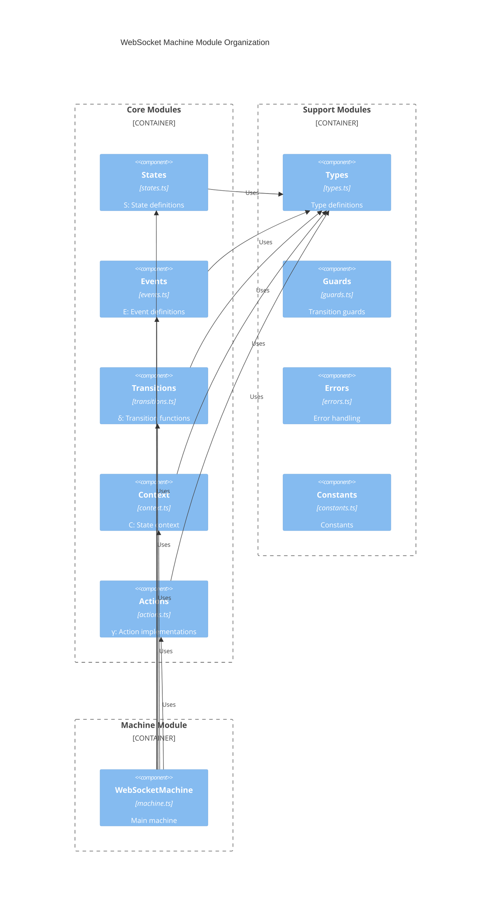

# WebSocket Machine Architecture & Implementation Guide

## 1. Overview & Design Goals

### 1.1 Phased Implementation Strategy

The implementation is divided into two phases:

Phase 1: Core State Machine

- Focus on implementing the formal mathematical definition $M = (S, E, \delta, s_0, C, \gamma, F)$
- Establish foundational reliability and correctness
- Core WebSocket functionality

Phase 2: Advanced Features

- Build on core functionality
- Add performance features
- Enhance monitoring capabilities

### 1.2 Module Organization



## 2. Core Module Implementation

### 2.1 States Module ($S$)

State set and initial state $s_0$.

WebSocket States following mathematical model:
$S = \{s_i \mid i=1,2,...,n; n=6\}$ where each $s_i$ represents a specific state.

- $s_0\in S$ is the initial state (Disconnected)
- $F\subset S$ is the set of final states $F = \{s_{Terminated}\}$

```typescript
/**
 * @fileoverview WebSocket States Module
 * @module @qi/websocket/states
 * 
 * @description
 * Implements WebSocket states following mathematical model:
 * S = {sᵢ | i=1,2,...,n; n=6} where each sᵢ represents a specific state
 * s₀ ∈ S is the initial state (Disconnected)
 * F ⊆ S is the set of final states F = {s_Terminated}
 *
 * @author zhifeng-sz
 * @created 2024-12-29
 */

import { WebSocketEvent } from "./events";
import { TransitionDefinition } from "./types";

/**
 * S₆: Complete state set of the WebSocket machine
 */
export const STATES = {
  DISCONNECTED: "disconnected",   // s₁: Initial state s₀
  CONNECTING: "connecting",       // s₂
  CONNECTED: "connected",         // s₃
  RECONNECTING: "reconnecting",   // s₄
  DISCONNECTING: "disconnecting", // s₅
  TERMINATED: "terminated",       // s₆: Final state ∈ F
} as const;

export type State = keyof typeof STATES;

/**
 * State Schema
 * For each s ∈ S, defines:
 * - Entry actions: γentry ⊆ γ
 * - Exit actions: γexit ⊆ γ
 * - Allowed transitions: {e ∈ E | ∃s' ∈ S: δ(s,e) = (s',γ)}
 * - Error handlers: ε ⊆ γ for error recovery
 */
export const stateSchema: Record<State, StateDefinition> = {
  // s₁: Disconnected (Initial state s₀)
  [STATES.DISCONNECTED]: {
    entry: ["resetConnection", "resetError"],
    on: {
      CONNECT: {
        target: STATES.CONNECTING,
        guards: ["canConnect"],
        actions: ["storeUrl", "logConnection"]
      }
    },
    meta: {
      description: "Initial state, ready to connect",
      invariants: [
        "socket === null",
        "error === undefined",
        "reconnectAttempts === 0"
      ]
    }
  },

  // s₂: Connecting
  [STATES.CONNECTING]: {
    entry: ["createSocket"],
    exit: ["cleanupOnError"],
    on: {
      OPEN: {
        target: STATES.CONNECTED,
        actions: ["resetRetries", "logConnection"]
      },
      ERROR: {
        target: STATES.RECONNECTING,
        guards: ["canRetry"],
        actions: ["handleError", "incrementRetries"]
      },
      CLOSE: {
        target: STATES.DISCONNECTED,
        actions: ["handleError", "cleanupSocket"]
      }
    },
    meta: {
      description: "Attempting to establish connection",
      invariants: [
        "socket !== null",
        "readyState === WebSocket.CONNECTING"
      ]
    }
  },

  // s₃: Connected
  [STATES.CONNECTED]: {
    entry: ["logConnection", "resetError"],
    exit: ["cleanupSocket"],
    on: {
      DISCONNECT: {
        target: STATES.DISCONNECTING,
        actions: ["logDisconnection"]
      },
      ERROR: {
        target: STATES.RECONNECTING,
        guards: ["canRetry"],
        actions: ["handleError", "incrementRetries"]
      },
      MESSAGE: {
        target: STATES.CONNECTED,
        actions: ["processMessage", "enforceRateLimit"]
      },
      SEND: {
        target: STATES.CONNECTED,
        guards: ["canSend"],
        actions: ["sendMessage", "enforceRateLimit"]
      },
      PING: {
        target: STATES.CONNECTED,
        actions: ["handlePing"]
      },
      PONG: {
        target: STATES.CONNECTED,
        actions: ["handlePong"]
      }
    },
    meta: {
      description: "Connection established and active",
      invariants: [
        "socket !== null",
        "readyState === WebSocket.OPEN",
        "error === undefined"
      ]
    }
  },

  // s₄: Reconnecting
  [STATES.RECONNECTING]: {
    entry: ["prepareReconnect"],
    on: {
      RETRY: {
        target: STATES.CONNECTING,
        guards: ["canRetry"],
        actions: ["incrementRetries"]
      },
      MAX_RETRIES: {
        target: STATES.DISCONNECTED,
        actions: ["handleError", "logMaxRetries"]
      },
      ERROR: {
        target: STATES.RECONNECTING,
        guards: ["canRetry"],
        actions: ["handleError", "incrementRetries"]
      }
    },
    meta: {
      description: "Attempting to recover from error",
      invariants: [
        "socket === null",
        "error !== undefined",
        "reconnectAttempts > 0"
      ]
    }
  },

  // s₅: Disconnecting
  [STATES.DISCONNECTING]: {
    entry: ["initiateDisconnect"],
    on: {
      CLOSE: {
        target: STATES.DISCONNECTED,
        actions: ["logDisconnection", "cleanupSocket"]
      },
      ERROR: {
        target: STATES.DISCONNECTED,
        actions: ["handleError", "cleanupSocket"]
      }
    },
    meta: {
      description: "Gracefully closing connection",
      invariants: [
        "socket !== null",
        "readyState === WebSocket.CLOSING"
      ]
    }
  },

  // s₆: Terminated (Final state ∈ F)
  [STATES.TERMINATED]: {
    entry: ["forceTerminate"],
    on: {}, // No transitions out of terminated state
    meta: {
      description: "Connection permanently terminated",
      invariants: [
        "socket === null",
        "status === 'terminated'"
      ]
    }
  }
};

/**
 * Initial state s₀ ∈ S
 */
export const INITIAL_STATE: State = STATES.DISCONNECTED;

/**
 * Final states F ⊆ S
 */
export const FINAL_STATES: Set<State> = new Set([STATES.TERMINATED]);

/**
 * State interface with error handling
 */
export interface StateDefinition {
  entry?: string[];         // Entry actions γentry ⊆ γ
  exit?: string[];          // Exit actions γexit ⊆ γ
  on: {                     // Allowed transitions
    [K in WebSocketEvent['type']]?: TransitionDefinition;
  };
  meta?: {
    description: string;    // State description
    invariants: string[];   // State invariants
  };
}

/**
 * Validates if a state exists in S
 */
export const isValidState = (state: unknown): state is State => {
  return typeof state === "string" && state in STATES;
};

/**
 * Gets all valid transitions from a state
 * Returns {e ∈ E | ∃s' ∈ S: δ(s,e) = (s',γ)}
 */
export const getValidTransitions = (state: State): State[] => {
  return Object.entries(stateSchema[state].on)
    .map(([_, transition]) => transition.target)
    .filter((target): target is State => isValidState(target));
};

/**
 * Checks if state is final
 * Returns true if s ∈ F
 */
export const isFinalState = (state: State): boolean => {
  return FINAL_STATES.has(state);
};

/**
 * Gets entry actions for a state
 * Returns γentry ⊆ γ
 */
export const getEntryActions = (state: State): string[] => {
  return stateSchema[state].entry || [];
};

/**
 * Gets exit actions for a state
 * Returns γexit ⊆ γ
 */
export const getExitActions = (state: State): string[] => {
  return stateSchema[state].exit || [];
};

/**
 * Validates the entire state schema
 * Ensures all states are properly defined with valid transitions
 */
export const validateStateSchema = (): boolean => {
  return Object.values(STATES).every((state) => {
    const definition = stateSchema[state];
    if (!definition) return false;

    // Validate entry/exit actions exist
    const validEntry = !definition.entry || 
                      definition.entry.every(isValidAction);
    const validExit = !definition.exit || 
                     definition.exit.every(isValidAction);

    // Validate transitions refer to valid states
    const validTransitions = Object.values(definition.on).every((transition) =>
      isValidState(transition.target)
    );

    return validEntry && validExit && validTransitions;
  });
};

/**
 * Helper to validate action name
 */
const isValidAction = (action: string): boolean => {
  // Implementation would check against actual action names
  return true; // Simplified for example
};
```

### 2.2 Events Module ($E$)

Event set definitions.

WebSocket Events following mathematical model:

$E = \{e_i \mid i=1,2,...,m; m=12\}$ where each eᵢ represents a specific event type. Each event carries specific payload data relevant to its type.


```typescript
/**
 * @fileoverview WebSocket Events Module
 * @module @qi/websocket/events
 * 
 * @description
 * Implements WebSocket events following mathematical model:
 * E = {eᵢ | i=1,2,...,m; m=12} where each eᵢ represents a specific event type.
 * Each event carries specific payload data relevant to its type.
 *
 * @author zhifeng-sz
 * @created 2024-12-29
 */

import { QueuedMessage } from "./types";
import { WebSocketErrorContext } from "./errors";

/**
 * E₁₂: Complete event set with all possible WebSocket events
 */
export const EVENTS = {
  // Connection Events (e₁ - e₄)
  CONNECT: "CONNECT",       // e₁: Initiate connection
  DISCONNECT: "DISCONNECT", // e₂: Initiate disconnection
  OPEN: "OPEN",            // e₃: Connection established
  CLOSE: "CLOSE",          // e₄: Connection closed

  // Error Events (e₅ - e₈)
  ERROR: "ERROR",          // e₅: Error occurred
  RETRY: "RETRY",          // e₆: Retry connection
  MAX_RETRIES: "MAX_RETRIES", // e₇: Max retries reached
  TERMINATE: "TERMINATE",  // e₈: Force termination

  // Data Events (e₉ - e₁₂)
  MESSAGE: "MESSAGE",      // e₉: Received message
  SEND: "SEND",           // e₁₀: Send message
  PING: "PING",           // e₁₁: Health check ping
  PONG: "PONG"            // e₁₂: Health check response
} as const;

export type EventType = keyof typeof EVENTS;

/**
 * Event Definitions
 * E = {e₁, e₂, ..., e₁₂}
 */
export type WebSocketEvent =
  // e₁: CONNECT - Initiates connection to WebSocket server
  | {
      type: "CONNECT";
      url: string;
      protocols?: string[];
      options?: ConnectionOptions;
    }
  // e₂: DISCONNECT - Initiates graceful disconnection
  | {
      type: "DISCONNECT";
      code?: number;
      reason?: string;
      context?: WebSocketErrorContext;
    }
  // e₃: OPEN - Connection successfully established
  | {
      type: "OPEN";
      event: Event;
      timestamp: number;
    }
  // e₄: CLOSE - Connection closed
  | {
      type: "CLOSE";
      code: number;
      reason: string;
      wasClean: boolean;
      context?: WebSocketErrorContext;
    }
  // e₅: ERROR - Error occurred during operation
  | {
      type: "ERROR";
      error: Error;
      timestamp: number;
      attempt?: number;
      context?: WebSocketErrorContext;
    }
  // e₆: RETRY - Attempt to reconnect
  | {
      type: "RETRY";
      attempt: number;
      delay: number;
      context?: WebSocketErrorContext;
    }
  // e₇: MAX_RETRIES - Maximum retry attempts reached
  | {
      type: "MAX_RETRIES";
      attempts: number;
      lastError?: Error;
      context?: WebSocketErrorContext;
    }
  // e₈: TERMINATE - Force immediate termination
  | {
      type: "TERMINATE";
      code?: number;
      reason?: string;
      immediate?: boolean;
      context?: WebSocketErrorContext;
    }
  // e₉: MESSAGE - Received message from server
  | {
      type: "MESSAGE";
      data: any;
      timestamp: number;
      id?: string;
    }
  // e₁₀: SEND - Send message to server
  | {
      type: "SEND";
      data: any;
      id?: string;
      options?: SendOptions;
    }
  // e₁₁: PING - Health check ping
  | {
      type: "PING";
      timestamp: number;
    }
  // e₁₂: PONG - Health check response
  | {
      type: "PONG";
      latency: number;
      timestamp: number;
    };

/**
 * Connection Options Interface
 */
interface ConnectionOptions {
  reconnect: boolean;
  maxReconnectAttempts: number;
  reconnectInterval: number;
  reconnectBackoffRate: number;
  pingInterval: number;
  pongTimeout: number;
  messageQueueSize: number;
  messageTimeout: number;
  rateLimit: RateLimit;
}

interface RateLimit {
  messages: number;
  window: number;
}

interface SendOptions {
  retry: boolean;
  timeout: number;
  priority: "high" | "normal";
  queueIfOffline: boolean;
}

/**
 * Event Creators
 * Functions to create properly typed events with required payload data
 */
export const createEvent = {
  connect: (
    url: string,
    protocols?: string[],
    options?: ConnectionOptions
  ): WebSocketEvent => ({
    type: EVENTS.CONNECT,
    url,
    protocols,
    options
  }),

  disconnect: (
    code?: number,
    reason?: string,
    context?: WebSocketErrorContext
  ): WebSocketEvent => ({
    type: EVENTS.DISCONNECT,
    code,
    reason,
    context
  }),

  error: (
    error: Error,
    context?: WebSocketErrorContext,
    attempt?: number
  ): WebSocketEvent => ({
    type: EVENTS.ERROR,
    error,
    timestamp: Date.now(),
    attempt,
    context
  }),

  retry: (
    attempt: number,
    delay: number,
    context?: WebSocketErrorContext
  ): WebSocketEvent => ({
    type: EVENTS.RETRY,
    attempt,
    delay,
    context
  }),

  maxRetries: (
    attempts: number,
    lastError?: Error,
    context?: WebSocketErrorContext
  ): WebSocketEvent => ({
    type: EVENTS.MAX_RETRIES,
    attempts,
    lastError,
    context
  }),

  terminate: (
    reason?: string,
    code?: number,
    context?: WebSocketErrorContext,
    immediate?: boolean
  ): WebSocketEvent => ({
    type: EVENTS.TERMINATE,
    code,
    reason,
    immediate,
    context
  })
};

/**
 * Event Validation
 */
export const validateEvent = (event: unknown): event is WebSocketEvent => {
  if (!event || typeof event !== "object" || !("type" in event)) {
    return false;
  }

  const { type } = event as { type: string };

  // Verify event type exists in E
  if (!(type in EVENTS)) {
    return false;
  }

  // Validate required payload data based on event type
  return validateEventPayload(event as WebSocketEvent);
};

/**
 * Helper function to validate event payload data
 */
const validateEventPayload = (event: WebSocketEvent): boolean => {
  switch (event.type) {
    case EVENTS.CONNECT:
      return typeof event.url === "string";

    case EVENTS.OPEN:
      return event.event instanceof Event && 
             typeof event.timestamp === "number";

    case EVENTS.CLOSE:
      return typeof event.code === "number" &&
             typeof event.reason === "string" &&
             typeof event.wasClean === "boolean";

    case EVENTS.ERROR:
      return event.error instanceof Error &&
             typeof event.timestamp === "number";

    case EVENTS.RETRY:
      return typeof event.attempt === "number" &&
             typeof event.delay === "number";

    case EVENTS.MAX_RETRIES:
      return typeof event.attempts === "number";

    default:
      return true;
  }
};

/**
 * Type Guards
 */
export const isErrorEvent = (
  event: WebSocketEvent
): event is Extract<WebSocketEvent, { type: "ERROR" }> =>
  event.type === EVENTS.ERROR;

export const isCloseEvent = (
  event: WebSocketEvent
): event is Extract<WebSocketEvent, { type: "CLOSE" }> =>
  event.type === EVENTS.CLOSE;

export const isRetryEvent = (
  event: WebSocketEvent
): event is Extract<WebSocketEvent, { type: "RETRY" }> =>
  event.type === EVENTS.RETRY;
```

### 2.3 Context Module ($C$)

Context structure and validation.

WebSocket Context following mathematical model:
$$C = (P, V, T)$$
where
  - $P$ = Primary Connection Properties (strings, socket, connection state)
  - $V$ = Metric Values (natural numbers ℕ: messagesSent, messagesReceived, etc.)
  - $T$ = Timing Properties (positive real numbers ℝ⁺ or null: connectTime, etc.)

```typescript
/**
 * @fileoverview WebSocket Context Module
 * @module @qi/websocket/context
 * 
 * @description
 * Implements WebSocket context following mathematical model:
 * C = (P, V, T) where:
 * - P = Primary Connection Properties
 * - V = Metric Values
 * - T = Timing Properties
 *
 * @author zhifeng-sz
 * @created 2024-12-29
 */

import { ApplicationError } from "@qi/core/errors";
import { 
  WebSocketConfig,
  PrimaryConnectionProperties,
  MetricValues,
  TimingProperties,
  ConnectionStatus,
  ReadyState
} from "./types";

/**
 * Complete Context Implementation
 * C = (P, V, T)
 */
export interface WebSocketContext {
  // P: Primary Connection Properties
  connection: PrimaryConnectionProperties;
  
  // V: Metric Values (ℕ - natural numbers)
  metrics: MetricValues;
  
  // T: Timing Properties (ℝ⁺ ∪ {null})
  timing: TimingProperties;
  
  // Configuration
  maxRetries: number;
  rateLimit?: {
    messages: number;
    window: number;
  };
}

/**
 * Creates initial context state
 * Returns C₀: Initial context
 */
export const createInitialContext = (
  config: WebSocketConfig
): WebSocketContext => ({
  connection: {
    url: null,
    protocols: [],
    socket: null,
    status: "disconnected",
    readyState: WebSocket.CLOSED,
    error: undefined
  },
  metrics: {
    messagesSent: 0,
    messagesReceived: 0,
    reconnectAttempts: 0,
    bytesSent: 0,
    bytesReceived: 0,
    errorCount: 0,
    lastRetryTime: null
  },
  timing: {
    connectTime: null,
    disconnectTime: null,
    lastPingTime: null,
    lastPongTime: null,
    windowStart: null,
    terminationTime: null
  },
  maxRetries: config.maxRetries ?? 3,
  rateLimit: config.rateLimit ? {
    messages: config.rateLimit.messages,
    window: config.rateLimit.window
  } : undefined
});

/**
 * Validates a context object
 * Returns true if context satisfies all invariants
 */
export const validateContext = (
  context: unknown
): context is WebSocketContext => {
  if (!context || typeof context !== "object") return false;
  const c = context as Partial<WebSocketContext>;

  // Validate P (Primary Connection Properties)
  if (!validatePrimaryProps(c.connection)) return false;

  // Validate V (Metric Values)
  if (!validateMetricValues(c.metrics)) return false;

  // Validate T (Timing Properties)
  if (!validateTimingProps(c.timing)) return false;

  return typeof c.maxRetries === "number" && c.maxRetries >= 0;
};

/**
 * Helper validators
 */
const validatePrimaryProps = (
  p: unknown
): p is PrimaryConnectionProperties => {
  if (!p || typeof p !== "object") return false;
  const props = p as Partial<PrimaryConnectionProperties>;

  return (
    (typeof props.url === "string" || props.url === null) &&
    Array.isArray(props.protocols) &&
    (props.socket instanceof WebSocket || props.socket === null) &&
    isValidStatus(props.status) &&
    isValidReadyState(props.readyState) &&
    (props.error === undefined || props.error instanceof ApplicationError)
  );
};

const validateMetricValues = (v: unknown): v is MetricValues => {
  if (!v || typeof v !== "object") return false;
  const metrics = v as Partial<MetricValues>;

  return (
    typeof metrics.messagesSent === "number" &&
    metrics.messagesSent >= 0 &&
    typeof metrics.messagesReceived === "number" &&
    metrics.messagesReceived >= 0 &&
    typeof metrics.reconnectAttempts === "number" &&
    metrics.reconnectAttempts >= 0 &&
    typeof metrics.bytesSent === "number" &&
    metrics.bytesSent >= 0 &&
    typeof metrics.bytesReceived === "number" &&
    metrics.bytesReceived >= 0 &&
    typeof metrics.errorCount === "number" &&
    metrics.errorCount >= 0 &&
    (metrics.lastRetryTime === null || typeof metrics.lastRetryTime === "number")
  );
};

const validateTimingProps = (t: unknown): t is TimingProperties => {
  if (!t || typeof t !== "object") return false;
  const timing = t as Partial<TimingProperties>;

  const isPositiveRealOrNull = (n: unknown): boolean =>
    n === null || (typeof n === "number" && n > 0);

  return (
    isPositiveRealOrNull(timing.connectTime) &&
    isPositiveRealOrNull(timing.disconnectTime) &&
    isPositiveRealOrNull(timing.lastPingTime) &&
    isPositiveRealOrNull(timing.lastPongTime) &&
    isPositiveRealOrNull(timing.windowStart) &&
    isPositiveRealOrNull(timing.terminationTime)
  );
};

/**
 * Type Guards for enum-like types
 */
const isValidStatus = (status: unknown): status is ConnectionStatus => {
  return typeof status === "string" && [
    "disconnected",
    "connecting",
    "connected",
    "reconnecting",
    "disconnecting",
    "terminated"
  ].includes(status);
};

const isValidReadyState = (state: unknown): state is ReadyState => {
  return typeof state === "number" && [
    WebSocket.CONNECTING,
    WebSocket.OPEN,
    WebSocket.CLOSING,
    WebSocket.CLOSED
  ].includes(state);
};
```

### 2.4 Actions Module ($\gamma$)

Action implementations.

WebSocket Actions following mathematical model:
$$\gamma: C\times E\rightarrow C, \forall\gamma\in\Gamma$$
where
  - $C$ is the Context triple $(P, V, T)$
  - $E$ is the Event set
  - $\forall\gamma\in\Gamma,\ \gamma: C\times E\rightarrow C$ is a pure function that transforms the context

```typescript
/**
 * @fileoverview WebSocket Actions Module
 * @module @qi/websocket/actions
 * 
 * @description
 * Implements WebSocket actions following mathematical model:
 * γ: C × E → C where:
 * - C is the Context triple (P, V, T)
 * - E is the Event set
 * - Each action γᵢ: C × E → C is a pure function that transforms the context
 *
 * @author zhifeng-sz
 * @created 2024-12-29
 */

import { WebSocketContext } from "./context";
import { WebSocketEvent } from "./events";
import { 
  createWebSocketError, 
  handleWebSocketConnectionError,
  isRecoverableError 
} from "./errors";

type ActionArgs = {
  context: WebSocketContext;
  event: WebSocketEvent;
};

/**
 * γ₁: Store URL
 * γ₁(c, e_CONNECT) = c' where c'.connection.url = e_CONNECT.url
 */
const storeUrl = ({
  context,
  event,
}: ActionArgs): Partial<WebSocketContext> => {
  if (event.type !== "CONNECT") return context;
  return {
    connection: {
      ...context.connection,
      url: event.url,
      protocols: event.protocols || [],
      error: undefined // Clear any previous errors
    }
  };
};

/**
 * γ₂: Reset Retries
 * γ₂(c) = c' where c'.metrics.reconnectAttempts = 0
 */
const resetRetries = ({ context }: ActionArgs): Partial<WebSocketContext> => ({
  metrics: {
    ...context.metrics,
    reconnectAttempts: 0,
    lastRetryTime: null
  }
});

/**
 * γ₃: Handle Error
 * γ₃(c, e_ERROR) = c' where:
 * - c'.connection.error = handleError(e_ERROR)
 * - c'.connection.status = error
 * - c'.timing.disconnectTime = now()
 */
const handleError = ({
  context,
  event,
}: ActionArgs): Partial<WebSocketContext> => {
  if (event.type !== "ERROR") return context;

  const errorContext = {
    url: context.connection.url ?? undefined,
    readyState: context.connection.socket?.readyState,
    reconnectAttempts: context.metrics.reconnectAttempts,
    maxRetries: context.maxRetries,
    messagesSent: context.metrics.messagesSent,
    messagesReceived: context.metrics.messagesReceived,
    lastPingTime: context.timing.lastPingTime ?? undefined,
    lastPongTime: context.timing.lastPongTime ?? undefined
  };

  const error = handleWebSocketConnectionError(event.error, errorContext);

  return {
    connection: {
      ...context.connection,
      status: "error",
      socket: null,
      error
    },
    timing: {
      ...context.timing,
      disconnectTime: Date.now()
    },
    metrics: {
      ...context.metrics,
      errorCount: context.metrics.errorCount + 1
    }
  };
};

/**
 * γ₄: Process Message
 * γ₄(c, e_MESSAGE) = c' where:
 * - c'.metrics.messagesReceived = c.metrics.messagesReceived + 1
 * - c'.metrics.bytesReceived = c.metrics.bytesReceived + size(e_MESSAGE.data)
 */
const processMessage = ({
  context,
  event,
}: ActionArgs): Partial<WebSocketContext> => {
  if (event.type !== "MESSAGE") return context;
  
  try {
    const messageSize = new Blob([event.data]).size;
    return {
      metrics: {
        ...context.metrics,
        messagesReceived: context.metrics.messagesReceived + 1,
        bytesReceived: context.metrics.bytesReceived + messageSize
      }
    };
  } catch (error) {
    // Handle message processing error
    const processError = createWebSocketError(
      "Failed to process message",
      {
        url: context.connection.url ?? undefined,
        messagesSent: context.metrics.messagesSent,
        messagesReceived: context.metrics.messagesReceived
      }
    );
    
    return {
      connection: {
        ...context.connection,
        error: processError
      },
      metrics: {
        ...context.metrics,
        errorCount: context.metrics.errorCount + 1
      }
    };
  }
};

/**
 * γ₅: Send Message
 * γ₅(c, e_SEND) = c' where:
 * - c'.metrics.messagesSent = c.metrics.messagesSent + 1
 * - c'.metrics.bytesSent = c.metrics.bytesSent + size(e_SEND.data)
 */
const sendMessage = ({
  context,
  event,
}: ActionArgs): Partial<WebSocketContext> => {
  if (event.type !== "SEND") return context;

  try {
    const messageSize = new Blob([event.data]).size;
    return {
      metrics: {
        ...context.metrics,
        messagesSent: context.metrics.messagesSent + 1,
        bytesSent: context.metrics.bytesSent + messageSize
      }
    };
  } catch (error) {
    // Handle send error
    const sendError = createWebSocketError(
      "Failed to send message",
      {
        url: context.connection.url ?? undefined,
        messagesSent: context.metrics.messagesSent,
        messagesReceived: context.metrics.messagesReceived
      }
    );

    return {
      connection: {
        ...context.connection,
        error: sendError
      },
      metrics: {
        ...context.metrics,
        errorCount: context.metrics.errorCount + 1
      }
    };
  }
};

/**
 * γ₆: Handle Ping
 * γ₆(c, e_PING) = c' where c'.timing.lastPingTime = e_PING.timestamp
 */
const handlePing = ({
  context,
  event,
}: ActionArgs): Partial<WebSocketContext> => {
  if (event.type !== "PING") return context;
  return {
    timing: {
      ...context.timing,
      lastPingTime: event.timestamp
    }
  };
};

/**
 * γ₇: Handle Pong
 * γ₇(c, e_PONG) = c' where:
 * - c'.timing.lastPongTime = e_PONG.timestamp
 */
const handlePong = ({
  context,
  event,
}: ActionArgs): Partial<WebSocketContext> => {
  if (event.type !== "PONG") return context;
  return {
    timing: {
      ...context.timing,
      lastPongTime: event.timestamp
    },
    connection: {
      ...context.connection,
      error: undefined // Clear any ping timeout errors
    }
  };
};

/**
 * γ₈: Enforce Rate Limit
 * γ₈(c) = c' where:
 * - c'.timing.windowStart = now() if windowExpired(c)
 */
const enforceRateLimit = ({
  context,
}: ActionArgs): Partial<WebSocketContext> => {
  if (!context.rateLimit) return context;

  const now = Date.now();
  const windowExpired =
    context.timing.windowStart === null ||
    now - context.timing.windowStart >= context.rateLimit.window;

  if (windowExpired) {
    return {
      timing: {
        ...context.timing,
        windowStart: now
      }
    };
  }

  // Check if we've exceeded rate limit
  const messageCount = context.metrics.messagesSent + context.metrics.messagesReceived;
  if (messageCount >= context.rateLimit.messages) {
    const rateLimitError = createWebSocketError(
      "Rate limit exceeded",
      {
        url: context.connection.url ?? undefined,
        messagesSent: context.metrics.messagesSent,
        messagesReceived: context.metrics.messagesReceived
      }
    );

    return {
      connection: {
        ...context.connection,
        error: rateLimitError
      }
    };
  }

  return context;
};

/**
 * γ₉: Increment Retries
 * γ₉(c) = c' where c'.metrics.reconnectAttempts = c.metrics.reconnectAttempts + 1
 */
const incrementRetries = ({
  context,
}: ActionArgs): Partial<WebSocketContext> => {
  // Only increment if we haven't exceeded max retries
  if (context.metrics.reconnectAttempts >= context.maxRetries) {
    const maxRetriesError = createWebSocketError(
      "Maximum retry attempts exceeded",
      {
        url: context.connection.url ?? undefined,
        reconnectAttempts: context.metrics.reconnectAttempts,
        maxRetries: context.maxRetries
      }
    );

    return {
      connection: {
        ...context.connection,
        error: maxRetriesError
      },
      metrics: {
        ...context.metrics,
        errorCount: context.metrics.errorCount + 1
      }
    };
  }

  return {
    metrics: {
      ...context.metrics,
      reconnectAttempts: context.metrics.reconnectAttempts + 1,
      lastRetryTime: Date.now()
    }
  };
};

/**
 * γ₁₀: Log Connection
 * γ₁₀(c) = c' where c'.timing.connectTime = now()
 */
const logConnection = ({ context }: ActionArgs): Partial<WebSocketContext> => ({
  timing: {
    ...context.timing,
    connectTime: Date.now()
  },
  connection: {
    ...context.connection,
    error: undefined // Clear any connection errors
  }
});

/**
 * γ₁₁: Force Terminate
 * γ₁₁(c) = c' where:
 * - c'.connection.socket = null
 * - c'.connection.status = terminated
 * - c'.timing.terminationTime = now()
 */
const forceTerminate = ({
  context,
  event,
}: ActionArgs): Partial<WebSocketContext> => {
  const error = event.type === "TERMINATE" && event.reason ? 
    createWebSocketError(
      event.reason,
      {
        url: context.connection.url ?? undefined,
        code: event.code
      }
    ) : context.connection.error;

  return {
    connection: {
      ...context.connection,
      socket: null,
      status: "terminated",
      error
    },
    timing: {
      ...context.timing,
      disconnectTime: Date.now(),
      terminationTime: Date.now()
    }
  };
};

/**
 * γ₁₂: Reset Error State
 * New action for clearing error state
 */
const resetError = ({
  context,
}: ActionArgs): Partial<WebSocketContext> => ({
  connection: {
    ...context.connection,
    error: undefined
  }
});

/**
 * γ₁₃: Cleanup Socket
 * Enhanced with error handling
 */
const cleanupSocket = ({
  context,
  event,
}: ActionArgs): Partial<WebSocketContext> => {
  if (!context.connection.socket) return context;

  // Remove all listeners first
  context.connection.socket.onopen = null;
  context.connection.socket.onclose = null;
  context.connection.socket.onerror = null;
  context.connection.socket.onmessage = null;

  // Close socket if still open
  if (context.connection.socket.readyState === WebSocket.OPEN) {
    try {
      context.connection.socket.close();
    } catch (error) {
      const cleanupError = createWebSocketError(
        "Failed to cleanup socket",
        {
          url: context.connection.url ?? undefined,
          readyState: context.connection.socket.readyState
        }
      );

      return {
        connection: {
          ...context.connection,
          socket: null,
          error: cleanupError
        },
        metrics: {
          ...context.metrics,
          errorCount: context.metrics.errorCount + 1
        }
      };
    }
  }

  return {
    connection: {
      ...context.connection,
      socket: null
    }
  };
};

// Export all actions
export const actions = {
  storeUrl,
  resetRetries,
  handleError,
  processMessage,
  sendMessage,
  handlePing,
  handlePong,
  enforceRateLimit,
  incrementRetries,
  logConnection,
  forceTerminate,
  resetError,
  cleanupSocket
} as const;

// Type for any action in γ
export type Action = (args: ActionArgs) => Partial<WebSocketContext>;
```


### 2.5 Transitions Module ($\delta$)

Transition function.

WebSocket Transitions following mathematical model:
$$\delta: S\times E\rightarrow S\times\Gamma$$
where
  - $S$ is the state set
  - $E$ is the event set
  - $\Gamma$ is the set of actions

Key transitions include:
  - $\delta(s_{\tiny\text{Disconnected}}, e_{\tiny\text{CONNECT}}) = (s_{\tiny\text{Connecting}},\{\gamma_1, \gamma_{10}\})$
  - $\delta(s_{\tiny\text{Connecting}}, e_{\tiny\text{OPEN}}) = (s_{\tiny\text{Connected}}, \{\gamma_2\})$
  - etc.

```typescript
/**
 * @fileoverview WebSocket Transitions Module
 * @module @qi/websocket/transitions
 * 
 * @description
 * Implements WebSocket transitions following mathematical model:
 * δ: S × E → S × Γ where:
 * - S is the state set
 * - E is the event set
 * - Γ is the set of actions
 *
 * @author zhifeng-sz
 * @created 2024-12-29
 */

import { State, STATES } from "./states";
import { WebSocketEvent, EventType } from "./events";
import { Action } from "./actions";

/**
 * TransitionDefinition represents a single transition:
 * δ(s, e) = (s', Γ') where Γ' ⊆ Γ
 */
export interface TransitionDefinition {
  target: State;           // s' - target state
  guards?: string[];       // Predicates that must be true for transition
  actions?: string[];      // Γ' - subset of actions to execute
  errorActions?: string[]; // Error handling actions
  meta?: {
    description: string;
    preconditions: string[];
    postconditions: string[];
    errorHandling?: string[];
  };
}

/**
 * Complete transition map δ: S × E → S × Γ
 */
export const transitions: Record<
  State,
  Partial<Record<EventType, TransitionDefinition>>
> = {
  // From Disconnected State
  [STATES.DISCONNECTED]: {
    CONNECT: {
      target: STATES.CONNECTING,
      guards: ["canConnect"],
      actions: ["storeUrl", "logConnection", "resetError"],
      meta: {
        description: "Initiate connection attempt",
        preconditions: ["No active connection", "Valid URL provided"],
        postconditions: ["Connection attempt started"]
      }
    }
  },

  // From Connecting State
  [STATES.CONNECTING]: {
    OPEN: {
      target: STATES.CONNECTED,
      actions: ["resetRetries", "logConnection"],
      meta: {
        description: "Connection successfully established",
        postconditions: ["Socket in OPEN state", "Error state cleared"]
      }
    },
    ERROR: {
      target: STATES.RECONNECTING,
      guards: ["canRetry"],
      actions: ["handleError", "incrementRetries", "cleanupSocket"],
      meta: {
        description: "Handle connection error with retry",
        errorHandling: ["Record error", "Increment retry counter"]
      }
    },
    CLOSE: {
      target: STATES.DISCONNECTED,
      actions: ["handleError", "cleanupSocket"],
      meta: {
        description: "Connection attempt failed",
        errorHandling: ["Cleanup resources", "Record error"]
      }
    }
  },

  // From Connected State
  [STATES.CONNECTED]: {
    DISCONNECT: {
      target: STATES.DISCONNECTING,
      actions: ["logDisconnection"],
      meta: {
        description: "Initiate graceful disconnection",
        preconditions: ["Active connection exists"]
      }
    },
    ERROR: {
      target: STATES.RECONNECTING,
      guards: ["canRetry"],
      actions: ["handleError", "incrementRetries", "cleanupSocket"],
      meta: {
        description: "Handle connection error with retry",
        errorHandling: ["Record error", "Attempt recovery"]
      }
    },
    MESSAGE: {
      target: STATES.CONNECTED,
      actions: ["processMessage", "enforceRateLimit"],
      errorActions: ["handleError"],
      meta: {
        description: "Process incoming message",
        errorHandling: ["Handle message processing errors"]
      }
    },
    SEND: {
      target: STATES.CONNECTED,
      guards: ["canSend"],
      actions: ["sendMessage", "enforceRateLimit"],
      errorActions: ["handleError"],
      meta: {
        description: "Send outgoing message",
        errorHandling: ["Handle send failures"]
      }
    },
    PING: {
      target: STATES.CONNECTED,
      actions: ["handlePing"],
      errorActions: ["handleError"],
      meta: {
        description: "Handle ping health check",
        errorHandling: ["Record ping failures"]
      }
    },
    PONG: {
      target: STATES.CONNECTED,
      actions: ["handlePong"],
      meta: {
        description: "Handle pong response",
        postconditions: ["Update latency metrics"]
      }
    }
  },

  // From Reconnecting State
  [STATES.RECONNECTING]: {
    RETRY: {
      target: STATES.CONNECTING,
      guards: ["canRetry"],
      actions: ["incrementRetries"],
      meta: {
        description: "Attempt reconnection",
        preconditions: ["Within retry limits"]
      }
    },
    MAX_RETRIES: {
      target: STATES.DISCONNECTED,
      actions: ["handleError", "cleanupSocket"],
      meta: {
        description: "Maximum retries exceeded",
        errorHandling: ["Record final error", "Cleanup resources"]
      }
    },
    ERROR: {
      target: STATES.RECONNECTING,
      guards: ["canRetry"],
      actions: ["handleError", "incrementRetries"],
      meta: {
        description: "Handle reconnection error",
        errorHandling: ["Update error state", "Retry if possible"]
      }
    }
  },

  // From Disconnecting State
  [STATES.DISCONNECTING]: {
    CLOSE: {
      target: STATES.DISCONNECTED,
      actions: ["logDisconnection", "cleanupSocket"],
      meta: {
        description: "Complete graceful disconnection",
        postconditions: ["All resources cleaned up"]
      }
    },
    ERROR: {
      target: STATES.DISCONNECTED,
      actions: ["handleError", "cleanupSocket"],
      meta: {
        description: "Handle disconnection error",
        errorHandling: ["Record error", "Force cleanup"]
      }
    }
  },

  // From Terminated State (Final state)
  [STATES.TERMINATED]: {}, // No transitions out of terminated state
};

/**
 * Validates if a transition exists in δ
 * Returns true if δ(from, event) is defined
 */
export const isValidTransition = (
  from: State,
  event: EventType,
  to: State
): boolean => {
  const transition = transitions[from]?.[event];
  return transition?.target === to;
};

/**
 * Gets all possible transitions from a state
 * Returns {e ∈ E | ∃s' ∈ S: δ(s, e) = (s', Γ')}
 */
export const getPossibleTransitions = (state: State): EventType[] => {
  return Object.keys(transitions[state] || {}) as EventType[];
};

/**
 * Gets the target state for a transition
 * Returns s' where δ(s, e) = (s', Γ')
 */
export const getTargetState = (
  currentState: State,
  event: EventType
): State | undefined => {
  return transitions[currentState]?.[event]?.target;
};

/**
 * Gets actions for a transition
 * Returns Γ' where δ(s, e) = (s', Γ')
 */
export const getTransitionActions = (
  currentState: State,
  event: EventType,
  hasError: boolean = false
): string[] => {
  const transition = transitions[currentState]?.[event];
  if (!transition) return [];

  const baseActions = transition.actions || [];
  return hasError && transition.errorActions
    ? [...baseActions, ...transition.errorActions]
    : baseActions;
};

/**
 * Gets guards for a transition
 * Returns set of predicates that must be true for δ(s, e)
 */
export const getTransitionGuards = (
  currentState: State,
  event: EventType
): string[] => {
  return transitions[currentState]?.[event]?.guards || [];
};

/**
 * Validates the entire transition map
 * Ensures all states and events are handled properly
 */
export const validateTransitionMap = (): boolean => {
  // Check all states have transition definitions
  const allStatesHaveTransitions = Object.values(STATES).every(
    (state) => state in transitions
  );

  // Check all transitions reference valid states and actions
  const allTransitionsValid = Object.entries(transitions).every(
    ([fromState, eventMap]) =>
      Object.entries(eventMap).every(([eventType, def]) => {
        const validTarget = def.target in STATES;
        const validActions =
          def.actions?.every((action) => isValidAction(action)) ?? true;
        const validErrorActions =
          def.errorActions?.every((action) => isValidAction(action)) ?? true;
        return validTarget && validActions && validErrorActions;
      })
  );

  return allStatesHaveTransitions && allTransitionsValid;
};

// Helper to validate action name
const isValidAction = (action: string): boolean => {
  // Implementation would check against actual action names
  return true; // Simplified for example
};
```


## 3. Support Module Implementation

### 3.1 Types Module

#### 3.1.1 Mathematical Representation

A Type System \(\mathscr{T}\) is formally defined as a 3-tuple:
\[
\mathscr{T} = (B, C, V)
\]

Where:
- \( B \) is the set of base types
- \( C \) is the set of composite types
- \( V \) is the set of type validation functions

#### 3.1.2 Base Types (\(B\))
\[
B = \{b_i\mid i=1,2,\dots,n;\ n=5\}
\]
where
\[
\begin{eqnarray}
b_1 &=& \text{String}, \\
b_2 &=& \text{Number}, \\
b_3 &=& \text{Boolean}, \\
b_4 &=& \text{Null}, \\
b_5 &=& \text{Undefined}
\end{eqnarray}
\]

#### 3.1.3 Composite Types (\(C\))
\[
C = \{c_i(t_1,\dots,t_n)\mid i=1,2,3,4\}
\]
where
\[
\begin{eqnarray}
c_1 &=& \text{Record}(k: \text{String}, v: T), \\
c_2 &=& \text{Array}(t: T), \\
c_3 &=& \text{Union}(t_1: T, t_2: T), \\
c_4 &=& \text{Intersection}(t_1: T, t_2: T)
\end{eqnarray}
\]

#### 3.1.4 Source Code

```typescript
/**
 * @fileoverview WebSocket Type Definitions
 * @module @qi/websocket/types
 * 
 * @description
 * Type definitions for the WebSocket state machine.
 * Implements mathematical type system T = (B, C, V)
 *
 * @author zhifeng-sz
 * @created 2024-12-29
 */

import { ApplicationError } from '@qi/core/errors';
import { WebSocketErrorContext } from './errors';
import { State } from './states';
import { WebSocketEvent } from './events';

/**
 * B: Base Types
 * Foundational types for the WebSocket system
 */

// Socket Status Type
export type ConnectionStatus = 
  | 'disconnected'
  | 'connecting'
  | 'connected'
  | 'reconnecting'
  | 'disconnecting'
  | 'terminated';

// Socket ReadyState Type
export type ReadyState = 
  | WebSocket['CONNECTING']
  | WebSocket['OPEN']
  | WebSocket['CLOSING']
  | WebSocket['CLOSED'];

/**
 * C: Composite Types
 * Complex types composed from base types
 */

// Primary Connection Properties
export interface PrimaryConnectionProperties {
  url: string | null;
  protocols: string[];
  socket: WebSocket | null;
  status: ConnectionStatus;
  readyState: ReadyState;
  error?: ApplicationError;
}

// Configuration Types
export interface WebSocketConfig {
  url?: string;
  protocols?: string[];
  maxRetries?: number;
  retryInterval?: number;
  pingInterval?: number;
  pongTimeout?: number;
  messageQueueSize?: number;
  rateLimit?: RateLimitConfig;
}

export interface RateLimitConfig {
  messages: number;    // Messages per window
  window: number;      // Window size in ms
  burstLimit?: number; // Maximum burst size
}

// Message Types
export interface QueuedMessage {
  id: string;
  data: unknown;
  timestamp: number;
  attempts: number;
  timeout?: number;
  priority: 'high' | 'normal';
}

// Metric Types
export interface MetricValues {
  messagesSent: number;
  messagesReceived: number;
  reconnectAttempts: number;
  bytesSent: number;
  bytesReceived: number;
  errorCount: number;
  lastRetryTime: number | null;
}

// Timing Types
export interface TimingProperties {
  connectTime: number | null;
  disconnectTime: number | null;
  lastPingTime: number | null;
  lastPongTime: number | null;
  windowStart: number | null;
  terminationTime: number | null;
}

/**
 * State Machine Types
 * Types for the core state machine implementation
 */

// Machine Definition
export interface MachineDefinition {
  states: Record<State, StateDefinition>;
  events: Record<WebSocketEvent['type'], string>;
  context: WebSocketContext;
  initialState: State;
}

// State Definition
export interface StateDefinition {
  entry?: string[];
  exit?: string[];
  on: {
    [K in WebSocketEvent['type']]?: TransitionDefinition;
  };
  meta?: {
    description: string;
    invariants: string[];
  };
}

// Transition Definition
export interface TransitionDefinition {
  target: State;
  guards?: string[];
  actions?: string[];
  meta?: {
    description: string;
    preconditions: string[];
    postconditions: string[];
  };
}

// Action Types
export interface ActionParams {
  context: WebSocketContext;
  event: WebSocketEvent;
}

export type Action = (params: ActionParams) => Partial<WebSocketContext>;

// Guard Types
export interface GuardParams {
  context: WebSocketContext;
  event: WebSocketEvent;
}

export type Guard = (params: GuardParams) => boolean;

/**
 * V: Validation Types
 * Types for runtime validation functions
 */

// Context Validation
export interface ValidationResult {
  valid: boolean;
  errors?: string[];
}

export interface Validator<T> {
  validate: (value: unknown) => value is T;
  getErrors: () => string[];
}

// Error Validation
export interface ErrorValidation {
  isWebSocketError: (error: unknown) => error is ApplicationError;
  isRecoverableError: (error: unknown) => boolean;
  validateErrorContext: (context: unknown) => context is WebSocketErrorContext;
}

/**
 * Type Guards
 */

export function isConnectionStatus(value: unknown): value is ConnectionStatus {
  return typeof value === 'string' && 
    ['disconnected', 'connecting', 'connected', 'reconnecting', 'disconnecting', 'terminated'].includes(value);
}

export function isReadyState(value: unknown): value is ReadyState {
  return typeof value === 'number' && 
    [WebSocket.CONNECTING, WebSocket.OPEN, WebSocket.CLOSING, WebSocket.CLOSED].includes(value);
}

export function isQueuedMessage(value: unknown): value is QueuedMessage {
  if (!value || typeof value !== 'object') return false;
  const msg = value as Partial<QueuedMessage>;
  return typeof msg.id === 'string' &&
         msg.data !== undefined &&
         typeof msg.timestamp === 'number' &&
         typeof msg.attempts === 'number' &&
         (msg.timeout === undefined || typeof msg.timeout === 'number') &&
         (msg.priority === 'high' || msg.priority === 'normal');
}

export function validateMetricValues(metrics: unknown): metrics is MetricValues {
  if (!metrics || typeof metrics !== 'object') return false;
  const m = metrics as Partial<MetricValues>;
  return typeof m.messagesSent === 'number' &&
         typeof m.messagesReceived === 'number' &&
         typeof m.reconnectAttempts === 'number' &&
         typeof m.bytesSent === 'number' &&
         typeof m.bytesReceived === 'number' &&
         typeof m.errorCount === 'number' &&
         (m.lastRetryTime === null || typeof m.lastRetryTime === 'number');
}
```
#### 3.1.4 Example Type Constructions

1. WebSocket Message Type:
\[
\text{Message} = \text{Record}(\{\text{type}: \text{String}, \text{data}: \text{Union}(\text{String}, \text{ArrayBuffer})\})
\]

2. Connection Status Type:
\[
\text{Status} = \text{Union}(\text{Literal}(\text{'connected'}), \text{Literal}(\text{'disconnected'}))
\]

### 3.2 Guards Module

Implements mathematical model
$$G = (P, \Gamma, \Psi, \Omega)$$
where:
 - $P$: Set of predicate functions
 - $\Gamma$: Guard compositions
 - $\Psi$: Guard evaluation context
 - $\Omega$: Guard operators

```typescript
// src/core/guards.ts
/**
 * Guards Module Implementation
 * Implements mathematical model G = (P, Γ, Ψ, Ω) where:
 * - P: Set of predicate functions
 * - Γ: Guard compositions
 * - Ψ: Guard evaluation context
 * - Ω: Guard operators
 */

import { WebSocketContext } from '../core/context.js';
import { WebSocketEvent } from '../core/events.js';
import { createError } from './errors.js';

/**
 * Guard Context (Ψ)
 * Ψ = (C, E, H)
 */
interface GuardContext {
  context: WebSocketContext;   // C: Machine context
  event: WebSocketEvent;       // E: Triggering event
  history?: GuardHistory;      // H: Execution history (optional)
}

interface GuardHistory {
  lastExecution: number;
  executionCount: number;
  lastResult: boolean;
}

/**
 * Base Guard Type (P)
 * p: C × E → {true, false}
 */
export type Guard = (args: GuardContext) => boolean;

/**
 * Predicate Functions Implementation (P)
 * P = {p₁, p₂, ..., pₙ}
 */

/**
 * p₁: Can Connect Guard
 * Predicate: url exists ∧ socket is null ∧ retries = 0
 */
export const canConnect: Guard = ({ context }) => {
  const { connection, metrics } = context;
  return (
    typeof connection.url === 'string' &&
    connection.socket === null &&
    metrics.reconnectAttempts === 0
  );
};

/**
 * p₂: Can Retry Guard
 * Predicate: retryCount < maxRetries ∧ error is recoverable
 */
export const canRetry: Guard = ({ context }) => {
  const { metrics } = context;
  const maxRetries = 3; // Should come from config
  return metrics.reconnectAttempts < maxRetries;
};

/**
 * p₃: Is Connected Guard
 * Predicate: socket exists ∧ socket.readyState = OPEN
 */
export const isConnected: Guard = ({ context }) => {
  const { connection } = context;
  return (
    connection.socket !== null &&
    connection.socket.readyState === WebSocket.OPEN
  );
};

/**
 * p₄: Has Error Guard
 * Predicate: status = error
 */
export const hasError: Guard = ({ context }) => {
  const { connection } = context;
  return connection.status === 'error';
};

/**
 * p₅: Can Send Guard
 * Predicate: isConnected ∧ not rate limited
 */
export const canSend: Guard = ({ context }) => {
  const { timing } = context;
  const isRateLimited = timing.windowStart !== null &&
    Date.now() - timing.windowStart < 1000; // Rate limit window
  return isConnected({ context, event: { type: 'SEND', data: null } }) && !isRateLimited;
};

/**
 * p₆: Should Reconnect Guard
 * Predicate: canRetry ∧ (close event ∨ error event)
 */
export const shouldReconnect: Guard = ({ context, event }) => {
  if (event.type !== 'CLOSE' && event.type !== 'ERROR') return false;
  return canRetry({ context, event });
};

/**
 * p₇: Is Clean Disconnect Guard
 * Predicate: normal closure code ∧ was clean disconnect
 */
export const isCleanDisconnect: Guard = ({ event }) => {
  if (event.type !== 'CLOSE') return false;
  return event.code === 1000 && event.wasClean;
};

/**
 * p₈: Can Terminate Guard
 * Predicate: true (termination always allowed)
 */
export const canTerminate: Guard = () => true;

/**
 * Guard Composition Implementation (Γ)
 * Γ = {γ₁, γ₂, γ₃}
 */

/**
 * γ₁: AND Composition
 * γ₁(p₁, p₂)(c, e) = p₁(c, e) ∧ p₂(c, e)
 */
export const and = (guards: Guard[]): Guard =>
  (args: GuardContext) => guards.every(guard => guard(args));

/**
 * γ₂: OR Composition
 * γ₂(p₁, p₂)(c, e) = p₁(c, e) ∨ p₂(c, e)
 */
export const or = (guards: Guard[]): Guard =>
  (args: GuardContext) => guards.some(guard => guard(args));

/**
 * γ₃: NOT Composition
 * γ₃(p)(c, e) = ¬p(c, e)
 */
export const not = (guard: Guard): Guard =>
  (args: GuardContext) => !guard(args);

/**
 * Guard Operators Implementation (Ω)
 * Ω = {ω₁, ω₂, ω₃, ω₄}
 */

/**
 * ω₁: Sequence Operator
 * (p₁ ▷ p₂)(c, e) = p₁(c, e) ∧ p₂(c', e)
 */
export const sequence = (guard1: Guard, guard2: Guard): Guard =>
  (args: GuardContext) => {
    if (!guard1(args)) return false;
    // Execute second guard with potentially modified context
    return guard2(args);
  };

/**
 * ω₂: Parallel Operator
 * (p₁ ∥ p₂)(c, e) = p₁(c, e) ∧ p₂(c, e)
 */
export const parallel = and;

/**
 * ω₃: Timeout Operator
 * p_t(c, e, t) = p(c, e) ∧ time(e) ≤ t
 */
export const withTimeout = (guard: Guard, timeout: number): Guard =>
  (args: GuardContext) => {
    const start = Date.now();
    const result = guard(args);
    return result && (Date.now() - start <= timeout);
  };

/**
 * ω₄: Debounce Operator
 * p_d(c, e, d) = p(c, e) ∧ (time(e) - time(e_last)) > d
 */
export const debounce = (guard: Guard, delay: number): Guard => {
  let lastExecuted = 0;
  return (args: GuardContext) => {
    const now = Date.now();
    if (now - lastExecuted <= delay) return false;
    const result = guard(args);
    if (result) lastExecuted = now;
    return result;
  };
};

/**
 * Guard Validation
 */
export const validateGuard = (guard: Guard, args: GuardContext): boolean => {
  try {
    const result = guard(args);
    return typeof result === 'boolean';
  } catch {
    return false;
  }
};

/**
 * Combined Guards Map
 */
export const guards = {
  canConnect,
  canRetry,
  isConnected,
  hasError,
  canSend,
  shouldReconnect,
  isCleanDisconnect,
  canTerminate
} as const;

/**
 * Guard Type Helper
 */
export type GuardName = keyof typeof guards;

/**
 * Composite Guards
 */
export const compositeGuards = {
  canReconnect: and([canRetry, shouldReconnect]),
  canSendMessage: and([isConnected, canSend]),
  shouldTerminate: or([isCleanDisconnect, hasError])
};

export {
  type Guard,
  type GuardContext,
  type GuardHistory
};
```

### 3.3 Errors Module

Implements error handling based on the mathematical model:
$$\varepsilon = (K, R, H)$$
where
  - $K$: Error categories
  - $R$: Recovery strategies
  - $H$: Error history

```typescript
// src/support/errors.ts
/**
 * Error Support Module
 * Implements error handling based on the mathematical model:
 * ε = (K, R, H) where:
 * - K: Error categories
 * - R: Recovery strategies
 * - H: Error history
 */

/**
 * K: Error Categories
 * Formal categorization of error types
 */
export enum ErrorCategory {
  // Protocol Errors: ep ∈ K
  PROTOCOL = 'protocol',     // WebSocket protocol violations
  
  // Network Errors: en ∈ K
  NETWORK = 'network',       // Connection and transmission errors
  
  // Application Errors: ea ∈ K
  APPLICATION = 'application', // Logic and state errors
  
  // Resource Errors: er ∈ K
  RESOURCE = 'resource',      // Resource management errors
  
  // Timing Errors: et ∈ K
  TIMEOUT = 'timeout'         // Temporal constraint violations
}

/**
 * Error Classification
 * Maps error instances to formal categories
 */
interface ErrorClassification {
  category: ErrorCategory;     // k ∈ K
  recoverable: boolean;        // r ∈ {true, false}
  retryable: boolean;         // t ∈ {true, false}
  severity: ErrorSeverity;    // s ∈ {low, medium, high}
}

/**
 * Error Severity Levels
 * s ∈ {low, medium, high}
 */
export enum ErrorSeverity {
  LOW = 'low',       // Non-critical errors
  MEDIUM = 'medium', // Important but non-fatal
  HIGH = 'high'      // Critical errors
}

/**
 * WebSocket Error Implementation
 * ε = (k, r, m) where:
 * - k ∈ K (category)
 * - r ∈ R (recovery strategy)
 * - m (metadata)
 */
export class WebSocketError extends Error {
  constructor(
    message: string,
    public readonly classification: ErrorClassification,
    public readonly metadata: Record<string, unknown> = {}
  ) {
    super(message);
    this.name = 'WebSocketError';
  }

  /**
   * Error recovery predicate
   * r: ε → {true, false}
   */
  isRecoverable(): boolean {
    return this.classification.recoverable;
  }

  /**
   * Retry predicate
   * t: ε → {true, false}
   */
  isRetryable(): boolean {
    return this.classification.retryable;
  }
}

/**
 * R: Recovery Strategies
 * Formal definition of error recovery approaches
 */
interface RecoveryStrategy {
  maxAttempts: number;        // n ∈ ℕ
  backoffFactor: number;      // b ∈ ℝ⁺
  timeout: number;            // t ∈ ℝ⁺
  action: () => Promise<void>;
}

/**
 * H: Error History
 * Maintains temporal sequence of errors
 */
interface ErrorRecord {
  timestamp: number;  // t ∈ ℝ⁺
  error: WebSocketError;
  recovery?: RecoveryStrategy;
}

/**
 * Error History Implementation
 * H = {h₁, h₂, ..., hₙ} where hᵢ ∈ ErrorRecord
 */
export class ErrorHistory {
  private records: ErrorRecord[] = [];
  private readonly maxSize: number;

  constructor(maxSize: number = 100) {
    this.maxSize = maxSize;
  }

  /**
   * Adds error record to history
   * H' = H ∪ {h}
   */
  addRecord(error: WebSocketError, recovery?: RecoveryStrategy): void {
    const record: ErrorRecord = {
      timestamp: Date.now(),
      error,
      recovery
    };

    this.records.push(record);
    if (this.records.length > this.maxSize) {
      this.records.shift();
    }
  }

  /**
   * Gets error history within time window
   * H(t₁, t₂) = {h ∈ H | t₁ ≤ h.timestamp ≤ t₂}
   */
  getRecords(startTime: number, endTime: number): ErrorRecord[] {
    return this.records.filter(
      record => record.timestamp >= startTime && record.timestamp <= endTime
    );
  }

  /**
   * Gets errors by category
   * H(k) = {h ∈ H | h.error.category = k}
   */
  getByCategory(category: ErrorCategory): ErrorRecord[] {
    return this.records.filter(
      record => record.error.classification.category === category
    );
  }
}

/**
 * Error Factory
 * Creates properly classified errors
 */
export const createError = {
  protocol: (message: string, metadata?: Record<string, unknown>): WebSocketError => {
    return new WebSocketError(message, {
      category: ErrorCategory.PROTOCOL,
      recoverable: false,
      retryable: false,
      severity: ErrorSeverity.HIGH
    }, metadata);
  },

  network: (message: string, metadata?: Record<string, unknown>): WebSocketError => {
    return new WebSocketError(message, {
      category: ErrorCategory.NETWORK,
      recoverable: true,
      retryable: true,
      severity: ErrorSeverity.MEDIUM
    }, metadata);
  },

  application: (message: string, metadata?: Record<string, unknown>): WebSocketError => {
    return new WebSocketError(message, {
      category: ErrorCategory.APPLICATION,
      recoverable: true,
      retryable: false,
      severity: ErrorSeverity.MEDIUM
    }, metadata);
  },

  resource: (message: string, metadata?: Record<string, unknown>): WebSocketError => {
    return new WebSocketError(message, {
      category: ErrorCategory.RESOURCE,
      recoverable: true,
      retryable: true,
      severity: ErrorSeverity.LOW
    }, metadata);
  },

  timeout: (message: string, metadata?: Record<string, unknown>): WebSocketError => {
    return new WebSocketError(message, {
      category: ErrorCategory.TIMEOUT,
      recoverable: true,
      retryable: true,
      severity: ErrorSeverity.LOW
    }, metadata);
  }
};

/**
 * Error Predicates
 */
export const errorPredicates = {
  /**
   * Protocol error predicate
   * ep: ε → {true, false}
   */
  isProtocolError: (error: Error): error is WebSocketError => {
    return error instanceof WebSocketError &&
           error.classification.category === ErrorCategory.PROTOCOL;
  },

  /**
   * Network error predicate
   * en: ε → {true, false}
   */
  isNetworkError: (error: Error): error is WebSocketError => {
    return error instanceof WebSocketError &&
           error.classification.category === ErrorCategory.NETWORK;
  },

  /**
   * Recoverable error predicate
   * er: ε → {true, false}
   */
  isRecoverableError: (error: Error): error is WebSocketError => {
    return error instanceof WebSocketError &&
           error.classification.recoverable;
  }
};

/**
 * Recovery Strategy Factory
 */
export const createRecoveryStrategy = (
  category: ErrorCategory
): RecoveryStrategy => {
  switch (category) {
    case ErrorCategory.NETWORK:
      return {
        maxAttempts: 5,
        backoffFactor: 2,
        timeout: 30000,
        action: async () => { /* Implement network recovery */ }
      };
    case ErrorCategory.PROTOCOL:
      return {
        maxAttempts: 1,
        backoffFactor: 1,
        timeout: 5000,
        action: async () => { /* Implement protocol recovery */ }
      };
    // Add other strategies...
    default:
      return {
        maxAttempts: 3,
        backoffFactor: 1.5,
        timeout: 15000,
        action: async () => { /* Implement default recovery */ }
      };
  }
};

/**
 * Error Analysis
 * Provides metrics and analysis of error patterns
 */
export class ErrorAnalyzer {
  constructor(private history: ErrorHistory) {}

  /**
   * Analyzes error frequency
   * f(k, Δt) = |H(k, t-Δt, t)| / Δt
   */
  getErrorFrequency(
    category: ErrorCategory,
    timeWindow: number
  ): number {
    const now = Date.now();
    const startTime = now - timeWindow;
    const records = this.history.getRecords(startTime, now);
    const categoryRecords = records.filter(
      r => r.error.classification.category === category
    );
    return categoryRecords.length / timeWindow;
  }

  /**
   * Analyzes recovery success rate
   * r(k) = |Successful(H(k))| / |H(k)|
   */
  getRecoveryRate(category: ErrorCategory): number {
    const records = this.history.getByCategory(category);
    if (records.length === 0) return 1;

    const successfulRecoveries = records.filter(
      r => r.error.classification.recoverable && r.recovery
    );
    return successfulRecoveries.length / records.length;
  }

  /**
   * Determines if error pattern indicates systemic issue
   * s(k, θ) = f(k, Δt) > θ where θ is threshold
   */
  isSystemicIssue(
    category: ErrorCategory,
    timeWindow: number,
    threshold: number
  ): boolean {
    return this.getErrorFrequency(category, timeWindow) > threshold;
  }
}

/**
 * Error Recovery Executor
 * Implements recovery strategies
 */
export class RecoveryExecutor {
  private attempts: Map<string, number> = new Map();

  /**
   * Executes recovery strategy
   * Returns success status
   */
  async executeStrategy(
    error: WebSocketError,
    strategy: RecoveryStrategy
  ): Promise<boolean> {
    const errorId = this.getErrorId(error);
    const currentAttempts = this.attempts.get(errorId) || 0;

    if (currentAttempts >= strategy.maxAttempts) {
      return false;
    }

    try {
      const backoffDelay = this.calculateBackoff(
        currentAttempts,
        strategy.backoffFactor
      );
      await this.delay(backoffDelay);
      await strategy.action();
      
      this.attempts.set(errorId, currentAttempts + 1);
      return true;
    } catch {
      return false;
    }
  }

  /**
   * Calculates exponential backoff
   * b(n) = initialDelay * factor^n
   */
  private calculateBackoff(attempt: number, factor: number): number {
    const baseDelay = 1000; // 1 second
    return baseDelay * Math.pow(factor, attempt);
  }

  private getErrorId(error: WebSocketError): string {
    return `${error.classification.category}-${error.message}`;
  }

  private delay(ms: number): Promise<void> {
    return new Promise(resolve => setTimeout(resolve, ms));
  }

  /**
   * Resets recovery attempts for an error
   */
  resetAttempts(error: WebSocketError): void {
    this.attempts.delete(this.getErrorId(error));
  }
}

/**
 * Error Monitoring Interface
 * Provides error monitoring capabilities
 */
export interface ErrorMonitor {
  onError: (error: WebSocketError) => void;
  onRecovery: (error: WebSocketError, successful: boolean) => void;
  onSystemicIssue: (category: ErrorCategory) => void;
}

/**
 * Default Error Monitor Implementation
 */
export class DefaultErrorMonitor implements ErrorMonitor {
  constructor(
    private analyzer: ErrorAnalyzer,
    private executor: RecoveryExecutor
  ) {}

  onError(error: WebSocketError): void {
    // Implement error handling
  }

  onRecovery(error: WebSocketError, successful: boolean): void {
    // Implement recovery monitoring
  }

  onSystemicIssue(category: ErrorCategory): void {
    // Implement systemic issue detection
  }
}

// Export all for module integration
export {
  WebSocketError,
  ErrorCategory,
  ErrorSeverity,
  ErrorHistory,
  ErrorAnalyzer,
  RecoveryExecutor,
  createError,
  errorPredicates,
  createRecoveryStrategy
};
```

### 3.4 Resources Module

Implements resource lifecycle management based on mathematical model:
$$R = (L, A, M)$$
where
  - $L$: Resource lifecycle states
  - $A$: Resource acquisition/release operations
  - $M$: Resource monitoring and metrics

```typescript
// src/support/resources.ts
/**
 * Resource Management Module
 * Implements resource lifecycle management based on mathematical model:
 * R = (L, A, M) where:
 * - L: Resource lifecycle states
 * - A: Resource acquisition/release operations
 * - M: Resource monitoring and metrics
 */

import { WebSocketError, ErrorCategory, createError } from './errors';

/**
 * L: Resource Lifecycle States
 * L = {free, acquired, failed}
 */
enum ResourceState {
  FREE = 'free',         // Resource available
  ACQUIRED = 'acquired', // Resource in use
  FAILED = 'failed'      // Resource error state
}

/**
 * Resource Types
 * T = {socket, timer, listener}
 */
export type ResourceType = 'socket' | 'timer' | 'listener';

/**
 * Resource Definition
 * r = (t, s, m) where:
 * - t ∈ T (type)
 * - s ∈ L (state)
 * - m (metadata)
 */
interface Resource<T> {
  type: ResourceType;
  state: ResourceState;
  value: T | null;
  metadata: ResourceMetadata;
}

interface ResourceMetadata {
  createdAt: number;     // Creation timestamp
  lastUsed: number;      // Last usage timestamp
  errorCount: number;    // Error counter
  retryCount: number;    // Retry counter
}

/**
 * Resource Manager Implementation
 * Manages lifecycle of resources R
 */
export class ResourceManager {
  private resources: Map<string, Resource<any>> = new Map();
  private listeners: Set<ResourceListener> = new Set();

  /**
   * Creates a new resource
   * r' = create(t) where t ∈ T
   */
  createResource<T>(
    id: string,
    type: ResourceType,
    initialValue: T | null = null
  ): Resource<T> {
    const resource: Resource<T> = {
      type,
      state: ResourceState.FREE,
      value: initialValue,
      metadata: {
        createdAt: Date.now(),
        lastUsed: Date.now(),
        errorCount: 0,
        retryCount: 0
      }
    };
    this.resources.set(id, resource);
    this.notifyListeners('create', id, resource);
    return resource;
  }

  /**
   * Acquires a resource
   * s' = acquire(r) where s' ∈ L
   */
  async acquireResource<T>(id: string): Promise<T> {
    const resource = this.resources.get(id);
    if (!resource) {
      throw createError.resource(`Resource ${id} not found`);
    }

    if (resource.state === ResourceState.ACQUIRED) {
      throw createError.resource(`Resource ${id} already acquired`);
    }

    try {
      resource.state = ResourceState.ACQUIRED;
      resource.metadata.lastUsed = Date.now();
      this.notifyListeners('acquire', id, resource);
      return resource.value;
    } catch (error) {
      resource.state = ResourceState.FAILED;
      resource.metadata.errorCount++;
      throw error;
    }
  }

  /**
   * Releases a resource
   * s' = release(r) where s' ∈ L
   */
  async releaseResource(id: string): Promise<void> {
    const resource = this.resources.get(id);
    if (!resource) {
      throw createError.resource(`Resource ${id} not found`);
    }

    try {
      await this.cleanup(resource);
      resource.state = ResourceState.FREE;
      resource.metadata.lastUsed = Date.now();
      this.notifyListeners('release', id, resource);
    } catch (error) {
      resource.state = ResourceState.FAILED;
      resource.metadata.errorCount++;
      throw error;
    }
  }

  /**
   * Resource cleanup implementation by type
   */
  private async cleanup(resource: Resource<any>): Promise<void> {
    switch (resource.type) {
      case 'socket':
        if (resource.value instanceof WebSocket) {
          this.cleanupSocket(resource.value);
        }
        break;
      case 'timer':
        if (typeof resource.value === 'number') {
          clearTimeout(resource.value);
        }
        break;
      case 'listener':
        if (typeof resource.value === 'function') {
          // Remove event listener
          resource.value = null;
        }
        break;
    }
  }

  /**
   * Socket-specific cleanup
   */
  private cleanupSocket(socket: WebSocket): void {
    // Remove all listeners first
    socket.onopen = null;
    socket.onclose = null;
    socket.onerror = null;
    socket.onmessage = null;
    
    // Close socket if still open
    if (socket.readyState === WebSocket.OPEN) {
      socket.close();
    }
  }

  /**
   * Resource monitoring
   */
  addListener(listener: ResourceListener): void {
    this.listeners.add(listener);
  }

  removeListener(listener: ResourceListener): void {
    this.listeners.delete(listener);
  }

  private notifyListeners(
    event: ResourceEvent,
    id: string,
    resource: Resource<any>
  ): void {
    this.listeners.forEach(listener => {
      listener.onResourceEvent(event, id, resource);
    });
  }

  /**
   * Resource state query predicates
   */
  isResourceAcquired(id: string): boolean {
    return this.resources.get(id)?.state === ResourceState.ACQUIRED;
  }

  isResourceFree(id: string): boolean {
    return this.resources.get(id)?.state === ResourceState.FREE;
  }

  isResourceFailed(id: string): boolean {
    return this.resources.get(id)?.state === ResourceState.FAILED;
  }

  /**
   * Resource metrics collection
   * M: Resource metrics
   */
  getResourceMetrics(id: string): ResourceMetrics | null {
    const resource = this.resources.get(id);
    if (!resource) return null;

    return {
      uptime: Date.now() - resource.metadata.createdAt,
      lastUsed: resource.metadata.lastUsed,
      errorRate: resource.metadata.errorCount / Math.max(1, resource.metadata.retryCount),
      state: resource.state
    };
  }
}

/**
 * Resource Event Types
 */
type ResourceEvent = 'create' | 'acquire' | 'release' | 'error';

/**
 * Resource Listener Interface
 */
interface ResourceListener {
  onResourceEvent(
    event: ResourceEvent,
    id: string,
    resource: Resource<any>
  ): void;
}

/**
 * Resource Metrics Interface
 */
interface ResourceMetrics {
  uptime: number;        // Time since creation
  lastUsed: number;      // Last usage timestamp
  errorRate: number;     // Error rate calculation
  state: ResourceState;  // Current state
}

export {
  ResourceState,
  Resource,
  ResourceListener,
  ResourceMetrics
};
```

### 3.5 Constants Module

Implements Constants module based on the mathematical model
$$K = (V, R, T)$$
where
  - $V$: Value set (the constant values themselves)
  - $R$: Relationship functions (like isValid predicates)
  - $T$: Type constraints

```typescript
// src/support/constants.ts
/**
 * WebSocket Constants Module
 */

/**
 * WebSocket Close Codes
 * As defined in RFC 6455
 */
export const WS_CODES = {
  NORMAL_CLOSURE: 1000,      // Normal closure; the connection successfully completed
  GOING_AWAY: 1001,         // Client is leaving (browser tab closing)
  PROTOCOL_ERROR: 1002,     // Protocol error
  UNSUPPORTED_DATA: 1003,   // Received data of a type it cannot handle
  NO_STATUS: 1005,          // Expected a status code but didn't get one
  ABNORMAL_CLOSURE: 1006,   // Connection was closed abnormally
  INVALID_PAYLOAD: 1007,    // Received data that wasn't consistent with the message type
  POLICY_VIOLATION: 1008,   // Received a message that violates policy
  MESSAGE_TOO_BIG: 1009,    // Message is too big to process
  MISSING_EXTENSION: 1010,  // Client expected the server to negotiate extension
  INTERNAL_ERROR: 1011,     // Server encountered an error
  SERVICE_RESTART: 1012,    // Server is restarting
  TRY_AGAIN_LATER: 1013,    // Server is temporarily unavailable
  BAD_GATEWAY: 1014,        // Gateway server received invalid response
  TLS_HANDSHAKE: 1015      // TLS handshake failed
} as const;

/**
 * Configuration Defaults
 */
export const CONFIG = {
  // Connection
  DEFAULT_RETRY_COUNT: 3,
  DEFAULT_RETRY_INTERVAL: 1000,    // 1 second
  DEFAULT_CONNECT_TIMEOUT: 10000,  // 10 seconds
  DEFAULT_MESSAGE_QUEUE_SIZE: 100,

  // Rate Limiting
  DEFAULT_RATE_LIMIT: {
    messages: 100,  // messages per window
    window: 60000   // 1 minute window
  },

  // Health Check
  DEFAULT_PING_INTERVAL: 30000,    // 30 seconds
  DEFAULT_PONG_TIMEOUT: 5000,      // 5 seconds
  DEFAULT_HEALTH_CHECK_SAMPLES: 10
} as const;

/**
 * Time Constants
 */
export const TIMING = {
  // Retry Timing
  MIN_RETRY_DELAY: 1000,      // 1 second
  MAX_RETRY_DELAY: 30000,     // 30 seconds
  BACKOFF_FACTOR: 2,          // Exponential backoff multiplier
  JITTER_MAX: 100,            // Maximum jitter in ms

  // Queue Processing
  QUEUE_PROCESS_INTERVAL: 100, // 100ms
  MAX_BATCH_SIZE: 10,         // Maximum batch size for queue processing

  // Health Check
  MIN_PING_INTERVAL: 1000,    // Minimum time between pings
  MAX_PING_INTERVAL: 300000   // Maximum time between pings (5 minutes)
} as const;

/**
 * Message Types
 */
export const MESSAGE_TYPES = {
  TEXT: 'text',
  BINARY: 'binary',
  PING: 'ping',
  PONG: 'pong'
} as const;

/**
 * Connection States
 */
export const CONNECTION_STATES = {
  CONNECTING: WebSocket.CONNECTING,
  OPEN: WebSocket.OPEN,
  CLOSING: WebSocket.CLOSING,
  CLOSED: WebSocket.CLOSED
} as const;

/**
 * Error Categories
 */
export const ERROR_CATEGORIES = {
  NETWORK: 'network',
  PROTOCOL: 'protocol',
  APPLICATION: 'application',
  TIMEOUT: 'timeout',
  RESOURCE: 'resource'
} as const;

/**
 * Health States
 */
export const HEALTH_STATES = {
  HEALTHY: 'healthy',
  DEGRADED: 'degraded',
  UNHEALTHY: 'unhealthy'
} as const;

/**
 * Protocol Constants
 */
export const PROTOCOL = {
  VERSION: '13',                   // WebSocket protocol version
  GUID: '258EAFA5-E914-47DA-95CA-C5AB0DC85B11', // WebSocket GUID
  MAX_FRAME_SIZE: 65535,          // Maximum WebSocket frame size
  MAX_MESSAGE_SIZE: 1024 * 1024   // Maximum message size (1MB)
} as const;

/**
 * Type Guards
 */
export const isValidCloseCode = (code: number): boolean =>
  Object.values(WS_CODES).includes(code);

export const isValidHealthState = (state: string): boolean =>
  Object.values(HEALTH_STATES).includes(state as any);

export const isValidMessageType = (type: string): boolean =>
  Object.values(MESSAGE_TYPES).includes(type as any);

/**
 * Export all constant types
 */
export type WSCode = typeof WS_CODES[keyof typeof WS_CODES];
export type MessageType = typeof MESSAGE_TYPES[keyof typeof MESSAGE_TYPES];
export type HealthState = typeof HEALTH_STATES[keyof typeof HEALTH_STATES];
export type ErrorCategory = typeof ERROR_CATEGORIES[keyof typeof ERROR_CATEGORIES];
```

### 3.6 Errors Module

#### 3.6.1 Mathematical Model

##### 3.6.1.1 WebSocket Error System ($\mathcal{W}_\varepsilon$)

A WebSocket Error System is formally defined as a 5-tuple:
\[
\mathcal{W}_\varepsilon = (E, K, \mathcal{R}, \mathcal{M}, \Phi)
\]

Where:
- $E$ is the set of error types
- $K$ is the error classification function
- $\mathcal{R}$ is the recovery strategy set
- $\mathcal{M}$ is the error metadata system
- $\Phi$ is the error transformation function

##### 3.6.1.2 Error Types ($E$)

The set of WebSocket-specific error types:
\[
E = \{e_i \mid i=1,2,\dots,n;\ n=14\}
\]
where
\[
\begin{eqnarray}
e_1 &=& \text{WEBSOCKET_ERROR}: \text{Base WebSocket error} \\
e_2 &=& \text{WEBSOCKET_CLOSED}: \text{Normal closure} \\
e_3 &=& \text{WEBSOCKET_ABNORMAL}: \text{Abnormal closure} \\
e_4 &=& \text{WEBSOCKET_PROTOCOL}: \text{Protocol error} \\
e_5 &=& \text{WEBSOCKET_INVALID_DATA}: \text{Invalid frame/data} \\
e_6 &=& \text{WEBSOCKET_POLICY}: \text{Policy violation} \\
e_7 &=& \text{WEBSOCKET_MESSAGE_SIZE}: \text{Message too large} \\
e_8 &=& \text{WEBSOCKET_DISCONNECT}: \text{Going away} \\
e_9 &=& \text{WEBSOCKET_EXTENSION}: \text{Extension failure} \\
e_{10} &=& \text{WEBSOCKET_INTERNAL}: \text{Internal error} \\
e_{11} &=& \text{WEBSOCKET_INVALID_URL}: \text{Invalid URL} \\
e_{12} &=& \text{WEBSOCKET_TIMEOUT}: \text{Timeout} \\
e_{13} &=& \text{WEBSOCKET_NOT_CONNECTED}: \text{Not connected} \\
e_{14} &=& \text{WEBSOCKET_SEND_FAILED}: \text{Send failure}
\end{eqnarray}
\]

##### 3.6.1.3 Error Classification ($K$)

The error classification function maps WebSocket errors to platform error categories:
\[
K: E \rightarrow \text{ErrorCategory}
\]

Classification mappings:
\[
\begin{eqnarray}
K(e_{\text{PROTOCOL}}) &=& \text{ErrorCategory.NETWORK} \\
K(e_{\text{TIMEOUT}}) &=& \text{ErrorCategory.TIMEOUT} \\
K(e_{\text{POLICY}}) &=& \text{ErrorCategory.APPLICATION} \\
K(e_{\text{INTERNAL}}) &=& \text{ErrorCategory.RESOURCE}
\end{eqnarray}
\]

##### 3.6.1.4 Recovery Strategies ($\mathcal{R}$)

Recovery strategy function:
\[
\mathcal{R}: E \times \mathbb{N} \rightarrow (m, b, t)
\]

where:
- $m$ is maximum retry attempts
- $b$ is backoff factor
- $t$ is timeout duration

Example strategies:
\[
\begin{eqnarray}
\mathcal{R}(e_{\text{NETWORK}}, n) &=& (5, 2, 1000 \cdot 2^n) \\
\mathcal{R}(e_{\text{TIMEOUT}}, n) &=& (3, 1.5, 2000 \cdot 1.5^n) \\
\mathcal{R}(e_{\text{PROTOCOL}}, n) &=& (1, 1, 5000)
\end{eqnarray}
\]

##### 3.6.1.5 Error Metadata ($\mathcal{M}$)

Error metadata system:
\[
\mathcal{M} = (C, T, S)
\]

where:
\[
\begin{eqnarray}
C &=& \text{Context information} \\
T &=& \text{Temporal data} \\
S &=& \text{State information}
\end{eqnarray}
\]

Context structure:
\[
C = \{\text{url}, \text{readyState}, \text{reconnectAttempts}, \text{messages}, \text{timestamp}\}
\]

##### 3.6.1.6 Error Transformation ($\Phi$)

Error transformation function:
\[
\Phi: E \times \mathcal{M} \rightarrow \text{ApplicationError}
\]

Properties:
1. Category preservation:
   \[
   \forall e \in E: K(\Phi(e, m)) = K(e)
   \]

2. Context preservation:
   \[
   \forall e \in E, m \in \mathcal{M}: \text{context}(\Phi(e, m)) \supseteq m
   \]

#### 3.6.2 Implementation

##### 3.6.2.1 Type Definitions
```typescript
export interface WebSocketErrorContext extends NetworkErrorContext {
  reconnectAttempts?: number;
  maxRetries?: number;
  lastPingTime?: number;
  lastPongTime?: number;
  messagesSent?: number;
  messagesReceived?: number;
}

export type WebSocketErrorCode = ErrorCode.WEBSOCKET_ERROR 
  | ErrorCode.WEBSOCKET_CLOSED 
  | ErrorCode.WEBSOCKET_ABNORMAL
  | ErrorCode.WEBSOCKET_PROTOCOL
  | ErrorCode.WEBSOCKET_INVALID_DATA
  | ErrorCode.WEBSOCKET_POLICY
  | ErrorCode.WEBSOCKET_MESSAGE_SIZE
  | ErrorCode.WEBSOCKET_DISCONNECT
  | ErrorCode.WEBSOCKET_EXTENSION
  | ErrorCode.WEBSOCKET_INTERNAL
  | ErrorCode.WEBSOCKET_INVALID_URL
  | ErrorCode.WEBSOCKET_TIMEOUT
  | ErrorCode.WEBSOCKET_NOT_CONNECTED
  | ErrorCode.WEBSOCKET_SEND_FAILED;
```

##### 3.6.2.2 Error Classification
```typescript
export function mapWebSocketCloseToErrorCode(code: number): ErrorCode {
  switch (code) {
    case HttpStatusCode.WEBSOCKET_NORMAL_CLOSURE:
      return ErrorCode.WEBSOCKET_CLOSED;
    case HttpStatusCode.WEBSOCKET_GOING_AWAY:
      return ErrorCode.WEBSOCKET_DISCONNECT;
    case HttpStatusCode.WEBSOCKET_PROTOCOL_ERROR:
      return ErrorCode.WEBSOCKET_PROTOCOL;
    // ... other mappings
  }
}
```

##### 3.6.2.3 Recovery Strategy Implementation
```typescript
export function createRecoveryStrategy(
  errorCode: WebSocketErrorCode,
  attempt: number
): RecoveryStrategy {
  switch (errorCode) {
    case ErrorCode.WEBSOCKET_ERROR:
      return {
        maxAttempts: 5,
        backoffFactor: 2,
        timeout: 1000 * Math.pow(2, attempt)
      };
    // ... other strategies
  }
}
```

#### 3.6.3 Integration with Platform Error System

##### 3.6.3.1 Error Hierarchy
```
ApplicationError
  └── NetworkError
        └── WebSocketError
```

##### 3.6.3.2 Error Transformation
```typescript
export function createWebSocketError(
  message: string,
  context?: WebSocketErrorContext,
  closeCode?: number
): ApplicationError {
  const errorCode = closeCode 
    ? mapWebSocketCloseToErrorCode(closeCode)
    : ErrorCode.WEBSOCKET_ERROR;
    
  return new ApplicationError(
    message,
    errorCode,
    mapErrorCodeToStatus(errorCode),
    context
  );
}
```

##### 3.6.3.3 Recovery Integration
```typescript
export function isRecoverableError(error: unknown): boolean {
  if (!isWebSocketError(error)) return false;
  
  const unrecoverableErrors = new Set([
    ErrorCode.WEBSOCKET_POLICY,
    ErrorCode.WEBSOCKET_INVALID_URL,
    ErrorCode.WEBSOCKET_NOT_CONNECTED
  ]);
  
  return !unrecoverableErrors.has(error.code);
}
```

## 4. Machine Integration

### 4.1 Main Machine Module

Complete system integration.

Implements the complete mathematical model:
$$M = (S, E, \delta, s_0, C, \gamma, F)$$
where
 - $S$: State set (`states.ts`)
 - $E$: Event set (events.ts)
 - $\delta$: Transition function (`transitions.ts`)
 - $s_0$: Initial state (DISCONNECTED)
 - $C$: Context (`context.ts`)
 - $\gamma$: Actions (`actions.ts`)
 - $F$: Final states (TERMINATED)

```typescript
/**
 * @fileoverview WebSocket Machine Integration
 * @module @qi/websocket/machine
 * 
 * @description
 * Implements the complete WebSocket state machine following mathematical model:
 * M = (S, E, δ, s₀, C, γ, F) where:
 * - S: State set (states.ts)
 * - E: Event set (events.ts)
 * - δ: Transition function (transitions.ts)
 * - s₀: Initial state (DISCONNECTED)
 * - C: Context (context.ts)
 * - γ: Actions (actions.ts)
 * - F: Final states (TERMINATED)
 *
 * @author zhifeng-sz
 * @created 2024-12-29
 */

import { setup } from "xstate";
import {
  STATES,
  INITIAL_STATE,
  FINAL_STATES,
  stateSchema,
  type State,
} from "./states";
import { 
  type WebSocketEvent,
  createEvent 
} from "./events";
import { 
  createInitialContext,
  type WebSocketContext 
} from "./context";
import { actions } from "./actions";
import { guards } from "./guards";
import { 
  handleWebSocketConnectionError,
  isWebSocketError,
  createWebSocketError,
  type WebSocketErrorContext 
} from "./errors";
import { WebSocketConfig } from "./types";
import { ApplicationError } from "@qi/core/errors";

/**
 * Creates a new WebSocket machine instance
 * Returns M = (S, E, δ, s₀, C, γ, F)
 */
export const createWebSocketMachine = (config: WebSocketConfig) => {
  /**
   * Machine Definition
   * Combines all mathematical components into a working implementation
   */
  return setup({
    types: {} as {
      context: WebSocketContext;
      events: WebSocketEvent;
      actions: typeof actions;
      guards: typeof guards;
    },
    actions: {
      ...actions,
      // Add error handling wrapper for actions
      handleActionError: ({ context, event }, params: { error: Error }) => {
        const error = handleWebSocketConnectionError(params.error, {
          url: context.connection.url ?? undefined,
          readyState: context.connection.socket?.readyState,
          reconnectAttempts: context.metrics.reconnectAttempts
        });

        return {
          connection: {
            ...context.connection,
            error
          },
          metrics: {
            ...context.metrics,
            errorCount: context.metrics.errorCount + 1
          }
        };
      }
    },
    guards: {
      ...guards,
      // Add error-specific guards
      hasRecoverableError: ({ context }) => {
        const { error } = context.connection;
        return error !== undefined && isWebSocketError(error) && 
               error.isRecoverable();
      }
    }
  }).createMachine({
    id: "webSocket",
    initial: INITIAL_STATE,
    context: createInitialContext(config),
    states: stateSchema,
    on: {
      // Global transitions (apply to all states)
      TERMINATE: {
        target: STATES.TERMINATED,
        actions: ["forceTerminate"]
      },
      // Global error handling
      ERROR: {
        actions: ["handleError"]
      }
    }
  });
};

/**
 * Types for the WebSocket machine
 */
export type WebSocketMachine = ReturnType<typeof createWebSocketMachine>;
export type WebSocketActor = ReturnType<WebSocketMachine["createActor"]>;

/**
 * Creates a WebSocket machine actor with monitoring
 */
export const createWebSocketActor = (
  machine: WebSocketMachine,
  options: {
    onTransition?: (state: State) => void;
    onError?: (error: ApplicationError) => void;
    onRetry?: (attempt: number) => void;
  } = {}
) => {
  return machine.createActor({
    inspect: (inspectionEvent) => {
      switch (inspectionEvent.type) {
        case "@xstate.transition":
          options.onTransition?.(inspectionEvent.state.value as State);
          break;
        case "@xstate.error": {
          // Transform error to ApplicationError if needed
          const error = inspectionEvent.error instanceof ApplicationError 
            ? inspectionEvent.error
            : handleWebSocketConnectionError(
                inspectionEvent.error,
                extractErrorContext(inspectionEvent.state.context)
              );
          options.onError?.(error);
          break;
        }
      }
    },
    systemId: `websocket-${Date.now()}`
  });
};

/**
 * Helper function to extract error context from machine context
 */
const extractErrorContext = (
  context: WebSocketContext
): WebSocketErrorContext => ({
  url: context.connection.url ?? undefined,
  readyState: context.connection.socket?.readyState,
  reconnectAttempts: context.metrics.reconnectAttempts,
  maxRetries: context.maxRetries,
  messagesSent: context.metrics.messagesSent,
  messagesReceived: context.metrics.messagesReceived,
  lastPingTime: context.timing.lastPingTime ?? undefined,
  lastPongTime: context.timing.lastPongTime ?? undefined
});

/**
 * WebSocket Client Class
 * Provides a simplified interface to the state machine
 */
export class WebSocketClient {
  private actor: WebSocketActor;

  constructor(
    config: WebSocketConfig,
    options: {
      onError?: (error: ApplicationError) => void;
      onRetry?: (attempt: number) => void;
    } = {}
  ) {
    const machine = createWebSocketMachine(config);
    this.actor = createWebSocketActor(machine, {
      onError: options.onError,
      onRetry: options.onRetry
    });
  }

  /**
   * Starts the WebSocket client
   * Transitions from s₀ to first state
   */
  start(): void {
    this.actor.start();
  }

  /**
   * Stops the WebSocket client
   * Transitions to final state F
   */
  stop(): void {
    this.actor.send(createEvent.terminate("Client stopped"));
    this.actor.stop();
  }

  /**
   * Connects to WebSocket server
   */
  connect(url: string, protocols?: string[]): void {
    this.actor.send(createEvent.connect(url, protocols));
  }

  /**
   * Disconnects from WebSocket server
   */
  disconnect(code?: number, reason?: string): void {
    this.actor.send(createEvent.disconnect(code, reason));
  }

  /**
   * Sends data through WebSocket
   */
  send(data: any, options?: { 
    priority?: "high" | "normal";
    timeout?: number;
  }): void {
    this.actor.send({
      type: "SEND",
      data,
      options: {
        retry: true,
        timeout: options?.timeout ?? 5000,
        priority: options?.priority ?? "normal",
        queueIfOffline: true
      }
    });
  }

  /**
   * Gets current machine state s ∈ S
   */
  getState(): State {
    return this.actor.getSnapshot().value as State;
  }

  /**
   * Gets current context c ∈ C
   */
  getContext(): WebSocketContext {
    return this.actor.getSnapshot().context;
  }

  /**
   * Gets current error state if any
   */
  getError(): ApplicationError | undefined {
    return this.getContext().connection.error;
  }

  /**
   * Subscribes to state changes
   * Monitors transitions δ(s, e) = (s', γ)
   */
  subscribe(
    callback: (state: State, context: WebSocketContext) => void
  ): () => void {
    return this.actor.subscribe((snapshot) => {
      callback(snapshot.value as State, snapshot.context);
    }).unsubscribe;
  }

  /**
   * Checks if connection is active
   */
  isConnected(): boolean {
    const context = this.getContext();
    return (
      context.connection.socket !== null &&
      context.connection.socket.readyState === WebSocket.OPEN &&
      !context.connection.error
    );
  }

  /**
   * Gets connection metrics
   */
  getMetrics(): Readonly<WebSocketContext["metrics"]> {
    return this.getContext().metrics;
  }
}

/**
 * Runtime validation of machine integrity
 * Verifies all mathematical properties are maintained
 */
export const validateMachine = (machine: WebSocketMachine): boolean => {
  // Verify states S
  const hasAllStates = Object.values(STATES).every(
    (state) => state in machine.config.states
  );

  // Verify initial state s₀
  const hasInitialState = machine.config.initial === INITIAL_STATE;

  // Verify final states F
  const hasFinalStates = Array.from(FINAL_STATES).every(
    (state) => state in machine.config.states
  );

  // Verify transitions δ
  const hasValidTransitions = Object.entries(machine.config.states).every(
    ([state, def]: [string, any]) =>
      Object.entries(def.on || {}).every(([event, transition]) => {
        const target = transition.target;
        return target in machine.config.states;
      })
  );

  // Verify error handling
  const hasErrorHandling = Object.values(machine.config.states).every((state) =>
    Object.values(state.on || {}).every((transition: any) =>
      transition.actions?.includes("handleError") ||
      transition.errorActions?.length > 0
    )
  );

  return (
    hasAllStates &&
    hasInitialState &&
    hasFinalStates &&
    hasValidTransitions &&
    hasErrorHandling
  );
};

/**
 * Type assertion utilities
 */
export const assertValidMachine = (machine: WebSocketMachine): void => {
  if (!validateMachine(machine)) {
    throw new Error("Invalid WebSocket machine configuration");
  }
};

export const assertValidState = (state: unknown): asserts state is State => {
  if (!(typeof state === "string" && state in STATES)) {
    throw new Error(`Invalid state: ${state}`);
  }
};

export const assertValidEvent = (
  event: unknown
): asserts event is WebSocketEvent => {
  if (!event || typeof event !== "object" || !("type" in event)) {
    throw new Error(`Invalid event: ${event}`);
  }
};

// Export everything needed by consumers
export {
  type WebSocketConfig,
  type WebSocketContext,
  type WebSocketEvent,
  State,
  STATES,
  createEvent
};
```

## 5. Testing Strategy

### 5.1 Testing Support

Implements verification tools based on mathematical model:
$$V = (P, I, T)$$
where
  - $P$: Property verification
  - $I$: Invariant checking
  - $T$: Transition testing

```typescript
// src/support/testing.ts
/**
 * Testing Support Module
 * Implements verification tools based on mathematical model:
 * V = (P, I, T) where:
 * - P: Property verification
 * - I: Invariant checking
 * - T: Transition testing
 */

import { WebSocketContext } from '../core/context';
import { WebSocketEvent } from '../core/events';
import { State } from '../core/states';
import { transitions } from '../core/transitions';
import { actions } from '../core/actions';
import { guards } from '../core/guards';

/**
 * Property Verifier
 * Implements formal property verification
 */
export class PropertyVerifier {
  /**
   * Verifies state reachability
   * ∀s ∈ S, ∃ path: s₀ →* s
   */
  static verifyStateReachability(
    initialState: State,
    states: Set<State>
  ): boolean {
    const visited = new Set<State>();
    const queue: State[] = [initialState];

    while (queue.length > 0) {
      const current = queue.shift()!;
      visited.add(current);

      // Get all possible transitions from current state
      const possibleTransitions = transitions[current] || {};
      
      // Add unvisited target states to queue
      Object.values(possibleTransitions).forEach(transition => {
        if (transition.target && !visited.has(transition.target)) {
          queue.push(transition.target);
        }
      });
    }

    // All states should be reachable
    return Array.from(states).every(state => visited.has(state));
  }

  /**
   * Verifies deterministic transitions
   * ∀s ∈ S, e ∈ E: |δ(s,e)| ≤ 1
   */
  static verifyDeterministicTransitions(): boolean {
    return Object.entries(transitions).every(([fromState, events]) =>
      Object.entries(events).every(([eventType, transition]) =>
        // Each state-event pair should have at most one target
        typeof transition.target === 'string'
      )
    );
  }

  /**
   * Verifies no deadlocks
   * ∀s ∈ S - F, ∃e ∈ E: δ(s,e) ≠ ∅
   */
  static verifyNoDeadlocks(finalStates: Set<State>): boolean {
    return Object.keys(transitions).every(state => {
      if (finalStates.has(state as State)) return true;
      const stateTransitions = transitions[state as State];
      return Object.keys(stateTransitions).length > 0;
    });
  }
}

/**
 * Invariant Checker
 * Verifies system invariants
 */
export class InvariantChecker {
  /**
   * Context invariant verification
   * ∀γ ∈ Γ, c ∈ C: I(γ(c))
   */
  static verifyContextInvariants(
    context: WebSocketContext,
    event: WebSocketEvent
  ): boolean {
    return Object.values(actions).every(action => {
      const result = action({ context, event });
      return this.validateContextProperties(result);
    });
  }

  /**
   * Validates context property types and constraints
   */
  private static validateContextProperties(
    context: Partial<WebSocketContext>
  ): boolean {
    if (!context) return false;

    // Validate connection properties
    if (context.connection) {
      if (typeof context.connection.url !== 'string' && 
          context.connection.url !== null) return false;
      if (!(context.connection.socket instanceof WebSocket) && 
          context.connection.socket !== null) return false;
    }

    // Validate metrics (must be natural numbers)
    if (context.metrics) {
      const metrics = context.metrics;
      if (!Object.values(metrics).every(v => 
        typeof v === 'number' && v >= 0 && Number.isInteger(v)
      )) return false;
    }

    // Validate timing (must be positive real numbers or null)
    if (context.timing) {
      const timing = context.timing;
      if (!Object.values(timing).every(v =>
        v === null || (typeof v === 'number' && v > 0)
      )) return false;
    }

    return true;
  }

  /**
   * Guard consistency verification
   * ∀g ∈ G: g is pure predicate
   */
  static verifyGuardConsistency(): boolean {
    const testContext: WebSocketContext = {
      connection: {
        url: null,
        protocols: [],
        socket: null,
        status: 'disconnected',
        readyState: WebSocket.CLOSED
      },
      metrics: {
        messagesSent: 0,
        messagesReceived: 0,
        reconnectAttempts: 0,
        bytesSent: 0,
        bytesReceived: 0
      },
      timing: {
        connectTime: null,
        disconnectTime: null,
        lastPingTime: null,
        lastPongTime: null,
        windowStart: null
      }
    };

    const testEvent: WebSocketEvent = {
      type: 'CONNECT',
      url: 'ws://test'
    };

    return Object.values(guards).every(guard => {
      try {
        const result = guard({ context: testContext, event: testEvent });
        return typeof result === 'boolean';
      } catch {
        return false;
      }
    });
  }
}

/**
 * Transition Tester
 * Provides transition testing utilities
 */
export class TransitionTester {
  /**
   * Simulates a transition sequence
   * Returns final state and context
   */
  static simulateTransitionSequence(
    initialState: State,
    initialContext: WebSocketContext,
    events: WebSocketEvent[]
  ): { state: State; context: WebSocketContext } {
    let currentState = initialState;
    let currentContext = { ...initialContext };

    for (const event of events) {
      const transition = transitions[currentState]?.[event.type];
      if (!transition) continue;

      // Check guards
      const guardsPass = transition.guards?.every(guardName => {
        const guard = guards[guardName];
        return guard?.({ context: currentContext, event });
      }) ?? true;

      if (!guardsPass) continue;

      // Execute actions
      transition.actions?.forEach(actionName => {
        const action = actions[actionName];
        if (action) {
          const update = action({ context: currentContext, event });
          currentContext = { ...currentContext, ...update };
        }
      });

      currentState = transition.target;
    }

    return { state: currentState, context: currentContext };
  }

  /**
   * Verifies a specific transition path
   * Returns true if path is valid
   */
  static verifyTransitionPath(
    path: { state: State; event: WebSocketEvent }[]
  ): boolean {
    for (let i = 0; i < path.length - 1; i++) {
      const current = path[i];
      const next = path[i + 1];
      
      const transition = transitions[current.state]?.[current.event.type];
      if (!transition || transition.target !== next.state) {
        return false;
      }
    }
    return true;
  }
}

/**
 * Mock WebSocket for testing
 */
export class MockWebSocket {
  private listeners: Map<string, Set<Function>> = new Map();
  readyState: number = WebSocket.CONNECTING;

  constructor(url: string) {
    setTimeout(() => this.simulateOpen(), 0);
  }

  addEventListener(type: string, listener: Function): void {
    if (!this.listeners.has(type)) {
      this.listeners.set(type, new Set());
    }
    this.listeners.get(type)!.add(listener);
  }

  removeEventListener(type: string, listener: Function): void {
    this.listeners.get(type)?.delete(listener);
  }

  send(data: any): void {
    if (this.readyState !== WebSocket.OPEN) {
      throw new Error('WebSocket is not open');
    }
  }

  close(): void {
    this.readyState = WebSocket.CLOSING;
    setTimeout(() => this.simulateClose(), 0);
  }

  // Simulation methods
  private simulateOpen(): void {
    this.readyState = WebSocket.OPEN;
    this.emit('open', new Event('open'));
  }

  private simulateClose(): void {
    this.readyState = WebSocket.CLOSED;
    this.emit('close', new CloseEvent('close'));
  }

  simulateMessage(data: any): void {
    this.emit('message', new MessageEvent('message', { data }));
  }

  simulateError(error: Error): void {
    this.emit('error', new ErrorEvent('error', { error }));
  }

  private emit(type: string, event: Event): void {
    this.listeners.get(type)?.forEach(listener => listener(event));
  }
}

export {
  PropertyVerifier,
  InvariantChecker,
  TransitionTester,
  MockWebSocket
};
```

### 5.2 Unit Tests

Each module should have comprehensive unit tests:

```typescript
// tests/core/states.test.ts
describe("States Module", () => {
  test("should validate states", () => {
    expect(isValidState("connecting")).toBe(true);
    expect(isValidState("invalid")).toBe(false);
  });

  test("should get valid transitions", () => {
    const transitions = getValidTransitions("disconnected");
    expect(transitions).toContain("connecting");
  });
});

// tests/core/actions.test.ts
describe("Actions Module", () => {
  test("should create socket", () => {
    const context = createInitialContext({ maxRetries: 3 });
    const event = { type: "CONNECT", url: "ws://test" };

    const result = actions.createSocket({ context, event });

    expect(result.socket).toBeDefined();
    expect(result.url).toBe("ws://test");
  });
});
```

### 5.3 Integration Tests

```typescript
// tests/integration/machine.test.ts
describe("WebSocket Machine Integration", () => {
  test("should handle connection lifecycle", () => {
    const machine = createWebSocketMachine({ maxRetries: 3 });
    const actor = createActor(machine);

    actor.start();
    actor.send({ type: "CONNECT", url: "ws://test" });

    expect(actor.getSnapshot().value).toBe("connecting");

    // Simulate successful connection
    const socket = actor.getSnapshot().context.socket;
    socket.emit("open");

    expect(actor.getSnapshot().value).toBe("connected");
  });
});
```

## 6. Implementation Guidelines

### 6.1 Module Guidelines

1. **States Module**

   - Keep state definitions pure
   - Validate all transitions
   - Document state invariants

2. **Events Module**

   - Use strict event typing
   - Keep event creators pure
   - Validate event payloads

3. **Context Module**

   - Maintain immutability
   - Validate all updates
   - Document constraints

4. **Actions Module**

   - Keep actions pure
   - Return partial context updates
   - Handle all edge cases
   - Document side effects
   - Implement proper cleanup

5. **Transitions Module**
   - Validate all transitions
   - Document guard conditions
   - Maintain transition consistency
   - Keep transitions deterministic
   - Handle error cases

### 6.2 Resource Management

1. **Socket Cleanup**

```typescript
const cleanupSocket = (socket: WebSocket | null) => {
  if (!socket) return;

  // Remove all listeners first
  socket.onopen = null;
  socket.onclose = null;
  socket.onerror = null;
  socket.onmessage = null;

  // Close socket if still open
  if (socket.readyState === WebSocket.OPEN) {
    socket.close();
  }
};
```

2. **Timer Management**

```typescript
class TimerManager {
  private timers = new Set<NodeJS.Timeout>();

  setTimeout(fn: () => void, ms: number): NodeJS.Timeout {
    const timer = setTimeout(() => {
      this.timers.delete(timer);
      fn();
    }, ms);
    this.timers.add(timer);
    return timer;
  }

  clearAll() {
    this.timers.forEach((timer) => clearTimeout(timer));
    this.timers.clear();
  }
}
```

3. **Event Listener Management**

```typescript
class ListenerManager {
  private listeners: Array<{
    target: EventTarget;
    event: string;
    fn: Function;
  }> = [];

  add(target: EventTarget, event: string, fn: Function) {
    this.listeners.push({ target, event, fn });
    target.addEventListener(event, fn as EventListener);
  }

  removeAll() {
    this.listeners.forEach(({ target, event, fn }) => {
      target.removeEventListener(event, fn as EventListener);
    });
    this.listeners = [];
  }
}
```

### 6.3 Error Handling

1. **Error Categories**

```typescript
enum ErrorCategory {
  NETWORK = "network",
  PROTOCOL = "protocol",
  APPLICATION = "application",
  TIMEOUT = "timeout",
}

interface ErrorMetadata {
  category: ErrorCategory;
  recoverable: boolean;
  retryable: boolean;
  context?: Record<string, unknown>;
}

const categorizeError = (error: Error): ErrorMetadata => {
  if (error.message.includes("ECONNREFUSED")) {
    return {
      category: ErrorCategory.NETWORK,
      recoverable: true,
      retryable: true,
    };
  }
  // ... other categorizations
};
```

2. **Error Recovery Strategies**

```typescript
const recoveryStrategies: Record<
  ErrorCategory,
  (error: Error) => Promise<void>
> = {
  [ErrorCategory.NETWORK]: async (error) => {
    // Implement exponential backoff
    const delay = calculateBackoff(context.retryCount);
    await new Promise((resolve) => setTimeout(resolve, delay));
  },
  // ... other strategies
};
```

### 6.4 Type Safety

1. **Module Types**

```typescript
// Type definitions for module boundaries
export interface ModuleDefinition<TState, TEvent, TContext> {
  states: Record<TState, StateDefinition>;
  events: Record<TEvent, EventDefinition>;
  context: ContextDefinition<TContext>;
}

// Ensure type safety across module boundaries
export interface ModuleBoundary<T extends ModuleDefinition<any, any, any>> {
  readonly states: T["states"];
  readonly events: T["events"];
  readonly context: T["context"];
}
```

2. **Runtime Type Checking**

```typescript
const typeCheckers = {
  state: (state: unknown): state is State => {
    return typeof state === "string" && state in STATES;
  },

  event: (event: unknown): event is WebSocketEvent => {
    if (!event || typeof event !== "object") return false;
    const { type } = event as { type?: unknown };
    return typeof type === "string" && type in EVENTS;
  },

  context: (context: unknown): context is WebSocketContext => {
    if (!context || typeof context !== "object") return false;
    const c = context as Partial<WebSocketContext>;
    return (
      (typeof c.url === "string" || c.url === null) &&
      (c.socket instanceof WebSocket || c.socket === null) &&
      typeof c.retryCount === "number"
    );
  },
};
```

## 7. Performance Considerations

### 7.1 Memory Management

```typescript
class MemoryManager {
  private static instance: MemoryManager;
  private resources: Set<{ cleanup: () => void }> = new Set();

  static getInstance(): MemoryManager {
    if (!MemoryManager.instance) {
      MemoryManager.instance = new MemoryManager();
    }
    return MemoryManager.instance;
  }

  register(resource: { cleanup: () => void }) {
    this.resources.add(resource);
  }

  cleanup() {
    this.resources.forEach((resource) => resource.cleanup());
    this.resources.clear();
  }
}
```

### 7.2 Event Queue Optimization

```typescript
class EventQueue {
  private queue: WebSocketEvent[] = [];
  private processing = false;
  private maxSize: number;

  constructor(maxSize = 1000) {
    this.maxSize = maxSize;
  }

  enqueue(event: WebSocketEvent) {
    if (this.queue.length >= this.maxSize) {
      this.queue.shift(); // Remove oldest event
    }
    this.queue.push(event);
    this.processQueue();
  }

  private async processQueue() {
    if (this.processing) return;
    this.processing = true;

    while (this.queue.length > 0) {
      const event = this.queue.shift()!;
      await this.processEvent(event);
    }

    this.processing = false;
  }

  private async processEvent(event: WebSocketEvent) {
    // Process event
  }
}
```

## 8. Future Extensions (Phase 2)

### 8.1 Health Monitoring Module

Implements health monitoring based on mathematical model:
$$H = (\Pi, \Delta, \Phi)$$
where:
  - $\Pi$: Health probe system (ping/pong)
  - $\Delta$: Health metrics collection
  - $\Phi$: Health state function

```typescript
// src/support/health.ts
/**
 * Health Monitoring Module
 * Implements health monitoring based on mathematical model:
 * H = (Π, Δ, Φ) where:
 * - Π: Health probe system (ping/pong)
 * - Δ: Health metrics collection
 * - Φ: Health state function
 */

import { WebSocketError, createError } from './errors';
import { ResourceManager } from './resources';

/**
 * Health States
 * S = {healthy, degraded, unhealthy}
 */
export enum HealthState {
  HEALTHY = 'healthy',     // All checks passing
  DEGRADED = 'degraded',   // Some checks failing
  UNHEALTHY = 'unhealthy'  // Critical checks failing
}

/**
 * Health Check Configuration
 * Defines probe parameters
 */
interface HealthCheckConfig {
  pingInterval: number;     // τp: Time between pings
  pongTimeout: number;      // τt: Max time to wait for pong
  failureThreshold: number; // nf: Failures before unhealthy
  sampleSize: number;       // ns: Samples for health calculation
}

/**
 * Health Metrics
 * Δ = (L, R, U) where:
 * - L: Latency measurements
 * - R: Response success rate
 * - U: Uptime calculations
 */
interface HealthMetrics {
  latency: number[];        // L: Recent latency samples
  responseRate: number;     // R: Response success rate
  uptime: number;          // U: Connection uptime
  lastPing: number | null;  // tp: Last ping timestamp
  lastPong: number | null;  // tr: Last pong timestamp
  failureCount: number;     // nf: Consecutive failures
}

/**
 * Health Monitor Implementation
 */
export class HealthMonitor {
  private metrics: HealthMetrics;
  private probeTimer: number | null = null;
  private listeners: Set<HealthListener> = new Set();

  constructor(
    private config: HealthCheckConfig,
    private resources: ResourceManager
  ) {
    this.metrics = this.initializeMetrics();
  }

  /**
   * Initializes health metrics
   * Δ₀: Initial metrics state
   */
  private initializeMetrics(): HealthMetrics {
    return {
      latency: [],
      responseRate: 1,
      uptime: 0,
      lastPing: null,
      lastPong: null,
      failureCount: 0
    };
  }

  /**
   * Starts health monitoring
   * Initiates probe system Π
   */
  start(): void {
    if (this.probeTimer !== null) return;

    this.probeTimer = window.setInterval(
      () => this.probe(),
      this.config.pingInterval
    );
  }

  /**
   * Stops health monitoring
   */
  stop(): void {
    if (this.probeTimer !== null) {
      clearInterval(this.probeTimer);
      this.probeTimer = null;
    }
  }

  /**
   * Health probe implementation
   * π: Probe function
   */
  private async probe(): Promise<void> {
    const now = Date.now();
    this.metrics.lastPing = now;

    try {
      const socket = await this.resources.acquireResource<WebSocket>('socket');
      if (socket.readyState === WebSocket.OPEN) {
        socket.send('ping');
        this.startPongTimeout();
      }
    } catch (error) {
      this.handleProbeError(error as Error);
    }
  }

  /**
   * Starts pong timeout timer
   */
  private startPongTimeout(): void {
    setTimeout(() => {
      if (this.isPongOverdue()) {
        this.handlePongTimeout();
      }
    }, this.config.pongTimeout);
  }

  /**
   * Handles pong response
   * Updates health metrics Δ
   */
  handlePong(): void {
    const now = Date.now();
    this.metrics.lastPong = now;

    if (this.metrics.lastPing !== null) {
      const latency = now - this.metrics.lastPing;
      this.updateLatencyMetrics(latency);
    }

    this.metrics.failureCount = 0;
    this.updateHealthState();
  }

  /**
   * Updates latency metrics
   * L' = L ∪ {l} where |L| ≤ ns
   */
  private updateLatencyMetrics(latency: number): void {
    this.metrics.latency.push(latency);
    if (this.metrics.latency.length > this.config.sampleSize) {
      this.metrics.latency.shift();
    }
  }

  /**
   * Handles probe errors
   */
  private handleProbeError(error: Error): void {
    this.metrics.failureCount++;
    this.updateHealthState();

    if (this.metrics.failureCount >= this.config.failureThreshold) {
      this.notifyUnhealthy(error);
    }
  }

  /**
   * Handles pong timeout
   */
  private handlePongTimeout(): void {
    this.metrics.failureCount++;
    this.updateHealthState();

    if (this.metrics.failureCount >= this.config.failureThreshold) {
      this.notifyUnhealthy(
        createError.timeout('Pong response timeout')
      );
    }
  }

  /**
   * Health state calculation
   * Φ(Δ) → S
   */
  private calculateHealthState(): HealthState {
    if (this.metrics.failureCount >= this.config.failureThreshold) {
      return HealthState.UNHEALTHY;
    }

    const avgLatency = this.getAverageLatency();
    const latencyThreshold = 1000; // 1 second

    if (this.metrics.failureCount > 0 || avgLatency > latencyThreshold) {
      return HealthState.DEGRADED;
    }

    return HealthState.HEALTHY;
  }

  /**
   * Updates health state and notifies listeners
   */
  private updateHealthState(): void {
    const state = this.calculateHealthState();
    this.notifyHealthState(state);
  }

  /**
   * Health metric calculations
   */
  private getAverageLatency(): number {
    if (this.metrics.latency.length === 0) return 0;
    const sum = this.metrics.latency.reduce((a, b) => a + b, 0);
    return sum / this.metrics.latency.length;
  }

  private isPongOverdue(): boolean {
    return this.metrics.lastPing !== null &&
           this.metrics.lastPong !== null &&
           this.metrics.lastPing > this.metrics.lastPong;
  }

  /**
   * Health Events
   */
  addListener(listener: HealthListener): void {
    this.listeners.add(listener);
  }

  removeListener(listener: HealthListener): void {
    this.listeners.delete(listener);
  }

  private notifyHealthState(state: HealthState): void {
    this.listeners.forEach(listener => {
      listener.onHealthStateChange(state, this.getHealthMetrics());
    });
  }

  private notifyUnhealthy(error: Error): void {
    this.listeners.forEach(listener => {
      listener.onUnhealthy(error, this.getHealthMetrics());
    });
  }

  /**
   * Public API
   */
  getHealthMetrics(): Readonly<HealthMetrics> {
    return { ...this.metrics };
  }

  getHealthState(): HealthState {
    return this.calculateHealthState();
  }

  isHealthy(): boolean {
    return this.calculateHealthState() === HealthState.HEALTHY;
  }
}

/**
 * Health Listener Interface
 */
interface HealthListener {
  onHealthStateChange(state: HealthState, metrics: HealthMetrics): void;
  onUnhealthy(error: Error, metrics: HealthMetrics): void;
}

/**
 * Health Monitor Factory
 */
export const createHealthMonitor = (
  config: HealthCheckConfig,
  resources: ResourceManager
): HealthMonitor => {
  return new HealthMonitor(config, resources);
};

export type {
  HealthCheckConfig,
  HealthMetrics,
  HealthListener
};
```

### 8.2 Rate Limiting Module

Implements rate limiting based on mathematical model:
$$\rho = (W, Q, \lambda)$$
where
  - $W$: Time window for rate measurement
  - $Q$: Message queue management
  - $\lambda$: Rate limiting function

```typescript
// src/support/rate-limiting.ts
/**
 * Rate Limiting Module
 * Implements rate limiting based on mathematical model:
 * ρ = (W, Q, λ) where:
 * - W: Time window for rate measurement
 * - Q: Message queue management
 * - λ: Rate limiting function
 */

import { createError, ErrorCategory } from './errors';

/**
 * Rate Limit Configuration
 * Defines window W and rate λ
 */
export interface RateLimitConfig {
  windowMs: number;      // W: Window size in milliseconds
  maxRequests: number;   // n: Maximum messages per window
  burstLimit?: number;   // b: Maximum burst size
  queueLimit?: number;   // q: Maximum queue size
}

/**
 * Message Token
 * τ = (id, t, p) where:
 * - id: Unique identifier
 * - t: Timestamp
 * - p: Priority
 */
interface MessageToken {
  id: string;
  timestamp: number;
  priority: MessagePriority;
  size: number;  // Message size in bytes
}

/**
 * Message Priority Levels
 * P = {high, normal, low}
 */
type MessagePriority = 'high' | 'normal' | 'low';

/**
 * Rate Limiter Implementation
 * Implements rate limiting function λ: M → {accept, queue, reject}
 */
export class RateLimiter {
  private tokens: MessageToken[] = [];
  private queue: MessageToken[] = [];
  private windowStart: number = Date.now();

  constructor(private config: RateLimitConfig) {}

  /**
   * Attempts to accept a message under rate limit
   * λ(m) ∈ {accept, queue, reject}
   */
  async tryAcceptMessage(
    messageId: string,
    size: number,
    priority: MessagePriority = 'normal'
  ): Promise<boolean> {
    this.updateWindow();

    const token: MessageToken = {
      id: messageId,
      timestamp: Date.now(),
      priority,
      size
    };

    if (this.canAcceptImmediately(token)) {
      this.tokens.push(token);
      return true;
    }

    if (this.canQueue(token)) {
      await this.enqueue(token);
      return true;
    }

    throw createError.resource(
      'Rate limit exceeded',
      { token, currentRate: this.getCurrentRate() }
    );
  }

  /**
   * Updates sliding window
   * W(t) = [t - windowMs, t]
   */
  private updateWindow(): void {
    const now = Date.now();
    if (now - this.windowStart >= this.config.windowMs) {
      this.tokens = this.tokens.filter(
        token => now - token.timestamp < this.config.windowMs
      );
      this.windowStart = now;
    }
  }

  /**
   * Checks if message can be accepted immediately
   * α(τ) = |M(W)| < n where M(W) is messages in window
   */
  private canAcceptImmediately(token: MessageToken): boolean {
    if (this.tokens.length < this.config.maxRequests) {
      return true;
    }

    // High priority messages can exceed normal rate limit
    if (token.priority === 'high' && 
        this.tokens.length < (this.config.burstLimit || this.config.maxRequests * 1.5)) {
      return true;
    }

    return false;
  }

  /**
   * Checks if message can be queued
   * q(τ) = |Q| < qmax where Q is current queue
   */
  private canQueue(token: MessageToken): boolean {
    return this.queue.length < (this.config.queueLimit || this.config.maxRequests);
  }

  /**
   * Enqueues a message token
   * Q' = Q ∪ {τ}
   */
  private async enqueue(token: MessageToken): Promise<void> {
    this.queue.push(token);
    this.queue.sort((a, b) => {
      // Sort by priority first
      const priorityOrder = { high: 0, normal: 1, low: 2 };
      const priorityDiff = priorityOrder[a.priority] - priorityOrder[b.priority];
      if (priorityDiff !== 0) return priorityDiff;
      
      // Then by timestamp
      return a.timestamp - b.timestamp;
    });

    // Process queue when possible
    await this.processQueue();
  }

  /**
   * Processes message queue
   * Implements queue drainage algorithm
   */
  private async processQueue(): Promise<void> {
    while (this.queue.length > 0) {
      if (this.canAcceptImmediately(this.queue[0])) {
        const token = this.queue.shift()!;
        this.tokens.push(token);
      } else {
        break;
      }
    }
  }

  /**
   * Rate Calculation
   * r(t) = |M(W)| / |W| where:
   * - M(W) is messages in window
   * - |W| is window size in seconds
   */
  getCurrentRate(): number {
    this.updateWindow();
    return this.tokens.length / (this.config.windowMs / 1000);
  }

  /**
   * Window Utilization
   * u(t) = |M(W)| / n where n is max requests
   */
  getWindowUtilization(): number {
    this.updateWindow();
    return this.tokens.length / this.config.maxRequests;
  }

  /**
   * Queue Metrics
   * Returns current queue statistics
   */
  getQueueMetrics(): QueueMetrics {
    return {
      length: this.queue.length,
      highPriorityCount: this.queue.filter(t => t.priority === 'high').length,
      oldestMessageAge: this.queue.length > 0 
        ? Date.now() - this.queue[0].timestamp 
        : 0,
      utilizationRate: this.queue.length / (this.config.queueLimit || this.config.maxRequests)
    };
  }
}

/**
 * Queue Metrics Interface
 */
interface QueueMetrics {
  length: number;           // Current queue length
  highPriorityCount: number; // High priority messages
  oldestMessageAge: number;  // Age of oldest message
  utilizationRate: number;   // Queue utilization
}

/**
 * Rate Limit Factory
 */
export const createRateLimiter = (config: RateLimitConfig): RateLimiter => {
  return new RateLimiter(config);
};

export {
  MessagePriority,
  QueueMetrics
};
```


### 8.3 Metrics Collection

Implements mathematical model
$$M = (D, \Sigma, \Theta, \Phi)$$
where
 * - $D$: Metric data points
 * - $\Sigma$: Collection strategies
 * - $\Theta$: Temporal aggregation
 * - $\Phi$: Processing functions

```typescript
// src/support/metrics.ts
/**
 * Metrics Collection Module
 * Implements mathematical model M = (D, Σ, Θ, Φ) where:
 * - D: Metric data points
 * - Σ: Collection strategies
 * - Θ: Temporal aggregation
 * - Φ: Processing functions
 */

/**
 * Metric Data Point (d ∈ D)
 */
interface MetricPoint {
  value: number;
  timestamp: number;
  metadata?: Record<string, unknown>;
}

/**
 * Metric Types
 */
enum MetricType {
  COUNTER = 'counter',    // Monotonically increasing
  GAUGE = 'gauge',        // Point-in-time value
  HISTOGRAM = 'histogram' // Distribution over time
}

/**
 * Collection Strategy (σ ∈ Σ)
 */
enum CollectionStrategy {
  INCREMENTAL = 'incremental', // Cumulative values
  SNAPSHOT = 'snapshot',       // Current state
  SAMPLING = 'sampling'        // Periodic samples
}

/**
 * Time Window Definition
 */
interface TimeWindow {
  start: number;
  end: number;
  resolution: number; // Sampling resolution
}

/**
 * Metric Definition
 */
interface MetricDefinition {
  name: string;
  type: MetricType;
  strategy: CollectionStrategy;
  unit?: string;
  description?: string;
}

/**
 * Metrics Collection Implementation
 */
export class MetricsCollector {
  private metrics: Map<string, MetricPoint[]> = new Map();
  private definitions: Map<string, MetricDefinition> = new Map();

  /**
   * Records a metric data point
   * D = D ∪ {d}
   */
  record(name: string, value: number, metadata?: Record<string, unknown>): void {
    const definition = this.definitions.get(name);
    if (!definition) {
      throw new Error(`Metric ${name} not defined`);
    }

    const point: MetricPoint = {
      value,
      timestamp: Date.now(),
      metadata
    };

    // Apply collection strategy
    this.applyCollectionStrategy(name, point, definition.strategy);
  }

  /**
   * Collection Strategy Implementation (Σ)
   */
  private applyCollectionStrategy(
    name: string,
    point: MetricPoint,
    strategy: CollectionStrategy
  ): void {
    let points = this.metrics.get(name) || [];

    switch (strategy) {
      case CollectionStrategy.INCREMENTAL:
        // d(t+1) = d(t) + Δd
        const lastValue = points[points.length - 1]?.value || 0;
        point.value += lastValue;
        break;

      case CollectionStrategy.SNAPSHOT:
        // d(t) = v(t)
        // Replace last value
        points = points.slice(0, -1);
        break;

      case CollectionStrategy.SAMPLING:
        // d(t) = s(v(t), r)
        // Keep only within sampling window
        const window = 300000; // 5 minutes
        points = points.filter(p => p.timestamp > Date.now() - window);
        break;
    }

    points.push(point);
    this.metrics.set(name, points);
  }

  /**
   * Temporal Aggregation Implementation (Θ)
   */

  /**
   * θ_sum: Sum over time window
   */
  sum(name: string, window: TimeWindow): number {
    const points = this.getPointsInWindow(name, window);
    return points.reduce((sum, point) => sum + point.value, 0);
  }

  /**
   * θ_avg: Average over time window
   */
  average(name: string, window: TimeWindow): number {
    const points = this.getPointsInWindow(name, window);
    if (points.length === 0) return 0;
    return this.sum(name, window) / points.length;
  }

  /**
   * θ_max: Maximum over time window
   */
  maximum(name: string, window: TimeWindow): number {
    const points = this.getPointsInWindow(name, window);
    if (points.length === 0) return 0;
    return Math.max(...points.map(p => p.value));
  }

  /**
   * θ_min: Minimum over time window
   */
  minimum(name: string, window: TimeWindow): number {
    const points = this.getPointsInWindow(name, window);
    if (points.length === 0) return 0;
    return Math.min(...points.map(p => p.value));
  }

  /**
   * Processing Functions Implementation (Φ)
   */

  /**
   * φ_rate: Calculate rate of change
   */
  rate(name: string, window: TimeWindow): number {
    const points = this.getPointsInWindow(name, window);
    if (points.length < 2) return 0;

    const first = points[0];
    const last = points[points.length - 1];
    const valueDelta = last.value - first.value;
    const timeDelta = last.timestamp - first.timestamp;

    return valueDelta / (timeDelta / 1000); // Rate per second
  }

  /**
   * φ_normalize: Normalize values to [0,1]
   */
  normalize(name: string, window: TimeWindow): number[] {
    const points = this.getPointsInWindow(name, window);
    if (points.length === 0) return [];

    const values = points.map(p => p.value);
    const min = Math.min(...values);
    const max = Math.max(...values);
    const range = max - min;

    return values.map(v => range === 0 ? 0 : (v - min) / range);
  }

  /**
   * φ_smooth: Exponential smoothing
   */
  smooth(name: string, window: TimeWindow, alpha: number): number[] {
    const points = this.getPointsInWindow(name, window);
    if (points.length === 0) return [];

    const values = points.map(p => p.value);
    const smoothed: number[] = [values[0]];

    for (let i = 1; i < values.length; i++) {
      smoothed.push(alpha * values[i] + (1 - alpha) * smoothed[i - 1]);
    }

    return smoothed;
  }

  /**
   * Helper Functions
   */
  private getPointsInWindow(name: string, window: TimeWindow): MetricPoint[] {
    const points = this.metrics.get(name) || [];
    return points.filter(p => 
      p.timestamp >= window.start && p.timestamp <= window.end
    );
  }

  /**
   * Metric Definition Management
   */
  defineMetric(definition: MetricDefinition): void {
    this.definitions.set(definition.name, definition);
    this.metrics.set(definition.name, []);
  }

  getMetricDefinition(name: string): MetricDefinition | undefined {
    return this.definitions.get(name);
  }

  /**
   * Utility Functions
   */
  clearMetrics(name: string): void {
    this.metrics.set(name, []);
  }

  getMetricPoints(name: string): MetricPoint[] {
    return this.metrics.get(name) || [];
  }
}

// Export types and enums
export {
  MetricPoint,
  MetricType,
  CollectionStrategy,
  TimeWindow,
  MetricDefinition
};
```
