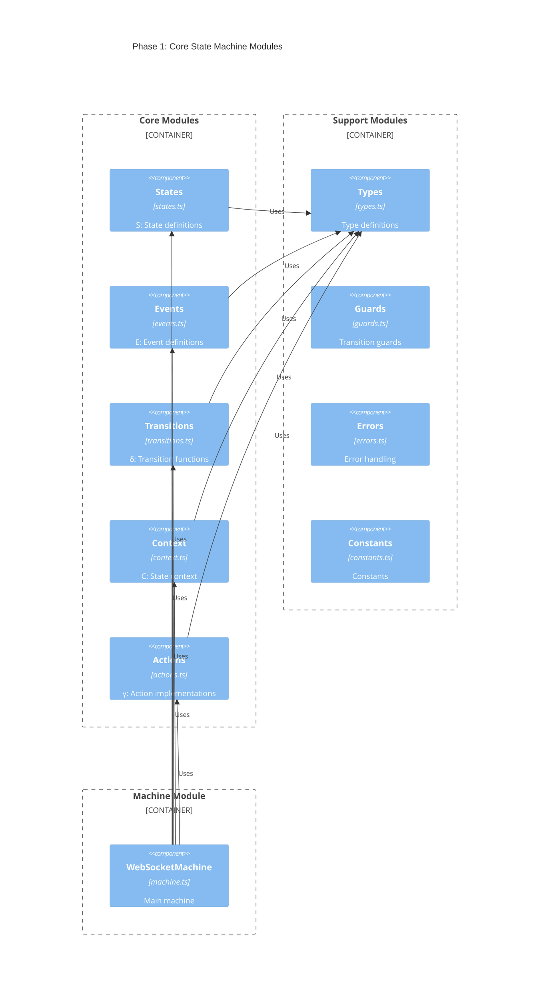

# WebSocket State Machine - Phased Implementation Design

## Overview

Breaking the implementation into two phases allows us to:
1. First establish the core state machine based on formal definitions
2. Then add advanced features while maintaining mathematical correctness

## Phase Division Strategy

### Phase 1: Core State Machine
Focus on implementing the fundamental components defined in the formal definition M = (S, E, δ, s0, C, γ, F)

#### Components:
1. States (S)
2. Events (E)
3. Transitions (δ)
4. Initial State (s0)
5. Basic Context (C)
6. Core Actions (γ)
7. Final States (F)

### Phase 2: Advanced Features
Extend the core machine with additional capabilities while preserving the formal properties

#### Components:
1. Health Checking
2. Rate Limiting
3. Queue Management
4. Metrics Collection
5. Advanced Recovery
6. State Persistence
7. Integration Features

## Module Organization

### Phase 1 Modules



### Phase 2 Extensions

```mermaid
C4Context
title Phase 2: Extended Modules

Container_Boundary(core, "Core (Phase 1)") {
    Component(base, "Core Modules", "", "Base implementation")
}

Container_Boundary(health, "Health Check") {
    Component(ping, "Ping/Pong", "health.ts", "Connection monitoring")
}

Container_Boundary(perf, "Performance") {
    Component(rate, "Rate Limiter", "rate.ts", "Message rate control")
    Component(queue, "Queue", "queue.ts", "Message queueing")
}

Container_Boundary(monitoring, "Monitoring") {
    Component(metrics, "Metrics", "metrics.ts", "Performance metrics")
    Component(logger, "Logger", "logger.ts", "Logging system")
}

Container_Boundary(persist, "Persistence") {
    Component(storage, "Storage", "storage.ts", "State persistence")
}

Rel(health, base, "Extends")
Rel(perf, base, "Extends")
Rel(monitoring, base, "Extends")
Rel(persist, base, "Extends")
```

## Implementation Plan

### Phase 1 Implementation

#### 1. Core Modules

1. **states.ts** (Mathematical set S)
```typescript
export const STATES = {
  DISCONNECTED: 'disconnected',
  CONNECTING: 'connecting',
  CONNECTED: 'connected',
  RECONNECTING: 'reconnecting',
  DISCONNECTING: 'disconnecting',
  TERMINATED: 'terminated'
} as const;

export type State = keyof typeof STATES;

export interface StateSchema {
  states: Record<State, StateDefinition>;
}
```

2. **events.ts** (Mathematical set E)
```typescript
export const EVENTS = {
  CONNECT: 'CONNECT',
  DISCONNECT: 'DISCONNECT',
  OPEN: 'OPEN',
  CLOSE: 'CLOSE',
  ERROR: 'ERROR',
} as const;

export type Event = {
  type: keyof typeof EVENTS;
  payload?: unknown;
};
```

3. **transitions.ts** (Mathematical function δ)
```typescript
export interface TransitionDefinition {
  target: State;
  guards?: Array<(context: Context) => boolean>;
  actions?: Array<(context: Context) => Partial<Context>>;
}

export type TransitionMap = Record<State, Record<Event['type'], TransitionDefinition>>;
```

4. **context.ts** (Mathematical set C)
```typescript
export interface Context {
  url: string | null;
  socket: WebSocket | null;
  error: Error | null;
  retryCount: number;
}
```

5. **actions.ts** (Mathematical set γ)
```typescript
export interface ActionImplementations {
  createSocket: Action<Context>;
  closeSocket: Action<Context>;
  handleError: Action<Context>;
  resetRetry: Action<Context>;
  incrementRetry: Action<Context>;
}
```

#### 2. Support Modules

6. **types.ts**
```typescript
export type Action<TContext> = (context: TContext) => Partial<TContext>;
export type Guard<TContext> = (context: TContext) => boolean;
```

7. **guards.ts**
```typescript
export const guards = {
  canConnect: (context: Context) => !context.socket && !context.error,
  canRetry: (context: Context) => context.retryCount < MAX_RETRIES,
};
```

### Phase 2 Extensions

#### 1. Health Check Module
```typescript
export interface HealthCheck {
  ping: () => void;
  pong: () => void;
  timeout: number;
  lastPing: number;
  lastPong: number;
}
```

#### 2. Rate Limiting Module
```typescript
export interface RateLimit {
  windowSize: number;
  maxRequests: number;
  currentWindow: number;
  requestCount: number;
}
```

## Testing Strategy

### Phase 1 Tests

1. Core State Machine
```typescript
describe('State Machine Core', () => {
  test('State Transitions', () => {
    // Test all valid transitions
  });
  
  test('Guards', () => {
    // Test transition guards
  });
  
  test('Actions', () => {
    // Test context modifications
  });
});
```

### Phase 2 Tests

1. Extended Features
```typescript
describe('Health Check', () => {
  test('Ping/Pong Cycle', () => {
    // Test health monitoring
  });
});

describe('Rate Limiting', () => {
  test('Message Rate Control', () => {
    // Test rate limiting
  });
});
```

## Validation Steps

### Phase 1 Validation

1. Mathematical Correctness
   - Verify state set completeness
   - Validate transition function
   - Check action determinism

2. Implementation Correctness
   - Type safety
   - Resource management
   - Error handling

### Phase 2 Validation

1. Feature Integration
   - Verify feature independence
   - Check state machine integrity
   - Validate performance impact

2. System Properties
   - Resource efficiency
   - Error recovery
   - Performance metrics

## Completion Criteria

### Phase 1 Completion
- Core state machine implemented
- All transitions working
- Basic error handling
- Resource management
- Test coverage >90%

### Phase 2 Completion
- All extensions implemented
- Performance metrics met
- Integration tests passing
- Documentation complete
- Production ready