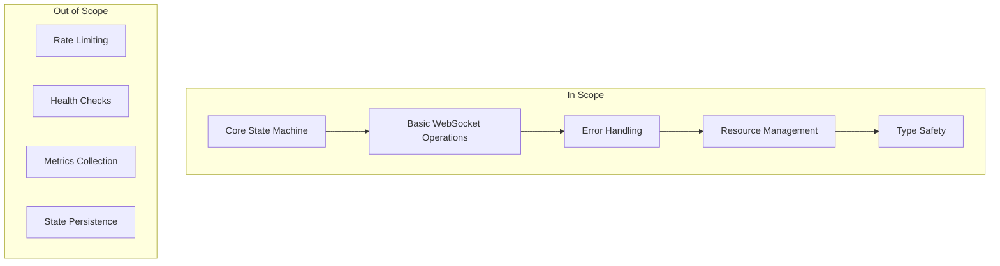
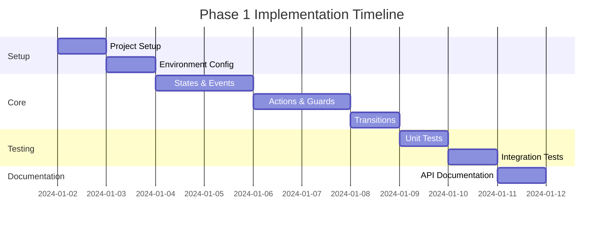

# WebSocket State Machine - Phase 1 Implementation Plan

## 1. Project Goals

### 1.1 Primary Objectives
1. Implement core WebSocket state machine using XState v5
2. Establish mathematical correctness based on formal definition M = (S, E, δ, s0, C, γ, F)
3. Ensure type safety and resource management
4. Create comprehensive test coverage
5. Provide clear documentation

### 1.2 Phase 1 Scope


## 2. Implementation Timeline

### 2.1 Phase 1 Schedule
Total Duration: 2 Weeks (10 Working Days)



### 2.2 Sprint Breakdown

#### Sprint 1 (Week 1)
1. **Days 1-2: Project Setup**
   - Repository setup
   - Development environment configuration
   - CI/CD pipeline setup

2. **Days 3-4: Core Module Implementation**
   - States module (S)
   - Events module (E)
   - Basic type definitions

3. **Day 5: Core Logic Implementation**
   - Context module (C)
   - Actions module (γ)
   - Initial transitions (δ)

#### Sprint 2 (Week 2)
1. **Days 6-7: Machine Integration**
   - XState v5 integration
   - Machine factory implementation
   - Resource management

2. **Days 8-9: Testing**
   - Unit test implementation
   - Integration test implementation
   - Type safety verification

3. **Day 10: Documentation & Review**
   - API documentation
   - Usage examples
   - Code review
   - Release preparation

## 3. Milestones & Deliverables

### 3.1 Key Milestones
```typescript
interface Milestone {
    id: string;
    name: string;
    deliverables: string[];
    criteria: string[];
}

const milestones: Milestone[] = [
    {
        id: "M1",
        name: "Project Setup Complete",
        deliverables: [
            "Repository structure",
            "Development environment",
            "CI/CD pipeline"
        ],
        criteria: [
            "All dependencies installed",
            "Build pipeline passing",
            "Test framework configured"
        ]
    },
    {
        id: "M2",
        name: "Core Implementation Complete",
        deliverables: [
            "Core modules implemented",
            "Type definitions complete",
            "Basic WebSocket operations"
        ],
        criteria: [
            "All core modules passing tests",
            "Type checking passing",
            "No compile errors"
        ]
    },
    {
        id: "M3",
        name: "Testing Complete",
        deliverables: [
            "Unit tests",
            "Integration tests",
            "Type safety tests"
        ],
        criteria: [
            ">90% test coverage",
            "All tests passing",
            "Performance benchmarks met"
        ]
    },
    {
        id: "M4",
        name: "Release Ready",
        deliverables: [
            "Complete documentation",
            "API examples",
            "Release package"
        ],
        criteria: [
            "All milestones completed",
            "Documentation reviewed",
            "Final code review passed"
        ]
    }
];
```

## 4. Dependencies

### 4.1 External Dependencies
```json
{
  "dependencies": {
    "xstate": "^5.0.0",
    "ws": "^8.0.0"
  },
  "devDependencies": {
    "typescript": "^5.0.0",
    "vitest": "^1.0.0",
    "@vitest/coverage-v8": "^1.0.0",
    "@types/ws": "^8.0.0"
  }
}
```

### 4.2 Development Tools
1. **Build Tools**
   - Vite
   - TypeScript compiler
   - ESLint + Prettier

2. **Testing Tools**
   - Vitest
   - Coverage reporter
   - Type testing utilities

3. **CI/CD Tools**
   - GitHub Actions
   - NPM publishing workflow
   - Automated testing

## 5. Risk Management

### 5.1 Technical Risks
| Risk | Impact | Mitigation |
|------|---------|------------|
| XState v5 adoption challenges | High | Early prototype, community engagement |
| WebSocket complexity | Medium | Thorough testing, error handling |
| Type safety challenges | Medium | Strong typing, validation tests |
| Performance issues | Low | Benchmarking, optimization |

### 5.2 Project Risks
| Risk | Impact | Mitigation |
|------|---------|------------|
| Timeline slippage | Medium | Buffer time, scope management |
| Resource constraints | Low | Clear prioritization |
| Technical debt | Medium | Code review, refactoring |
| Documentation gaps | Low | Early documentation |

## 6. Success Criteria

### 6.1 Implementation Criteria
```typescript
interface SuccessCriteria {
    category: string;
    criteria: Array<{
        name: string;
        verification: string;
    }>;
}

const successCriteria: SuccessCriteria[] = [
    {
        category: "Functionality",
        criteria: [
            {
                name: "Core state machine working",
                verification: "All state transitions verified"
            },
            {
                name: "WebSocket operations successful",
                verification: "Connection lifecycle tests passing"
            }
        ]
    },
    {
        category: "Quality",
        criteria: [
            {
                name: "Test coverage > 90%",
                verification: "Coverage reports"
            },
            {
                name: "Type safety verified",
                verification: "TypeScript strict mode passing"
            }
        ]
    },
    {
        category: "Performance",
        criteria: [
            {
                name: "Memory usage stable",
                verification: "Memory leak tests"
            },
            {
                name: "Response time < 100ms",
                verification: "Performance benchmarks"
            }
        ]
    }
];
```

### 6.2 Documentation Criteria
1. **API Documentation**
   - All public APIs documented
   - Type definitions explained
   - Examples provided

2. **Usage Documentation**
   - Getting started guide
   - Configuration guide
   - Error handling guide

3. **Development Documentation**
   - Contributing guide
   - Testing guide
   - Release process

## 7. Review Process

### 7.1 Code Review Checklist
```typescript
interface ReviewChecklist {
    category: string;
    items: string[];
    required: boolean;
}

const reviewChecklist: ReviewChecklist[] = [
    {
        category: "XState v5 Compliance",
        items: [
            "Uses setup() pattern",
            "No v4 patterns",
            "Proper type definitions"
        ],
        required: true
    },
    {
        category: "Type Safety",
        items: [
            "Strict type checking",
            "No type assertions",
            "Proper generics usage"
        ],
        required: true
    },
    {
        category: "Testing",
        items: [
            "Unit tests present",
            "Integration tests present",
            "Edge cases covered"
        ],
        required: true
    }
];
```

### 7.2 Release Criteria
1. **Technical Requirements**
   - All tests passing
   - No known bugs
   - Performance benchmarks met

2. **Documentation Requirements**
   - All APIs documented
   - Examples up to date
   - Change log updated

3. **Quality Requirements**
   - Code review completed
   - Security review completed
   - Performance review completed

## 8. Next Steps

### 8.1 Immediate Actions
1. Repository setup and configuration
2. Development environment setup
3. Core module implementation start

### 8.2 Team Communication
1. Daily progress updates
2. Weekly review meetings
3. Documentation reviews

### 8.3 Follow-up Planning
1. Phase 2 planning initiation
2. Feedback collection
3. Performance monitoring setup