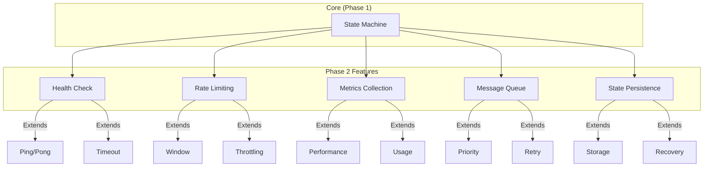
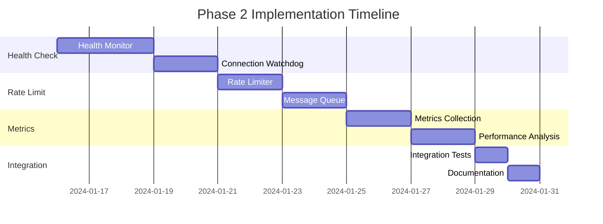

# WebSocket State Machine - Phase 2 Implementation Plan

## 1. Project Goals

### 1.1 Primary Objectives
1. Implement advanced WebSocket features
2. Add health checking mechanism
3. Implement rate limiting
4. Add metrics collection
5. Implement state persistence
6. Maintain mathematical correctness from Phase 1

### 1.2 Phase 2 Scope


## 2. Implementation Timeline

### 2.1 Phase 2 Schedule
Total Duration: 3 Weeks (15 Working Days)



## 3. Feature Implementation Plan

### 3.1 Health Check Module
```typescript
interface HealthCheck {
  // Configuration
  pingInterval: number;      // Default: 30000ms
  pongTimeout: number;       // Default: 5000ms
  failureThreshold: number;  // Default: 3
  
  // State
  lastPing: number;
  lastPong: number;
  failures: number;
  
  // Methods
  startMonitoring(): void;
  stopMonitoring(): void;
  checkHealth(): boolean;
}

// Actions
const healthCheckActions = {
  startHealthCheck: ({ context }) => ({
    ...context,
    healthCheck: {
      ...defaultHealthCheck,
      active: true
    }
  }),
  
  handlePing: ({ context }) => ({
    ...context,
    healthCheck: {
      ...context.healthCheck,
      lastPing: Date.now()
    }
  })
};

// Guards
const healthCheckGuards = {
  isHealthy: ({ context }) => {
    if (!context.healthCheck.active) return true;
    return context.healthCheck.failures < context.healthCheck.failureThreshold;
  }
};
```

### 3.2 Rate Limiting Module
```typescript
interface RateLimit {
  // Configuration
  windowSize: number;     // Default: 1000ms
  maxRequests: number;    // Default: 100
  
  // State
  currentWindow: number;
  requestCount: number;
  
  // Methods
  canProcess(): boolean;
  recordRequest(): void;
  resetWindow(): void;
}

// Implementation
class RateLimiter {
  private windows: Map<number, number> = new Map();
  
  canProcess(timestamp: number): boolean {
    this.cleanup(timestamp);
    return this.getCurrentCount() < this.maxRequests;
  }
  
  private cleanup(now: number) {
    const cutoff = now - this.windowSize;
    for (const [time] of this.windows) {
      if (time < cutoff) this.windows.delete(time);
    }
  }
}
```

### 3.3 Metrics Collection Module
```typescript
interface Metrics {
  // Counters
  messagesSent: number;
  messagesReceived: number;
  errors: number;
  reconnections: number;
  
  // Gauges
  currentLatency: number;
  connectionUptime: number;
  queueSize: number;
  
  // Histograms
  latencyHistory: number[];
  messageSizes: number[];
}

class MetricsCollector {
  private metrics: Metrics;
  private startTime: number;
  
  record(metric: keyof Metrics, value: number) {
    if (Array.isArray(this.metrics[metric])) {
      (this.metrics[metric] as number[]).push(value);
    } else {
      this.metrics[metric] = value;
    }
  }
}
```

### 3.4 Message Queue Module
```typescript
interface QueuedMessage {
  id: string;
  data: unknown;
  priority: 'high' | 'normal';
  attempts: number;
  timestamp: number;
}

class MessageQueue {
  private highPriority: QueuedMessage[] = [];
  private normalPriority: QueuedMessage[] = [];
  
  enqueue(message: QueuedMessage) {
    const queue = message.priority === 'high' 
      ? this.highPriority 
      : this.normalPriority;
    queue.push(message);
  }
  
  dequeue(): QueuedMessage | null {
    return this.highPriority.shift() || this.normalPriority.shift() || null;
  }
}
```

### 3.5 State Persistence Module
```typescript
interface PersistenceConfig {
  storage: 'local' | 'session' | 'memory';
  key: string;
  serialize?: (state: unknown) => string;
  deserialize?: (data: string) => unknown;
}

class StatePersistence {
  private storage: Storage;
  
  async save(state: unknown): Promise<void> {
    const serialized = this.config.serialize?.(state) 
      ?? JSON.stringify(state);
    await this.storage.setItem(this.config.key, serialized);
  }
  
  async load(): Promise<unknown> {
    const serialized = await this.storage.getItem(this.config.key);
    return serialized 
      ? (this.config.deserialize?.(serialized) ?? JSON.parse(serialized))
      : null;
  }
}
```

## 4. Integration Strategy

### 4.1 Machine Extension
```typescript
const extendedMachine = setup({
  types: {} as {
    context: WebSocketContext & {
      healthCheck: HealthCheck;
      rateLimit: RateLimit;
      metrics: Metrics;
      queue: MessageQueue;
    },
    events: WebSocketEvent | 
      HealthCheckEvent |
      RateLimitEvent |
      MetricsEvent
  }
}).createMachine({
  // Extended machine configuration
});
```

### 4.2 Feature Integration Tests
```typescript
describe('Extended Features', () => {
  test('health check cycle', async () => {
    const machine = createExtendedMachine(config);
    const actor = createActor(machine);
    actor.start();
    
    // Test health check cycle
    actor.send({ type: 'CONNECT', url: 'ws://test' });
    await waitFor(() => {
      const snapshot = actor.getSnapshot();
      return snapshot.context.healthCheck.lastPing > 0;
    });
  });

  test('rate limiting', async () => {
    const machine = createExtendedMachine({
      rateLimit: { maxRequests: 2, windowSize: 1000 }
    });
    const actor = createActor(machine);
    actor.start();
    
    // Test rate limiting
    actor.send({ type: 'SEND', data: '1' });
    actor.send({ type: 'SEND', data: '2' });
    actor.send({ type: 'SEND', data: '3' });
    
    expect(actor.getSnapshot().context.queue.size).toBe(1);
  });
});
```

## 5. Success Criteria

### 5.1 Feature Requirements
1. **Health Check**
   - Regular ping/pong cycle
   - Automatic reconnection on failure
   - Configurable thresholds

2. **Rate Limiting**
   - Enforced message rate limits
   - Message queuing
   - Priority handling

3. **Metrics**
   - Performance metrics collection
   - Usage statistics
   - Latency tracking

4. **State Persistence**
   - Reliable state storage
   - Recovery mechanisms
   - Configuration persistence

### 5.2 Performance Requirements
```typescript
interface PerformanceRequirements {
  // Latency
  maxLatency: number;         // 100ms
  maxProcessingTime: number;  // 50ms
  
  // Memory
  maxMemoryGrowth: number;    // 10MB
  maxQueueSize: number;       // 1000
  
  // Reliability
  minUptime: number;          // 99.9%
  maxFailureRate: number;     // 0.1%
}
```

## 6. Risk Management

### 6.1 Technical Risks
| Risk | Impact | Mitigation |
|------|---------|------------|
| Performance degradation | High | Progressive feature enabling, monitoring |
| Memory leaks | High | Memory profiling, cleanup verification |
| State corruption | Medium | Validation, recovery mechanisms |
| Browser compatibility | Medium | Feature detection, fallbacks |

### 6.2 Integration Risks
| Risk | Impact | Mitigation |
|------|---------|------------|
| Core functionality breaks | High | Comprehensive integration tests |
| Type system complexity | Medium | Clear type boundaries |
| Resource conflicts | Medium | Resource management strategy |
| Configuration complexity | Low | Default configurations |

## 7. Monitoring & Maintenance

### 7.1 Performance Monitoring
```typescript
interface MonitoringMetrics {
  // Resource usage
  memoryUsage: number;
  cpuUsage: number;
  
  // Performance
  messageLatency: number;
  processingTime: number;
  
  // Reliability
  errorRate: number;
  uptimePercentage: number;
}

class PerformanceMonitor {
  private metrics: MonitoringMetrics;
  
  collectMetrics(): MonitoringMetrics {
    return {
      memoryUsage: process.memoryUsage().heapUsed,
      messageLatency: this.calculateLatency(),
      // ... other metrics
    };
  }
}
```

### 7.2 Maintenance Tasks
1. Regular cleanup of stored states
2. Metric data aggregation
3. Performance optimization
4. Configuration updates

## 8. Documentation Requirements

### 8.1 Technical Documentation
1. Feature API documentation
2. Configuration guide
3. Integration examples
4. Performance tuning guide

### 8.2 User Documentation
1. Feature usage guide
2. Troubleshooting guide
3. Best practices
4. Migration guide

## 9. Release Strategy

### 9.1 Release Phases
1. Alpha Release
   - Core features complete
   - Internal testing
   - Documentation draft

2. Beta Release
   - All features complete
   - External testing
   - Documentation complete

3. Production Release
   - Performance optimized
   - All tests passing
   - Documentation finalized

### 9.2 Post-Release
1. Monitor production usage
2. Collect feedback
3. Plan optimizations
4. Consider Phase 3 features