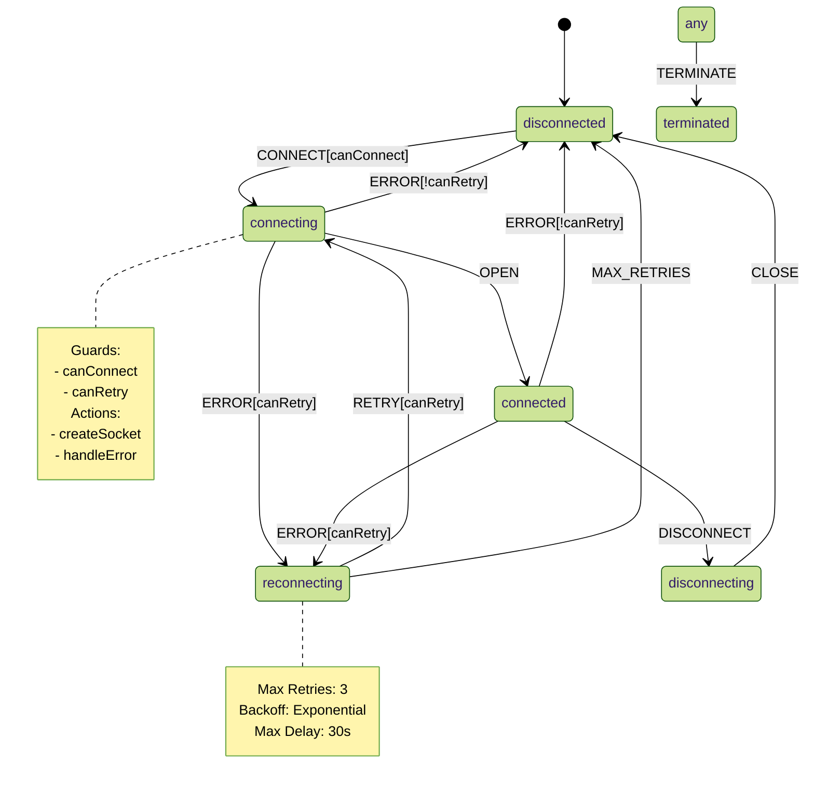

# WebSocket Machine Verification Guide

## 1. State Machine Verification

### 1.1 State Diagram


### 1.2 Formal Properties Verification

#### 1.2.1 State Set (S) Completeness
```typescript
describe('State Set Completeness', () => {
  test('all states are defined', () => {
    const states = Object.keys(STATES);
    const required = [
      'disconnected', 'connecting', 'connected',
      'reconnecting', 'disconnecting', 'terminated'
    ];
    required.forEach(state => {
      expect(states).toContain(state);
    });
  });

  test('no unreachable states', () => {
    const reachable = findReachableStates(machine);
    const defined = Object.keys(STATES);
    expect(reachable).toEqual(defined);
  });
});
```

#### 1.2.2 Event Set (E) Completeness
```typescript
describe('Event Set Completeness', () => {
  test('all events are defined', () => {
    const events = Object.keys(EVENTS);
    const required = [
      'CONNECT', 'DISCONNECT', 'OPEN', 'CLOSE',
      'ERROR', 'RETRY', 'TERMINATE'
    ];
    required.forEach(event => {
      expect(events).toContain(event);
    });
  });

  test('all events have proper types', () => {
    const eventTypes = createEventTypeChecker();
    Object.keys(EVENTS).forEach(event => {
      expect(eventTypes.validate(event)).toBe(true);
    });
  });
});
```

#### 1.2.3 Transition Function (δ) Correctness
```typescript
describe('Transition Function Correctness', () => {
  test('all transitions are deterministic', () => {
    const transitions = getAllTransitions(machine);
    transitions.forEach(({ from, event, to }) => {
      const result = getNextState(from, event);
      expect(result).toBe(to);
    });
  });

  test('no invalid transitions', () => {
    const states = Object.keys(STATES);
    const events = Object.keys(EVENTS);
    
    states.forEach(from => {
      events.forEach(event => {
        const to = getNextState(from, event);
        expect(isValidTransition(from, event, to)).toBe(true);
      });
    });
  });
});
```

#### 1.2.4 Context (C) Invariants
```typescript
describe('Context Invariants', () => {
  test('context maintains type safety', () => {
    const machine = createWebSocketMachine(config);
    const actor = createActor(machine);
    
    actor.subscribe(state => {
      expect(validateContext(state.context)).toBe(true);
    });

    // Run through all possible transitions
    getAllTransitions(machine).forEach(({ event }) => {
      actor.send(event);
    });
  });

  test('context updates are immutable', () => {
    const actions = getAllActions(machine);
    const context = createMockContext();
    
    actions.forEach(action => {
      const newContext = action({ context, event: mockEvent });
      expect(newContext).not.toBe(context);
    });
  });
});
```

## 2. Implementation Verification

### 2.1 Core Modules Verification

#### 2.1.1 States Module
```typescript
describe('States Module', () => {
  test('state definitions', () => {
    Object.values(STATES).forEach(state => {
      expect(stateSchema[state]).toBeDefined();
      expect(stateSchema[state].on).toBeDefined();
    });
  });

  test('state transitions', () => {
    Object.values(STATES).forEach(state => {
      const transitions = stateSchema[state].on;
      Object.entries(transitions).forEach(([event, { target }]) => {
        expect(STATES[target]).toBeDefined();
      });
    });
  });
});
```

#### 2.1.2 Events Module
```typescript
describe('Events Module', () => {
  test('event creators', () => {
    Object.keys(EVENTS).forEach(event => {
      const created = createEvent[event.toLowerCase()]();
      expect(created.type).toBe(event);
    });
  });

  test('event validation', () => {
    const validEvents = Object.keys(EVENTS).map(event => ({
      type: event
    }));
    validEvents.forEach(event => {
      expect(isValidEvent(event)).toBe(true);
    });
  });
});
```

### 2.2 Resource Management Verification

#### 2.2.1 Socket Cleanup
```typescript
describe('Socket Cleanup', () => {
  test('resources are cleaned on disconnect', async () => {
    const machine = createWebSocketMachine(config);
    const actor = createActor(machine);
    actor.start();

    actor.send({ type: 'CONNECT', url: 'ws://test' });
    const socket = actor.getSnapshot().context.socket;
    
    actor.send({ type: 'DISCONNECT' });
    await waitFor(() => {
      expect(socket.readyState).toBe(WebSocket.CLOSED);
      expect(actor.getSnapshot().context.socket).toBeNull();
    });
  });

  test('listeners are removed', () => {
    const socket = new WebSocket('ws://test');
    const listenerSpy = vi.spyOn(socket, 'removeEventListener');
    
    cleanupSocket(socket);
    
    expect(listenerSpy).toHaveBeenCalledTimes(4); // open, close, error, message
  });
});
```

#### 2.2.2 Memory Management
```typescript
describe('Memory Management', () => {
  test('no memory leaks in transitions', () => {
    const machine = createWebSocketMachine(config);
    const actor = createActor(machine);
    
    const memoryUsage = [];
    actor.subscribe(() => {
      memoryUsage.push(process.memoryUsage().heapUsed);
    });

    // Run 1000 transitions
    for (let i = 0; i < 1000; i++) {
      actor.send({ type: 'CONNECT', url: 'ws://test' });
      actor.send({ type: 'DISCONNECT' });
    }

    // Check memory growth is linear, not exponential
    const growth = calculateMemoryGrowth(memoryUsage);
    expect(growth.type).toBe('linear');
  });
});
```

### 2.3 Error Handling Verification

#### 2.3.1 Recovery Mechanisms
```typescript
describe('Error Recovery', () => {
  test('implements exponential backoff', async () => {
    const machine = createWebSocketMachine({ maxRetries: 3 });
    const actor = createActor(machine);
    actor.start();

    const delays = [];
    const timeSpy = vi.spyOn(global, 'setTimeout');

    // Simulate connection failures
    for (let i = 0; i < 3; i++) {
      actor.send({ type: 'CONNECT', url: 'ws://test' });
      actor.send({ type: 'ERROR', error: new Error('Failed') });
      delays.push(timeSpy.mock.calls[i][1]);
    }

    // Verify exponential increase
    expect(delays[1]).toBeGreaterThan(delays[0] * 1.5);
    expect(delays[2]).toBeGreaterThan(delays[1] * 1.5);
  });

  test('handles max retries correctly', () => {
    const machine = createWebSocketMachine({ maxRetries: 2 });
    const actor = createActor(machine);
    actor.start();

    // Exhaust retries
    for (let i = 0; i <= 2; i++) {
      actor.send({ type: 'CONNECT', url: 'ws://test' });
      actor.send({ type: 'ERROR', error: new Error('Failed') });
    }

    expect(actor.getSnapshot().value).toBe('disconnected');
    expect(actor.getSnapshot().context.retryCount).toBe(2);
  });
});
```

### 2.4 Type System Verification

#### 2.4.1 Type Safety
```typescript
describe('Type Safety', () => {
  test('context type safety', () => {
    type Expected = {
      url: string | null;
      socket: WebSocket | null;
      retryCount: number;
    };
    
    type Actual = typeof machine extends {
      context: infer C;
    } ? C : never;
    
    type Test = Actual extends Expected ? true : false;
    const test: Test = true;
    expect(test).toBe(true);
  });

  test('event type safety', () => {
    const eventCreators = {
      connect: (url: string) => ({ type: 'CONNECT' as const, url }),
      disconnect: () => ({ type: 'DISCONNECT' as const })
    };

    type Events = ReturnType<typeof eventCreators[keyof typeof eventCreators]>;
    type Test = Events extends WebSocketEvent ? true : false;
    const test: Test = true;
    expect(test).toBe(true);
  });
});
```

## 3. Integration Verification

### 3.1 End-to-End Scenarios
```typescript
describe('E2E Scenarios', () => {
  test('complete connection lifecycle', async () => {
    const machine = createWebSocketMachine(config);
    const actor = createActor(machine);
    const states: string[] = [];

    actor.subscribe(state => {
      states.push(state.value as string);
    });

    actor.start();
    actor.send({ type: 'CONNECT', url: 'ws://test' });
    
    const socket = actor.getSnapshot().context.socket;
    socket.emit('open');
    
    actor.send({ type: 'DISCONNECT' });
    socket.emit('close');

    expect(states).toEqual([
      'disconnected',
      'connecting',
      'connected',
      'disconnecting',
      'disconnected'
    ]);
  });
});
```

### 3.2 State Machine Integration
```typescript
describe('State Machine Integration', () => {
  test('integrates with XState correctly', () => {
    const machine = createWebSocketMachine(config);
    
    expect(machine.config.types).toBeDefined();
    expect(machine.config.guards).toBeDefined();
    expect(machine.config.actions).toBeDefined();
    
    const snapshot = machine.initialState;
    expect(snapshot.value).toBe('disconnected');
    expect(snapshot.context).toEqual(expect.objectContaining({
      url: null,
      socket: null,
      retryCount: 0
    }));
  });
});
```

## 4. Performance Verification

### 4.1 Memory Usage
```typescript
describe('Memory Usage', () => {
  test('stable memory consumption', async () => {
    const initialMemory = process.memoryUsage().heapUsed;
    const machine = createWebSocketMachine(config);
    const actor = createActor(machine);
    
    // Run 1000 cycles
    for (let i = 0; i < 1000; i++) {
      actor.start();
      actor.send({ type: 'CONNECT', url: 'ws://test' });
      actor.send({ type: 'DISCONNECT' });
      actor.stop();
    }

    const finalMemory = process.memoryUsage().heapUsed;
    const growth = (finalMemory - initialMemory) / initialMemory;
    
    expect(growth).toBeLessThan(0.1); // Less than 10% growth
  });
});
```

### 4.2 Transition Performance
```typescript
describe('Transition Performance', () => {
  test('transition timing', () => {
    const machine = createWebSocketMachine(config);
    const actor = createActor(machine);
    actor.start();

    const times: number[] = [];
    const transitions = getAllTransitions(machine);

    transitions.forEach(({ event }) => {
      const start = performance.now();
      actor.send(event);
      times.push(performance.now() - start);
    });

    const avgTime = times.reduce((a, b) => a + b) / times.length;
    expect(avgTime).toBeLessThan(1); // Less than 1ms per transition
  });
});
```

## 5. Verification Checklist

### 5.1 Mathematical Properties
- [ ] State set is complete and minimal
- [ ] Event set covers all required transitions
- [ ] Transition function is deterministic
- [ ] Context updates maintain invariants
- [ ] Guards are pure functions
- [ ] Actions are pure functions

### 5.2 Implementation Properties
- [ ] Resource cleanup is comprehensive
- [ ] Memory management is efficient
- [ ] Error handling is complete
- [ ] Type safety is maintained
- [ ] Performance metrics are met

### 5.3 Integration Properties
- [ ] XState integration is correct
- [ ] Module boundaries are respected
- [ ] External dependencies are properly managed
- [ ] Resource lifecycle is properly handled

### 5.4 Documentation Properties
- [ ] All public APIs are documented
- [ ] Type definitions are complete
- [ ] Examples are provided
- [ ] Error scenarios are documented