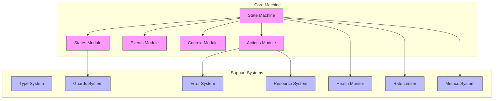
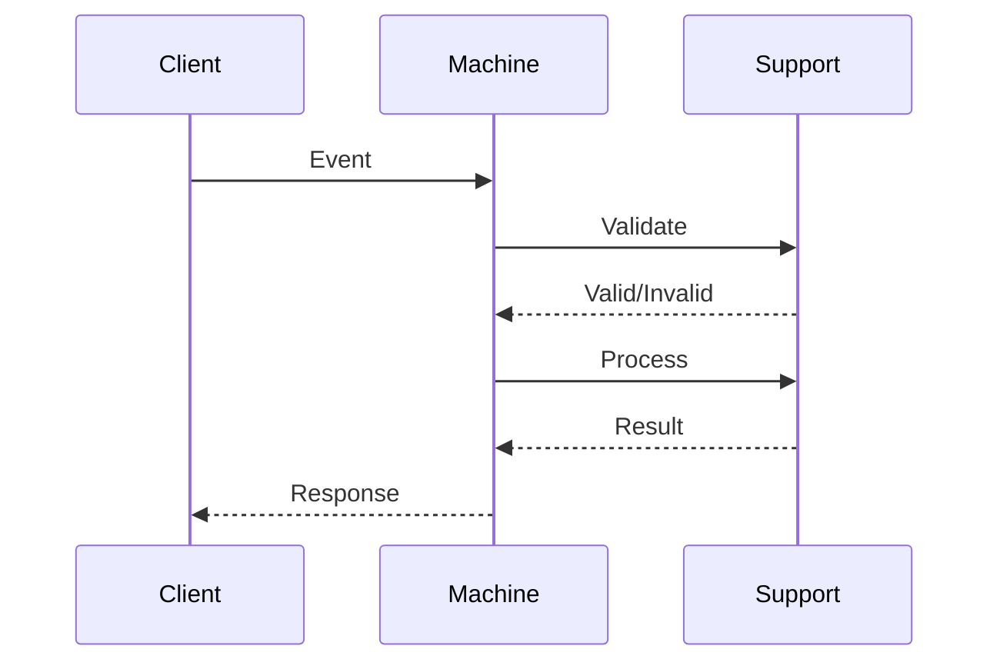
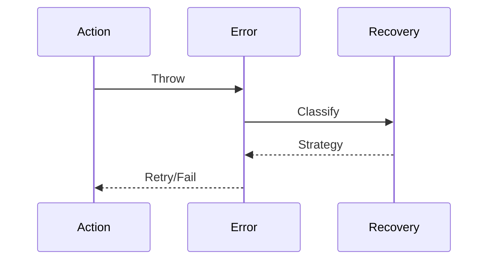
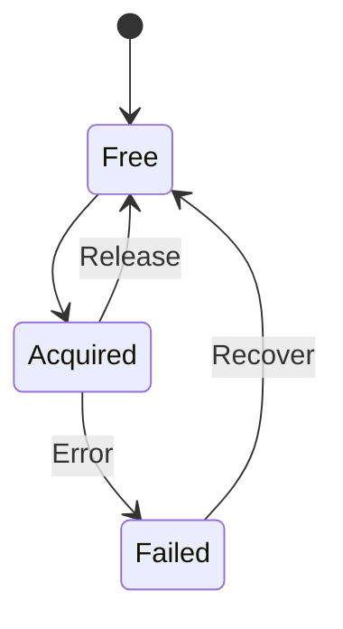

# WebSocket Machine Implementation Guide

## 1. System Architecture

## 2. Core Module Implementation

### 2.1 State Machine
- **Module**: Main state machine integrating all components
- **Dependencies**: All core and support modules
- **Requirements**:
  * Single instance per connection
  * Clean startup/shutdown
  * Error propagation chain

### 2.2 States Module
- **Implements**: $S = \{s_i\}$ from formal spec
- **Key Components**:
  * State definitions
  * Valid transitions
  * State invariants
- **Requirements**:
  * Unique state names
  * Complete transition map
  * Invariant checking

### 2.3 Events Module
- **Implements**: $E = \{e_i\}$ from formal spec
- **Event Categories**:
  * Connection events
  * Error events
  * Data events
- **Requirements**:
  * Type discrimination
  * Payload validation
  * Event ordering

### 2.4 Context Module
- **Implements**: $C = (P, V, T)$ from formal spec
- **Components**:
  * Primary properties ($P$)
  * Metric values ($V$)
  * Timing properties ($T$)
- **Requirements**:
  * Immutable updates
  * Type safety
  * History tracking

### 2.5 Actions Module
- **Implements**: $\gamma: C \times E \rightarrow C$ from formal spec
- **Categories**:
  * Connection actions
  * Message handling
  * Error recovery
  * Resource management
- **Requirements**:
  * Pure functions
  * Error handling
  * Context updates

## 3. Support Systems Implementation

### 3.1 Type System
- **Implements**: $\mathscr{T} = (B, C, V)$
- **Components**:
  * Base types
  * Composite types
  * Validators
- **Requirements**:
  * Runtime validation
  * Type composition
  * Serialization

### 3.2 Guards System
- **Implements**: $\mathscr{G} = (P, \Gamma, \Psi, \Omega)$
- **Components**:
  * Predicates
  * Compositions
  * Operators
- **Requirements**:
  * Pure evaluation
  * Composability
  * Error safety

### 3.3 Error System
- **Implements**: $\varepsilon = (K, R, H)$
- **Components**:
  * Categories
  * Recovery
  * History
- **Requirements**:
  * Error classification
  * Recovery strategies
  * Error tracking

### 3.4 Resource System
- **Implements**: $\mathscr{R} = (L, A, M)$
- **Components**:
  * Lifecycle
  * Acquisition
  * Monitoring
- **Requirements**:
  * Resource tracking
  * Cleanup guarantee
  * Leak prevention

### 3.5 Rate Limiting
- **Implements**: $\rho = (W, Q, \lambda)$
- **Components**:
  * Window tracking
  * Queue management
  * Limit function
- **Requirements**:
  * Fair queueing
  * Overflow handling
  * Priority support

### 3.6 Health Monitoring
- **Implements**: $\mathscr{H} = (\Pi, \Delta, \Phi)$
- **Components**:
  * Probes
  * Metrics
  * State function
- **Requirements**:
  * Low overhead
  * Early warning
  * State tracking

### 3.7 Metrics Collection
- **Implements**: $\mathscr{M} = (D, \Sigma, \Theta, \Phi)$
- **Components**:
  * Data points
  * Collection
  * Processing
- **Requirements**:
  * Efficient storage
  * Fast retrieval
  * Aggregation

## 4. Integration Patterns

### 4.1 Event Flow

### 4.2 Error Handling

### 4.3 Resource Management

## 5. Testing Strategy

### 5.1 Unit Testing
- **Components**:
  * State transitions
  * Action execution
  * Guard conditions
- **Coverage**:
  * Error paths
  * Race conditions
  * Resource cleanup

### 5.2 Integration Testing
- **Scenarios**:
  * Connection lifecycle
  * Error recovery
  * Resource management
- **Performance**:
  * Message throughput
  * Memory usage
  * Error overhead

## 6. Implementation Notes

### 6.1 Performance Considerations
- **Memory Management**:
  * Resource pooling
  * Message buffering
  * Context sharing
- **Event Processing**:
  * Batch processing
  * Priority queues
  * Worker pools

### 6.2 Security Requirements
- **Connection**:
  * TLS validation
  * Origin checking
  * Protocol security
- **Messages**:
  * Input validation
  * Output encoding
  * Rate limiting

### 6.3 Monitoring & Debugging
- **Observability**:
  * State tracking
  * Event logging
  * Metric collection
- **Diagnostics**:
  * Error tracing
  * Performance profiling
  * Resource tracking

### 6.4 Configuration
- **Required Settings**:
  * Connection timeouts
  * Retry policies
  * Buffer sizes
- **Optional Features**:
  * Auto reconnect
  * Message persistence
  * Compression