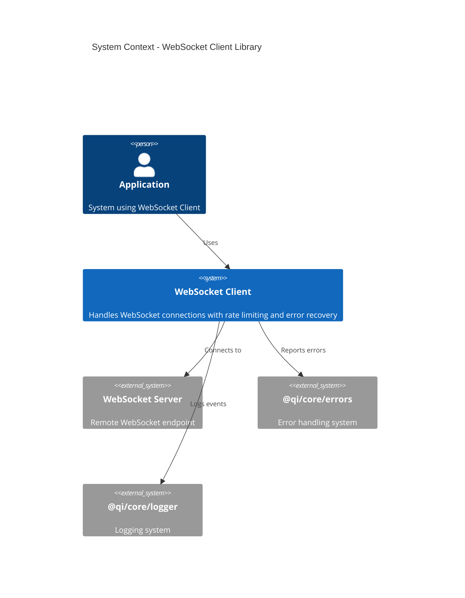
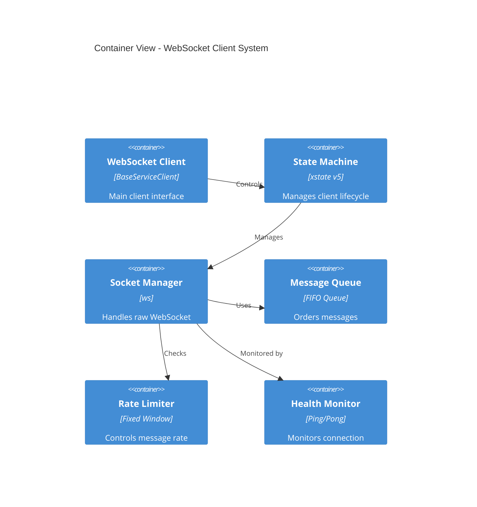
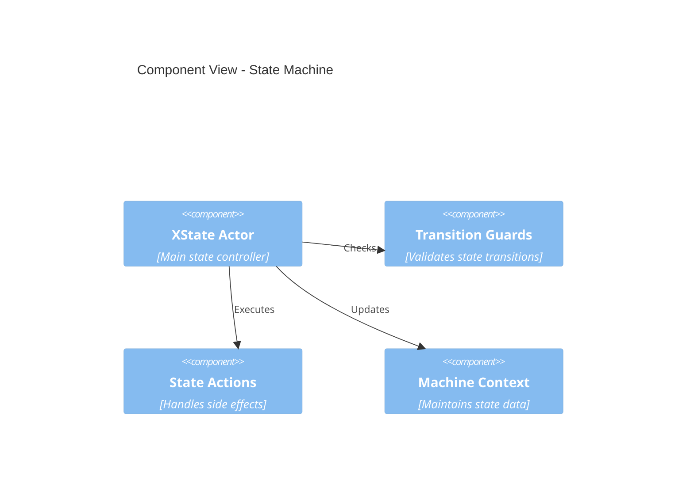
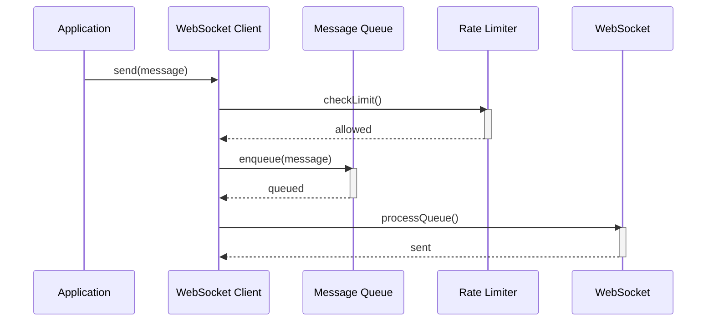
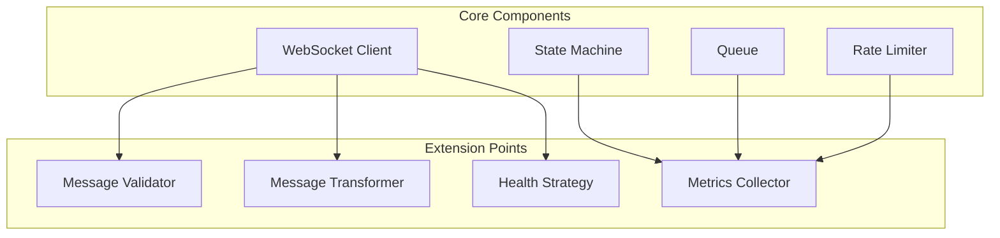

```markdown
# WebSocket Client Implementation Documentation

## Table of Contents
1. [System Architecture](#1-system-architecture)
    - [1.1 System Context](#11-system-context)
    - [1.2 Container View](#12-container-view)
    - [1.3 Component View - State Machine](#13-component-view---state-machine)
2. [Implementation Structure](#2-implementation-structure)
    - [2.1 Directory Structure](#21-directory-structure)
3. [Message Flow](#3-message-flow)
4. [Extension Points](#4-extension-points)
5. [Implementation Mapping](#5-implementation-mapping)
    - [5.1 Core Definitions](#51-core-definitions)
    - [5.2 Rate Limiting System](#52-rate-limiting-system)
    - [5.3 Message Queue](#53-message-queue)
    - [5.4 Message Operations](#54-message-operations)
    - [5.5 State Machine](#55-state-machine)
    - [5.6 Context Structure](#56-context-structure)
    - [5.7 Transition Function](#57-transition-function)
    - [5.8 Helper Functions](#58-helper-functions)
    - [5.9 Initial States](#59-initial-states)
    - [5.10 Error Handling](#510-error-handling)
    - [5.11 WebSocket Type Definitions](#511-websocket-type-definitions)
    - [5.12 System Safety Properties](#512-system-safety-properties)
    - [5.13 Ordering Rules](#513-ordering-rules)
    - [5.14 Extension Points](#514-extension-points)
    - [5.15 Testing Modules](#515-testing-modules)
    - [5.16 Performance Metrics](#516-performance-metrics)
    - [5.17 Scalability and Extensibility Considerations](#517-scalability-and-extensibility-considerations)
6. [References](#6-references)

---

## 1. System Architecture

### 1.1 System Context


**Implementation Mapping:**

- **WebSocket Client (`𝒲𝒞`):** Defined in Core Definitions
- **Error System:** Implements error states and transitions ([Error Handling](#510-error-handling))
- **Logger:** Tracks state changes and operations ([System Safety Properties](#512-system-safety-properties))

---

### 1.2 Container View


**Implementation Mapping:**

- **State Machine:** Implements ([State Machine](#55-state-machine))
- **Message Queue:** Implements ([Message Queue](#53-message-queue))
- **Rate Limiter:** Implements ([Rate Limiting System](#52-rate-limiting-system))
- **Socket Manager:** Handles ([Message Operations](#54-message-operations))

---

### 1.3 Component View - State Machine


**Mathematical Mapping:**

- **Actor:** Implements transition function `δ`: S × E → S ([Transition Function](#57-transition-function))
- **Guards:** Implements state invariants `I(s)` ([State Machine](#55-state-machine))
- **Context:** Maintains `C` and initial context `c₀` ([Context Structure](#56-context-structure))

---

## 2. Implementation Structure

### 2.1 Directory Structure
```
src/
├── client/                     # Core Client Implementation (𝒲𝒞)
│   ├── index.ts               # Public API
│   ├── WebSocketClient.ts     # Main client
│   └── constants.ts          # System constants from 1.1
│
├── state/                     # State Machine (S, E, δ)
│   ├── machine.ts            # XState implementation
│   ├── guards.ts             # State invariants I(s)
│   └── context.ts            # Context structure C
│
├── message/                   # Message Operations
│   ├── operations/            # From machine.md 1.4
│   │   ├── send.ts            # t_s operations
│   │   ├── transmit.ts        # t_x operations
│   │   ├── receive.ts         # t_r operations
│   │   └── deliver.ts         # t_d operations
│   └── types.ts               # Message types
│
├── queue/                     # Message Queue (Q)
│   ├── Queue.ts               # FIFO implementation
│   └── QueueOperations.ts     # Queue operations
│
├── rate-limit/                # Rate Limiting (R)
│   ├── RateLimiter.ts         # Window management
│   └── Window.ts              # Window implementation
│
├── extensions/                # Extension Points
│   ├── MessageValidator.ts
│   ├── MessageTransformer.ts
│   ├── MetricsCollector.ts
│   └── HealthStrategy.ts
│
├── errors/                    # Error Handling
│   ├── ErrorTypes.ts
│   └── ErrorHandler.ts
│
├── helpers/                   # Helper Functions
│   ├── Set.ts
│   └── Now.ts
│
├── context/                   # Context Structures
│   ├── Context.ts
│   └── InitialStates.ts
│
├── types/                     # Type Definitions
│   └── WebSocketTypes.ts
│
├── safety/                    # System Safety Properties
│   └── SafetyProperties.ts
│
├── performance/               # Performance Metrics
│   └── PerformanceMetrics.ts
│
├── scalability/               # Scalability and Extensibility
│   └── ScalabilityConsiderations.ts
│
└── tests/                     # Testing Modules
    ├── unit/                  # Unit Tests
    └── integration/           # Integration Tests
```

---

## 3. Message Flow


**Mathematical Properties:**

- **Preserves Message Ordering:** `t_s < t_x < t_r < t_d`
- **Maintains Queue Invariants:** `|M| ≤ MAX_QUEUE_SIZE`
- **Enforces Rate Limits:** `count ≤ MAX_MESSAGES`

---

## 4. Extension Points

### 4.1 Configurable Components


**Implementation Mapping:**

- **Message Validator:** `src/extensions/MessageValidator.ts`
- **Message Transformer:** `src/extensions/MessageTransformer.ts`
- **Metrics Collector:** `src/extensions/MetricsCollector.ts`
- **Health Strategy:** `src/extensions/HealthStrategy.ts`

---

## 5. Implementation Mapping

This section maps each formal specification from **machine.md** to its corresponding implementation.

### 5.1 Core Definitions

- **WebSocket Client Implementation (\(\mathcal{WC}\))**
  - **Code File:** `src/client/WebSocketClient.ts`
  - **Description:** Implements the main WebSocket client, managing connection states, integrating with the Message Queue and Rate Limiter, and handling communication with the WebSocket server.

### 5.2 Rate Limiting System

- **Code Files:**
  - `src/rate-limit/RateLimiter.ts`
  - `src/rate-limit/Window.ts`
- **Description:** Manages rate limiting using a window-based approach. The `RateLimiter` handles the creation, expiration, and incrementation of windows, enforcing constraints on message throughput.

### 5.3 Message Queue

- **Code File:** `src/queue/Queue.ts`
- **Description:** Manages the enqueueing and dequeueing of messages, ensuring that the queue does not exceed `MAX_QUEUE_SIZE` and maintains proper message ordering based on timestamps.

### 5.4 Message Operations

#### 5.4.1 Message Structure

- **Code File:** `src/message/types.ts`
- **Description:** Defines the `Message` data structure with attributes for data payload and timestamps (`t_s`, `t_x`, `t_r`, `t_d`).

#### 5.4.2 Temporal Operators

- **Code File:** `src/helpers/TemporalOperators.ts`
- **Description:** Implements functions to handle timestamp operations, including `send`, `transmit`, `receive`, and `deliver`.

#### 5.4.3 Message Sequence Properties

- **Code Files:** Implemented within `src/message/types.ts` and enforced in `src/queue/Queue.ts` and `src/message/operations/MessageHandler.ts`
- **Description:** Ensures the logical order of message operations and maintains ordering based on send times.

#### 5.4.4 Operation Definitions and Invariants

- **Code Files:**
  - `src/message/operations/send.ts`
  - `src/message/operations/transmit.ts`
  - `src/message/operations/receive.ts`
  - `src/message/operations/deliver.ts`
- **Description:** Defines each message operation with input/output types, state transitions, and invariants to ensure correct timestamp updates.

### 5.5 State Machine

- **Code Files:**
  - `src/state/machine.ts`
  - `src/state/guards.ts`
  - `src/state/contexts.ts`
- **Description:** Implements the state machine managing connection states (`disconnected`, `connecting`, `connected`, `reconnecting`) and transitions based on events (`CONNECT`, `CONNECTED`, `DISCONNECT`, `ERROR`, `RECONNECT`, `SEND`, `RECEIVE`).

### 5.6 Context Structure

- **Code File:** `src/context/Context.ts`
- **Description:** Defines the context structure `C` encompassing the URL, WebSocket instance, error state, retry count, rate limiting system, and message queue.

### 5.7 Transition Function

- **Code File:** `src/state/machine.ts`
- **Description:** Implements the transition function `δ` handling state transitions based on current state and incoming events, updating the context accordingly.

### 5.8 Helper Functions

- **Code Files:**
  - `src/helpers/Set.ts`
  - `src/helpers/Now.ts`
- **Description:** Implements utility functions:
  - `set`: Updates attributes of a message.
  - `now`: Retrieves the current timestamp.

### 5.9 Initial States

- **Code File:** `src/context/InitialStates.ts`
- **Description:** Defines the initial states `R_0` for the rate limiting system and `Q_0` for the message queue, ensuring all components are properly initialized at system start.

### 5.10 Error Handling

- **Code Files:**
  - `src/errors/ErrorTypes.ts`
  - `src/errors/ErrorHandler.ts`
- **Description:** Implements error types and propagation rules, integrating error management within the state machine and other system components.

### 5.11 WebSocket Type Definitions

- **Code File:** `src/types/WebSocketTypes.ts`
- **Description:** Defines types and interfaces related to WebSocket operations and states, ensuring type safety and consistency across the codebase.

### 5.12 System Safety Properties

- **Code File:** `src/safety/SafetyProperties.ts`
- **Description:** Implements checks and validations to ensure system safety properties such as "No Message Loss," "Rate Limit Compliance," "Message Ordering," and "State Consistency."

### 5.13 Ordering Rules

- **Code Files:**
  - `src/queue/Queue.ts`
  - `src/message/operations/MessageHandler.ts`
- **Description:** Enforces message ordering rules within the Queue and MessageHandler components to maintain temporal consistency.

### 5.14 Extension Points

- **Code Files:**
  - `src/extensions/MessageValidator.ts`
  - `src/extensions/MessageTransformer.ts`
  - `src/extensions/MetricsCollector.ts`
  - `src/extensions/HealthStrategy.ts`
- **Description:** Provides hooks and interfaces for extending functionality, allowing for message validation, transformation, metrics collection, and health monitoring.

### 5.15 Testing Modules

- **Code Files:**
  - `tests/unit/`: Contains unit tests for individual components.
  - `tests/integration/`: Contains integration tests ensuring components interact correctly.
- **Description:** Maps testing strategies to corresponding test suites, ensuring comprehensive coverage of both unit and integration aspects.

### 5.16 Performance Metrics

- **Code File:** `src/performance/PerformanceMetrics.ts`
- **Description:** Implements monitoring and reporting of performance metrics such as message throughput, latency, and resource utilization to ensure the system meets efficiency standards.

### 5.17 Scalability and Extensibility Considerations

- **Code File:** `src/scalability/ScalabilityConsiderations.ts`
- **Description:** Outlines strategies for scaling the WebSocket client and extending its functionality without significant restructuring, including modular design and interface-driven development.

---

## 6. References

- **Formal Specifications:** machine.md
- **C4 Model Documentation:** [C4 Model](https://c4model.com/)
- **XState Documentation:** [XState](https://xstate.js.org/docs/)
- **WebSocket Protocol (RFC 6455):** [RFC 6455](https://tools.ietf.org/html/rfc6455)
```

---
