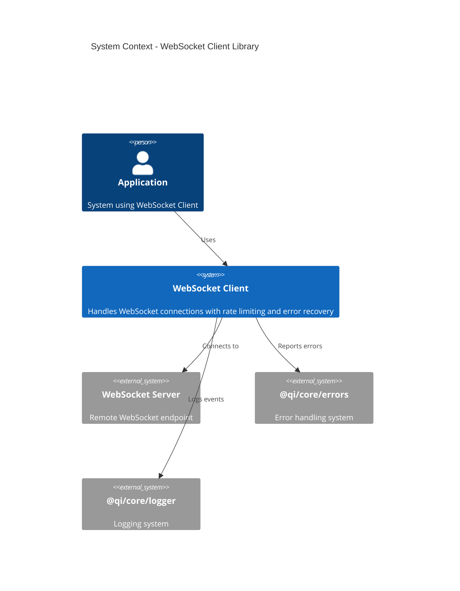
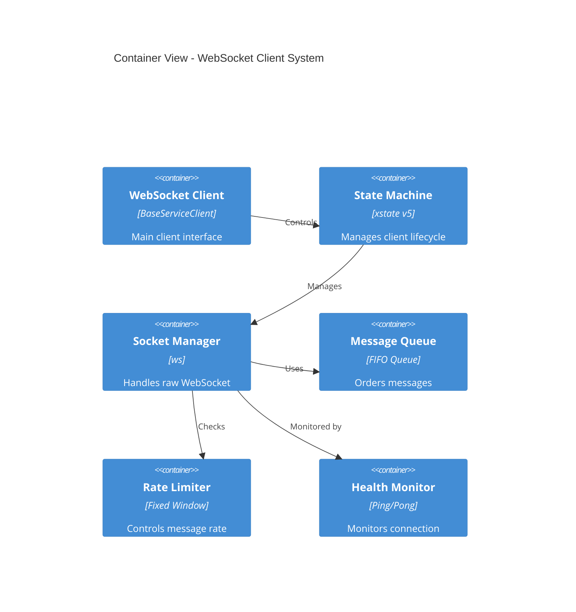
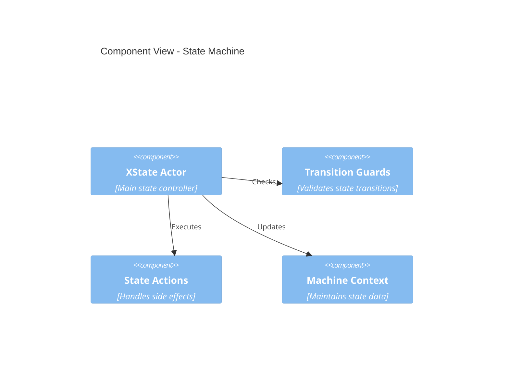
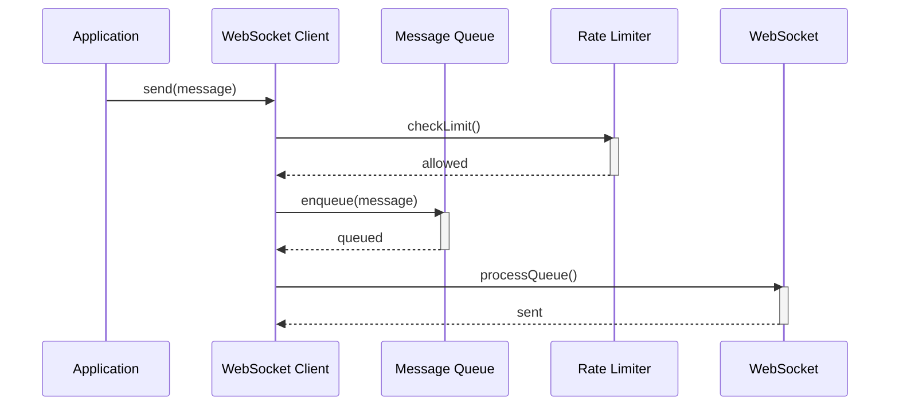
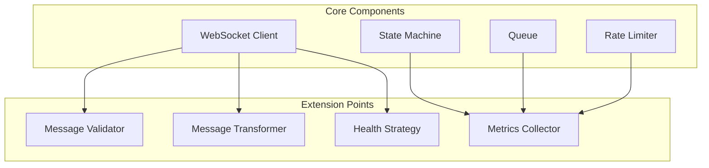

# WebSocket Client Implementation Documentation

## Table of Contents

1. [System Architecture](#1-system-architecture)
   - [1.1 System Context](#11-system-context)
   - [1.2 Container View](#12-container-view)
   - [1.3 Component View - State Machine](#13-component-view---state-machine)
2. [Implementation Structure](#2-implementation-structure)
   - [2.1 Directory Structure](#21-directory-structure)
3. [Message Flow](#3-message-flow)
4. [Extension Points](#4-extension-points)
5. [Implementation Mapping](#5-implementation-mapping)
   - [5.1 Core Definitions](#51-core-definitions)
   - [5.2 Rate Limiting System](#52-rate-limiting-system)
   - [5.3 Message Queue](#53-message-queue)
   - [5.4 Message Operations](#54-message-operations)
   - [5.5 State Machine](#55-state-machine)
   - [5.6 Context Structure](#56-context-structure)
   - [5.7 Transition Function](#57-transition-function)
   - [5.8 Helper Functions](#58-helper-functions)
   - [5.9 Initial States](#59-initial-states)
   - [5.10 Error Handling](#510-error-handling)
   - [5.11 WebSocket Type Definitions](#511-websocket-type-definitions)
   - [5.12 System Safety Properties](#512-system-safety-properties)
   - [5.13 Ordering Rules](#513-ordering-rules)
   - [5.14 Extension Points](#514-extension-points)
   - [5.15 Testing Modules](#515-testing-modules)
   - [5.16 Performance Metrics](#516-performance-metrics)
   - [5.17 Scalability and Extensibility Considerations](#517-scalability-and-extensibility-considerations)
6. [References](#6-references)

---

## 1. System Architecture

### 1.1 System Context



**Implementation Mapping:**

- **WebSocket Client (`𝒲𝒞`):** Defined in Core Definitions
- **Error System:** Implements error states and transitions ([Error Handling](#510-error-handling))
- **Logger:** Tracks state changes and operations ([System Safety Properties](#512-system-safety-properties))

---

### 1.2 Container View



**Implementation Mapping:**

- **State Machine:** Implements ([State Machine](#55-state-machine))
- **Message Queue:** Implements ([Message Queue](#53-message-queue))
- **Rate Limiter:** Implements ([Rate Limiting System](#52-rate-limiting-system))
- **Socket Manager:** Handles ([Message Operations](#54-message-operations))

---

### 1.3 Component View - State Machine



**Mathematical Mapping:**

- **Actor:** Implements transition function `δ`: S × E → S ([Transition Function](#57-transition-function))
- **Guards:** Implements state invariants `I(s)` ([State Machine](#55-state-machine))
- **Context:** Maintains `C` and initial context `c₀` ([Context Structure](#56-context-structure))

---

## 2. Implementation Structure

### 2.1 Directory Structure

```
src/
├── client/                     # Core Client Implementation (𝒲𝒞)
│   ├── index.ts               # Public API
│   ├── WebSocketClient.ts     # Main client
│   └── constants.ts          # System constants from 1.1
│
├── state/                     # State Machine (S, E, δ)
│   ├── machine.ts            # XState implementation
│   ├── guards.ts             # State invariants I(s)
│   └── context.ts            # Context structure C
│
├── message/                   # Message Operations
│   ├── operations/            # From machine.md 1.4
│   │   ├── send.ts            # t_s operations
│   │   ├── transmit.ts        # t_x operations
│   │   ├── receive.ts         # t_r operations
│   │   └── deliver.ts         # t_d operations
│   └── types.ts               # Message types
│
├── queue/                     # Message Queue (Q)
│   ├── Queue.ts               # FIFO implementation
│   └── QueueOperations.ts     # Queue operations
│
├── rate-limit/                # Rate Limiting (R)
│   ├── RateLimiter.ts         # Window management
│   └── Window.ts              # Window implementation
│
├── extensions/                # Extension Points
│   ├── MessageValidator.ts
│   ├── MessageTransformer.ts
│   ├── MetricsCollector.ts
│   └── HealthStrategy.ts
│
├── errors/                    # Error Handling
│   ├── ErrorTypes.ts
│   └── ErrorHandler.ts
│
├── helpers/                   # Helper Functions
│   ├── Set.ts
│   └── Now.ts
│
├── context/                   # Context Structures
│   ├── Context.ts
│   └── InitialStates.ts
│
├── types/                     # Type Definitions
│   └── WebSocketTypes.ts
│
├── safety/                    # System Safety Properties
│   └── SafetyProperties.ts
│
├── performance/               # Performance Metrics
│   └── PerformanceMetrics.ts
│
├── scalability/               # Scalability and Extensibility
│   └── ScalabilityConsiderations.ts
│
└── tests/                     # Testing Modules
    ├── unit/                  # Unit Tests
    └── integration/           # Integration Tests
```

---

## 3. Message Flow



**Mathematical Properties:**

- **Preserves Message Ordering:** `t_s < t_x < t_r < t_d`
- **Maintains Queue Invariants:** `|M| ≤ MAX_QUEUE_SIZE`
- **Enforces Rate Limits:** `count ≤ MAX_MESSAGES`

---

## 4. Extension Points

### 4.1 Configurable Components



**Implementation Mapping:**

- **Message Validator:** `src/extensions/MessageValidator.ts`
- **Message Transformer:** `src/extensions/MessageTransformer.ts`
- **Metrics Collector:** `src/extensions/MetricsCollector.ts`
- **Health Strategy:** `src/extensions/HealthStrategy.ts`

---

## 5. Implementation Mapping

This section maps each formal specification from **machine.md** to its corresponding implementation.

### 5.1 Core Definitions

- **WebSocket Client Implementation (\(\mathcal{WC}\))**
  - **Code File:** `src/client/WebSocketClient.ts`
  - **Description:** Implements the main WebSocket client, managing connection states, integrating with the Message Queue and Rate Limiter, and handling communication with the WebSocket server.

#### 5.1.1 System Components

- WebSocket Client (𝒲𝒞)
- Message Queue (Q)
- Rate Limiter (R)
- State Machine (S, E)

#### 5.1.2 Core Constants

- System Constraints
- Timing Parameters
- Resource Limits

#### 5.1.3 Integration Points

- Message Flow
- Component Interactions
- System Boundaries

#### 5.1.4 Mathematical Mapping

| Component         | Formal Specification (machine.md)                                                   |
| ----------------- | ----------------------------------------------------------------------------------- |
| WebSocket Client  | $\scriptsize \mathcal{WC}=(S,E,C,\delta,s_0,c_0,Q,R)\,[\S1]$                        |
| System Constants  | $\scriptsize \text{MAX\_RETRIES},\text{MAX\_MESSAGES},\text{WINDOW\_SIZE}\,[\S1.1]$ |
| Integration Rules | $\scriptsize \forall m\in M:\text{send}(m)\Rightarrow\text{enqueue}(Q,m)\,[\S1.5]$  |

### 5.2 Rate Limiting System

- **Code Files:**
  - `src/rate-limit/RateLimiter.ts`
  - `src/rate-limit/Window.ts`
- **Description:** Manages rate limiting using a window-based approach. The `RateLimiter` handles the creation, expiration, and incrementation of windows, enforcing constraints on message throughput.

#### 5.2.1 Window Management Components

- **Window Manager**
  - Manages window lifecycle (creation, expiration, incrementation)
  - Enforces window invariants from formal spec (Section 1.2)
  - Handles window pruning and count validation

#### 5.2.2 Rate Limiting Operations

- **Rate Limiter**
  - Maintains active window set
  - Processes message increments
  - Manages window expiration
  - Tracks current message counts
  - Enforces MAX_MESSAGES constraint

#### 5.2.3 Window Constraints

- Implements all invariants from machine.md Section 1.2
- Validates temporal properties of windows
- Maintains count limits per window
- Handles window lifetime boundaries

#### 5.2.4 Mathematical Mapping

| Component         | Formal Specification (machine.md)                                                                                               |
| ----------------- | ------------------------------------------------------------------------------------------------------------------------------- |
| Rate Limiter      | $\scriptsize R = (W, n: \mathbb{N}, t: \mathbb{R}^+)\ [\S1.2]$                                                                  |
| Window Structure  | $\scriptsize w = (start: \mathbb{R}^+, count: \mathbb{N}, expiry: \mathbb{R}^+)\ \left[\S1.2\right]$                            |
| Window Operations | $\scriptsize create(): \rightarrow w_0, expire(): W\times t\rightarrow W', increment(): w\times Message → w' \left[\S11\right]$ |
| Window Invariants | $\tiny\forall w\in W: w.count ≤ MAX\_MESSAGES\wedge (now() - w.start) ≤ WINDOW\_SIZE \left[\S1.2\right]$                  |

### 5.3 Message Queue

- **Code File:** `src/queue/Queue.ts`
- **Description:** Manages the enqueueing and dequeueing of messages, ensuring that the queue does not exceed `MAX_QUEUE_SIZE` and maintains proper message ordering based on timestamps.

#### 5.3.1 Queue Structure

- FIFO queue implementation with:
  - Message set storage
  - Capacity management
  - Head/tail pointers
  - Size constraints

#### 5.3.2 Queue Operations

- **Core Operations**
  - Enqueue with overflow protection
  - Dequeue with empty queue handling
  - Clear operation for queue reset
  - Queue state validation

#### 5.3.3 Overflow Management

- **Overflow Strategy**
  - Capacity enforcement
  - Oldest message removal
  - Buffer management
  - Queue size monitoring

#### 5.3.4 Queue Invariants

- Enforces size constraints
- Maintains message ordering properties
- Preserves temporal relationships
- Validates queue state transitions

#### 5.3.5 Mathematical Mapping

| Component        | Formal Specification (machine.md)                                                                  |
| ---------------- | -------------------------------------------------------------------------------------------------- |
| Queue Structure  | $\small Q = (M: Set[Message], cap: \mathbb{N}, head: \mathbb{N}, tail: \mathbb{N})\ [\S1.3]$       |
| Queue Operations | $\small enqueue: Q\times Message\rightarrow Q, dequeue: Q\rightarrow Message\times Q\ [\S1.3]$     |
| Queue Invariants | $\small\|M\| ≤ MAX\_QUEUE\_SIZE [\S1.3]$                                                           |
| Ordering Rules   | $\small\forall m_1,m_2\in M: index(m_1) < index(m_2)\Longrightarrow send(m_1) <ₜ send(m_2)\ [\S7]$ |

### 5.4 Message Operations

#### 5.4.1 Message Structure

- **Code File:** `src/message/types.ts`
- **Description:** Defines the `Message` data structure with attributes for data payload and timestamps (`t_s`, `t_x`, `t_r`, `t_d`).

#### 5.4.2 Temporal Operators

- **Code File:** `src/helpers/TemporalOperators.ts`
- **Description:** Implements functions to handle timestamp operations, including `send`, `transmit`, `receive`, and `deliver`.

#### 5.4.3 Message Sequence Properties

- **Code Files:** Implemented within `src/message/types.ts` and enforced in `src/queue/Queue.ts` and `src/message/operations/MessageHandler.ts`
- **Description:** Ensures the logical order of message operations and maintains ordering based on send times.

#### 5.4.4 Operation Definitions and Invariants

- **Code Files:**
  - `src/message/operations/send.ts`
  - `src/message/operations/transmit.ts`
  - `src/message/operations/receive.ts`
  - `src/message/operations/deliver.ts`
- **Description:** Defines each message operation with input/output types, state transitions, and invariants to ensure correct timestamp updates.

#### 5.4.5 Mathematical Mapping

| Component         | Formal Specification (machine.md)                                                                                                                                               |
| ----------------- | ------------------------------------------------------------------------------------------------------------------------------------------------------------------------------- |
| Message Structure | $\scriptsize M=(\text{data}:\text{Bytes},\,t_s:\mathbb{R}^+\cup\{\bot\},\,t_r:\mathbb{R}^+\cup\{\bot\},\,t_x:\mathbb{R}^+\cup\{\bot\},\,t_d:\mathbb{R}^+\cup\{\bot\})\,[\S1.4]$ |
| Temporal Order    | $\scriptsize \forall m\in M:t_s(m)<t_x(m)<t_r(m)<t_d(m)\,[\S1.4]$                                                                                                               |
| Send Order        | $\scriptsize \forall m_1,m_2\in M:t_s(m_1)<t_s(m_2)\Rightarrow t_x(m_1)<t_x(m_2)\,[\S7]$                                                                                        |

### 5.5 State Machine

- **Code Files:**
  - `src/state/machine.ts`
  - `src/state/guards.ts`
  - `src/state/contexts.ts`
- **Description:** Implements the state machine managing connection states (`disconnected`, `connecting`, `connected`, `reconnecting`) and transitions based on events (`CONNECT`, `CONNECTED`, `DISCONNECT`, `ERROR`, `RECONNECT`, `SEND`, `RECEIVE`).

#### 5.5.1 State Components

- State Definitions
- Event Handlers
- Transition Rules
- Guard Conditions

#### 5.5.2 State Transitions

- Connect/Disconnect Flow
- Error Recovery
- Message Processing
- Health Monitoring

#### 5.5.3 State Guards

- Connection Validation
- Rate Limit Checks
- Queue Capacity
- Error Conditions

#### 5.5.4 Mathematical Mapping

| Component        | Formal Specification (machine.md)                                                                                                     |
| ---------------- | ------------------------------------------------------------------------------------------------------------------------------------- |
| States           | $\scriptsize S=\{\text{disconnected},\text{connecting},\text{connected},\text{reconnecting}\}\,[\S2]$                                 |
| Events           | $\scriptsize E=\{\text{CONNECT},\text{CONNECTED},\text{DISCONNECT},\text{ERROR},\text{RECONNECT},\text{SEND},\text{RECEIVE}\}\,[\S2]$ |
| State Invariants | $\scriptsize I(s)\,[\S4]$ |

### 5.6 Context Structure

- **Code File:** `src/context/Context.ts`
- **Description:** Defines the context structure `C` encompassing the URL, WebSocket instance, error state, retry count, rate limiting system, and message queue.

#### 5.6.1 Context Components
- URL Management
- Socket State
- Error Tracking
- Retry Mechanism
- Window System
- Message Queue

#### 5.6.2 Context Operations
- State Updates
- Resource Management
- Error Handling
- Component Lifecycle

#### 5.6.3 Context Constraints
- Resource Limits
- State Invariants
- Operational Bounds
- System Safety

#### 5.6.4 Mathematical Mapping

| Component         | Formal Specification (machine.md)                                                                                                                                                                         |
| ----------------- | --------------------------------------------------------------------------------------------------------------------------------------------------------------------------------------------------------- |
| Context Structure | $\scriptsize\begin{align*}C=&\{\\&\quad\text{url}:\text{String}\cup\{\bot\},\\&\quad\text{socket}:\text{WebSocket}\cup\{\bot\},\\&\quad\text{error}:\text{Error}\cup\{\bot\},\\&\quad\text{retries}:\mathbb{N},\\&\quad\text{window}:R,\text{queue}:Q\\&\}\,[\S3]\end{align*}$ |
| Initial Context   | $\scriptsize c_0=\{\text{url}:\bot,\text{socket}:\bot,\text{error}:\bot,\text{retries}:0,\text{window}:R_0,\text{queue}:Q_0\}\,[\S3]$ |

### 5.7 Transition Function

- **Code File:** `src/state/machine.ts`
- **Description:** Implements the transition function `δ` handling state transitions based on current state and incoming events, updating the context accordingly.

#### 5.7.1 Transition Components
- State Transitions
- Event Processing
- Context Updates
- Error Recovery

#### 5.7.2 Operation Controls
- Rate Limiting
- Queue Management
- Connection Handling
- Message Processing

#### 5.7.3 Safety Guarantees
- State Consistency
- Message Preservation
- Timing Properties
- Resource Management

#### 5.7.4 Mathematical Mapping

| Component           | Formal Specification (machine.md)                                         |
| ------------------- | ------------------------------------------------------------------------- |
| Transition Function | $\scriptsize \delta:S\times E\rightarrow S\,[\S5]$                        |
| State Updates       | $\scriptsize \text{updateContext}:C\times S\times E\rightarrow C\,[\S15]$ |
| Retry Logic         | $\scriptsize \text{incrementRetries}:C\rightarrow C\,[\S15]$              |

### 5.8 Helper Functions

- **Code Files:**
  - `src/helpers/Set.ts`
  - `src/helpers/Now.ts`
- **Description:** Implements utility functions:
  - `set`: Updates attributes of a message.
  - `now`: Retrieves the current timestamp.

#### 5.8.1 Utility Components
- Timestamp Operations
- Message Updates
- Queue Operations
- Window Management

#### 5.8.2 Support Functions
- Resource Cleanup
- Error Recovery
- State Reset
- Health Checks

#### 5.8.3 System Operations
- Performance Monitoring
- Resource Tracking
- State Validation
- Safety Checks

#### 5.8.4 Mathematical Mapping

| Component    | Formal Specification (machine.md)                                                         |
| ------------ | ----------------------------------------------------------------------------------------- |
| Set Function | $\scriptsize \text{set}:M\times(\text{Attribute}\times\mathbb{R}^+)\rightarrow M\,[\S10]$ |
| Now Function | $\scriptsize \text{now}:() \rightarrow\mathbb{R}^+\,[\S10]$                               |

### 5.9 Initial States

- **Code File:** `src/context/InitialStates.ts`
- **Description:** Defines the initial states `R_0` for the rate limiting system and `Q_0` for the message queue, ensuring all components are properly initialized at system start.

#### 5.9.1 State Components
- Rate Limiter State
- Queue State
- Connection State
- Error State

#### 5.9.2 Initialization Process
- Component Setup
- Resource Allocation
- State Validation
- System Readiness

#### 5.9.3 System Constraints
- Resource Limits
- Timing Bounds
- Safety Properties
- Operational Rules

#### 5.9.4 Mathematical Mapping

| Component            | Formal Specification (machine.md)                                       |
| -------------------- | ----------------------------------------------------------------------- |
| Initial Rate Limiter | $\scriptsize R_0=(W_0,0,t_0),\,W_0=\emptyset,\,t_0=\text{now}()\,[\S9]$ |
| Initial Queue        | $\scriptsize Q_0=(\emptyset,\text{MAX\_QUEUE\_SIZE},0,0)\,[\S9]$        |

### 5.10 Error Handling

- **Code Files:**
  - `src/errors/ErrorTypes.ts`
  - `src/errors/ErrorHandler.ts`
- **Description:** Implements error types and propagation rules, integrating error management within the state machine and other system components.

#### 5.10.1 Error Types
- Connection Errors
- Rate Limit Errors
- Queue Overflow
- Protocol Errors

#### 5.10.2 Error Processing
- Detection
- Classification
- Recovery Actions
- State Updates

#### 5.10.3 Recovery Strategy
- Retry Logic
- State Reset
- Resource Cleanup
- System Restoration

#### 5.10.4 Mathematical Mapping

| Component   | Formal Specification (machine.md)                                                                             |
| ----------- | ------------------------------------------------------------------------------------------------------------- |
| Error Types | $\scriptsize \text{Error}=\{\text{ConnectionError},\text{TimeoutError},\text{RateLimitError}\}\,[\S8]$        |
| Error State | $\scriptsize \text{ErrorState}=(\text{type}:\text{Error},\text{message}:\text{String},t:\mathbb{R}^+)\,[\S8]$ |

### 5.11 WebSocket Type Definitions

- **Code File:** `src/types/WebSocketTypes.ts`
- **Description:** Defines types and interfaces related to WebSocket operations and states, ensuring type safety and consistency across the codebase.

#### 5.11.1 Socket States
- Connection States
- Protocol Types
- Extension Support
- Health Status

#### 5.11.2 Data Types
- Message Formats
- Control Frames
- System Events
- Error Types

#### 5.11.3 Type Constraints
- State Validation
- Protocol Rules
- Safety Checks
- Resource Limits

#### 5.11.4 Mathematical Mapping
| Component | Formal Specification (machine.md) |
|-----------|-----------------------------------|
| WebSocket | $\scriptsize \text{WebSocket}=(\text{url}:\text{String},\text{readyState}:\{0,1,2,3\},\text{protocol}:\text{String}\cup\{\bot\})\,[\S13]$ |
| States | $\scriptsize \{0\Rightarrow\text{CONNECTING},1\Rightarrow\text{OPEN},2\Rightarrow\text{CLOSING},3\Rightarrow\text{CLOSED}\}\,[\S13]$ |

### 5.12 System Safety Properties

- **Code File:** `src/safety/SafetyProperties.ts`
- **Description:** Implements checks and validations to ensure system safety properties such as "No Message Loss," "Rate Limit Compliance," "Message Ordering," and "State Consistency."

#### 5.12.1 Safety Components
- Message Preservation
- Rate Limiting
- Order Preservation
- State Consistency

#### 5.12.2 Validation Rules
- Message Integrity
- Queue Properties
- Window Constraints
- State Invariants

#### 5.12.3 Monitoring Strategy
- Performance Metrics
- Resource Usage
- System Health
- Error Detection

#### 5.12.4 Mathematical Mapping

| Component         | Formal Specification (machine.md)                                                                      |
| ----------------- | ------------------------------------------------------------------------------------------------------ |
| No Message Loss   | $\scriptsize \forall m\in M:t_s(m)\neq\bot\Rightarrow\exists t:t_d(m)\neq\bot\,\vee\,m\in Q.M\,[\S14]$ |
| Rate Limit        | $\scriptsize \forall w\in W:w.\text{count}\leq\text{MAX\_MESSAGES}\,[\S14]$                            |
| Message Order     | $\scriptsize \forall m_1,m_2\in M:t_s(m_1)<t_s(m_2)\Rightarrow t_d(m_1)<t_d(m_2)\,[\S14]$              |
| State Consistency | $\scriptsize \forall s\in S:I(s)\text{ holds}\,[\S14]$                                                 |

### 5.13 Ordering Rules

- **Code Files:**
  - `src/queue/Queue.ts`
  - `src/message/operations/MessageHandler.ts`
- **Description:** Enforces message ordering rules within the Queue and MessageHandler components to maintain temporal consistency.

#### 5.13.1 Order Components
- Send Order
- Receive Order
- Queue Order
- Delivery Order

#### 5.13.2 Ordering Constraints
- Temporal Properties
- Queue Invariants
- Message Sequence
- State Dependencies

#### 5.13.3 Implementation Strategy
- Order Enforcement
- Sequence Validation
- State Tracking
- Conflict Resolution

#### 5.13.4 Mathematical Mapping

| Component     | Formal Specification (machine.md)                                                                                                       |
| ------------- | --------------------------------------------------------------------------------------------------------------------------------------- |
| Send Order    | $\scriptsize t_s(m_1)<t_s(m_2)\Rightarrow t_x(m_1)<t_x(m_2)\,[\S7]$                                                                     |
| Receive Order | $\scriptsize t_r(m_1)<t_r(m_2)\Rightarrow t_d(m_1)<t_d(m_2)\,[\S7]$                                                                     |
| Queue Order   | $\scriptsize \forall m_1,m_2\in Q.M:\text{index}(m_1)<\text{index}(m_2)\Rightarrow t_s(m_1)<t_s(m_2)\,\wedge\,t_d(m_1)<t_d(m_2)\,[\S7]$ |

### 5.14 Extension Points

- **Code Files:**
  - `src/extensions/MessageValidator.ts`
  - `src/extensions/MessageTransformer.ts`
  - `src/extensions/MetricsCollector.ts`
  - `src/extensions/HealthStrategy.ts`
- **Description:** Provides hooks and interfaces for extending functionality, allowing for message validation, transformation, metrics collection, and health monitoring.

#### 5.14.1 Extension Components
- Message Validation
- Transformation Pipeline
- Metrics Collection
- Health Monitoring

#### 5.14.2 Integration Points
- Component Hooks
- Event Pipeline
- Data Flow
- State Access

#### 5.14.3 Extension Rules
- Safety Requirements
- Performance Bounds
- Resource Limits
- State Invariants

#### 5.14.4 Mathematical Mapping
| Component | Formal Specification (machine.md) |
|-----------|-----------------------------------|
| Extensions | $\scriptsize\begin{align*}\text{Extensions}=&\{\\&\quad\text{MessageValidator},\\&\quad\text{MessageTransformer},\\&\quad\text{MetricsCollector},\\&\quad\text{HealthStrategy}\\&\}\,[\S17]\end{align*}$ |


### 5.15 Testing Modules

- **Code Files:**
  - `tests/unit/`: Contains unit tests for individual components.
  - `tests/integration/`: Contains integration tests ensuring components interact correctly.
- **Description:** Maps testing strategies to corresponding test suites, ensuring comprehensive coverage of both unit and integration aspects.

#### 5.15.1 Test Components
- Unit Tests
- Integration Tests
- Performance Tests
- Safety Tests

#### 5.15.2 Test Coverage
- Component Testing
- State Transitions
- Error Handling
- Resource Management

#### 5.15.3 Validation Strategy
- Property Verification
- Invariant Checking
- Performance Validation
- Safety Assurance

### 5.16 Performance Metrics

- **Code File:** `src/performance/PerformanceMetrics.ts`
- **Description:** Implements monitoring and reporting of performance metrics such as message throughput, latency, and resource utilization to ensure the system meets efficiency standards.

#### 5.16.1 Core Metrics

- **Performance Measurement**
  - Message latency tracking
  - Throughput calculation
  - Resource usage monitoring
  - System health metrics

#### 5.16.2 Performance Bounds

- **System Constraints**
  - Message rate limits
  - Maximum latency thresholds
  - Memory usage bounds
  - Resource allocation limits

#### 5.16.3 Resource Monitoring

- **Monitor Components**
  - Queue memory tracking
  - Window set memory measurement
  - Total system resource monitoring

#### 5.16.4 Mathematical Mapping

| Component       | Formal Specification (machine.md)                                                |
| --------------- | -------------------------------------------------------------------------------- |
| Message Rate    | $\scriptsize rate(t) = \|\{m\in M\,\|\,t_s(m)\in[t,t+1000]\}\|\leq 1000\,[\S18]$ |
| Message Latency | $\scriptsize latency(m) = t_d(m)-t_s(m)\leq 100\text{ ms}\,[\S18]$               |
| Memory Usage    | $\scriptsize \|Q.M\|\times\text{sizeof}(M)\leq 100\text{ MB}\,[\S\text{B}.2]$    |
| Memory Bounds   | $\scriptsize \text{totalMemory}(Q,W)\leq 120\text{ MB}\,[\S\text{B}.2]$          |

### 5.17 Scalability and Extensibility Considerations

- **Code File:** `src/scalability/ScalabilityConsiderations.ts`
- **Description:** Outlines strategies for scaling the WebSocket client and extending its functionality without significant restructuring, including modular design and interface-driven development.

#### 5.17.1 Scalability Components
- Load Management
- Resource Scaling
- Performance Optimization
- System Boundaries

#### 5.17.2 Extension Mechanisms
- Component Plugins
- Protocol Extensions
- Custom Handlers
- Monitoring Tools

#### 5.17.3 Design Principles
- Modular Architecture
- Interface Contracts
- Resource Isolation
- State Management

#### 5.17.4 Mathematical Mapping
| Component | Formal Specification (machine.md) |
|-----------|-----------------------------------|
| Scalability | $\scriptsize \text{rate}(t)\leq 1000,\,\text{latency}(m)\leq 100\text{ ms}\,[\S18]$ |
| Extensions | $\scriptsize M_{\text{ext}}=(M\times\text{MessageType}\times\text{Priority})\,[\S17]$ |


### 5.18 Extended Message Types

#### 5.18.1 Message Type System

- **Message Classifications**
  - Text messages
  - Binary messages
  - Control messages (PING/PONG)
  - Priority levels

#### 5.18.2 Message Processing

- **Processing Strategy**
  - Type-based handling
  - Priority queue management
  - Message validation rules
  - Type-specific constraints

#### 5.18.3 Mathematical Mapping

| Component        | Formal Specification (machine.md)                                    |
| ---------------- | -------------------------------------------------------------------- |
| Message Types    | $\scriptsize MessageType = {TEXT, BINARY, PING, PONG}\ [\S17]$       |
| Priority Levels  | $\scriptsize Priority = {HIGH, NORMAL, LOW}\ [\S17]$                 |
| Extended Message | $\scriptsize M_{ext} = (M\times MessageType\times Priority)\ [\S17]$ |

---

## 6. References

- **Formal Specifications:** machine.md
- **C4 Model Documentation:** [C4 Model](https://c4model.com/)
- **XState Documentation:** [XState](https://xstate.js.org/docs/)
- **WebSocket Protocol (RFC 6455):** [RFC 6455](https://tools.ietf.org/html/rfc6455)

---
