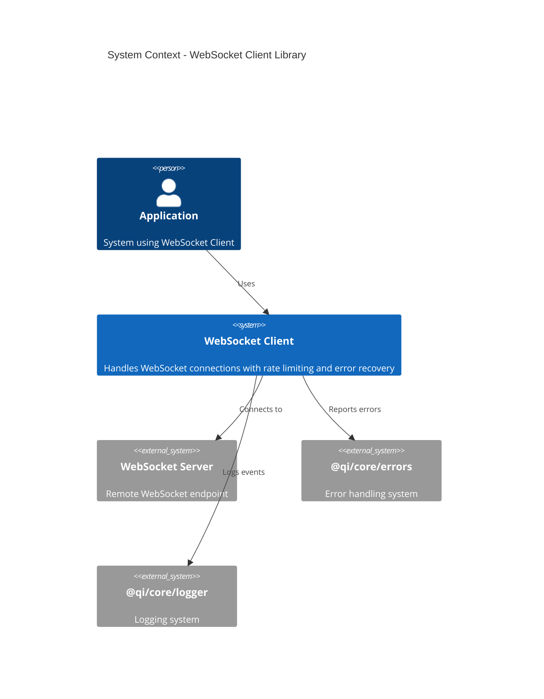
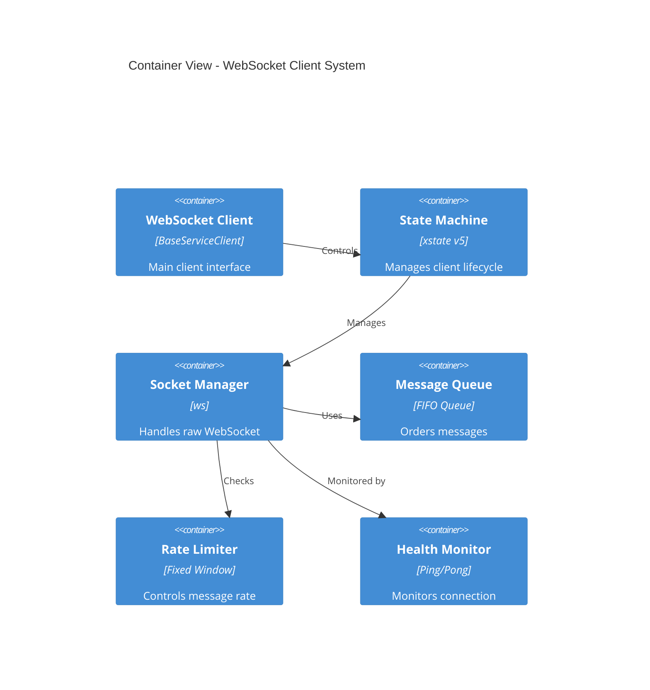
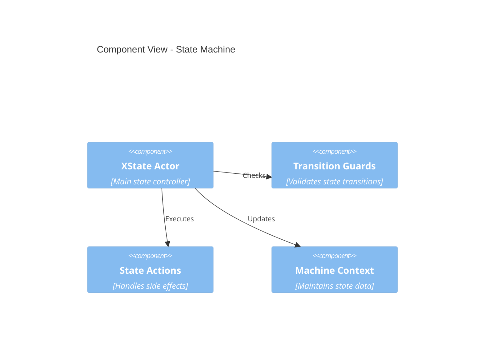
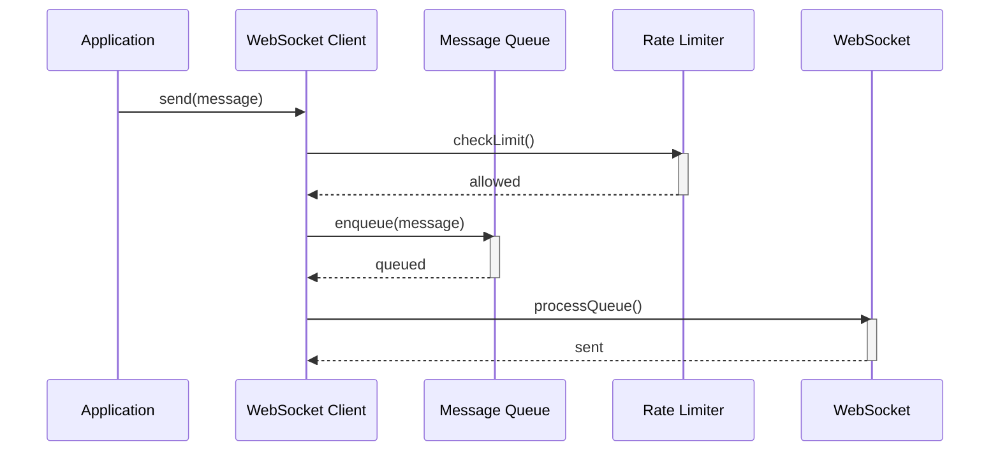
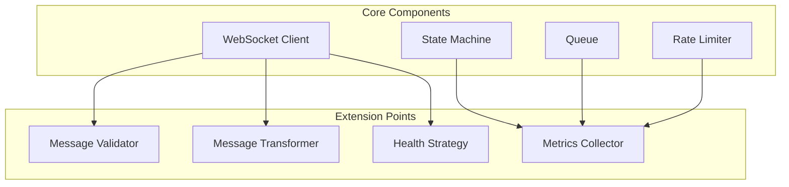

# WebSocket Client Implementation Design

## 1. System Architecture

### 1.1 System Context


**Implementation Mapping:**
- WebSocket Client maps to machine.md's 𝒲𝒞 = (S, E, C, δ, s₀, c₀, Q, R)
- Error system implements error states and transitions
- Logger tracks state changes and operations

### 1.2 Container View


**Implementation Mapping:**
- State Machine implements (S, E, δ)
- Message Queue implements Q with FIFO properties
- Rate Limiter implements R with window management
- Socket Manager handles WebSocket lifecycle

### 1.3 Component View - State Machine


**Mathematical Mapping:**
- Actor implements state machine δ: S × E → S
- Guards implement state invariants I(s)
- Context implements C and maintains c₀

## 2. Implementation Structure

### 2.1 Directory Structure
```
src/
├── client/                     # Core Client Implementation (𝒲𝒞)
│   ├── index.ts               # Public API
│   ├── WebSocketClient.ts     # Main client
│   └── constants.ts          # System constants from 1.1
│
├── state/                     # State Machine (S, E, δ)
│   ├── machine.ts            # XState implementation
│   ├── guards.ts            # State invariants I(s)
│   └── context.ts           # Context structure C
│
├── message/                   # Message Operations
│   ├── operations/           # From machine.md 1.4
│   │   ├── send.ts          # t_s operations
│   │   ├── transmit.ts      # t_x operations
│   │   ├── receive.ts       # t_r operations
│   │   └── deliver.ts       # t_d operations
│   └── types.ts             # Message types
│
├── queue/                     # Message Queue (Q)
│   ├── Queue.ts             # FIFO implementation
│   └── QueueOperations.ts   # Queue operations
│
├── rate-limit/               # Rate Limiting (R)
│   ├── RateLimiter.ts       # Window management
│   └── Window.ts            # Window implementation
│
└── socket/                   # WebSocket Integration
    ├── manager.ts           # Connection management
    └── health.ts            # Health monitoring
```

## 3. Message Flow


**Mathematical Properties:**
- Preserves message ordering: t_s < t_x < t_r < t_d
- Maintains queue invariants: |M| ≤ MAX_QUEUE_SIZE
- Enforces rate limits: count ≤ MAX_MESSAGES

## 4. Extension Points

### 4.1 Configurable Components
